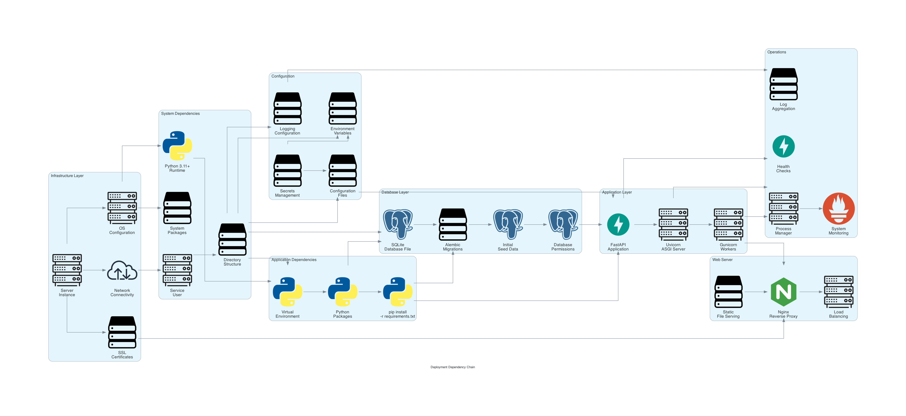
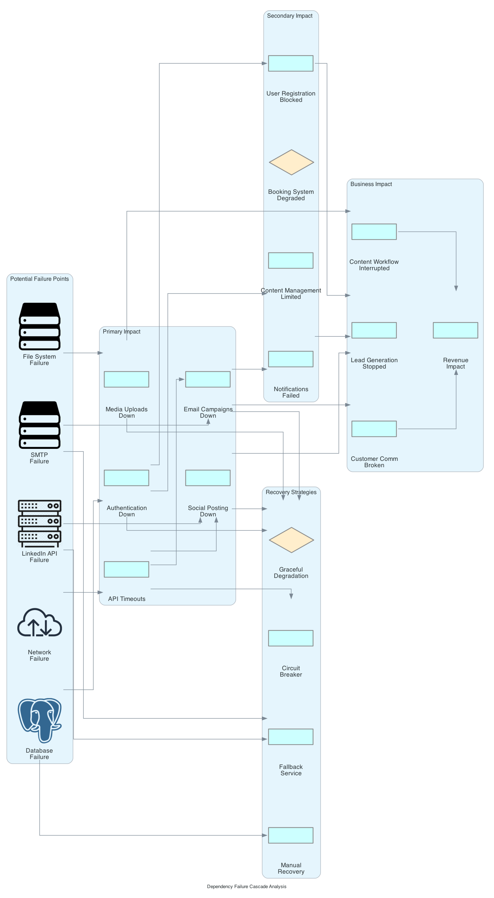

# Dependency Visualization Guide - Magnetiq v2

## Overview

This guide provides comprehensive visualization of dependency chains, trees, and maps for the Magnetiq v2 application. Understanding these dependencies is crucial for development, deployment, troubleshooting, and system maintenance.

## Dependency Categories

### 🏗️ Feature Dependencies

#### Feature Dependency Tree


**Shows**: Complete feature dependency hierarchy from core infrastructure to business features
- **Core Layer**: Authentication, Database, Health Checks
- **Content Layer**: Content API, Media Upload, CMS
- **Business Layer**: Webinars, Whitepapers, Bookings  
- **Communication Layer**: Email Campaigns, Social Integrations
- **External Dependencies**: SMTP, LinkedIn API, Twitter API, File System

#### FastAPI Service Dependencies


**Shows**: Service layer dependency injection patterns in FastAPI
- **Route Dependencies**: Authentication, permissions, validation
- **Service Dependencies**: Cross-service communication patterns
- **Shared Dependencies**: Database sessions, configuration, utilities

### 🗄️ Database Dependencies

#### Model Dependencies with Cascades


**Shows**: SQLAlchemy model relationships with cascade behavior
- **CASCADE**: Parent deletion removes children (User → Sessions)
- **SET NULL**: Parent deletion nullifies foreign key (User → Pages) 
- **RESTRICT**: Parent deletion blocked if children exist (User → Downloads)

#### Data Flow Dependencies


**Shows**: Data flow through all system layers
- **Input Processing**: Validation, sanitization, transformation
- **Business Processing**: Domain-specific logic execution
- **Data Persistence**: Database, file storage, caching
- **Data Distribution**: API responses, notifications, webhooks

### 📊 Service Layer Dependencies

#### Detailed Service Layer Dependencies  


**Shows**: Detailed service-to-service dependencies
- **Repository Pattern**: Service → Repository → Database mapping
- **Cross-Service Dependencies**: Service collaboration patterns
- **Dependency Injection**: FastAPI `Depends()` usage patterns

#### Request Lifecycle Dependencies


**Shows**: Complete request processing with all dependency touchpoints
- **Middleware Stack**: CORS, rate limiting, authentication, logging
- **Dependency Resolution**: Database sessions, user context, permissions
- **Error Handling**: Permission failures, external API timeouts

### 🔧 Operational Dependencies

#### Comprehensive Health Check Tree


**Shows**: Complete health monitoring dependency chain
- **Core Health**: Application, database, file system, memory
- **External Health**: SMTP, LinkedIn API, Twitter API connectivity
- **Feature Health**: Dependent feature availability status
- **Status Aggregation**: Healthy, degraded, unhealthy determination

#### Deployment Dependency Chain


**Shows**: Infrastructure and application deployment dependencies
- **Infrastructure**: Server, OS, network, SSL certificates
- **System Dependencies**: Python runtime, packages, user accounts
- **Application Setup**: Virtual environment, packages, configuration
- **Database Setup**: SQLite file, migrations, seed data
- **Web Server**: Nginx reverse proxy, static files, load balancing

#### Failure Cascade Analysis


**Shows**: How failures cascade through the system
- **Initial Failures**: Database, SMTP, APIs, file system, network
- **Primary Impact**: Feature-level failures and timeouts
- **Secondary Impact**: Business process degradation  
- **Recovery Strategies**: Circuit breakers, fallbacks, manual recovery

#### Monitoring Dependencies


**Shows**: Monitoring and alerting dependency structure
- **Metrics Collection**: Application, database, system, external metrics
- **Monitoring Stack**: Metrics collector, time-series database, alerting
- **Alert Routing**: Critical, warning, info alerts to appropriate teams

## Using Dependency Visualizations

### For Development

1. **Feature Planning**: Use feature dependency trees to understand impact of new features
2. **Service Design**: Reference service dependency maps when designing new services
3. **Database Changes**: Check model cascade diagrams before schema changes
4. **API Development**: Understand request lifecycle dependencies for new endpoints

### For Operations

1. **Health Monitoring**: Use health check trees to understand monitoring coverage
2. **Incident Response**: Reference failure cascade analysis during outages
3. **Deployment Planning**: Follow deployment dependency chains for releases  
4. **Capacity Planning**: Analyze service dependencies for scaling decisions

### For Troubleshooting

1. **Performance Issues**: Trace request lifecycle dependencies to find bottlenecks
2. **Service Outages**: Use failure cascade analysis to identify root causes
3. **Data Consistency**: Check model cascade behavior for data integrity issues
4. **External Integration Failures**: Reference external dependency health trees

## Generating Updated Diagrams

All dependency diagrams are generated using Python scripts with the `diagrams` library:

```bash
# Generate all dependency diagrams
cd docs/diagrams/generator
python generate_all_dependency_diagrams.py

# Generate specific categories
python shorts/feature_dependency_diagrams.py
python shorts/enhanced_dependency_diagrams.py  
python shorts/operational_dependency_diagrams.py
```

## Integration with Specifications

These dependency visualizations complement the main specification documents:

- **[Backend API Specification](spec_v2/backend/api.md)**: Service layer dependencies
- **[Architecture Specification](spec_v2/architecture.md)**: Feature dependency trees
- **[Testing Strategy](spec_v2/testing_strategy.md)**: Test dependency chains
- **[Deployment Specification](spec_v2/deployment.md)**: Deployment dependency chains

## Dependency Management Best Practices

### 1. **Minimize External Dependencies**
- Keep external API dependencies optional where possible
- Implement circuit breakers for external service calls
- Provide graceful degradation when external services are unavailable

### 2. **Clear Dependency Injection**
- Use FastAPI's `Depends()` system consistently  
- Make dependencies explicit in function signatures
- Avoid hidden or implicit dependencies

### 3. **Health Check Coverage**
- Monitor all critical dependencies via health checks
- Implement dependency-specific health checks
- Use dependency health for load balancer decisions

### 4. **Deployment Orchestration**
- Follow deployment dependency order (database → app → web server)
- Validate dependencies before application startup
- Implement proper shutdown sequences

### 5. **Failure Isolation**
- Design for dependency failure scenarios
- Implement timeouts and retries for external dependencies
- Use bulkhead patterns to isolate failing services

This dependency visualization system provides comprehensive insight into the Magnetiq v2 application structure, enabling better development practices, operational monitoring, and incident response.