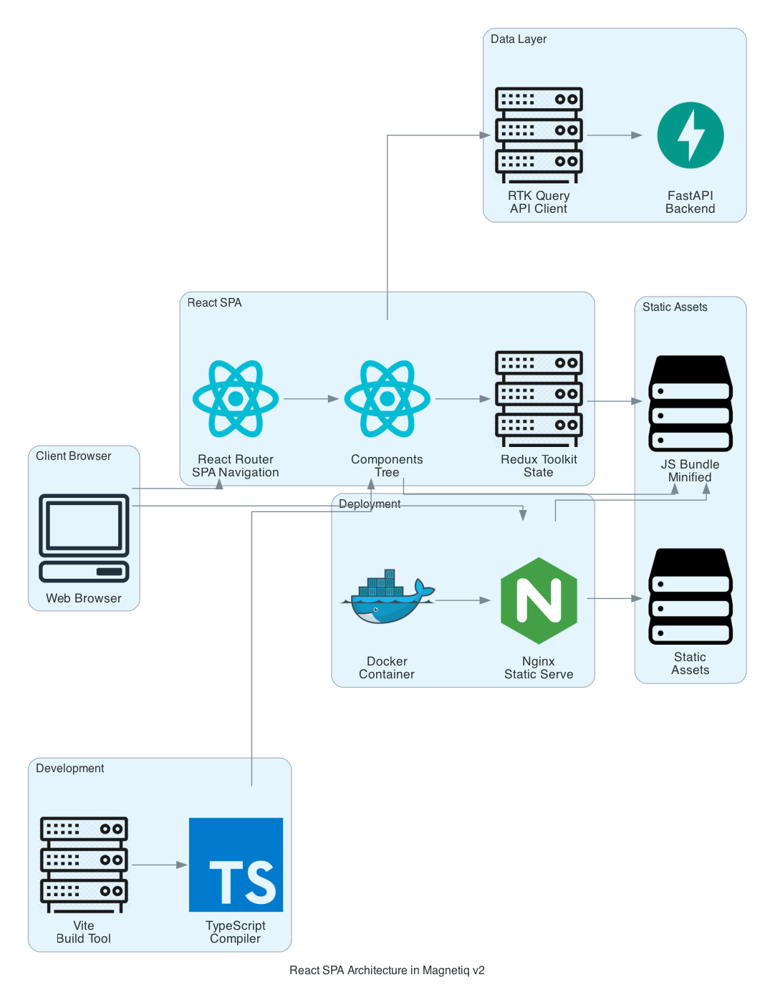
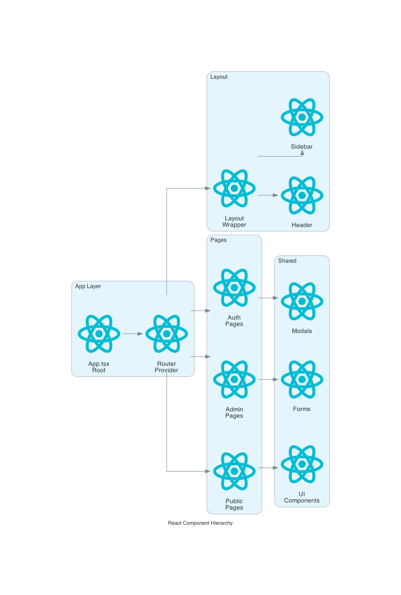
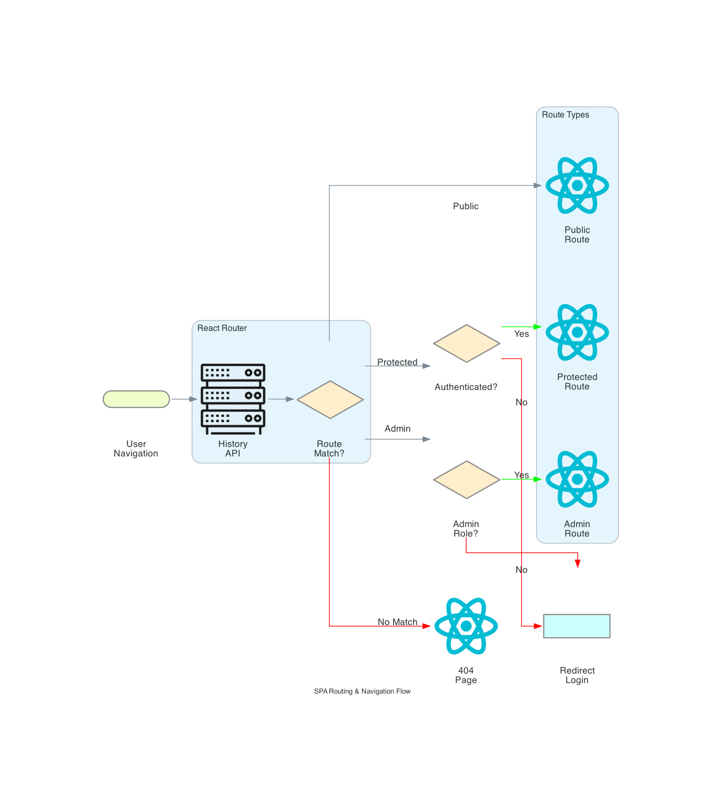
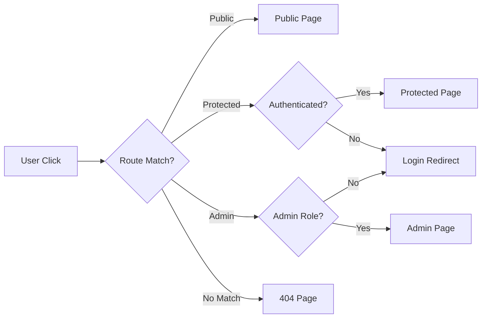
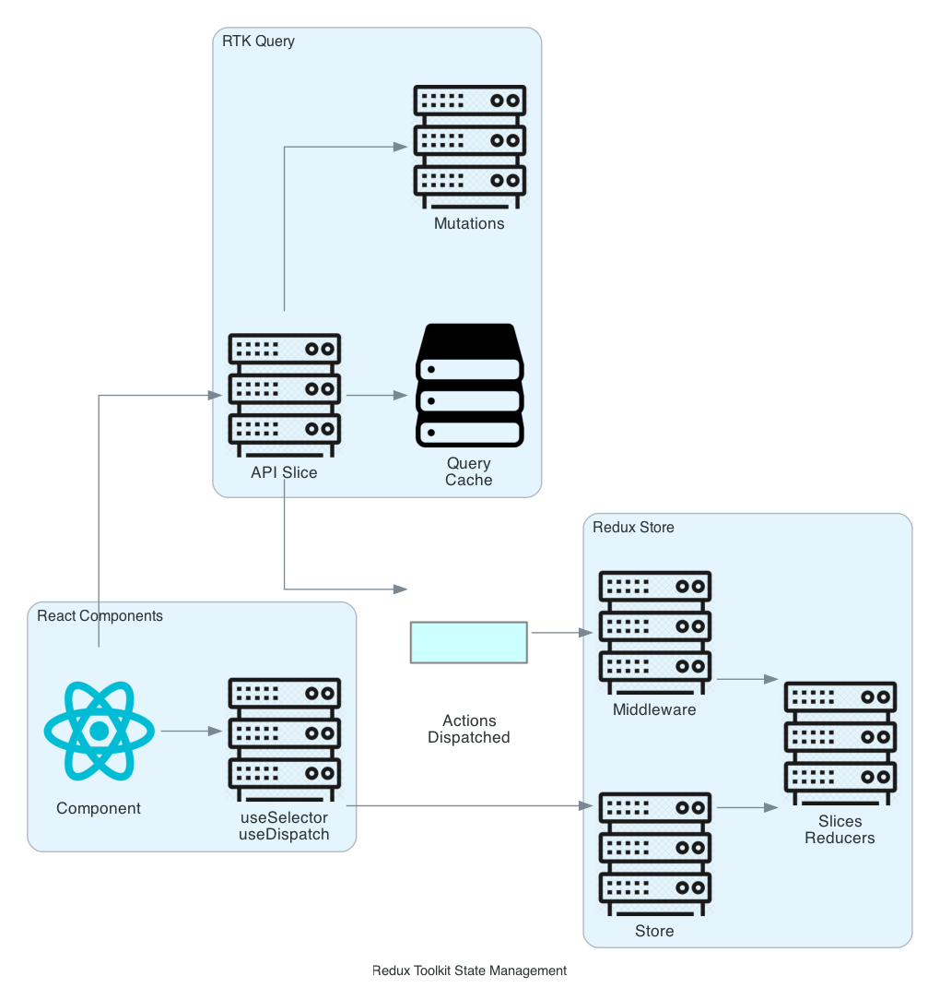
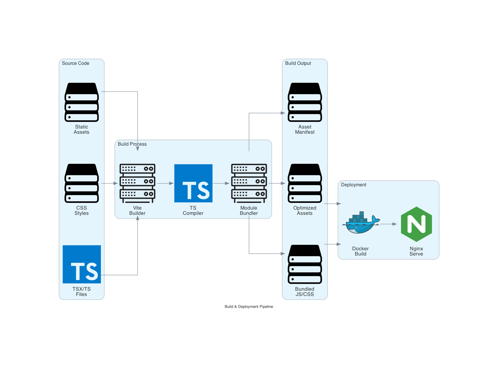
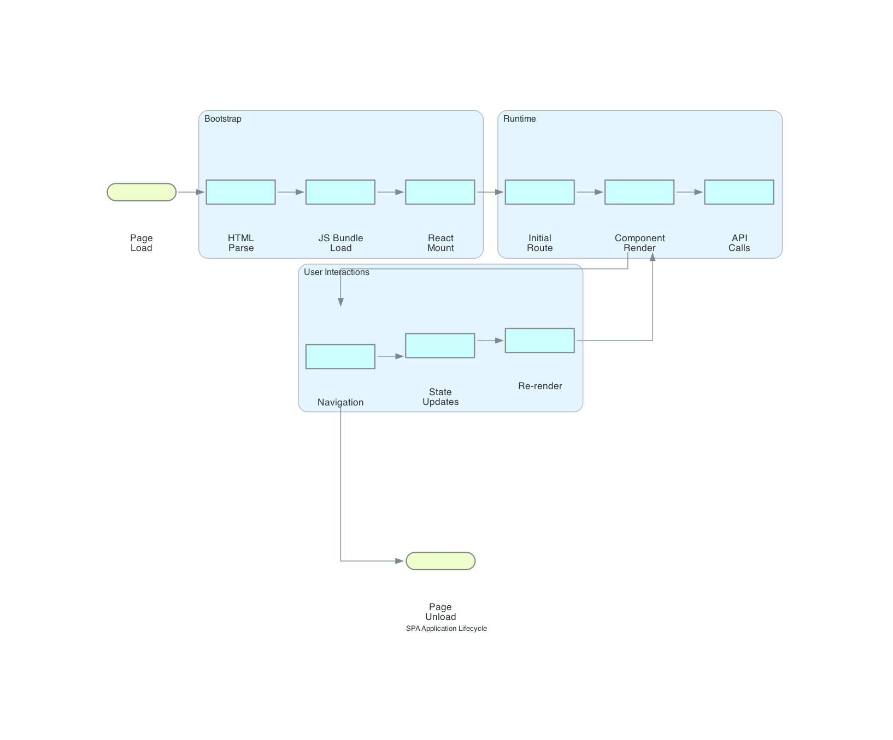
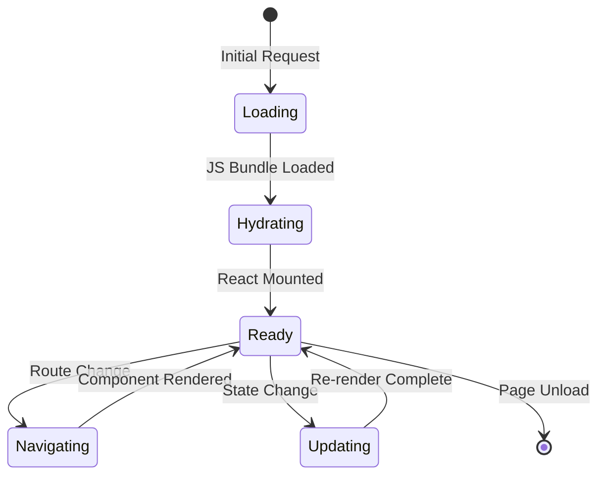

# React SPA: Single Page Application Framework

## Architecture Overview


## What is React SPA?

React Single Page Application (SPA) represents a paradigm shift from traditional multi-page websites to dynamic, client-side rendered applications. Unlike conventional web applications that reload entire pages, SPAs load a single HTML document and dynamically update content through JavaScript, creating fluid, app-like user experiences. React's virtual DOM, component-based architecture, and unidirectional data flow make it the premier framework for building scalable, performant SPAs.

## Usage in Magnetiq v2

React SPA powers the entire frontend experience for Magnetiq v2, delivering both public-facing content and administrative interfaces through a unified, TypeScript-enhanced codebase with Vite build optimization.

### Component Architecture


### Implementation Structure
```typescript
// App.tsx - Root component with providers
export function App() {
  return (
    <Provider store={store}>
      <Router>
        <Routes>
          <Route path="/*" element={<PublicLayout />} />
          <Route path="/admin/*" element={<AdminLayout />} />
        </Routes>
      </Router>
    </Provider>
  );
}
```

### Project Organization
```
frontend/
├── src/
│   ├── components/           # Reusable UI components
│   ├── pages/               # Route-specific page components
│   ├── store/               # Redux Toolkit slices
│   ├── services/            # RTK Query API definitions
│   ├── hooks/               # Custom React hooks
│   └── utils/               # Shared utilities
├── public/                  # Static assets
└── dist/                    # Build output
```

## Routing & Navigation




### Route Configuration
React Router v6 provides declarative routing with nested route support, enabling complex layouts with shared components and protected route authentication checks.

## State Management & Data Flow


### Redux Toolkit Integration
```typescript
// store/authSlice.ts - Authentication state management
export const authSlice = createSlice({
  name: 'auth',
  initialState: { user: null, token: null, isAuthenticated: false },
  reducers: {
    setCredentials: (state, action) => {
      state.user = action.payload.user;
      state.token = action.payload.token;
      state.isAuthenticated = true;
    },
    logout: (state) => {
      state.user = null;
      state.token = null;
      state.isAuthenticated = false;
    }
  }
});
```

### API State Management
RTK Query handles server state, caching, and synchronization with automatic background refetching, optimistic updates, and normalized cache management.

## Build & Deployment Pipeline


### Vite Build Process
Vite's lightning-fast development server and optimized production builds leverage ES modules, tree-shaking, and code splitting for superior performance.

### Build Optimization Features
- **Tree Shaking**: Eliminates unused code from final bundle
- **Code Splitting**: Automatic route-based splitting with dynamic imports
- **Asset Optimization**: Image compression and format conversion
- **Bundle Analysis**: Detailed analysis of chunk sizes and dependencies

## Application Lifecycle




### Performance Characteristics
- **Initial Load**: Single HTML + JS bundle download
- **Navigation**: Instantaneous client-side routing
- **Updates**: Granular component re-rendering via Virtual DOM
- **Caching**: Aggressive caching of static assets and API responses

## Modern React Patterns

### Custom Hooks for Logic Reuse
```typescript
// hooks/useAuth.ts - Authentication logic encapsulation
export function useAuth() {
  const dispatch = useAppDispatch();
  const { user, isAuthenticated } = useAppSelector(state => state.auth);
  
  const login = useCallback(async (credentials) => {
    const result = await dispatch(authApi.endpoints.login.initiate(credentials));
    if (result.data) {
      dispatch(setCredentials(result.data));
    }
  }, [dispatch]);
  
  return { user, isAuthenticated, login };
}
```

### Concurrent Features
React 18's concurrent rendering enables Suspense boundaries, automatic batching, and startTransition for improved user experience during heavy updates.

## Historical Development

- **2011**: Jordan Walke creates React at Facebook for news feed optimization
- **2013**: Open-sourced at JSConf, revolutionizing frontend development
- **2015**: React Router emerges, enabling true SPA architectures
- **2018**: React Hooks introduced, eliminating class component complexity
- **2020**: Concurrent Mode experimental features for better performance
- **2022**: React 18 with automatic batching and concurrent rendering
- **2024**: Integrated into Magnetiq v2 for modern SPA architecture

## Key Contributors

1. **Jordan Walke** - Original React creator at Facebook, now Meta
2. **Dan Abramov** - Redux creator, React core team member
3. **Sebastian Markbåge** - Concurrent features architect
4. **Rachel Nabors** - React documentation and developer experience
5. **Andrew Clark** - Concurrent mode and Suspense implementation
6. **Ryan Florence** - React Router creator and community advocate

## Real-World Implementations

### Netflix's Interface
Netflix rebuilt their entire web interface as a React SPA, handling millions of concurrent users with sophisticated caching strategies, lazy loading, and performance monitoring. Their implementation showcases advanced patterns like render-as-you-fetch and selective hydration for optimal user experience.

### WhatsApp Web
WhatsApp Web demonstrates React SPA's capability for real-time applications, managing complex state synchronization between multiple devices, offline message queuing, and seamless reconnection handling through service workers and local storage persistence.

## Contemporary Alternatives

- **Vue.js SPA**: Template-driven approach with gradual adoption curve, excellent for smaller teams
- **Angular SPA**: Full framework with TypeScript-first approach, ideal for enterprise applications
- **Svelte SPA**: Compile-time optimization with smaller bundle sizes, emerging ecosystem

React SPA's mature ecosystem, extensive tooling, and proven scalability make it the definitive choice for Magnetiq v2's complex frontend requirements, enabling rapid development while maintaining enterprise-grade performance and maintainability.