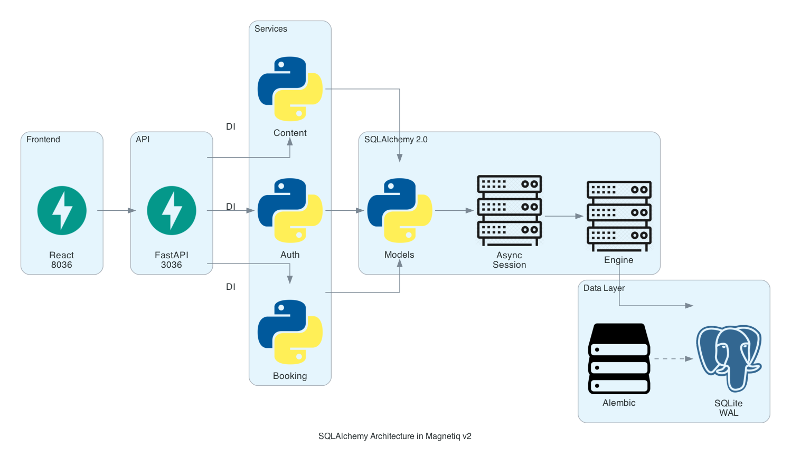
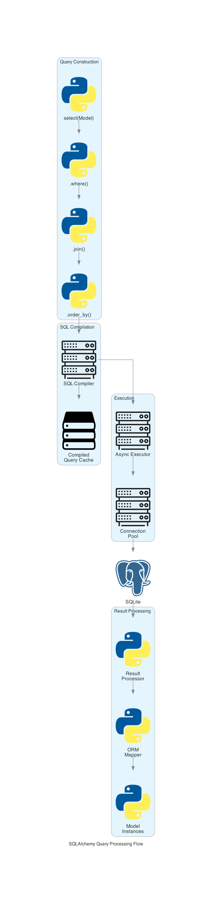
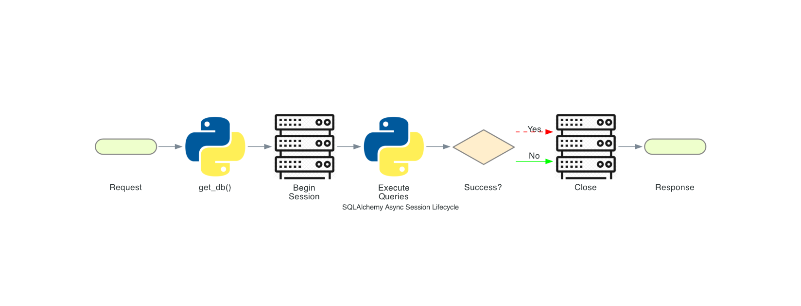
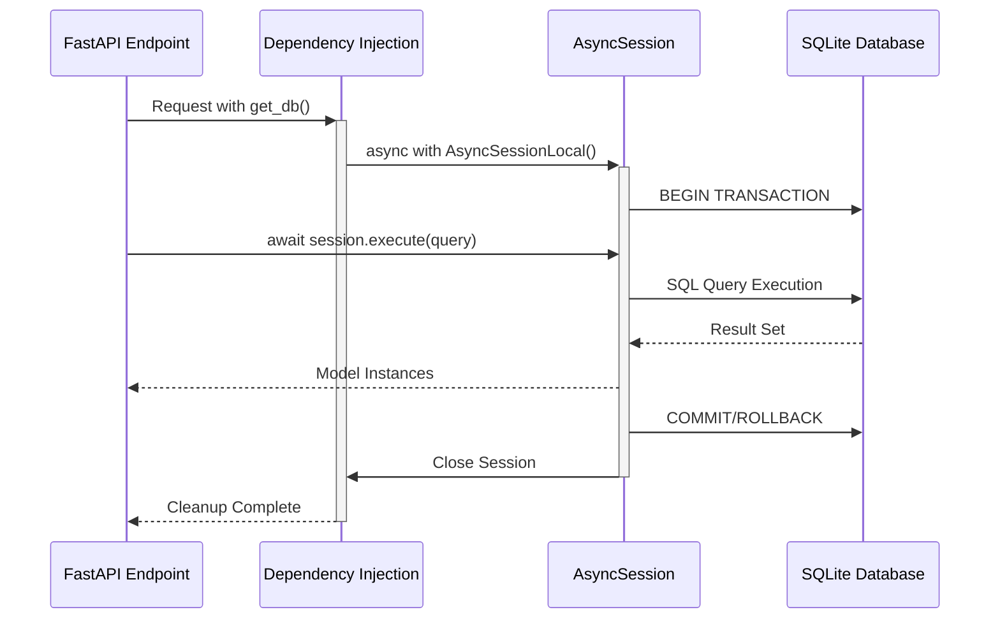
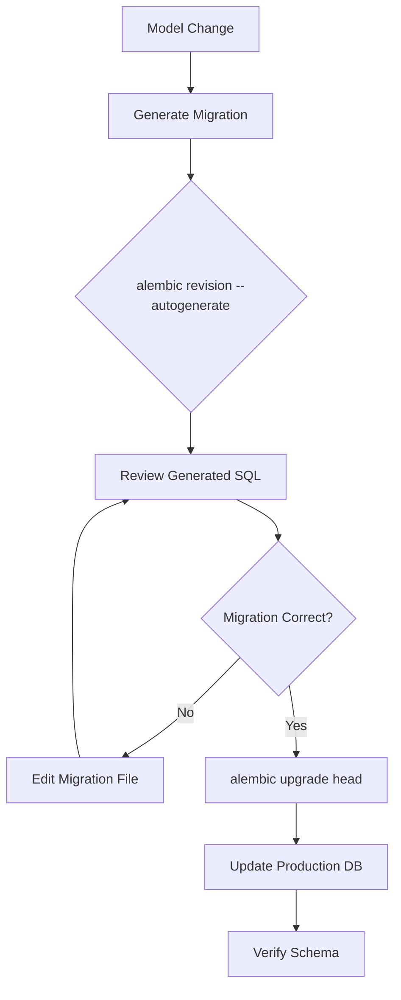

# SQLAlchemy: The Python SQL Toolkit and Object-Relational Mapper

## System Architecture


## What is SQLAlchemy?

SQLAlchemy is Python's premier SQL toolkit and Object-Relational Mapper, providing enterprise-level persistence patterns with dual-layer architecture. Its Core expression layer offers SQL-like control while the ORM layer enables full object-oriented database interaction. SQLAlchemy 2.0+ brings native async support, enhanced type hints, and streamlined APIs, making it the gold standard for Python database operations.

## Usage in Magnetiq v2

SQLAlchemy 2.0 powers the entire Magnetiq v2 data layer through async SQLite operations, managing multilingual content, authentication, bookings, and business automation with modern Python patterns.

### Architecture Overview


### Implementation Structure
```
backend/
├── app/
│   ├── database.py              # Async engine & session factory
│   ├── models/
│   │   ├── base.py             # Base model with common fields
│   │   ├── auth.py             # User, Role, Session models
│   │   ├── content.py          # Page, ContentBlock models
│   │   └── booking.py          # Booking, Consultation models
│   ├── services/               # Business logic with ORM queries
│   └── migrations/            # Alembic schema versioning
```

### Core Configuration
```python
# database.py - Async SQLite with WAL mode
from sqlalchemy.ext.asyncio import AsyncSession, create_async_engine
DATABASE_URL = "sqlite+aiosqlite:///magnetiq_v2.db"

engine = create_async_engine(
    DATABASE_URL,
    connect_args={"check_same_thread": False},
    pool_pre_ping=True
)

AsyncSessionLocal = async_sessionmaker(
    bind=engine, class_=AsyncSession, expire_on_commit=False
)
```

## Model Relationships & Patterns


### Declarative Model Pattern
```python
from sqlalchemy.orm import Mapped, mapped_column, relationship
from typing import Dict, Optional
from datetime import datetime

class Page(Base):
    __tablename__ = "pages"
    
    id: Mapped[int] = mapped_column(primary_key=True)
    slug: Mapped[str] = mapped_column(String(200), unique=True, index=True)
    title: Mapped[Dict[str, str]] = mapped_column(JSON)  # Multilingual
    author_id: Mapped[int] = mapped_column(ForeignKey("users.id"))
    author: Mapped["User"] = relationship(back_populates="pages")
```

## Session Lifecycle Management




## Migration Workflow with Alembic



### Migration Commands
```bash
# Generate migration
alembic revision --autogenerate -m "Add booking fields"

# Apply migrations
alembic upgrade head

# Rollback one version
alembic downgrade -1
```

## Advanced Query Patterns

### Async Service Implementation
```python
class ContentService:
    async def get_published_pages(self, lang: str = "en") -> List[Page]:
        stmt = (
            select(Page)
            .options(selectinload(Page.content_blocks))
            .where(Page.is_published == True)
            .order_by(Page.published_at.desc())
        )
        result = await self.db.execute(stmt)
        return result.scalars().all()
```

### Performance Optimization
- **Connection Pooling**: Pre-configured pool with health checks
- **Eager Loading**: `selectinload()` prevents N+1 queries
- **Compiled Caching**: Statement compilation reuse
- **WAL Mode**: Write-Ahead Logging for concurrent reads

## Historical Timeline

- **2006**: Mike Bayer releases SQLAlchemy 0.1 at Pycon
- **2012**: SQLAlchemy 0.8 introduces new declarative syntax
- **2016**: Version 1.0 marks production stability milestone
- **2021**: SQLAlchemy 1.4 introduces 2.0 transition features
- **2022**: SQLAlchemy 2.0 launches with native async, modern typing
- **2024**: Adopted by Magnetiq v2 for async data operations

## Key Contributors

1. **Mike Bayer** (@zzzeek) - Creator, lead architect at Red Hat
2. **Federico Caselli** - Core maintainer, async implementation
3. **Gord Thompson** - Database driver compatibility expert
4. **Jonathan Vanasco** - Performance optimization specialist
5. **Ramon Williams** - SQLAlchemy 2.0 migration lead

## Real-World Implementations

### Reddit's Trophy System
Reddit uses SQLAlchemy for their trophy and award system, handling millions of user achievements with complex relationships between users, trophies, and award criteria. Their implementation leverages SQLAlchemy's hybrid properties for computed fields and extensive query optimization for feed generation.

### OpenStack Nova
OpenStack's compute service Nova relies on SQLAlchemy for multi-database support across MySQL, PostgreSQL, and SQLite. They utilize SQLAlchemy's migration system for zero-downtime upgrades across thousands of nodes, with custom connection pooling for high-availability deployments.

## Contemporary Alternatives

- **Django ORM**: Tightly integrated with Django framework, simpler API but less flexible for complex queries
- **Tortoise ORM**: Async-first design inspired by Django ORM, younger ecosystem
- **SQLModel**: FastAPI creator's hybrid combining SQLAlchemy with Pydantic, simplified but less mature

SQLAlchemy's maturity, comprehensive async support, and extensive optimization capabilities make it ideal for Magnetiq v2's scalable data layer requirements.