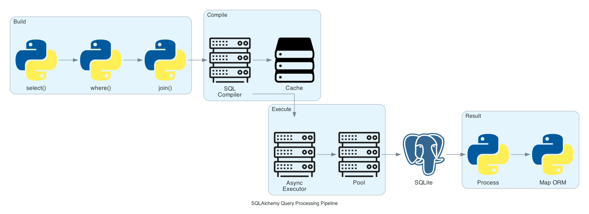

# SQLAlchemy: The Python SQL Toolkit and Object-Relational Mapper

## Architecture Overview


## What is SQLAlchemy?

SQLAlchemy is Python's premier SQL toolkit and Object-Relational Mapper, providing enterprise-level persistence patterns through a sophisticated dual-layer architecture. The Core layer delivers precise SQL expression control while the ORM layer enables intuitive object-oriented database interaction. Version 2.0 revolutionized the library with native async support, comprehensive type hints, and streamlined APIs that embrace modern Python patterns.

## Usage in Magnetiq v2

SQLAlchemy 2.0 powers Magnetiq v2's entire data persistence layer, managing multilingual content, user authentication, booking systems, and business automation through async SQLite operations with WAL mode for concurrent access.

### Data Flow Through Layers


### Project Implementation
```python
# backend/app/database.py - Async SQLite Configuration
from sqlalchemy.ext.asyncio import AsyncSession, create_async_engine
from sqlalchemy.orm import declarative_base

DATABASE_URL = "sqlite+aiosqlite:///magnetiq_v2.db"
engine = create_async_engine(
    DATABASE_URL,
    connect_args={"check_same_thread": False},
    pool_pre_ping=True,
    echo=False
)

AsyncSessionLocal = async_sessionmaker(
    bind=engine,
    class_=AsyncSession,
    expire_on_commit=False
)

# Dependency injection for FastAPI
async def get_db():
    async with AsyncSessionLocal() as session:
        try:
            yield session
        finally:
            await session.close()
```

## Model Relationships Design


### Modern Declarative Models
```python
# SQLAlchemy 2.0 typed models with relationships
from sqlalchemy.orm import Mapped, mapped_column, relationship
from typing import Dict, List, Optional
from datetime import datetime

class User(Base):
    __tablename__ = "users"
    
    id: Mapped[int] = mapped_column(primary_key=True)
    email: Mapped[str] = mapped_column(String(255), unique=True, index=True)
    role: Mapped[str] = mapped_column(String(50), default="viewer")
    
    # Relationships
    pages: Mapped[List["Page"]] = relationship(back_populates="author")
    bookings: Mapped[List["Booking"]] = relationship(back_populates="user")

class Page(Base):
    __tablename__ = "pages"
    
    id: Mapped[int] = mapped_column(primary_key=True)
    slug: Mapped[str] = mapped_column(String(200), unique=True, index=True)
    title: Mapped[Dict[str, str]] = mapped_column(JSON)  # {"en": "Title", "de": "Titel"}
    author_id: Mapped[int] = mapped_column(ForeignKey("users.id"))
    
    author: Mapped["User"] = relationship(back_populates="pages")
    content_blocks: Mapped[List["ContentBlock"]] = relationship(cascade="all, delete-orphan")
```

## Query Processing Pipeline



## Session & Transaction Management


### Async Service Pattern
```python
class ContentService:
    def __init__(self, db: AsyncSession):
        self.db = db
    
    async def get_published_pages(self, language: str = "en") -> List[Page]:
        """Fetch published pages with eager loading"""
        stmt = (
            select(Page)
            .options(selectinload(Page.content_blocks))  # Prevent N+1
            .where(Page.is_published == True)
            .order_by(Page.published_at.desc())
        )
        result = await self.db.execute(stmt)
        return result.scalars().all()
    
    async def create_page_transaction(self, page_data: dict) -> Page:
        """Transactional page creation with rollback"""
        async with self.db.begin():  # Auto commit/rollback
            page = Page(**page_data)
            self.db.add(page)
            await self.db.flush()  # Get ID without committing
            
            # Add content blocks
            for block_data in page_data.get("blocks", []):
                block = ContentBlock(page_id=page.id, **block_data)
                self.db.add(block)
            
            return page  # Commits on context exit
```

## Migration Management with Alembic


## Performance Optimizations

- **Connection Pooling**: Pre-configured async pool with health checks via `pool_pre_ping`
- **Eager Loading**: Strategic use of `selectinload()` and `joinedload()` to prevent N+1 queries
- **Query Compilation Cache**: Automatic SQL statement compilation reuse
- **WAL Mode**: SQLite Write-Ahead Logging enables concurrent reads
- **Batch Operations**: `bulk_insert_mappings()` for efficient data loading

## Historical Evolution

- **2006**: Mike Bayer creates SQLAlchemy, introduces innovative Unit of Work pattern
- **2012**: Version 0.8 revolutionizes declarative syntax
- **2016**: 1.0 release marks enterprise production readiness
- **2021**: 1.4 bridges to 2.0 with future compatibility mode
- **2022**: SQLAlchemy 2.0 launches with native async, full typing support
- **2024**: Powers Magnetiq v2's async data operations

## Key Contributors

1. **Mike Bayer** (@zzzeek) - Creator and BDFL, Red Hat engineer
2. **Federico Caselli** - Async implementation architect
3. **Gord Thompson** - Database driver compatibility specialist
4. **Sebastian Bank** - Type hints system designer
5. **Jonathan Vanasco** - Performance optimization lead

## Real-World Implementations

### Dropbox's Paper Backend
Dropbox Paper uses SQLAlchemy for document storage with custom sharding across MySQL clusters. Their implementation handles millions of collaborative documents using SQLAlchemy's event system for real-time sync triggers and hybrid properties for computed document statistics.

### Mozilla's Crash Reporter (Socorro)
Mozilla Socorro processes Firefox crash reports using SQLAlchemy with PostgreSQL partitioning. They handle 3+ million daily crash reports through custom SQLAlchemy types for stack trace data and connection pooling optimized for high-throughput data ingestion.

## Contemporary Alternatives

- **Django ORM**: Integrated with Django, simpler but less flexible for complex queries and raw SQL
- **Tortoise ORM**: Async-first design, younger ecosystem, inspired by Django ORM patterns
- **SQLModel**: FastAPI creator's hybrid merging SQLAlchemy with Pydantic, trades power for simplicity

SQLAlchemy's maturity, comprehensive async capabilities, and unmatched flexibility in handling complex queries make it the optimal choice for Magnetiq v2's scalable, high-performance data layer.