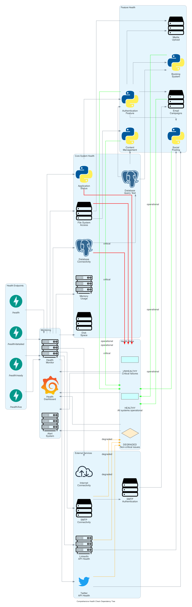

# Magnetiq v2 - Backend API Specification

## Overview

The Magnetiq v2 backend is a streamlined, production-ready API built with Python and FastAPI. It provides secure, RESTful endpoints for all system functionality including authentication, content management, communications and business operations using a simple SQLite database.

## Technical Foundation

### Technology Stack
- **Framework**: FastAPI 0.104+ with async/await
- **Python Version**: 3.11+
- **ASGI Server**: Uvicorn with Gunicorn workers
- **ORM**: SQLAlchemy 2.0 with async support
- **Database**: SQLite (all environments)
- **Validation**: Pydantic v2 with JSON Schema
- **Authentication**: JWT with HS256 algorithm
- **Documentation**: Auto-generated OpenAPI 3.0

### Port Configuration
- **Development**: Port 3036 (unified backend port)
- **Production**: Port 3036 (behind Nginx reverse proxy)
- **Health Checks**: Dedicated endpoints with basic dependency monitoring
- **API Documentation**: Swagger UI available at `/docs`

### Project Structure
```
backend/
├── app/
│   ├── main.py              # FastAPI application entry
│   ├── config.py            # Configuration management  
│   ├── database.py          # SQLite database setup and connection
│   ├── dependencies.py      # Dependency injection
│   ├── exceptions.py        # Custom exception handlers
│   ├── middleware.py        # Custom middleware
│   ├── api/                 # API routes (all under /api/)
│   │   ├── v1/
│   │   │   ├── auth/        # Authentication endpoints
│   │   │   ├── content/     # Content management
│   │   │   ├── business/    # Business features
│   │   │   ├── communication/ # Communication services
│   │   │   │   ├── email/   # Email marketing
│   │   │   │   ├── linkedin/# LinkedIn integration
│   │   │   │   └── twitter/ # Twitter/X integration
│   │   │   ├── admin/       # Admin panel APIs
│   │   │   └── public/      # Public-facing APIs
│   ├── core/                # Core functionality
│   │   ├── auth.py          # Authentication logic
│   │   ├── permissions.py   # RBAC implementation
│   │   ├── security.py      # Security utilities
│   │   └── logging.py       # Logging configuration
│   ├── models/              # SQLAlchemy models
│   ├── schemas/             # Pydantic request/response models
│   ├── services/            # Business logic services
│   └── utils/               # Shared utilities
├── migrations/              # Alembic database migrations
├── tests/                   # Test suites
├── requirements.txt         # Python dependencies
└── alembic.ini             # Database migration configuration
```

## Database Configuration

### SQLite Setup
```python
# database.py
from sqlalchemy.ext.asyncio import create_async_engine, AsyncSession
from sqlalchemy.orm import sessionmaker, declarative_base

# SQLite with WAL mode for better concurrency
DATABASE_URL = "sqlite+aiosqlite:///./magnetiq.db"

engine = create_async_engine(
    DATABASE_URL,
    echo=False,  # Set to True for SQL logging in development
    connect_args={
        "check_same_thread": False,
        "timeout": 30,
    }
)

SessionLocal = sessionmaker(
    autocommit=False,
    autoflush=False,
    bind=engine,
    class_=AsyncSession
)

Base = declarative_base()

# Enable WAL mode for better concurrent performance
async def enable_wal_mode():
    async with engine.begin() as conn:
        await conn.execute(text("PRAGMA journal_mode=WAL;"))
        await conn.execute(text("PRAGMA foreign_keys=ON;"))
        await conn.execute(text("PRAGMA synchronous=NORMAL;"))
```

### Database Management
- **Migrations**: Alembic for schema version control
- **Connections**: Connection pooling via SQLAlchemy
- **Transactions**: Async transaction support
- **Backup**: Simple file-based backup strategy
- **Maintenance**: Regular VACUUM operations for optimization

## API Architecture

### Service Dependency Map


The service layer implements a clean dependency injection pattern using FastAPI's `Depends()` system, with clear separation between API endpoints, service logic, repository patterns, and cross-cutting concerns.

### Request Lifecycle


Each request flows through middleware, dependency injection, business logic, and response processing with proper error handling at each stage.

### Base URL Structure
- **Development**: `http://localhost:3036/api/v1/`
- **Production**: `https://api.voltaic.systems/api/v1/`

### Authentication Endpoints
```
POST   /api/v1/auth/login           # User login
POST   /api/v1/auth/refresh         # Token refresh
POST   /api/v1/auth/logout          # User logout
POST   /api/v1/auth/register        # User registration (admin only)
POST   /api/v1/auth/forgot-password # Password reset request
POST   /api/v1/auth/reset-password  # Password reset confirmation
```

### Content Management Endpoints
```
GET    /api/v1/content/pages        # List pages
POST   /api/v1/content/pages        # Create page
GET    /api/v1/content/pages/{id}   # Get page details
PUT    /api/v1/content/pages/{id}   # Update page
DELETE /api/v1/content/pages/{id}   # Delete page (soft delete)

GET    /api/v1/content/media        # List media files
POST   /api/v1/content/media        # Upload media
DELETE /api/v1/content/media/{id}   # Delete media file
```

### Business Operations Endpoints
```
# Webinars
GET    /api/v1/business/webinars              # List webinars
POST   /api/v1/business/webinars              # Create webinar
GET    /api/v1/business/webinars/{id}         # Get webinar details
POST   /api/v1/business/webinars/{id}/register # Register for webinar

# Whitepapers
GET    /api/v1/business/whitepapers           # List whitepapers
POST   /api/v1/business/whitepapers           # Create whitepaper
GET    /api/v1/business/whitepapers/{id}      # Get whitepaper
POST   /api/v1/business/whitepapers/{id}/download # Download with lead capture

# Bookings
GET    /api/v1/business/bookings              # List bookings
POST   /api/v1/business/bookings              # Create booking
GET    /api/v1/business/bookings/{id}         # Get booking details
PUT    /api/v1/business/bookings/{id}         # Update booking status
```

### Communication Services Endpoints

#### Email Marketing
```
GET    /api/v1/communication/email/campaigns           # List email campaigns
POST   /api/v1/communication/email/campaigns           # Create email campaign  
GET    /api/v1/communication/email/campaigns/{id}      # Get campaign details
PUT    /api/v1/communication/email/campaigns/{id}      # Update campaign
DELETE /api/v1/communication/email/campaigns/{id}      # Delete campaign
POST   /api/v1/communication/email/campaigns/{id}/send # Send campaign

GET    /api/v1/communication/email/templates           # List email templates
POST   /api/v1/communication/email/templates           # Create email template
GET    /api/v1/communication/email/templates/{id}      # Get template
PUT    /api/v1/communication/email/templates/{id}      # Update template
DELETE /api/v1/communication/email/templates/{id}      # Delete template
```

#### LinkedIn Integration
```
GET    /api/v1/communication/linkedin/accounts         # List connected LinkedIn accounts
POST   /api/v1/communication/linkedin/accounts         # Connect LinkedIn account
DELETE /api/v1/communication/linkedin/accounts/{id}    # Disconnect account

GET    /api/v1/communication/linkedin/content          # List LinkedIn posts
POST   /api/v1/communication/linkedin/content          # Create LinkedIn post
GET    /api/v1/communication/linkedin/content/{id}     # Get post details
PUT    /api/v1/communication/linkedin/content/{id}     # Update scheduled post
DELETE /api/v1/communication/linkedin/content/{id}     # Delete/cancel post
POST   /api/v1/communication/linkedin/content/{id}/publish # Publish post immediately

POST   /api/v1/communication/linkedin/media            # Upload LinkedIn media
GET    /api/v1/communication/linkedin/engagement       # Get engagement analytics
GET    /api/v1/communication/linkedin/engagement/{post_id} # Get post-specific analytics
```

#### Twitter/X Integration
```
GET    /api/v1/communication/twitter/accounts          # List connected Twitter accounts  
POST   /api/v1/communication/twitter/accounts          # Connect Twitter account
DELETE /api/v1/communication/twitter/accounts/{id}     # Disconnect account

GET    /api/v1/communication/twitter/content           # List tweets/threads
POST   /api/v1/communication/twitter/content           # Create tweet/thread
GET    /api/v1/communication/twitter/content/{id}      # Get tweet details
PUT    /api/v1/communication/twitter/content/{id}      # Update scheduled tweet
DELETE /api/v1/communication/twitter/content/{id}      # Delete/cancel tweet
POST   /api/v1/communication/twitter/content/{id}/publish # Publish tweet immediately

POST   /api/v1/communication/twitter/media             # Upload Twitter media
GET    /api/v1/communication/twitter/engagement        # Get engagement analytics
GET    /api/v1/communication/twitter/engagement/{tweet_id} # Get tweet-specific analytics
```

### Admin Panel Endpoints
```
GET    /api/v1/admin/users          # List admin users
POST   /api/v1/admin/users          # Create admin user
PUT    /api/v1/admin/users/{id}     # Update user
DELETE /api/v1/admin/users/{id}     # Deactivate user

GET    /api/v1/admin/analytics      # Basic analytics data
GET    /api/v1/admin/system-health  # System status
```

## Authentication & Security

### JWT Implementation
```python
# auth.py
from jose import JWTError, jwt
from passlib.context import CryptContext
from datetime import datetime, timedelta

# HS256 algorithm for simplicity
SECRET_KEY = "your-secret-key-here"  # From environment
ALGORITHM = "HS256"
ACCESS_TOKEN_EXPIRE_MINUTES = 15
REFRESH_TOKEN_EXPIRE_DAYS = 7

pwd_context = CryptContext(schemes=["bcrypt"], deprecated="auto")

def create_access_token(data: dict, expires_delta: timedelta = None):
    to_encode = data.copy()
    if expires_delta:
        expire = datetime.utcnow() + expires_delta
    else:
        expire = datetime.utcnow() + timedelta(minutes=ACCESS_TOKEN_EXPIRE_MINUTES)
    to_encode.update({"exp": expire, "type": "access"})
    encoded_jwt = jwt.encode(to_encode, SECRET_KEY, algorithm=ALGORITHM)
    return encoded_jwt

def create_refresh_token(data: dict):
    to_encode = data.copy()
    expire = datetime.utcnow() + timedelta(days=REFRESH_TOKEN_EXPIRE_DAYS)
    to_encode.update({"exp": expire, "type": "refresh"})
    encoded_jwt = jwt.encode(to_encode, SECRET_KEY, algorithm=ALGORITHM)
    return encoded_jwt
```

### Role-Based Access Control
```python
# permissions.py
from enum import Enum
from functools import wraps

class UserRole(Enum):
    ADMIN = "admin"
    EDITOR = "editor"
    VIEWER = "viewer"

class Permission(Enum):
    READ = "read"
    WRITE = "write"
    DELETE = "delete"
    ADMIN = "admin"

ROLE_PERMISSIONS = {
    UserRole.ADMIN: [Permission.READ, Permission.WRITE, Permission.DELETE, Permission.ADMIN],
    UserRole.EDITOR: [Permission.READ, Permission.WRITE],
    UserRole.VIEWER: [Permission.READ],
}

def require_permission(permission: Permission):
    def decorator(func):
        @wraps(func)
        async def wrapper(*args, **kwargs):
            current_user = kwargs.get('current_user')
            if not current_user:
                raise HTTPException(status_code=401, detail="Authentication required")
            
            user_permissions = ROLE_PERMISSIONS.get(current_user.role, [])
            if permission not in user_permissions:
                raise HTTPException(status_code=403, detail="Insufficient permissions")
            
            return await func(*args, **kwargs)
        return wrapper
    return decorator
```

## Data Models

### Model Relationships and Dependencies


The data models implement proper cascade behaviors (CASCADE, SET NULL, RESTRICT) to maintain referential integrity and prevent orphaned records.

### User Model
```python
# models/user.py
from sqlalchemy import Column, Integer, String, DateTime, Enum, Boolean
from sqlalchemy.sql import func
from app.database import Base
from app.core.permissions import UserRole

class User(Base):
    __tablename__ = "admin_users"

    id = Column(Integer, primary_key=True, index=True)
    email = Column(String(255), unique=True, index=True, nullable=False)
    hashed_password = Column(String(255), nullable=False)
    
    # Profile Information
    first_name = Column(String(100), nullable=False)
    last_name = Column(String(100), nullable=False)
    role = Column(Enum(UserRole), default=UserRole.VIEWER)
    
    # Status
    is_active = Column(Boolean, default=True)
    last_login = Column(DateTime(timezone=True))
    
    # Timestamps
    created_at = Column(DateTime(timezone=True), server_default=func.now())
    updated_at = Column(DateTime(timezone=True), onupdate=func.now())
    deleted_at = Column(DateTime(timezone=True), nullable=True)
```

### Content Model
```python
# models/content.py
from sqlalchemy import Column, Integer, String, Text, JSON, DateTime, Boolean
from sqlalchemy.sql import func
from app.database import Base

class Page(Base):
    __tablename__ = "pages"

    id = Column(Integer, primary_key=True, index=True)
    slug = Column(String(255), unique=True, index=True)
    
    # Multilingual content stored as JSON
    title = Column(JSON, nullable=False)  # {"en": "Title", "de": "Titel"}
    content = Column(JSON, nullable=False)
    meta_description = Column(JSON, nullable=True)
    
    # Status
    status = Column(String(20), default="draft")  # draft, published
    is_published = Column(Boolean, default=False)
    published_at = Column(DateTime(timezone=True), nullable=True)
    
    # SEO
    seo_title = Column(JSON, nullable=True)
    seo_keywords = Column(JSON, nullable=True)
    
    # Timestamps
    created_at = Column(DateTime(timezone=True), server_default=func.now())
    updated_at = Column(DateTime(timezone=True), onupdate=func.now())
    deleted_at = Column(DateTime(timezone=True), nullable=True)
```

## Request/Response Schemas

### Authentication Schemas
```python
# schemas/auth.py
from pydantic import BaseModel, EmailStr
from typing import Optional
from datetime import datetime

class LoginRequest(BaseModel):
    email: EmailStr
    password: str

class TokenResponse(BaseModel):
    access_token: str
    refresh_token: str
    token_type: str = "bearer"
    expires_in: int

class UserResponse(BaseModel):
    id: int
    email: str
    first_name: str
    last_name: str
    role: str
    is_active: bool
    last_login: Optional[datetime]
    created_at: datetime

    class Config:
        from_attributes = True
```

### Content Schemas
```python
# schemas/content.py
from pydantic import BaseModel
from typing import Dict, Optional
from datetime import datetime

class PageCreate(BaseModel):
    slug: str
    title: Dict[str, str]  # {"en": "Title", "de": "Titel"}
    content: Dict[str, str]
    meta_description: Optional[Dict[str, str]] = None
    status: str = "draft"

class PageResponse(BaseModel):
    id: int
    slug: str
    title: Dict[str, str]
    content: Dict[str, str]
    status: str
    is_published: bool
    created_at: datetime
    updated_at: Optional[datetime]

    class Config:
        from_attributes = True
```

## Error Handling

### Exception Classes
```python
# exceptions.py
from fastapi import HTTPException, Request
from fastapi.responses import JSONResponse
from sqlalchemy.exc import IntegrityError
import logging

logger = logging.getLogger(__name__)

class DatabaseError(Exception):
    pass

class ValidationError(Exception):
    def __init__(self, message: str, field: str = None):
        self.message = message
        self.field = field
        super().__init__(message)

async def database_error_handler(request: Request, exc: IntegrityError):
    logger.error(f"Database error: {exc}")
    return JSONResponse(
        status_code=500,
        content={
            "success": False,
            "error": {
                "code": "DATABASE_ERROR",
                "message": "A database error occurred"
            }
        }
    )

async def validation_error_handler(request: Request, exc: ValidationError):
    return JSONResponse(
        status_code=400,
        content={
            "success": False,
            "error": {
                "code": "VALIDATION_ERROR",
                "message": exc.message,
                "field": exc.field
            }
        }
    )
```

## Health Checks & Monitoring

### Comprehensive Health Check Dependencies


The health monitoring system tracks core dependencies, external services, and feature availability to provide comprehensive system status.

### Health Check Endpoint
```python
# api/v1/health.py
from fastapi import APIRouter, Depends
from sqlalchemy.ext.asyncio import AsyncSession
from sqlalchemy import text
from app.database import get_db
import os

router = APIRouter()

@router.get("/health")
async def health_check():
    """Basic health check"""
    return {
        "status": "healthy",
        "version": "2.0.0",
        "environment": os.getenv("ENVIRONMENT", "development")
    }

@router.get("/health/detailed")
async def detailed_health_check(db: AsyncSession = Depends(get_db)):
    """Detailed health check with database"""
    health_status = {
        "status": "healthy",
        "version": "2.0.0",
        "services": {}
    }
    
    # Database health
    try:
        result = await db.execute(text("SELECT 1"))
        health_status["services"]["database"] = {
            "status": "healthy",
            "type": "SQLite"
        }
    except Exception as e:
        health_status["services"]["database"] = {
            "status": "unhealthy",
            "error": str(e)
        }
        health_status["status"] = "degraded"
    
    # File system health
    try:
        db_path = "magnetiq.db"
        if os.path.exists(db_path):
            db_size = os.path.getsize(db_path)
            health_status["services"]["filesystem"] = {
                "status": "healthy",
                "database_size_mb": round(db_size / 1024 / 1024, 2)
            }
        else:
            health_status["services"]["filesystem"] = {
                "status": "warning",
                "message": "Database file not found"
            }
    except Exception as e:
        health_status["services"]["filesystem"] = {
            "status": "unhealthy",
            "error": str(e)
        }
    
    return health_status
```

## Development Configuration

### Environment Variables
```bash
# .env (development)
ENVIRONMENT=development
SECRET_KEY=your-development-secret-key-here
DATABASE_URL=sqlite+aiosqlite:///./magnetiq_dev.db
DEBUG=true

# CORS settings
ALLOWED_ORIGINS=http://localhost:8036,http://localhost:3000
ALLOWED_METHODS=GET,POST,PUT,PATCH,DELETE
ALLOWED_HEADERS=*

# Email settings (development)
SMTP_HOST=smtp.mailtrap.io
SMTP_PORT=587
SMTP_USER=your-mailtrap-user
SMTP_PASSWORD=your-mailtrap-password
SMTP_FROM_EMAIL=noreply@magnetiq.local

# File upload settings
MAX_FILE_SIZE=10485760  # 10MB
ALLOWED_FILE_TYPES=jpg,jpeg,png,gif,pdf,docx
UPLOAD_DIR=./media
```

### Production Configuration
```bash
# .env (production)
ENVIRONMENT=production
SECRET_KEY=your-super-secure-production-secret-key
DATABASE_URL=sqlite+aiosqlite:///./data/magnetiq_prod.db
DEBUG=false

# CORS settings
ALLOWED_ORIGINS=https://voltaic.systems,https://www.voltaic.systems
ALLOWED_METHODS=GET,POST,PUT,PATCH,DELETE
ALLOWED_HEADERS=*

# Email settings (production)
SMTP_HOST=smtp-relay.brevo.com
SMTP_PORT=587
SMTP_USER=your-brevo-user
SMTP_PASSWORD=your-brevo-password
SMTP_FROM_EMAIL=noreply@voltaic.systems

# File upload settings
MAX_FILE_SIZE=52428800  # 50MB
ALLOWED_FILE_TYPES=jpg,jpeg,png,gif,pdf,docx,xlsx,pptx
UPLOAD_DIR=./data/media
```

## API Testing

### Development Server
```bash
# Start development server
cd backend
pip install -r requirements.txt
uvicorn app.main:app --reload --port 3036

# Run database migrations
alembic upgrade head

# Create admin user (via CLI script)
python scripts/create_admin.py --email admin@voltaic.systems --password securepassword
```

### API Documentation
- **Swagger UI**: `http://localhost:3036/docs`
- **ReDoc**: `http://localhost:3036/redoc`
- **OpenAPI JSON**: `http://localhost:3036/openapi.json`

### Testing Endpoints
```bash
# Health check
curl http://localhost:3036/api/v1/health

# Login
curl -X POST http://localhost:3036/api/v1/auth/login \
  -H "Content-Type: application/json" \
  -d '{"email": "admin@voltaic.systems", "password": "securepassword"}'

# Get pages (with auth token)
curl -H "Authorization: Bearer YOUR_ACCESS_TOKEN" \
  http://localhost:3036/api/v1/content/pages
```

## Migration from Complex v2 to Simple v2

For teams migrating from the previous complex v2 architecture:

### Key Changes
- **Database**: PostgreSQL → SQLite (single file)
- **Caching**: Redis removed → In-memory caching only
- **Background Tasks**: Celery removed → Synchronous operations
- **Authentication**: RS256 → HS256 (simpler secret management)
- **Complexity**: Microservices → Monolithic API

### Migration Benefits
- **Simplified Deployment**: Single database file, no external dependencies
- **Reduced Infrastructure**: No Redis, Celery, or complex orchestration
- **Faster Development**: Fewer moving parts, easier debugging
- **Cost Effective**: Reduced hosting requirements and maintenance

### Evolution Path
For advanced integration capabilities, consider upgrading to [Magnetiq v3](../spec_v3/integration.md) which provides lightweight ESB functionality while maintaining reasonable complexity.

## Conclusion

The Magnetiq v2 backend provides a robust, production-ready API while maintaining simplicity through SQLite and monolithic architecture. This approach enables rapid development and deployment while providing a clear path to more advanced capabilities in v3.
