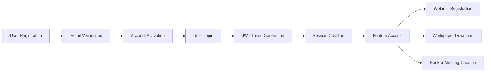

# Magnetiq v2 - Dependency Mapping System

## Overview

This document demonstrates the comprehensive dependency mapping capabilities of the B2B Web Application Specification Architect, using the User Authentication feature as a primary example. The system tracks forward dependencies, reverse dependencies, and validates cross-component integrity.

## User Authentication Feature Dependencies

### Forward Dependencies Analysis
**What the User Authentication feature requires to function:**

#### 1. Backend Dependencies
- **API Endpoints** → `/backend/api.md`
  - `POST /api/v1/auth/register` - User registration
  - `POST /api/v1/auth/login` - User authentication
  - `POST /api/v1/auth/refresh` - Token refresh
  - `POST /api/v1/auth/logout` - Session termination
  - `POST /api/v1/auth/forgot-password` - Password reset request
  - `POST /api/v1/auth/reset-password` - Password reset completion

#### 2. Database Dependencies
- **Tables Required** → `/backend/database.md`
  - `users` table - Core user account storage
  - `user_sessions` table - Active session tracking
  - `password_reset_tokens` table - Reset token management
  - `audit_logs` table - Authentication event logging

#### 3. Security Dependencies
- **Security Components** → `/security.md`
  - JWT token generation and validation service
  - Password hashing service (bcrypt)
  - Rate limiting middleware
  - Input validation and sanitization
  - Session management service

#### 4. Integration Dependencies
- **External Services** → `/integrations/smtp-brevo.md`
  - Email service for account verification
  - Password reset email notifications
  - Login alert notifications

#### 5. Frontend Dependencies
- **UI Components** → `/frontend/public/public.md`
  - Login form components
  - Registration form components
  - Password reset components
  - Authentication state management (Redux)

### Reverse Dependencies Analysis
**What components depend on User Authentication:**

#### 1. Feature Dependencies
- **Webinars** → `/frontend/public/features/webinars.md`
  - Requires user authentication for webinar registration
  - Admin authentication for webinar management
  - User session for personalized webinar recommendations

- **Whitepapers** → `/frontend/public/features/whitepapers.md`
  - User authentication for whitepaper downloads
  - Lead capture integration with user accounts
  - Download history tracking

- **Booking System** → `/frontend/public/features/book-a-meeting.md`
  - User authentication for consultation bookings
  - Calendar integration requires authenticated sessions
  - Book-a-meeting history and management

- **Communication** → `/frontend/public/features/communication.md`
  - Authenticated access for communication preferences
  - Social media account linking requires user sessions
  - Email campaign personalization

#### 2. Admin Panel Dependencies
- **Admin Interface** → `/frontend/adminpanel/admin.md`
  - Admin user authentication and authorization
  - Role-based access control
  - User management interface
  - System administration access

#### 3. User Persona Dependencies
- **Site Admin** → `/users/site-admin.md`
  - Requires highest-level authentication
  - System configuration access
  - User management capabilities

- **Content Editor** → `/users/content-editor.md`
  - Requires editor-level authentication
  - Content management access
  - Publishing workflow participation

### Cross-Component Integrity Validation

#### Validation Matrix

| Component | Validation Rule | Status | Issues |
|-----------|-----------------|--------|--------|
| `/backend/api.md` | All auth endpoints documented | ✅ | None |
| `/backend/database.md` | User tables defined | ⚠️ | Need session table schema |
| `/security.md` | JWT implementation specified | ✅ | None |
| `/integrations/smtp-brevo.md` | Email templates defined | ⚠️ | Need auth email templates |
| `/frontend/public/features/webinars.md` | Auth integration documented | ❌ | Missing auth requirements |
| `/frontend/adminpanel/admin.md` | Admin auth flow specified | ❌ | Missing admin auth details |

#### Dependency Chain Validation



### Cyclical Dependency Detection

**Analysis Result**: No cyclical dependencies detected in User Authentication feature.

**Validation Process**:
1. Build dependency graph from authentication feature
2. Perform depth-first traversal to detect cycles
3. Check for circular references in component relationships
4. Validate that no feature depends on authentication while authentication depends on it

## Comprehensive Dependency Mapping Structure

### 1. Core Infrastructure Dependencies

```yaml
infrastructure:
  database:
    sqlite_engine: required
    connection_pool: required
    migration_system: required
  
  security:
    jwt_service: required
    password_hashing: required
    rate_limiting: required
  
  caching:
    redis_client: required
    session_store: required
    rate_limit_store: required
```

### 2. Service Layer Dependencies

```yaml
services:
  authentication_service:
    depends_on:
      - password_service
      - jwt_service
      - email_service
      - user_repository
    
  user_service:
    depends_on:
      - authentication_service
      - audit_service
      - permission_service
```

### 3. API Layer Dependencies

```yaml
api_endpoints:
  auth_routes:
    dependencies:
      - authentication_service
      - rate_limiting_middleware
      - validation_middleware
    
  protected_routes:
    dependencies:
      - jwt_authentication_middleware
      - permission_checking_middleware
```

### 4. Frontend Dependencies

```yaml
frontend:
  authentication_components:
    dependencies:
      - auth_api_service
      - form_validation_service
      - state_management_store
    
  protected_components:
    dependencies:
      - authentication_guard
      - permission_checker
      - user_context_provider
```

## Dependency Validation Rules

### 1. Completeness Validation

**Rule**: Every feature specification must include:
- Required API endpoints in `/backend/api.md`
- Database schema in `/backend/database.md`
- Security considerations in `/security.md`
- Integration requirements if applicable

**Validation Script**:
```python
def validate_feature_completeness(feature_spec):
    required_components = [
        'api_endpoints',
        'database_schema', 
        'security_requirements',
        'frontend_components'
    ]
    
    missing = []
    for component in required_components:
        if not feature_spec.has_component(component):
            missing.append(component)
    
    return len(missing) == 0, missing
```

### 2. Consistency Validation

**Rule**: Data models must be consistent across all layers:
- Frontend TypeScript interfaces
- Backend Pydantic models
- Database table schemas
- API request/response schemas

**Validation Process**:
1. Extract data models from each specification
2. Compare field names, types, and constraints
3. Identify mismatches and inconsistencies
4. Generate reconciliation recommendations

### 3. Integration Validation

**Rule**: External service integrations must be properly documented:
- Authentication flows specified
- Error handling documented
- Fallback mechanisms defined
- Service configuration requirements listed

## Dependency Impact Analysis

### Change Impact Assessment

When modifying the User Authentication feature:

#### High Impact Changes
- **JWT Token Structure** → Affects all authenticated endpoints
- **User Schema Changes** → Impacts all user-dependent features
- **Authentication Flow** → Affects all protected components

#### Medium Impact Changes
- **Password Requirements** → Affects registration and reset flows
- **Session Duration** → Impacts user experience across features
- **Rate Limiting Rules** → Affects API usage patterns

#### Low Impact Changes
- **Email Templates** → Limited to authentication notifications
- **Validation Messages** → Frontend UI changes only
- **Audit Log Fields** → Monitoring and compliance only

### Migration Planning

When evolving authentication architecture:

```yaml
migration_phases:
  phase_1:
    - Update database schema
    - Deploy backend changes
    - Test authentication endpoints
  
  phase_2:
    - Update frontend components
    - Deploy UI changes
    - Test user workflows
  
  phase_3:
    - Update dependent features
    - Test integration points
    - Validate complete flows
```

## Dependency Monitoring

### Automated Validation Pipeline

```python
class DependencyValidator:
    def __init__(self):
        self.dependency_graph = self.build_dependency_graph()
    
    def validate_feature_dependencies(self, feature_name):
        """Validate all dependencies for a feature"""
        results = {}
        
        # Check forward dependencies
        forward_deps = self.get_forward_dependencies(feature_name)
        results['forward'] = self.validate_dependencies(forward_deps)
        
        # Check reverse dependencies  
        reverse_deps = self.get_reverse_dependencies(feature_name)
        results['reverse'] = self.validate_dependencies(reverse_deps)
        
        # Check for circular dependencies
        results['circular'] = self.detect_circular_dependencies(feature_name)
        
        return results
    
    def generate_impact_report(self, changed_components):
        """Generate impact report for component changes"""
        impacted = set()
        
        for component in changed_components:
            # Find all components that depend on this one
            dependents = self.get_reverse_dependencies(component)
            impacted.update(dependents)
        
        return {
            'directly_impacted': list(impacted),
            'cascade_analysis': self.analyze_cascade_effects(impacted),
            'recommended_actions': self.generate_recommendations(impacted)
        }
```

## Best Practices for Dependency Management

### 1. Specification Organization
- Keep related components in logical groupings
- Use consistent naming conventions across specifications
- Maintain clear separation between layers (frontend, backend, database)

### 2. Change Management
- Always validate dependencies before making changes
- Update all related specifications simultaneously
- Test integration points after modifications

### 3. Documentation Standards
- Document both explicit and implicit dependencies
- Include version compatibility information
- Maintain dependency change logs

### 4. Validation Frequency
- Run dependency validation on every specification change
- Schedule regular comprehensive validation audits
- Monitor for dependency drift over time

## Conclusion

The dependency mapping system provides comprehensive tracking and validation of component relationships throughout the Magnetiq v2 specification ecosystem. By maintaining this dependency awareness, we ensure that changes are properly coordinated and that the system remains architecturally sound as it evolves.

The User Authentication feature serves as a foundational example, demonstrating how a single feature can have wide-reaching dependencies and impacts throughout the system. This mapping approach scales to handle complex B2B applications with numerous interconnected components and external integrations.