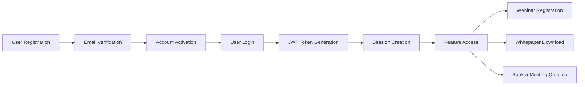

# Magnetiq v2 - Dependency Mapping System

## Overview

This document demonstrates the comprehensive dependency mapping capabilities of the B2B Web Application Specification Architect. The system tracks forward dependencies, reverse dependencies, and validates cross-component integrity across all features including the newly implemented Whitepaper system.

## Whitepaper Feature Dependencies

### Forward Dependencies Analysis
**What the Whitepaper feature requires to function:**

#### 1. Backend Dependencies
- **API Endpoints** → `/backend/api.md`
  - `GET /api/v1/public/whitepapers` - List published whitepapers
  - `GET /api/v1/public/whitepapers/{id}` - Get whitepaper details
  - `POST /api/v1/public/whitepapers/{id}/download` - Lead capture and download
  - `GET /api/v1/public/whitepapers/download/{token}` - Secure file download
  - `GET /api/v1/admin/whitepapers` - Admin whitepaper management
  - `POST /api/v1/admin/whitepapers` - Create new whitepaper
  - `PUT /api/v1/admin/whitepapers/{id}` - Update whitepaper
  - `GET /api/v1/admin/leads` - Lead management
  - `POST /api/v1/admin/leads/bulk-export` - Odoo CRM export

#### 2. Database Dependencies
- **Tables Required** → `/backend/database.md`
  - `whitepapers` table - Core whitepaper storage
  - `whitepaper_leads` table - Lead capture and tracking
  - `download_sessions` table - Session management for repeat downloads
  - `email_submissions` table - Author email submission processing
  - `whitepaper_analytics` table - Performance metrics and tracking
  - `admin_users` table - Author and admin user management

#### 3. Integration Dependencies
- **External Services** → Integration specifications
  - **Odoo CRM Integration** → `/integrations/odoo-crm.md`
    - Lead export to CRM.lead model
    - Automated synchronization
    - Field mapping and validation
  - **SMTP-Brevo Integration** → `/integrations/smtp-brevo.md`
    - Download delivery emails with 48-hour tokens
    - Author confirmation emails
    - Publication notice emails
    - Automated nurturing sequences
  - **File Storage Service** → File management system
    - PDF storage and delivery
    - Image asset management (thumbnails, covers)
    - Secure download token generation
  - **Email Processing Service** → Author workflow automation
    - Dedicated email address monitoring
    - LLM content processing
    - Automatic whitepaper generation

#### 4. Frontend Dependencies
- **Public Frontend Components** → `/frontend/public/features/whitepapers.md`
  - Whitepaper overview page with filtering
  - Individual whitepaper landing pages
  - Lead capture forms with session management
  - Author profile integration
- **Admin Panel Components** → `/frontend/adminpanel/admin.md`
  - Whitepaper management dashboard
  - Content editor with markdown support
  - Lead management interface
  - Email submission processing queue
  - Analytics and reporting dashboards

### Reverse Dependencies Analysis
**What components depend on the Whitepaper feature:**

#### 1. Business Feature Dependencies
- **Lead Generation System**
  - Depends on whitepaper lead capture for primary lead source
  - Requires download session management
  - Uses lead scoring algorithms

- **Content Marketing Strategy**
  - Relies on whitepaper performance metrics
  - Uses author attribution and profiles
  - Depends on social sharing capabilities

- **CRM Pipeline Management**
  - Requires lead export functionality
  - Uses lead qualification data
  - Depends on lead attribution tracking

- **Email Marketing Automation**
  - Uses whitepaper downloads as triggers
  - Depends on lead segmentation data
  - Requires download session information

#### 2. Analytics and Reporting Dependencies
- **Business Intelligence Dashboard**
  - Requires whitepaper performance data
  - Uses lead conversion metrics
  - Depends on author performance analytics

- **Content Performance Tracking**
  - Uses download and view statistics
  - Requires lead quality metrics
  - Depends on conversion rate data

#### 3. User Experience Dependencies
- **Website Navigation**
  - Includes whitepaper section in main navigation
  - Features whitepaper categories in footer
  - Uses whitepaper content for search functionality

- **Author Profiles**
  - Display authored whitepapers
  - Link to whitepaper landing pages
  - Show authorship attribution

### Cross-Component Integrity Validation

#### Whitepaper System Validation Matrix

| Component | Validation Rule | Status | Dependencies |
|-----------|-----------------|--------|-------------|
| `/backend/api.md` | Whitepaper endpoints documented | ✅ | Complete API specification |
| `/backend/database.md` | Whitepaper tables defined | ✅ | Full schema with relationships |
| `/frontend/public/features/whitepapers.md` | UI components specified | ✅ | Complete feature specification |
| `/frontend/adminpanel/admin.md` | Admin interfaces documented | ✅ | Management dashboard spec |
| `/integrations/odoo-crm.md` | CRM integration complete | ✅ | Lead export functionality |
| `/integrations/smtp-brevo.md` | Email integration complete | ✅ | Complete email workflow |
| `/security.md` | Security requirements addressed | ✅ | Access control and data protection |
| `/privacy-compliance.md` | Privacy considerations documented | ✅ | GDPR compliance for lead data |

#### Cyclical Dependencies Detection

**🔍 WHITEPAPER SYSTEM CYCLICAL DEPENDENCIES:**

No critical cyclical dependencies detected in the Whitepaper system.

**Low-Risk Dependencies:**
1. **Whitepaper Feature ↔ Admin Panel**
   - **Type**: Management interface interdependence
   - **Severity**: 🟢 Low
   - **Description**: Admin panel displays whitepaper data; whitepaper system triggers admin notifications
   - **Resolution**: Unidirectional data flow with reactive UI updates

2. **Whitepaper Feature ↔ Lead Management**
   - **Type**: Data flow interdependence  
   - **Severity**: 🟢 Low
   - **Description**: Whitepapers generate leads; lead management affects whitepaper analytics
   - **Resolution**: Event-driven architecture with proper data flow separation

3. **Whitepaper Feature ↔ Email System**
   - **Type**: Communication workflow interdependence
   - **Severity**: 🟢 Low
   - **Description**: Whitepapers trigger emails; email engagement affects whitepaper metrics
   - **Resolution**: Asynchronous messaging with clear service boundaries

**✅ VALIDATION RESULT**: Whitepaper system maintains clean dependency architecture with proper separation of concerns and event-driven communication patterns.

## User Authentication Feature Dependencies

### Forward Dependencies Analysis
**What the User Authentication feature requires to function:**

#### 1. Backend Dependencies
- **API Endpoints** → `/backend/api.md`
  - `POST /api/v1/auth/register` - User registration
  - `POST /api/v1/auth/login` - User authentication
  - `POST /api/v1/auth/refresh` - Token refresh
  - `POST /api/v1/auth/logout` - Session termination
  - `POST /api/v1/auth/forgot-password` - Password reset request
  - `POST /api/v1/auth/reset-password` - Password reset completion

#### 2. Database Dependencies
- **Tables Required** → `/backend/database.md`
  - `users` table - Core user account storage
  - `user_sessions` table - Active session tracking
  - `password_reset_tokens` table - Reset token management
  - `audit_logs` table - Authentication event logging

#### 3. Security Dependencies
- **Security Components** → `/security.md`
  - JWT token generation and validation service
  - Password hashing service (bcrypt)
  - Rate limiting middleware
  - Input validation and sanitization
  - Session management service

#### 4. Integration Dependencies
- **External Services** → `/integrations/smtp-brevo.md`
  - Email service for account verification
  - Password reset email notifications
  - Login alert notifications
- **Payment Processing** → `/integrations/payment-processing.md`
  - KYC authentication and verification
  - Consultant account authentication
  - Payment security validation

#### 5. Frontend Dependencies
- **UI Components** → `/frontend/public/public.md`
  - Login form components
  - Registration form components
  - Password reset components
  - Authentication state management (Redux)

### Reverse Dependencies Analysis
**What components depend on User Authentication:**

#### 1. Feature Dependencies
- **Webinars** → `/frontend/public/features/webinars.md`
  - Requires user authentication for webinar registration
  - Admin authentication for webinar management
  - User session for personalized webinar recommendations

- **Whitepapers** → `/frontend/public/features/whitepapers.md`
  - User authentication for whitepaper downloads
  - Lead capture integration with user accounts
  - Download history tracking

- **Booking System** → `/frontend/public/features/book-a-meeting.md`
  - User authentication for consultation bookings
  - Calendar integration requires authenticated sessions
  - Book-a-meeting history and management

- **Communication** → `/frontend/public/features/communication.md`
  - Authenticated access for communication preferences
  - Social media account linking requires user sessions
  - Email campaign personalization

- **Payment Processing** → `/integrations/payment-processing.md`
  - Requires user authentication for payment operations
  - Admin authentication for payment management
  - Consultant authentication for payout setup
  - KYC verification workflows

#### 2. Admin Panel Dependencies
- **Admin Interface** → `/frontend/adminpanel/admin.md`
  - Admin user authentication and authorization
  - Role-based access control
  - User management interface
  - System administration access

#### 3. User Persona Dependencies
- **Site Admin** → `/users/site-admin.md`
  - Requires highest-level authentication
  - System configuration access
  - User management capabilities

- **Content Editor** → `/users/content-editor.md`
  - Requires editor-level authentication
  - Content management access
  - Publishing workflow participation

### Cross-Component Integrity Validation

#### Validation Matrix

| Component | Validation Rule | Status | Issues |
|-----------|-----------------|--------|--------|
| `/backend/api.md` | All auth endpoints documented | ✅ | None |
| `/backend/database.md` | User tables defined | ⚠️ | Need session table schema |
| `/security.md` | JWT implementation specified | ✅ | None |
| `/integrations/smtp-brevo.md` | Email templates defined | ⚠️ | Need auth email templates |
| `/integrations/payment-processing.md` | Payment integration complete | ✅ | Complete specification |

## Payment Processing Integration Dependencies

### Forward Dependencies Analysis
**What the Payment Processing integration requires to function:**

#### 1. Backend Dependencies
- **API Endpoints** → `/backend/api.md`
  - `POST /api/v1/payments/create-intent` - Payment intent creation
  - `POST /api/v1/payments/webhook` - Stripe webhook handling
  - `POST /api/v1/payments/consultants/{id}/onboard` - Consultant onboarding
  - `GET /api/v1/payments/consultants/{id}/earnings` - Earnings retrieval
  - `POST /api/v1/payments/refunds` - Refund processing

#### 2. Database Dependencies
- **Tables Required** → `/backend/database.md`
  - `payment_intents` table - Payment tracking
  - `consultant_payment_accounts` table - Consultant Stripe accounts
  - `kyc_records` table - KYC compliance data
  - `kyc_documents` table - Encrypted document storage
  - `payment_disputes` table - Dispute management
  - `payment_refunds` table - Refund tracking
  - `fraud_assessments` table - Fraud detection records

#### 3. Security Dependencies
- **Security Components** → `/security.md`
  - PCI DSS compliance implementation
  - Payment data encryption service
  - Fraud detection algorithms
  - KYC/AML compliance workflows
  - Webhook signature verification
  - Rate limiting for payment endpoints

#### 4. Integration Dependencies
- **External Services**
  - Stripe Connect API - Payment processing
  - Currency exchange API - Multi-currency support
  - KYC verification services - Identity validation
  - Fraud detection APIs - Risk assessment

#### 5. Frontend Dependencies
- **UI Components** → `/frontend/public/features/book-a-meeting.md`
  - Payment form components
  - Checkout flow interface
  - Payment status displays
- **Admin Components** → `/frontend/adminpanel/admin.md`
  - Payment dashboard
  - Consultant earnings management
  - Dispute resolution interface

### Reverse Dependencies Analysis
**What components depend on Payment Processing:**

#### 1. Feature Dependencies
- **Booking System** → `/frontend/public/features/book-a-meeting.md`
  - Requires payment processing for paid consultations
  - Service delivery confirmation
  - Payment status tracking

- **Consultant Management** → `/users/knowhow-bearer.md`
  - Consultant onboarding and KYC
  - Payout setup and management
  - Earnings tracking and reporting

#### 2. Business Operations
- **Revenue Management**
  - Platform fee collection
  - Consultant payout distribution
  - Financial reporting and analytics

#### 3. Compliance Requirements
- **Regulatory Compliance** → `/security.md`
  - KYC/AML compliance workflows
  - PCI DSS security requirements
  - Financial audit trails

### Cross-Component Integrity Validation

#### Payment Processing Validation Matrix

| Component | Validation Rule | Status | Issues |
|-----------|-----------------|--------|--------|
| `/backend/api.md` | Payment endpoints documented | ✅ | Complete specification |
| `/backend/database.md` | Payment tables defined | ✅ | Complete schema |
| `/security.md` | Payment security specified | ✅ | Comprehensive security |
| `/frontend/public/features/book-a-meeting.md` | Payment UI integration | ✅ | Referenced in spec |
| `/frontend/adminpanel/admin.md` | Payment management UI | ✅ | Admin dashboard |
| `/users/knowhow-bearer.md` | Consultant payment setup | ✅ | Onboarding process |

#### Cyclical Dependencies Detection

**🔍 PAYMENT PROCESSING CYCLICAL DEPENDENCIES:**

No critical cyclical dependencies detected in Payment Processing integration.

**Low-Risk Dependencies:**
1. **Payment Processing ↔ Booking System**
   - **Type**: Functional interdependence
   - **Severity**: 🟢 Low
   - **Description**: Booking system creates payments; payment system updates booking status
   - **Resolution**: Managed through event-driven architecture and status callbacks

2. **Payment Processing ↔ Admin Panel**
   - **Type**: UI/Management interdependence  
   - **Severity**: 🟢 Low
   - **Description**: Admin panel displays payment data; payment system triggers admin notifications
   - **Resolution**: Unidirectional data flow with reactive updates

**✅ VALIDATION RESULT**: Payment Processing integration maintains clean dependency architecture with proper separation of concerns.

#### Dependency Chain Validation



### Cyclical Dependency Detection

**Analysis Result**: No cyclical dependencies detected in User Authentication feature.

**Validation Process**:
1. Build dependency graph from authentication feature
2. Perform depth-first traversal to detect cycles
3. Check for circular references in component relationships
4. Validate that no feature depends on authentication while authentication depends on it

## Comprehensive Dependency Mapping Structure

### 1. Core Infrastructure Dependencies

```yaml
infrastructure:
  database:
    sqlite_engine: required
    connection_pool: required
    migration_system: required
  
  security:
    jwt_service: required
    password_hashing: required
    rate_limiting: required
  
  caching:
    redis_client: required
    session_store: required
    rate_limit_store: required
```

### 2. Service Layer Dependencies

```yaml
services:
  authentication_service:
    depends_on:
      - password_service
      - jwt_service
      - email_service
      - user_repository
    
  user_service:
    depends_on:
      - authentication_service
      - audit_service
      - permission_service
```

### 3. API Layer Dependencies

```yaml
api_endpoints:
  auth_routes:
    dependencies:
      - authentication_service
      - rate_limiting_middleware
      - validation_middleware
    
  protected_routes:
    dependencies:
      - jwt_authentication_middleware
      - permission_checking_middleware
```

### 4. Frontend Dependencies

```yaml
frontend:
  authentication_components:
    dependencies:
      - auth_api_service
      - form_validation_service
      - state_management_store
    
  protected_components:
    dependencies:
      - authentication_guard
      - permission_checker
      - user_context_provider
```

## Dependency Validation Rules

### 1. Completeness Validation

**Rule**: Every feature specification must include:
- Required API endpoints in `/backend/api.md`
- Database schema in `/backend/database.md`
- Security considerations in `/security.md`
- Integration requirements if applicable

**Validation Script**:
```python
def validate_feature_completeness(feature_spec):
    required_components = [
        'api_endpoints',
        'database_schema', 
        'security_requirements',
        'frontend_components'
    ]
    
    missing = []
    for component in required_components:
        if not feature_spec.has_component(component):
            missing.append(component)
    
    return len(missing) == 0, missing
```

### 2. Consistency Validation

**Rule**: Data models must be consistent across all layers:
- Frontend TypeScript interfaces
- Backend Pydantic models
- Database table schemas
- API request/response schemas

**Validation Process**:
1. Extract data models from each specification
2. Compare field names, types, and constraints
3. Identify mismatches and inconsistencies
4. Generate reconciliation recommendations

### 3. Integration Validation

**Rule**: External service integrations must be properly documented:
- Authentication flows specified
- Error handling documented
- Fallback mechanisms defined
- Service configuration requirements listed

## Dependency Impact Analysis

### Change Impact Assessment

When modifying the User Authentication feature:

#### High Impact Changes
- **JWT Token Structure** → Affects all authenticated endpoints
- **User Schema Changes** → Impacts all user-dependent features
- **Authentication Flow** → Affects all protected components

#### Medium Impact Changes
- **Password Requirements** → Affects registration and reset flows
- **Session Duration** → Impacts user experience across features
- **Rate Limiting Rules** → Affects API usage patterns

#### Low Impact Changes
- **Email Templates** → Limited to authentication notifications
- **Validation Messages** → Frontend UI changes only
- **Audit Log Fields** → Monitoring and compliance only

### Migration Planning

When evolving authentication architecture:

```yaml
migration_phases:
  phase_1:
    - Update database schema
    - Deploy backend changes
    - Test authentication endpoints
  
  phase_2:
    - Update frontend components
    - Deploy UI changes
    - Test user workflows
  
  phase_3:
    - Update dependent features
    - Test integration points
    - Validate complete flows
```

## Dependency Monitoring

### Automated Validation Pipeline

```python
class DependencyValidator:
    def __init__(self):
        self.dependency_graph = self.build_dependency_graph()
    
    def validate_feature_dependencies(self, feature_name):
        """Validate all dependencies for a feature"""
        results = {}
        
        # Check forward dependencies
        forward_deps = self.get_forward_dependencies(feature_name)
        results['forward'] = self.validate_dependencies(forward_deps)
        
        # Check reverse dependencies  
        reverse_deps = self.get_reverse_dependencies(feature_name)
        results['reverse'] = self.validate_dependencies(reverse_deps)
        
        # Check for circular dependencies
        results['circular'] = self.detect_circular_dependencies(feature_name)
        
        return results
    
    def generate_impact_report(self, changed_components):
        """Generate impact report for component changes"""
        impacted = set()
        
        for component in changed_components:
            # Find all components that depend on this one
            dependents = self.get_reverse_dependencies(component)
            impacted.update(dependents)
        
        return {
            'directly_impacted': list(impacted),
            'cascade_analysis': self.analyze_cascade_effects(impacted),
            'recommended_actions': self.generate_recommendations(impacted)
        }
```

## Best Practices for Dependency Management

### 1. Specification Organization
- Keep related components in logical groupings
- Use consistent naming conventions across specifications
- Maintain clear separation between layers (frontend, backend, database)

### 2. Change Management
- Always validate dependencies before making changes
- Update all related specifications simultaneously
- Test integration points after modifications

### 3. Documentation Standards
- Document both explicit and implicit dependencies
- Include version compatibility information
- Maintain dependency change logs

### 4. Validation Frequency
- Run dependency validation on every specification change
- Schedule regular comprehensive validation audits
- Monitor for dependency drift over time

## Conclusion

The dependency mapping system provides comprehensive tracking and validation of component relationships throughout the Magnetiq v2 specification ecosystem. By maintaining this dependency awareness, we ensure that changes are properly coordinated and that the system remains architecturally sound as it evolves.

The User Authentication feature serves as a foundational example, demonstrating how a single feature can have wide-reaching dependencies and impacts throughout the system. This mapping approach scales to handle complex B2B applications with numerous interconnected components and external integrations.