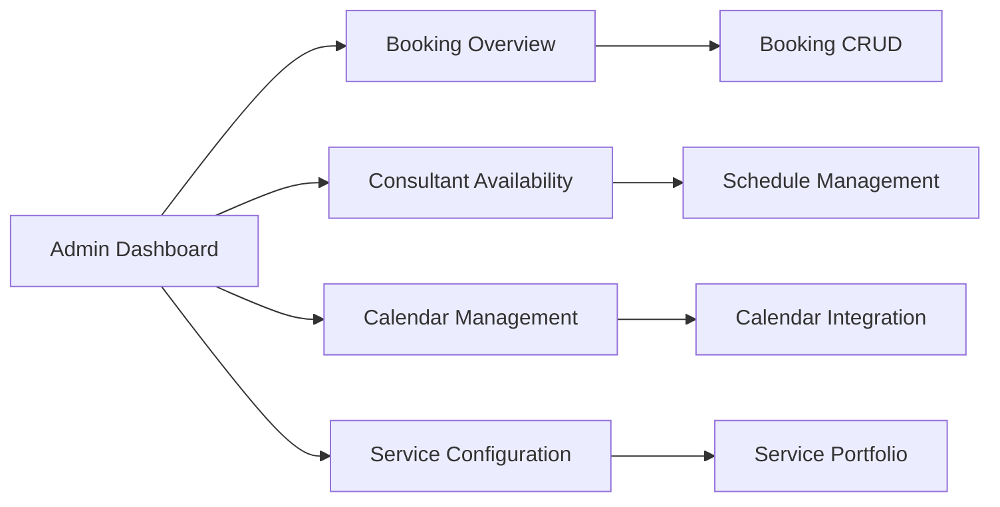

# Magnetiq v2 - Booking Management Admin Specification

## Overview

The Booking Management Admin Panel provides comprehensive tools for managing the consultation booking system, including appointment scheduling, consultant availability management, calendar integration, booking workflow automation, and service delivery tracking. This specification focuses on the administrative interfaces and workflows for managing the complete book-a-meeting ecosystem.

→ **Implements**: [Book-a-Meeting Feature](../../public/features/book-a-meeting.md#admin-integration)
← **Supports**: [Admin Panel Architecture](../admin.md#booking-management), [Business Operations](../../business/service-model.md#consultation-services)
⚡ **Dependencies**: [Authentication System](../authentication.md), [Booking API](../../../backend/api.md#booking-endpoints), [Database Schema](../../../backend/database.md#booking-tables)

## Visual System Overview


*Complete booking management system showing appointment scheduling, consultant coordination, and service delivery workflows*



⚡ **System Integration**:
- **API Layer**: [Booking Endpoints](../../../backend/api.md#booking-management-endpoints)
- **Data Layer**: [Booking Database Schema](../../../backend/database.md#booking-tables)
- **Public Layer**: [Book-a-Meeting Feature](../../public/features/book-a-meeting.md)
- **Payment Layer**: [Payment Processing](../../../integrations/payment-processing.md#booking-payments)
- **Communication Layer**: [Email Automation](../../../integrations/smtp-brevo.md#booking-notifications)

## Tab Navigation Structure

### Main Booking Management Interface (`/admin/bookings`)

```
├── Booking Overview (/admin/bookings/overview)
├── Consultant Availability (/admin/bookings/availability)
├── Calendar Management (/admin/bookings/calendar)
├── Service Configuration (/admin/bookings/services)
└── Analytics & Reports (/admin/bookings/analytics)
```

## 1. Booking Overview Tab (`/admin/bookings/overview`)

→ **API Integration**: [Booking Overview API](../../../backend/api.md#booking-overview-endpoints)
← **Data Source**: [Booking Database Tables](../../../backend/database.md#bookings)
⚡ **Dependencies**: [Payment Status Integration](../../../integrations/payment-processing.md#booking-status), [Email Notifications](../../../integrations/smtp-brevo.md#booking-emails)

### Enhanced Booking Management Structure


```typescript
interface AdminBookingManagement {
  id: string;
  
  // Core Booking Information → [Book-a-Meeting Data Model](../../public/features/book-a-meeting.md#enhanced-data-models)
  bookingDetails: {
    reference: string; // VLT-YYYYMMDD-XXXX format
    status: 'pending_payment' | 'confirmed' | 'in_progress' | 'completed' | 'cancelled' | 'no_show' | 'rescheduled';
    serviceType: '30-for-30' | 'standard-consultation' | 'project-scoping' | 'workshop' | 'custom';
    consultantId: string;
    clientId: string;
    scheduledDateTime: Date;
    duration: number; // minutes
    timezone: string;
    meetingType: 'video' | 'phone' | 'in_person' | 'hybrid';
  };
  
  // Administrative Metadata
  adminMetadata: {
    createdBy: string; // Admin user who created/imported
    assignedTo?: string; // Admin responsible for this booking
    priority: 'low' | 'medium' | 'high' | 'urgent';
    tags: string[]; // Administrative tags
    internalNotes: string;
    flags: BookingFlag[];
    lastAdminAction: AdminAction;
    escalationLevel: 'none' | 'supervisor' | 'manager' | 'director';
  };
  
  // Client Management Integration → [CRM Integration](../../../integrations/integrations.md#crm-integration)
  clientManagement: {
    clientProfile: ClientProfile;
    companyDetails: CompanyDetails;
    leadScore: number;
    crmLeadId?: number;
    communicationPreferences: CommunicationPreferences;
    previousBookings: BookingHistory[];
    followUpTasks: FollowUpTask[];
    relationshipManager?: string;
  };
  
  // Consultant Coordination → [Consultant Management](../consultant-management.md#booking-integration)
  consultantCoordination: {
    consultantProfile: ConsultantSummary;
    availabilityStatus: 'available' | 'busy' | 'unavailable';
    preparationStatus: 'not_started' | 'in_progress' | 'completed';
    deliveryStatus: 'pending' | 'delivered' | 'follow_up_required';
    performanceNotes: string;
    specialRequirements: string[];
  };
  
  // Payment & Financial Tracking → [Payment Management](./payment-management.md#booking-payments)
  financialTracking: {
    paymentStatus: 'pending' | 'paid' | 'failed' | 'refunded' | 'disputed';
    totalAmount: number;
    currency: string;
    platformFee: number;
    consultantPayout: number;
    paymentIntentId?: string;
    invoiceGenerated: boolean;
    payoutScheduled: boolean;
    disputeDetails?: DisputeDetails;
  };
  
  // Service Delivery Monitoring
  serviceDelivery: {
    preparationChecklist: PreparationItem[];
    meetingSetupStatus: 'pending' | 'configured' | 'tested' | 'ready';
    deliveryConfirmation: boolean;
    qualityAssurance: QualityCheckResult[];
    clientSatisfaction: SatisfactionMetric[];
    deliverables: DeliverableTracker[];
    followUpActions: PostMeetingAction[];
  };
  
  // Communication Tracking → [Email Automation](../../../integrations/smtp-brevo.md)
  communicationLog: {
    emailSequence: EmailSequenceStatus[];
    remindersSent: ReminderStatus[];
    consultantMessages: MessageThread[];
    clientMessages: MessageThread[];
    systemNotifications: SystemNotification[];
    escalationCommunications: EscalationCommunication[];
  };
  
  // Integration Status
  integrationStatus: {
    calendarSync: CalendarSyncStatus;
    crmSync: CRMSyncStatus;
    paymentSync: PaymentSyncStatus;
    emailSync: EmailSyncStatus;
    webhookEvents: WebhookEventLog[];
    syncErrors: SyncError[];
  };
}
```

**Supporting Administrative Interfaces**:
```typescript
interface BookingFlag {
  id: string;
  type: 'attention_required' | 'vip_client' | 'technical_issue' | 'payment_issue' | 'consultant_issue';
  message: string;
  severity: 'info' | 'warning' | 'error' | 'critical';
  createdAt: Date;
  resolvedAt?: Date;
  resolvedBy?: string;
}

interface AdminAction {
  action: 'created' | 'updated' | 'status_changed' | 'escalated' | 'resolved' | 'notes_added';
  performedBy: string;
  timestamp: Date;
  details: string;
  previousValue?: any;
  newValue?: any;
}

interface QualityCheckResult {
  checkType: 'preparation' | 'delivery' | 'follow_up' | 'client_satisfaction';
  status: 'passed' | 'failed' | 'needs_attention';
  score?: number;
  notes: string;
  checkedBy: string;
  checkedAt: Date;
}
```

### Booking Management Dashboard Interface


**List View Features**:
- **Advanced Table Component**: Sortable, filterable booking directory using [TanStack Table](../admin.md#table-components)
- **Status Indicators**: Visual status badges (confirmed/pending/completed), payment status, consultant availability
- **Priority Management**: Priority flags, escalation indicators, urgent booking highlights
- **Quick Actions**: View details, edit booking, contact client/consultant, process payment, generate invoice
- **Bulk Operations**: Mass status updates, bulk email, export selected, payment processing
- **Smart Filtering**: By status, consultant, date range, payment status, service type, client company
- **Advanced Search**: Full-text search across client name, company, booking reference, consultant

**Card View Features**:
- **Booking Cards**: Client info, consultant, service type, scheduled time, status indicators
- **Hover Actions**: Quick preview, edit, message client/consultant, view payment details
- **Status Overlays**: Payment status, delivery status, communication status, escalation indicators
- **Performance Metrics**: Service completion, client satisfaction, payment processing status

**Detail View Interface**:
- **Tabbed Interface**: Overview, Client Details, Consultant Info, Payment Details, Communication Log, Service Delivery
- **Timeline View**: Complete booking lifecycle with all interactions and status changes
- **Integration Status**: Real-time sync status with calendars, CRM, payment systems
- **Administrative Actions**: Escalate, assign, add notes, schedule follow-up, process refund
- **Communication Center**: Direct messaging with client/consultant, email history, system notifications

## 2. Consultant Availability Tab (`/admin/bookings/availability`)

→ **API Integration**: [Availability Management API](../../../backend/api.md#availability-endpoints)
← **Consultant Integration**: [Consultant Management](../consultant-management.md#availability-management)
⚡ **Dependencies**: [Calendar Integration](../../../integrations/calendar-integration.md), [Time Zone Management](../../../backend/api.md#timezone-service)

### Comprehensive Availability Management


```typescript
interface ConsultantAvailabilityManagement {
  consultantId: string;
  
  // Schedule Configuration
  scheduleConfig: {
    timezone: string;
    workingHours: WeeklyScheduleConfig;
    holidays: HolidayConfiguration[];
    vacations: VacationPeriod[];
    recurringUnavailability: RecurringUnavailability[];
    bufferTimeSettings: BufferTimeConfig;
    maxDailyBookings: number;
    advanceBookingLimits: AdvanceBookingConfig;
  };
  
  // Real-time Availability Status
  availabilityStatus: {
    currentStatus: 'available' | 'busy' | 'in_meeting' | 'offline' | 'do_not_disturb';
    nextAvailableSlot: Date;
    availabilityWindow: AvailabilityWindow;
    conflictingAppointments: ConflictingAppointment[];
    autoStatusUpdates: boolean;
    manualOverrides: ManualOverride[];
  };
  
  // Booking Rules & Constraints
  bookingRules: {
    serviceTypes: AllowedServiceType[];
    clientTypes: AllowedClientType[];
    bookingDurationLimits: DurationLimits;
    preparationTimeRequired: number;
    followUpTimeRequired: number;
    cancellationPolicy: CancellationPolicy;
    reschedulingPolicy: ReschedulingPolicy;
    emergencyBookingRules: EmergencyBookingConfig;
  };
  
  // Calendar Integration Status → [Calendar Integration](../../../integrations/calendar-integration.md)
  calendarIntegration: {
    googleCalendar: CalendarConnectionStatus;
    outlookCalendar: CalendarConnectionStatus;
    appleCalendar: CalendarConnectionStatus;
    customCalendar?: CalendarConnectionStatus;
    syncStatus: SyncStatus;
    conflictResolution: ConflictResolutionConfig;
    syncFrequency: SyncFrequencyConfig;
  };
  
  // Availability Analytics
  availabilityAnalytics: {
    utilizationRate: number; // Percentage of available time booked
    averageBookingGaps: number; // Average time between bookings
    peakAvailabilityHours: TimeSlot[];
    seasonalPatterns: SeasonalAvailabilityPattern[];
    demandVsSupply: DemandSupplyAnalysis;
    optimizationSuggestions: OptimizationSuggestion[];
  };
}
```

**Availability Management Features**:
- **Visual Calendar Interface**: Drag-and-drop schedule editing with multi-consultant view
- **Bulk Schedule Updates**: Mass availability changes, holiday scheduling, vacation management
- **Conflict Detection**: Automatic detection and resolution of scheduling conflicts
- **Availability Forecasting**: Predicted availability based on historical patterns
- **Emergency Scheduling**: Override rules for urgent bookings with approval workflows
- **Multi-timezone Support**: Global consultant network with automatic timezone conversion

### Schedule Optimization Tools

```typescript
interface ScheduleOptimizationEngine {
  // Demand-based Optimization
  async optimizeForDemand(
    consultantId: string,
    optimizationPeriod: DateRange
  ): Promise<{
    suggestedScheduleChanges: ScheduleChangeRecommendation[];
    demandForecast: DemandForecast;
    revenueImpact: RevenueImpactAnalysis;
    utilizationImprovement: UtilizationImprovement;
  }>;
  
  // Multi-consultant Coordination
  async coordinateTeamSchedules(
    consultantIds: string[],
    coordinationRules: CoordinationRules
  ): Promise<{
    optimizedSchedules: OptimizedSchedule[];
    coverageAnalysis: CoverageAnalysis;
    conflictResolutions: ConflictResolution[];
    teamUtilizationMetrics: TeamUtilizationMetrics;
  }>;
  
  // Client Preference Matching
  async matchClientPreferences(
    clientRequirements: ClientSchedulingRequirements
  ): Promise<{
    bestMatches: ConsultantAvailabilityMatch[];
    alternativeOptions: AlternativeOption[];
    waitListOpportunities: WaitListOpportunity[];
    preferenceSatisfactionScore: number;
  }>;
}
```

## 3. Calendar Management Tab (`/admin/bookings/calendar`)

→ **API Integration**: [Calendar Management API](../../../backend/api.md#calendar-endpoints)
← **Integration Layer**: [Calendar Integration Services](../../../integrations/calendar-integration.md)
⚡ **Dependencies**: [Webhook Processing](../../../integrations/webhooks.md), [Sync Services](../../../backend/api.md#sync-services)

### Multi-Platform Calendar Integration


```typescript
interface CalendarManagementSystem {
  // Multi-Platform Integration
  platformIntegrations: {
    googleCalendar: GoogleCalendarIntegration;
    microsoftOutlook: OutlookCalendarIntegration;
    appleCalendar: AppleCalendarIntegration;
    caldavProtocol: CalDAVIntegration;
    customIntegrations: CustomCalendarIntegration[];
  };
  
  // Sync Management
  syncManagement: {
    syncSchedules: SyncScheduleConfiguration[];
    conflictResolution: ConflictResolutionPolicies;
    syncHealthMonitoring: SyncHealthMetrics;
    errorHandling: SyncErrorHandling;
    dataConsistencyValidation: ConsistencyValidation;
    syncPerformanceMetrics: SyncPerformanceMetrics;
  };
  
  // Event Lifecycle Management
  eventManagement: {
    eventCreation: EventCreationWorkflow;
    eventUpdates: EventUpdateWorkflow;
    eventCancellation: EventCancellationWorkflow;
    recurringEventHandling: RecurringEventManagement;
    attendeeManagement: AttendeeManagementWorkflow;
    reminderConfiguration: ReminderConfiguration;
  };
  
  // Calendar Visualization & Control
  calendarVisualization: {
    multiCalendarView: MultiCalendarViewConfig;
    consultantScheduleOverlay: ScheduleOverlayConfig;
    bookingStatusVisualization: BookingStatusVisualization;
    timeZoneHandling: TimeZoneVisualizationConfig;
    calendarFiltering: CalendarFilterConfig;
    exportOptions: CalendarExportConfig;
  };
}
```

**Calendar Management Features**:
- **Unified Calendar View**: Consolidated view of all consultant calendars with booking overlays
- **Real-time Sync Monitoring**: Live sync status across all integrated calendar platforms
- **Conflict Resolution Dashboard**: Automated and manual conflict resolution with approval workflows
- **Bulk Calendar Operations**: Mass event creation, updates, and cancellations
- **Calendar Performance Analytics**: Sync success rates, conflict frequency, integration health metrics
- **Emergency Calendar Access**: Direct calendar manipulation for urgent scheduling needs

### Advanced Sync Management

```typescript
interface CalendarSyncOrchestrator {
  // Intelligent Sync Strategies
  async orchestrateSyncProcess(
    syncScope: SyncScope,
    syncStrategy: SyncStrategy
  ): Promise<{
    syncResults: SyncResult[];
    conflictResolutions: ConflictResolution[];
    performanceMetrics: SyncPerformanceMetrics;
    errorRecovery: ErrorRecoveryAction[];
  }>;
  
  // Conflict Detection & Resolution
  async detectAndResolveConflicts(
    conflictScope: ConflictDetectionScope
  ): Promise<{
    detectedConflicts: CalendarConflict[];
    automaticResolutions: AutomaticResolution[];
    manualReviewRequired: ManualReviewConflict[];
    resolutionStrategies: ConflictResolutionStrategy[];
  }>;
  
  // Sync Health Monitoring
  async monitorSyncHealth(): Promise<{
    overallSyncHealth: SyncHealthScore;
    platformHealthMetrics: PlatformHealthMetric[];
    performanceTrends: SyncPerformanceTrend[];
    predictiveIssueDetection: PredictiveIssue[];
  }>;
}
```

## 4. Service Configuration Tab (`/admin/bookings/services`)

→ **API Integration**: [Service Configuration API](../../../backend/api.md#service-config-endpoints)
← **Public Integration**: [Book-a-Meeting Service Selection](../../public/features/book-a-meeting.md#service-selection)
⚡ **Dependencies**: [Pricing Engine](../../../integrations/payment-processing.md#dynamic-pricing), [Service Templates](../../../backend/database.md#service-templates)

### Comprehensive Service Portfolio Management


```typescript
interface ServiceConfigurationManagement {
  // Service Catalog Administration
  serviceCatalog: {
    serviceDefinitions: ServiceDefinition[];
    serviceCategories: ServiceCategory[];
    serviceTiers: ServiceTier[];
    customServiceTemplates: CustomServiceTemplate[];
    serviceApprovalWorkflow: ServiceApprovalWorkflow;
    serviceLifecycleManagement: ServiceLifecycleManagement;
  };
  
  // Pricing & Revenue Configuration → [Payment Management](./payment-management.md#service-pricing)
  pricingConfiguration: {
    basePricingRules: BasePricingRule[];
    dynamicPricingFactors: DynamicPricingFactor[];
    discountPolicies: DiscountPolicy[];
    feeStructures: FeeStructure[];
    currencySupport: CurrencyConfiguration[];
    regionalPricingAdjustments: RegionalPricingAdjustment[];
  };
  
  // Service Quality & Standards
  serviceQualityManagement: {
    qualityStandards: ServiceQualityStandard[];
    deliverableTemplates: DeliverableTemplate[];
    serviceAgreementTemplates: ServiceAgreementTemplate[];
    satisfactionMetrics: SatisfactionMetricConfig[];
    performanceBenchmarks: PerformanceBenchmark[];
    improvementProcesses: ServiceImprovementProcess[];
  };
  
  // Consultant Service Assignment → [Consultant Management](../consultant-management.md#service-capabilities)
  consultantServiceMapping: {
    serviceCapabilityMatrix: ServiceCapabilityMatrix;
    consultantServiceApproval: ServiceApprovalProcess[];
    specialtyAssignments: SpecialtyAssignment[];
    serviceTrainingRequirements: TrainingRequirement[];
    performanceBasedAssignments: PerformanceBasedAssignment[];
    serviceCertifications: ServiceCertification[];
  };
  
  // Service Analytics & Optimization
  serviceAnalytics: {
    servicePerformanceMetrics: ServicePerformanceMetric[];
    demandAnalysis: ServiceDemandAnalysis[];
    profitabilityAnalysis: ServiceProfitabilityAnalysis[];
    clientSatisfactionTrends: ClientSatisfactionTrend[];
    serviceOptimizationRecommendations: ServiceOptimizationRecommendation[];
    competitiveAnalysis: ServiceCompetitiveAnalysis[];
  };
}
```

**Service Configuration Features**:
- **Visual Service Builder**: Drag-and-drop service creation with templates and customization options
- **Dynamic Pricing Engine**: Real-time pricing adjustments based on demand, consultant availability, and market factors
- **Service Quality Dashboard**: Performance monitoring, satisfaction tracking, and improvement recommendations
- **Consultant-Service Matrix**: Visual mapping of consultant capabilities to service offerings
- **A/B Testing Framework**: Service description and pricing optimization through controlled experiments
- **Service Approval Workflows**: Multi-stage approval process for new services and major modifications

### Advanced Service Optimization

```typescript
interface ServiceOptimizationEngine {
  // Service Performance Analysis
  async analyzeServicePerformance(
    serviceId: string,
    analysisWindow: DateRange
  ): Promise<{
    performanceMetrics: ServicePerformanceMetrics;
    clientSatisfactionAnalysis: SatisfactionAnalysis;
    revenueImpactAnalysis: RevenueImpactAnalysis;
    optimizationOpportunities: OptimizationOpportunity[];
  }>;
  
  // Demand Forecasting & Capacity Planning
  async forecastServiceDemand(
    serviceId: string,
    forecastHorizon: DateRange
  ): Promise<{
    demandForecast: ServiceDemandForecast;
    capacityRequirements: CapacityRequirement[];
    consultantAllocationRecommendations: ConsultantAllocationRecommendation[];
    revenueProjections: RevenueProjection[];
  }>;
  
  // Service Portfolio Optimization
  async optimizeServicePortfolio(): Promise<{
    portfolioAnalysis: PortfolioAnalysis;
    serviceRetirementCandidates: ServiceRetirementCandidate[];
    newServiceOpportunities: NewServiceOpportunity[];
    crossSellingOpportunities: CrossSellingOpportunity[];
  }>;
}
```

## 5. Analytics & Reports Tab (`/admin/bookings/analytics`)

→ **Analytics Integration**: [Analytics Dashboard](../analytics-dashboard.md#booking-analytics)
← **Data Sources**: [Booking Database](../../../backend/database.md#booking-analytics), [Payment Analytics](../../../integrations/payment-processing.md#booking-revenue-analytics)
⚡ **Dependencies**: [Reporting Engine](../../../backend/api.md#analytics-service), [Business Intelligence](../analytics-dashboard.md#business-intelligence)

### Comprehensive Booking Analytics Dashboard


```typescript
interface BookingAnalyticsEngine {
  // Core Booking Metrics
  bookingMetrics: {
    totalBookings: BookingVolumeMetric[];
    bookingGrowthRate: GrowthRateMetric[];
    conversionRates: ConversionRateMetric[];
    cancellationRates: CancellationRateMetric[];
    noShowRates: NoShowRateMetric[];
    reschedulingPatterns: ReschedulingPatternMetric[];
  };
  
  // Revenue Analytics → [Payment Management](./payment-management.md#revenue-analytics)
  revenueAnalytics: {
    totalRevenue: RevenueMetric[];
    revenuePerService: ServiceRevenueBreakdown[];
    revenuePerConsultant: ConsultantRevenueBreakdown[];
    averageBookingValue: AverageBookingValueMetric[];
    platformFeeRevenue: PlatformFeeRevenueMetric[];
    paymentMethodAnalysis: PaymentMethodAnalysis[];
  };
  
  // Client Analytics
  clientAnalytics: {
    clientAcquisition: ClientAcquisitionMetric[];
    clientRetention: ClientRetentionMetric[];
    clientLifetimeValue: ClientLTVMetric[];
    clientSatisfactionTrends: ClientSatisfactionTrend[];
    clientSegmentAnalysis: ClientSegmentAnalysis[];
    repeatBookingPatterns: RepeatBookingPattern[];
  };
  
  // Consultant Performance → [Consultant Management](../consultant-management.md#performance-analytics)
  consultantAnalytics: {
    consultantUtilization: ConsultantUtilizationMetric[];
    consultantRevenue: ConsultantRevenueMetric[];
    consultantRatings: ConsultantRatingMetric[];
    consultantAvailability: ConsultantAvailabilityMetric[];
    consultantEfficiency: ConsultantEfficiencyMetric[];
    consultantGrowth: ConsultantGrowthMetric[];
  };
  
  // Operational Analytics
  operationalAnalytics: {
    bookingFlowPerformance: BookingFlowPerformanceMetric[];
    systemPerformance: SystemPerformanceMetric[];
    integrationHealth: IntegrationHealthMetric[];
    supportTicketAnalysis: SupportTicketAnalysis[];
    adminProductivity: AdminProductivityMetric[];
    automationEffectiveness: AutomationEffectivenessMetric[];
  };
}
```

**Analytics Dashboard Features**:
- **Executive Summary**: High-level KPIs and trends for business leadership
- **Interactive Charts**: Drill-down capabilities with filtering and time range selection
- **Automated Reporting**: Scheduled reports for different stakeholder groups
- **Comparative Analysis**: Period-over-period, consultant-over-consultant, service-over-service comparisons
- **Predictive Analytics**: Demand forecasting, revenue projections, growth predictions
- **Export & Integration**: Data export capabilities and integration with business intelligence tools

### Advanced Analytics & Insights

```typescript
interface AdvancedBookingAnalytics {
  // Predictive Analytics
  async generatePredictiveInsights(
    predictionScope: PredictionScope,
    timeHorizon: TimeHorizon
  ): Promise<{
    demandForecasts: DemandForecast[];
    revenueProjections: RevenueProjection[];
    consultantCapacityPredictions: CapacityPrediction[];
    marketTrendPredictions: MarketTrendPrediction[];
  }>;
  
  // Customer Behavior Analysis
  async analyzeCustomerBehavior(): Promise<{
    bookingPatternAnalysis: BookingPatternAnalysis;
    customerJourneyAnalysis: CustomerJourneyAnalysis;
    churnPrediction: ChurnPredictionAnalysis;
    upsellOpportunities: UpsellOpportunityAnalysis;
  }>;
  
  // Business Intelligence
  async generateBusinessIntelligence(): Promise<{
    marketingAttributionAnalysis: MarketingAttributionAnalysis;
    consultantROIAnalysis: ConsultantROIAnalysis;
    servicePortfolioOptimization: ServicePortfolioOptimizationInsights;
    competitivePositionAnalysis: CompetitivePositionAnalysis;
  }>;
}
```

## Advanced Interface Components

### Booking Management Table Components

```typescript
interface BookingManagementTable {
  columns: {
    booking: {
      reference: boolean;
      client: boolean;
      consultant: boolean;
      service: boolean;
      status: boolean;
      priority: boolean;
    };
    scheduling: {
      scheduledDate: boolean;
      duration: boolean;
      timezone: boolean;
      meetingType: boolean;
    };
    financial: {
      totalAmount: boolean;
      paymentStatus: boolean;
      consultantPayout: boolean;
      platformFee: boolean;
    };
    administrative: {
      assignedAdmin: boolean;
      tags: boolean;
      flags: boolean;
      lastUpdate: boolean;
    };
  };
  features: {
    multiSort: boolean;
    columnFilters: boolean;
    globalSearch: boolean;
    rowSelection: boolean;
    bulkActions: boolean;
    exportOptions: boolean;
    columnVisibility: boolean;
    responsiveDesign: boolean;
    realTimeUpdates: boolean;
  };
  actions: {
    viewDetails: boolean;
    editBooking: boolean;
    contactClient: boolean;
    contactConsultant: boolean;
    processPayment: boolean;
    generateInvoice: boolean;
    escalateIssue: boolean;
    addNotes: boolean;
  };
}
```

### Advanced Form Components for Booking Management

```typescript
interface BookingManagementForms {
  bookingDetailsForm: {
    basicInformation: FormSection;
    schedulingDetails: FormSection;
    serviceConfiguration: FormSection;
    paymentInformation: FormSection;
  };
  
  availabilityForm: {
    scheduleBuilder: ScheduleBuilderComponent;
    holidayManager: HolidayManagerComponent;
    bufferTimeConfig: BufferTimeConfigComponent;
    integrationSettings: IntegrationSettingsComponent;
  };
  
  serviceConfigForm: {
    serviceDefinition: ServiceDefinitionComponent;
    pricingConfiguration: PricingConfigurationComponent;
    qualityStandards: QualityStandardsComponent;
    consultantAssignment: ConsultantAssignmentComponent;
  };
  
  analyticsConfiguration: {
    reportBuilder: ReportBuilderComponent;
    dashboardCustomizer: DashboardCustomizerComponent;
    alertConfiguration: AlertConfigurationComponent;
    exportSettings: ExportSettingsComponent;
  };
}
```

## Cross-Reference Integration Summary

### API Integration Cross-References
→ [Booking Management API](../../../backend/api.md#booking-management-endpoints)
→ [Consultant Availability API](../../../backend/api.md#availability-endpoints)
→ [Calendar Integration API](../../../backend/api.md#calendar-endpoints)
→ [Service Configuration API](../../../backend/api.md#service-config-endpoints)
→ [Booking Analytics API](../../../backend/api.md#booking-analytics-endpoints)

### Database Schema Cross-References
→ [Booking Tables](../../../backend/database.md#booking-tables)
→ [Consultant Availability Tables](../../../backend/database.md#availability-tables)
→ [Service Configuration Tables](../../../backend/database.md#service-tables)
→ [Calendar Integration Tables](../../../backend/database.md#calendar-tables)
→ [Booking Analytics Tables](../../../backend/database.md#booking-analytics-tables)

### Integration Dependencies
→ [Calendar Integration](../../../integrations/calendar-integration.md) - Multi-platform calendar synchronization
→ [Payment Processing](../../../integrations/payment-processing.md) - Booking payment workflows
→ [Email Automation](../../../integrations/smtp-brevo.md) - Booking notification sequences
→ [CRM Integration](../../../integrations/integrations.md#crm-integration) - Lead and opportunity management
→ [Analytics Services](../../../integrations/integrations.md#analytics) - Performance tracking and reporting

### Security and Compliance Cross-References
← [Booking Security Requirements](../../../security.md#booking-security)
← [Financial Data Protection](../../../privacy-compliance.md#booking-financial-data)
← [Calendar Data Privacy](../../../privacy-compliance.md#calendar-integration-privacy)
← [Client Data Protection](../../../privacy-compliance.md#client-data-protection)

### Feature Integration Cross-References
↔️ [Book-a-Meeting Public Feature](../../public/features/book-a-meeting.md) - Public booking interface integration
↔️ [Consultant Management](../consultant-management.md) - Consultant profile and availability management
↔️ [Payment Management](./payment-management.md) - Financial processing and payout workflows
↔️ [Analytics Dashboard](../analytics-dashboard.md) - Performance metrics and business intelligence
↔️ [Email Campaign Management](../../../integrations/smtp-brevo.md) - Automated communication workflows

### User Experience Cross-References
← [User Personas](../../../users/) - All booking management interfaces designed for [Site Admin](../../../users/site-admin.md) and [Content Editor](../../../users/content-editor.md) personas
→ [Design System](../../design-system.md) - All components follow established design patterns
⚡ [Responsive Design](../../public.md#responsive-design) - Mobile-friendly administrative interfaces

## Technology Implementation

### Frontend Technology Stack
- **Framework**: React 18 with TypeScript → [Architecture](../../../architecture.md#frontend)
- **State Management**: Redux Toolkit with RTK Query → [State Management](../../public.md#state-management)
- **UI Components**: Tailwind CSS with Headless UI → [Design System](../../design-system.md)
- **Tables**: TanStack Table v8 for advanced data grids → [Admin Panel](../admin.md#table-components)
- **Forms**: React Hook Form with Zod validation → [Form Components](../admin.md#form-management)
- **Charts**: Recharts for analytics visualization → [Analytics](../admin.md#analytics-reporting)
- **Calendar**: React Big Calendar with custom extensions → [Calendar Components](../admin.md#calendar-components)

### Integration Requirements
- **API Client**: Axios with RTK Query integration for real-time updates
- **WebSocket**: Real-time booking status updates and notifications
- **Calendar APIs**: Multi-platform calendar integration with conflict resolution
- **Payment APIs**: Stripe Connect integration for booking payments
- **Email APIs**: Brevo integration for automated booking communication
- **Export Functions**: CSV/Excel/PDF export capabilities for analytics and reports

## Related Diagrams
- [Booking Management System Architecture](../../../../diagrams/spec_v2/features/booking_management_system.png)
- [Calendar Integration Workflow](../../../../diagrams/spec_v2/integrations/calendar_integration_workflow.png)
- [Service Configuration Management](../../../../diagrams/spec_v2/features/service_configuration_management.png)
- [Booking Analytics Dashboard](../../../../diagrams/spec_v2/features/booking_analytics_dashboard.png)
- [Availability Optimization Engine](../../../../diagrams/spec_v2/features/availability_optimization_engine.png)

🔗 **Complete Booking Management Index**: [All Booking Admin Specifications](../../)