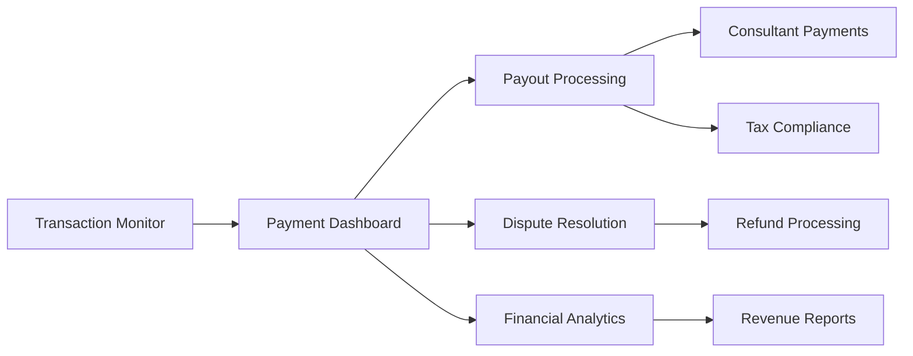

# Magnetiq v2 - Payment Management Admin Specification

## Overview

The Payment Management Admin interface provides comprehensive financial transaction oversight, consultant payout processing, and revenue analytics for the Magnetiq v2 platform. This specification defines the admin-side payment management capabilities for handling the 30-for-30 consultation business model, KYC compliance, dispute resolution, and financial reporting.

→ **Business Model**: [30-for-30 Consultation Service](../public/features/book-a-meeting.md#pricing-model)  
← **Supports**: [Revenue Operations](../../business/revenue-model.md), [Financial Compliance](../../security.md#financial-compliance)  
⚡ **Core Dependencies**: [Payment Processing Integration](../../integrations/payment-processing.md), [Database Schema](../../backend/database.md#payment-tables), [Security Framework](../../security.md#payment-security)

## Visual Payment Management Overview

*Complete admin payment management workflow showing transaction monitoring, payout processing, and dispute handling*

🔗 **Cross-referenced in**: [Admin Panel](./admin.md), [Consultant Management](./consultant-management.md), [Integration Systems](../../integrations/payment-processing.md)

## System Architecture Integration




⚡ **Admin System Integration**:
- **Payment Data Layer**: [Payment Processing API](../../backend/api.md#payment-endpoints)
- **Transaction Monitoring**: [Real-time Payment Tracking](../../integrations/payment-processing.md#transaction-monitoring)
- **Payout Management**: [Automated Disbursement](../../backend/api.md#payout-service)
- **Compliance Tools**: [KYC Management](../../security.md#kyc-compliance)
- **Financial Reporting**: [Revenue Analytics](../../../features/analytics.md#financial-metrics)

## Core Payment Management Features

### 1. Transaction Dashboard & Monitoring (`/admin/payments/transactions`)

→ **Data Integration**: [Payment Intents Table](../../backend/database.md#payment_intents_table)
← **Used by**: [Site Admin](../../users/site-admin.md#payment-oversight), [Financial Manager](../../users/content-editor.md#financial-tasks)

#### Transaction Monitoring Interface

```tsx
interface PaymentTransactionDashboard {
  transactionMetrics: {
    totalTransactions: number;
    totalRevenue: MoneyAmount;
    platformFees: MoneyAmount;
    consultantPayouts: MoneyAmount;
    pendingDisputes: number;
    recentActivity: TransactionActivity[];
  };
  
  filterOptions: {
    dateRange: DateRange;
    status: PaymentStatus[];
    consultants: string[];
    amountRange: [number, number];
    currency: string[];
    paymentMethod: string[];
  };
  
  displaySettings: {
    view: 'table' | 'cards' | 'timeline';
    groupBy: 'date' | 'consultant' | 'status' | 'amount';
    sortBy: 'created_at' | 'amount' | 'consultant_name' | 'status';
    itemsPerPage: number;
  };
}

interface PaymentTransaction {
  id: string;
  stripePaymentIntentId: string;
  bookingId: string;
  consultantInfo: {
    id: string;
    name: string;
    stripeAccountId: string;
  };
  
  // Financial details
  amounts: {
    total: MoneyAmount;
    platformFee: MoneyAmount;
    consultantAmount: MoneyAmount;
    currency: string;
  };
  
  // Status tracking
  status: PaymentStatus;
  paymentMethod: string;
  processingStage: ProcessingStage;
  
  // Timeline
  timestamps: {
    createdAt: Date;
    paidAt?: Date;
    serviceDeliveredAt?: Date;
    payoutReleasedAt?: Date;
  };
  
  // Risk and compliance
  fraudAssessment?: {
    riskScore: number;
    riskLevel: 'low' | 'medium' | 'high';
    riskFactors: string[];
  };
  
  // Related records
  disputeId?: string;
  refundId?: string;
  kycRecordId?: string;
}

enum PaymentStatus {
  PENDING = 'pending',
  PAID = 'paid',
  HELD_IN_ESCROW = 'held_in_escrow',
  SERVICE_DELIVERED = 'service_delivered',
  RELEASED_TO_CONSULTANT = 'released_to_consultant',
  DISPUTED = 'disputed',
  REFUNDED = 'refunded',
  FAILED = 'failed'
}

enum ProcessingStage {
  PAYMENT_CREATED = 'payment_created',
  PAYMENT_CONFIRMED = 'payment_confirmed',
  ESCROWED = 'escrowed',
  AWAITING_SERVICE = 'awaiting_service',
  SERVICE_CONFIRMED = 'service_confirmed',
  PAYOUT_SCHEDULED = 'payout_scheduled',
  PAYOUT_COMPLETED = 'payout_completed'
}
```

#### Transaction Management Features

**Advanced Transaction Table**:
- **Real-time Updates**: Live payment status updates via WebSocket
- **Multi-level Sorting**: Primary and secondary sort columns
- **Smart Filtering**: Combine multiple filter criteria with AND/OR logic
- **Bulk Actions**: Mass status updates, export selected transactions
- **Quick Actions**: View details, process refund, contact customer/consultant
- **Status Indicators**: Visual badges for payment stages and risk levels

**Transaction Detail View**:
- **Complete Payment Timeline**: Visual timeline of all payment events
- **Financial Breakdown**: Detailed fee structure and currency conversions
- **Risk Assessment Display**: Fraud detection results and risk factors
- **Customer Information**: Booking details, customer contact, payment method
- **Consultant Information**: Payout details, account status, KYC verification
- **Related Documents**: Invoices, receipts, dispute evidence, refund records

### 2. Consultant Payout Management (`/admin/payments/payouts`)

→ **Integration**: [Consultant Payment Accounts](../../backend/database.md#consultant_payment_accounts)
⚡ **Dependencies**: [Stripe Connect API](../../integrations/payment-processing.md#stripe-connect), [KYC Verification](../../security.md#kyc-compliance)

#### Payout Processing Interface

```tsx
interface PayoutManagementDashboard {
  payoutSummary: {
    pendingPayouts: MoneyAmount;
    scheduledPayouts: number;
    processingPayouts: number;
    completedToday: MoneyAmount;
    failedPayouts: number;
    nextPayoutDate: Date;
  };
  
  payoutRules: {
    minimumPayoutAmount: MoneyAmount;
    holdingPeriod: number; // Days
    disputeReservePercentage: number;
    processingFeePercentage: number;
    autoProcessThreshold: MoneyAmount;
    payoutFrequency: 'daily' | 'weekly' | 'bi_weekly' | 'monthly';
  };
  
  batchProcessing: {
    selectedPayouts: string[];
    batchSize: number;
    estimatedProcessingTime: number;
    totalAmount: MoneyAmount;
    processingOptions: BatchProcessingOptions;
  };
}

interface ScheduledPayout {
  id: string;
  consultantId: string;
  consultantInfo: {
    name: string;
    email: string;
    stripeAccountId: string;
    kycStatus: KYCStatus;
  };
  
  // Payout details
  payoutAmount: MoneyAmount;
  currency: string;
  scheduledDate: Date;
  paymentMethodInfo: {
    type: 'bank_account' | 'paypal' | 'wise';
    last4?: string;
    bankName?: string;
    verified: boolean;
  };
  
  // Earnings breakdown
  earningsBreakdown: {
    includedBookings: BookingEarning[];
    totalGrossEarnings: MoneyAmount;
    platformFeeDeducted: MoneyAmount;
    processingFeeDeducted: MoneyAmount;
    netPayoutAmount: MoneyAmount;
  };
  
  // Status and processing
  status: PayoutStatus;
  processingNotes?: string;
  estimatedArrival?: Date;
  trackingNumber?: string;
  
  // Compliance and validation
  complianceChecks: {
    kycVerified: boolean;
    bankAccountVerified: boolean;
    taxFormSubmitted: boolean;
    sanctionsListCheck: boolean;
  };
}

interface BookingEarning {
  bookingId: string;
  customerName: string;
  serviceDate: Date;
  grossAmount: MoneyAmount;
  consultantAmount: MoneyAmount;
  platformFee: MoneyAmount;
  status: 'completed' | 'disputed' | 'refunded';
}

enum PayoutStatus {
  SCHEDULED = 'scheduled',
  PROCESSING = 'processing',
  IN_TRANSIT = 'in_transit',
  COMPLETED = 'completed',
  FAILED = 'failed',
  CANCELLED = 'cancelled'
}
```

#### Payout Management Features

**Payout Scheduling Dashboard**:
- **Visual Payout Calendar**: Calendar view of scheduled payouts with consultant details
- **Automated Payout Rules**: Configure minimum amounts, frequencies, and hold periods
- **Payout Queue Management**: View and manage upcoming payouts by priority
- **Batch Processing Tools**: Process multiple payouts simultaneously with validation
- **Hold Management**: Manage payment holds for disputes or compliance issues

**Payout Processing Workflow**:
1. **Eligibility Verification**: Check KYC status, bank account verification, and compliance
2. **Earnings Calculation**: Aggregate completed bookings and calculate net amounts
3. **Validation Checks**: Verify minimum amounts, hold periods, and dispute reserves
4. **Processing Authorization**: Admin approval for large amounts or flagged consultants
5. **Stripe Connect Transfer**: Execute payout through Stripe Connect API
6. **Confirmation & Tracking**: Send notifications and provide tracking information

### 3. Revenue Analytics & Financial Reporting (`/admin/payments/analytics`)

→ **Analytics Integration**: [Financial Metrics](../../../features/analytics.md#financial-metrics)
← **Used by**: [Business Intelligence](../../business/bi-dashboard.md), [Executive Reporting](../../users/site-admin.md#executive-dashboard)

#### Financial Analytics Dashboard

```tsx
interface RevenueAnalyticsDashboard {
  kpiMetrics: {
    totalRevenue: {
      current: MoneyAmount;
      previous: MoneyAmount;
      change: PercentageChange;
      trend: 'up' | 'down' | 'stable';
    };
    platformFees: {
      current: MoneyAmount;
      percentage: number;
      change: PercentageChange;
    };
    consultantPayouts: {
      current: MoneyAmount;
      percentage: number;
      change: PercentageChange;
    };
    averageTransactionValue: {
      current: MoneyAmount;
      change: PercentageChange;
    };
  };
  
  performanceMetrics: {
    transactionVolume: number;
    successRate: number;
    disputeRate: number;
    refundRate: number;
    averageProcessingTime: number;
    customerRetentionRate: number;
  };
  
  geographicBreakdown: {
    revenueByCountry: CountryRevenue[];
    paymentMethodsByRegion: RegionPaymentMethods[];
    currencyDistribution: CurrencyDistribution[];
  };
  
  consultantPerformance: {
    topEarningConsultants: ConsultantEarning[];
    averageEarningsPerConsultant: MoneyAmount;
    payoutDistribution: PayoutDistribution[];
    consultantRetentionRate: number;
  };
}

interface RevenueChart {
  chartType: 'line' | 'bar' | 'area' | 'pie';
  timeRange: 'day' | 'week' | 'month' | 'quarter' | 'year';
  granularity: 'hourly' | 'daily' | 'weekly' | 'monthly';
  dataPoints: RevenueDataPoint[];
  comparison: {
    enabled: boolean;
    previousPeriod: boolean;
    targetRevenue?: MoneyAmount;
  };
  currency: string;
  includeProjection: boolean;
}

interface ConsultantEarningAnalytics {
  consultantId: string;
  consultantName: string;
  totalEarnings: MoneyAmount;
  bookingsCompleted: number;
  averageEarningPerBooking: MoneyAmount;
  payoutFrequency: string;
  lastPayoutDate: Date;
  outstandingEarnings: MoneyAmount;
  performanceMetrics: {
    completionRate: number;
    disputeRate: number;
    averageRating: number;
    responseTime: number;
  };
  earningsGrowth: PercentageChange;
  paymentCompliance: {
    kycStatus: KYCStatus;
    taxFormsComplete: boolean;
    bankAccountVerified: boolean;
  };
}
```

#### Financial Reporting Features

**Revenue Dashboard Components**:
- **Interactive Revenue Charts**: Line charts showing revenue trends with drill-down capability
- **Platform Fee Analysis**: Breakdown of platform fees by consultant, region, and payment method
- **Payout Analytics**: Consultant payout patterns, frequency analysis, and processing metrics
- **Currency Performance**: Multi-currency revenue analysis with exchange rate impacts
- **Seasonal Trends**: Identify peak booking periods and revenue seasonality patterns

**Consultant Financial Performance**:
- **Earnings Leaderboards**: Top-performing consultants by revenue and booking volume
- **Payout History Analysis**: Payment patterns, frequency preferences, and processing times
- **Financial Health Scoring**: Consultant revenue stability and growth metrics
- **Compliance Dashboard**: KYC status, tax form completion, and payment method verification
- **Earnings Forecasting**: Projected consultant earnings based on booking trends

### 4. Dispute Resolution & Management (`/admin/payments/disputes`)

→ **Dispute Integration**: [Payment Disputes Table](../../backend/database.md#payment_disputes)
⚡ **Dependencies**: [Stripe Dispute API](../../integrations/payment-processing.md#dispute-handling), [Communication Service](../../integrations/smtp-brevo.md)

#### Dispute Management Interface

```tsx
interface PaymentDisputeDashboard {
  disputeSummary: {
    openDisputes: number;
    underReview: number;
    evidenceDue: number;
    resolvedToday: number;
    disputeRate: number;
    averageResolutionTime: number;
  };
  
  disputeQueue: {
    highPriority: PaymentDispute[];
    evidenceDeadlines: PaymentDispute[];
    awaitingResponse: PaymentDispute[];
    newDisputes: PaymentDispute[];
  };
  
  resolutionTools: {
    evidenceTemplates: EvidenceTemplate[];
    responseTemplates: ResponseTemplate[];
    automatedResponses: AutomatedResponseRule[];
    escalationRules: EscalationRule[];
  };
}

interface PaymentDispute {
  id: string;
  stripeDisputeId: string;
  paymentIntentId: string;
  
  // Dispute details
  disputeReason: DisputeReason;
  disputeCategory: 'fraudulent' | 'unrecognized' | 'duplicate' | 'credit_not_processed' | 'general';
  disputedAmount: MoneyAmount;
  currency: string;
  
  // Parties involved
  customerInfo: {
    email: string;
    name: string;
    paymentMethod: string;
  };
  consultantInfo: {
    id: string;
    name: string;
    contactInfo: string;
  };
  bookingInfo: {
    id: string;
    serviceDate: Date;
    serviceDelivered: boolean;
    deliveryConfirmation?: string;
  };
  
  // Timeline and status
  status: DisputeStatus;
  createdAt: Date;
  evidenceDueBy: Date;
  responseSubmittedAt?: Date;
  resolvedAt?: Date;
  
  // Evidence and documentation
  evidence: {
    submissionStatus: 'pending' | 'submitted' | 'late';
    documents: DisputeDocument[];
    serviceProof: ServiceProofDocument[];
    communicationLog: CommunicationRecord[];
  };
  
  // Resolution
  outcome?: 'won' | 'lost' | 'accepted';
  finalAmount?: MoneyAmount;
  internalNotes: string;
  customerCommunication: CustomerCommunicationLog[];
}

enum DisputeReason {
  FRAUDULENT = 'fraudulent',
  UNRECOGNIZED = 'unrecognized',
  DUPLICATE = 'duplicate',
  SERVICE_NOT_RECEIVED = 'service_not_received',
  SERVICE_UNACCEPTABLE = 'service_unacceptable',
  CREDIT_NOT_PROCESSED = 'credit_not_processed'
}

enum DisputeStatus {
  OPEN = 'open',
  UNDER_REVIEW = 'under_review',
  EVIDENCE_REQUIRED = 'evidence_required',
  EVIDENCE_SUBMITTED = 'evidence_submitted',
  WON = 'won',
  LOST = 'lost',
  ACCEPTED = 'accepted'
}
```

#### Dispute Resolution Features

**Dispute Management Dashboard**:
- **Priority Queue System**: Automatically prioritize disputes by deadline, amount, and complexity
- **Evidence Collection Tools**: Streamlined evidence gathering with templates and checklists
- **Communication Hub**: Centralized communication with customers, consultants, and Stripe
- **Automated Response System**: Pre-configured responses for common dispute scenarios
- **Resolution Tracking**: Complete audit trail of all dispute activities and decisions

**Dispute Resolution Workflow**:
1. **Dispute Notification**: Real-time alerts for new disputes with immediate triage
2. **Case Assessment**: Automated initial assessment based on booking and service records
3. **Evidence Compilation**: Gather service delivery proof, communication logs, and documentation
4. **Response Strategy**: Select appropriate response strategy based on dispute reason and evidence
5. **Submission & Tracking**: Submit evidence to Stripe and track resolution progress
6. **Outcome Processing**: Handle resolution outcomes and financial adjustments

### 5. Refund Processing & Management (`/admin/payments/refunds`)

→ **Refund Integration**: [Payment Refunds Table](../../backend/database.md#payment_refunds)
← **Policy Compliance**: [Refund Policy](../../business/refund-policy.md), [Customer Service](../../features/customer-support.md)

#### Refund Management Interface

```tsx
interface RefundManagementDashboard {
  refundSummary: {
    pendingRefunds: number;
    processedToday: MoneyAmount;
    refundRate: number;
    averageProcessingTime: number;
    totalRefundsMonth: MoneyAmount;
    refundsByReason: RefundReasonBreakdown[];
  };
  
  refundQueue: {
    awaitingApproval: RefundRequest[];
    processing: RefundRequest[];
    completed: RefundRequest[];
    failed: RefundRequest[];
  };
  
  policyConfiguration: {
    refundEligibilityRules: RefundEligibilityRule[];
    approvalThresholds: ApprovalThreshold[];
    automatedRefundLimits: MoneyAmount;
    refundTimeWindows: RefundTimeWindow[];
  };
}

interface RefundRequest {
  id: string;
  paymentIntentId: string;
  stripeRefundId?: string;
  
  // Refund details
  refundAmount: MoneyAmount;
  refundReason: RefundReason;
  refundType: 'full' | 'partial';
  currency: string;
  
  // Request information
  requestedBy: {
    type: 'customer' | 'consultant' | 'admin';
    userId: string;
    name: string;
    contactInfo: string;
  };
  requestDate: Date;
  requestNotes: string;
  
  // Processing details
  status: RefundStatus;
  eligibilityCheck: {
    eligible: boolean;
    reasons: string[];
    eligibilityScore: number;
  };
  
  // Approval workflow
  approvalRequired: boolean;
  approvedBy?: string;
  approvalDate?: Date;
  approvalNotes?: string;
  
  // Financial breakdown
  financialImpact: {
    customerRefund: MoneyAmount;
    platformFeeRefund: MoneyAmount;
    consultantDeduction: MoneyAmount;
    processingFeeRefund: MoneyAmount;
  };
  
  // Processing results
  processedAt?: Date;
  stripeStatus?: string;
  failureReason?: string;
  customerNotificationSent: boolean;
  consultantNotificationSent: boolean;
}

enum RefundReason {
  CUSTOMER_REQUEST = 'customer_request',
  SERVICE_NOT_DELIVERED = 'service_not_delivered',
  SERVICE_UNSATISFACTORY = 'service_unsatisfactory',
  CONSULTANT_CANCELLATION = 'consultant_cancellation',
  TECHNICAL_ISSUE = 'technical_issue',
  BILLING_ERROR = 'billing_error',
  DISPUTE_RESOLUTION = 'dispute_resolution'
}

enum RefundStatus {
  PENDING = 'pending',
  APPROVED = 'approved',
  PROCESSING = 'processing',
  COMPLETED = 'completed',
  FAILED = 'failed',
  CANCELLED = 'cancelled'
}
```

#### Refund Processing Features

**Refund Management Dashboard**:
- **Automated Eligibility Checking**: Rule-based refund eligibility assessment
- **Approval Workflow**: Configurable approval thresholds based on amount and reason
- **Financial Impact Analysis**: Calculate refund impact on all parties (customer, consultant, platform)
- **Batch Refund Processing**: Process multiple refunds simultaneously with validation
- **Refund Analytics**: Track refund patterns, reasons, and prevention opportunities

### 6. Tax Compliance & Document Management (`/admin/payments/tax-compliance`)

→ **Tax Integration**: [Tax Document Management](../../backend/database.md#tax_documents)
⚡ **Compliance**: [Financial Compliance](../../security.md#financial-compliance), [Data Protection](../../privacy-compliance.md#financial-data)

#### Tax Compliance Interface

```tsx
interface TaxComplianceDashboard {
  complianceOverview: {
    consultantsRequiringTaxForms: number;
    pendingTaxDocuments: number;
    upcomingTaxDeadlines: TaxDeadline[];
    taxYearSummary: TaxYearSummary;
    complianceScore: number;
  };
  
  documentManagement: {
    generatedDocuments: TaxDocument[];
    pendingGeneration: ConsultantTaxInfo[];
    submissionTracking: SubmissionStatus[];
    archiveAccess: TaxArchiveAccess;
  };
  
  reportingTools: {
    taxReportTemplates: TaxReportTemplate[];
    customReportBuilder: ReportBuilderConfig;
    scheduledReports: ScheduledTaxReport[];
    auditTrail: TaxAuditRecord[];
  };
}

interface ConsultantTaxInfo {
  consultantId: string;
  consultantName: string;
  taxYear: number;
  
  // Earnings summary
  totalEarnings: MoneyAmount;
  totalPayouts: MoneyAmount;
  platformFeesDeducted: MoneyAmount;
  quarterlyBreakdown: QuarterlyEarnings[];
  
  // Tax document requirements
  requiresForm1099: boolean;
  requiresFormW9: boolean;
  internationalConsultant: boolean;
  taxFormStatus: TaxFormStatus;
  
  // Submission tracking
  documentsGenerated: boolean;
  documentsSent: boolean;
  submissionDeadline: Date;
  submissionStatus: 'pending' | 'submitted' | 'accepted' | 'rejected';
  
  // Compliance flags
  thresholdMet: boolean; // $600 threshold for 1099
  backupWithholding: boolean;
  exemptPayee: boolean;
  complianceNotes: string;
}

interface TaxDocument {
  id: string;
  consultantId: string;
  documentType: 'form_1099' | 'form_w9' | 'international_tax_form';
  taxYear: number;
  
  // Document details
  generatedAt: Date;
  documentPath: string;
  documentSize: number;
  checksumHash: string;
  
  // Distribution
  sentToConsultant: boolean;
  sentDate?: Date;
  deliveryMethod: 'email' | 'mail' | 'portal';
  deliveryConfirmation?: string;
  
  // IRS submission
  submittedToIRS: boolean;
  submissionDate?: Date;
  submissionConfirmation?: string;
  
  // Corrections and amendments
  corrected: boolean;
  originalDocumentId?: string;
  correctionReason?: string;
  amendmentDate?: Date;
}
```

#### Tax Compliance Features

**Automated Tax Document Generation**:
- **1099 Generation**: Automatic 1099-NEC generation for qualifying consultants
- **Threshold Monitoring**: Track earnings thresholds for tax reporting requirements
- **Document Delivery**: Secure delivery of tax documents via email or consultant portal
- **IRS Submission**: Electronic filing capabilities for required tax documents
- **Amendment Processing**: Handle corrections and amendments to filed documents

**Compliance Monitoring**:
- **Deadline Tracking**: Monitor all tax-related deadlines with automated reminders
- **Compliance Scoring**: Automated compliance assessment with risk identification
- **Audit Trail**: Complete audit trail for all tax-related activities and documents
- **International Compliance**: Special handling for international consultants and tax treaties

## Interface Components & User Experience

### Advanced Table Components for Payment Data

```tsx
interface PaymentTableConfiguration {
  columns: {
    transaction: {
      id: boolean;
      amount: boolean;
      currency: boolean;
      status: boolean;
      paymentMethod: boolean;
      created: boolean;
    };
    consultant: {
      name: boolean;
      earnings: boolean;
      payoutStatus: boolean;
      kycStatus: boolean;
    };
    customer: {
      email: boolean;
      bookingId: boolean;
      serviceDate: boolean;
    };
    financial: {
      platformFee: boolean;
      consultantAmount: boolean;
      processingFee: boolean;
      netRevenue: boolean;
    };
    compliance: {
      fraudScore: boolean;
      disputeStatus: boolean;
      taxImplications: boolean;
    };
  };
  
  features: {
    realTimeUpdates: boolean;
    multiSort: boolean;
    advancedFiltering: boolean;
    columnGrouping: boolean;
    exportOptions: boolean;
    bulkActions: boolean;
    inlineEditing: boolean;
    drillDownDetails: boolean;
  };
  
  customViews: {
    savedFilters: SavedFilterView[];
    personalizedColumns: ColumnConfiguration[];
    dashboardWidgets: WidgetConfiguration[];
  };
}
```

### Financial Analytics Visualizations

**Chart Components**:
- **Revenue Trend Charts**: Interactive line and area charts with drill-down capability
- **Payment Method Distribution**: Pie charts showing payment method preferences by region
- **Consultant Earnings Heatmap**: Geographic visualization of consultant earnings distribution
- **Dispute Resolution Funnel**: Visual representation of dispute resolution process efficiency
- **Payout Processing Timeline**: Gantt-style charts showing payout processing stages

**Dashboard Widgets**:
- **Real-time Revenue Counter**: Live updating revenue metrics with trend indicators
- **Payment Status Distribution**: Visual breakdown of payment statuses across the platform
- **Risk Assessment Summary**: Fraud detection metrics and risk level distribution
- **Compliance Health Score**: Overall financial compliance status with improvement recommendations

## Security & Access Control

### Role-Based Payment Management Access

```tsx
interface PaymentManagementPermissions {
  transactionViewing: {
    viewAllTransactions: boolean;
    viewConsultantTransactions: boolean;
    viewTransactionDetails: boolean;
    exportTransactionData: boolean;
  };
  
  payoutManagement: {
    viewPendingPayouts: boolean;
    approvePayouts: boolean;
    processPayouts: boolean;
    cancelPayouts: boolean;
    overridePayout: boolean;
  };
  
  disputeResolution: {
    viewDisputes: boolean;
    respondToDisputes: boolean;
    submitEvidence: boolean;
    acceptDisputes: boolean;
    communicateWithParties: boolean;
  };
  
  refundProcessing: {
    viewRefundRequests: boolean;
    approveRefunds: boolean;
    processRefunds: boolean;
    overrideRefundPolicy: boolean;
  };
  
  financialReporting: {
    viewRevenueReports: boolean;
    generateTaxDocuments: boolean;
    accessAuditLogs: boolean;
    exportFinancialData: boolean;
  };
  
  systemConfiguration: {
    modifyPayoutRules: boolean;
    configureRefundPolicy: boolean;
    manageTaxSettings: boolean;
    configureIntegrations: boolean;
  };
}
```

### Audit Logging for Financial Operations

```tsx
interface PaymentAuditLog {
  eventId: string;
  userId: string;
  action: PaymentAction;
  resourceType: 'transaction' | 'payout' | 'dispute' | 'refund' | 'tax_document';
  resourceId: string;
  
  // Change tracking
  beforeState?: any;
  afterState?: any;
  changesSummary: string;
  
  // Context
  timestamp: Date;
  ipAddress: string;
  userAgent: string;
  sessionId: string;
  
  // Financial impact
  financialImpact?: {
    amountChanged: MoneyAmount;
    accountsAffected: string[];
    approvalRequired: boolean;
  };
  
  // Compliance tracking
  complianceFlags: string[];
  riskLevel: 'low' | 'medium' | 'high';
  automatedAction: boolean;
}

enum PaymentAction {
  TRANSACTION_VIEWED = 'transaction_viewed',
  PAYOUT_APPROVED = 'payout_approved',
  PAYOUT_PROCESSED = 'payout_processed',
  DISPUTE_RESPONDED = 'dispute_responded',
  REFUND_APPROVED = 'refund_approved',
  TAX_DOCUMENT_GENERATED = 'tax_document_generated',
  CONFIGURATION_CHANGED = 'configuration_changed'
}
```

## API Integration Points

### Payment Management API Endpoints

**Cross-References:**
- **Backend Implementation**: [Payment API Endpoints](../../backend/api.md#payment-management-api)
- **Database Operations**: [Payment Queries](../../backend/database.md#payment-operations)
- **Security Layer**: [Financial Security](../../security.md#payment-api-security)

```typescript
// Frontend API Service Integration
export class PaymentManagementAPI {
  
  // Transaction monitoring
  async getTransactions(filters: TransactionFilters): Promise<TransactionListResponse> {
    return this.apiClient.get('/api/v1/admin/payments/transactions', { params: filters });
  }
  
  async getTransactionDetails(transactionId: string): Promise<PaymentTransaction> {
    return this.apiClient.get(`/api/v1/admin/payments/transactions/${transactionId}`);
  }
  
  // Payout management
  async getPendingPayouts(): Promise<ScheduledPayout[]> {
    return this.apiClient.get('/api/v1/admin/payments/payouts/pending');
  }
  
  async processPayout(payoutId: string, notes?: string): Promise<PayoutProcessResult> {
    return this.apiClient.post(`/api/v1/admin/payments/payouts/${payoutId}/process`, { notes });
  }
  
  async batchProcessPayouts(payoutIds: string[]): Promise<BatchProcessResult> {
    return this.apiClient.post('/api/v1/admin/payments/payouts/batch-process', { payoutIds });
  }
  
  // Dispute management
  async getDisputes(filters: DisputeFilters): Promise<PaymentDispute[]> {
    return this.apiClient.get('/api/v1/admin/payments/disputes', { params: filters });
  }
  
  async submitDisputeEvidence(disputeId: string, evidence: DisputeEvidence): Promise<DisputeResponse> {
    return this.apiClient.post(`/api/v1/admin/payments/disputes/${disputeId}/evidence`, evidence);
  }
  
  // Refund processing
  async processRefund(refundRequest: RefundProcessRequest): Promise<RefundResult> {
    return this.apiClient.post('/api/v1/admin/payments/refunds', refundRequest);
  }
  
  // Financial analytics
  async getRevenueAnalytics(timeRange: TimeRange): Promise<RevenueAnalytics> {
    return this.apiClient.get('/api/v1/admin/payments/analytics/revenue', { params: timeRange });
  }
  
  async getConsultantEarnings(consultantId?: string): Promise<ConsultantEarningAnalytics[]> {
    return this.apiClient.get('/api/v1/admin/payments/analytics/consultant-earnings', { 
      params: { consultantId } 
    });
  }
  
  // Tax compliance
  async generateTaxDocuments(taxYear: number, consultantIds?: string[]): Promise<TaxDocumentGeneration> {
    return this.apiClient.post('/api/v1/admin/payments/tax/generate', { 
      taxYear, 
      consultantIds 
    });
  }
}
```

## Performance Considerations

### Data Loading Optimization

```tsx
interface PaymentDataOptimization {
  // Pagination strategy
  pagination: {
    pageSize: number;
    virtualScrolling: boolean;
    prefetchPages: number;
    cacheStrategy: 'memory' | 'localStorage' | 'indexedDB';
  };
  
  // Real-time updates
  realTimeUpdates: {
    websocketConnection: boolean;
    updateThrottling: number;
    batchUpdates: boolean;
    conflictResolution: 'server' | 'client' | 'merge';
  };
  
  // Query optimization
  queryOptimization: {
    indexedFiltering: boolean;
    serverSideFiltering: boolean;
    aggregatedQueries: boolean;
    cacheInvalidation: CacheInvalidationStrategy;
  };
  
  // UI optimization
  uiOptimization: {
    lazyComponentLoading: boolean;
    memoizedCalculations: boolean;
    debounceUserInputs: number;
    progressIndicators: boolean;
  };
}
```

## Testing Strategy

### Payment Management Testing

**Cross-References:**
- **Testing Framework**: [Testing Strategy](../../testing_strategy.md#admin-interface-testing)
- **Financial Testing**: [Payment Testing](../../testing_strategy.md#payment-testing)

```typescript
interface PaymentManagementTestSuite {
  unitTests: {
    components: string[];
    services: string[];
    utilities: string[];
    coverage: number; // Target: 95%+
  };
  
  integrationTests: {
    apiIntegration: string[];
    databaseQueries: string[];
    externalServices: string[];
    userWorkflows: string[];
  };
  
  e2eTests: {
    transactionMonitoring: E2ETestScenario[];
    payoutProcessing: E2ETestScenario[];
    disputeResolution: E2ETestScenario[];
    refundWorkflows: E2ETestScenario[];
    reportGeneration: E2ETestScenario[];
  };
  
  performanceTests: {
    largeDatasetHandling: PerformanceTest[];
    realTimeUpdates: PerformanceTest[];
    reportGeneration: PerformanceTest[];
    exportOperations: PerformanceTest[];
  };
}
```

## Cross-References Summary

← **Referenced by**: 
- [Admin Panel Main](./admin.md#payment-management-section)
- [Consultant Management](./consultant-management.md#payment-integration)
- [Site Admin User](../../users/site-admin.md#financial-oversight)
- [Financial Analytics](../../../features/analytics.md#payment-metrics)

→ **Depends on**: 
- [Payment Processing Integration](../../integrations/payment-processing.md)
- [Database Payment Schema](../../backend/database.md#payment-tables)
- [Security Framework](../../security.md#payment-security)
- [Backend Payment API](../../backend/api.md#payment-endpoints)

↔️ **Integrates with**: 
- [Stripe Connect Platform](../../integrations/payment-processing.md#stripe-connect)
- [Tax Compliance Systems](../../security.md#tax-compliance)
- [Fraud Detection Service](../../security.md#fraud-detection)
- [Email Notification Service](../../integrations/smtp-brevo.md#payment-notifications)

## Related Diagrams

- [Payment Management Workflow](../../../diagrams/spec_v2/adminpanel/payment_management_workflow.png)
- [Payout Processing Pipeline](../../../diagrams/spec_v2/adminpanel/payout_processing_pipeline.png)
- [Dispute Resolution Flow](../../../diagrams/spec_v2/adminpanel/dispute_resolution_flow.png)
- [Financial Analytics Dashboard](../../../diagrams/spec_v2/adminpanel/financial_analytics_dashboard.png)
- [Tax Compliance Process](../../../diagrams/spec_v2/adminpanel/tax_compliance_process.png)
- [Payment Admin Architecture](../../../diagrams/spec_v2/adminpanel/payment_admin_architecture.png)

🔗 **Complete Payment Management Diagrams**: [All Payment Admin Diagrams](../../../diagrams/spec_v2/adminpanel/payment/)

This comprehensive payment management admin specification provides a focused, lean interface for managing all financial aspects of the Magnetiq v2 platform, with extensive cross-linking to related systems and comprehensive functionality for transaction monitoring, payout processing, dispute resolution, and financial compliance.