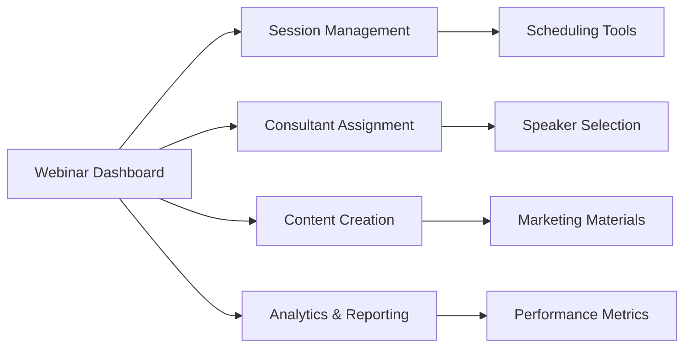

# Magnetiq v2 - Webinar Management Admin Specification

## Overview

The Webinar Management Admin Panel provides comprehensive tools for creating, scheduling, and managing webinars with integrated consultant assignment, content creation, and performance tracking. This specification focuses on the administrative interfaces for webinar program management.

→ **Implements**: [Webinar Business Strategy](../../business/webinar-strategy.md)
← **Supports**: [Admin Panel Architecture](./admin.md#webinar-management), [Content Strategy](../../business/content-strategy.md)
⚡ **Dependencies**: [Authentication System](./authentication.md), [Webinar API](../../backend/api.md#webinar-endpoints), [Database Schema](../../backend/database.md#webinar-tables)

## Quick Links
→ **Public Webinar System**: [Webinar Features](../public/features/webinars.md) (~1,684 lines)
→ **Consultant Integration**: [Consultant Management](./consultant-management.md#webinar-integration)
→ **Analytics Dashboard**: [Analytics Dashboard](./analytics-dashboard.md#webinar-analytics)
→ **Payment Integration**: [Payment Management](./payment-management.md#webinar-revenue)
→ **Content Tools**: [Content Management](./content-management.md#portable-text-editor)

## Visual System Overview


*Complete admin webinar management system showing session creation, consultant assignment, and performance tracking*



⚡ **System Integration**:
- **API Layer**: [Webinar Management Endpoints](../../backend/api.md#webinar-management-endpoints)
- **Data Layer**: [Webinar Database Schema](../../backend/database.md#webinars)
- **Content System**: [PortableText Editor](./content-management.md#portable-text-editor)
- **Consultant System**: [Consultant Assignment](./consultant-management.md#webinar-assignments)
- **Analytics System**: [Performance Tracking](./analytics-dashboard.md#webinar-performance)

## Main Interface (`/admin/webinars`)

### Navigation Structure
```
├── Sessions Overview (/admin/webinars/sessions)
├── Session Creation (/admin/webinars/create)
├── Consultant Assignment (/admin/webinars/consultants)
├── Content & Marketing (/admin/webinars/content)
├── Registration Management (/admin/webinars/registrations)
├── Analytics & Reports (/admin/webinars/analytics)
└── Program Settings (/admin/webinars/settings)
```

## 1. Webinar Sessions Overview (`/admin/webinars/sessions`)

→ **API Integration**: [Session Management API](../../backend/api.md#webinar-session-endpoints)
← **Data Source**: [Session Database Tables](../../backend/database.md#webinar_sessions)
⚡ **Dependencies**: [Real-time Updates](../../integrations/websockets.md), [Search Engine](../../backend/search.md)

### Session Management Dashboard


```tsx
interface WebinarSessionsOverview {
  sessionList: {
    upcomingSessions: WebinarSession[];
    liveSessions: WebinarSession[];
    completedSessions: WebinarSession[];
    draftSessions: WebinarSession[];
  };
  
  bulkOperations: {
    multiSelectActions: BulkActionInterface;
    exportTools: ExportInterface;
    batchNotifications: NotificationInterface;
  };
  
  filteringAndSearch: {
    advancedFilters: SessionFilterInterface;
    fullTextSearch: SearchInterface;
    dateRangeSelector: DateRangeInterface;
    statusFilters: StatusFilterInterface;
  };
  
  quickActions: {
    createNewSession: () => void;
    duplicateSession: (sessionId: string) => void;
    bulkReschedule: (sessionIds: string[]) => void;
    massEmailRegistrants: (sessionIds: string[]) => void;
  };
}
```

**Enhanced Session List Features**:
- **Advanced Table Component**: Sortable, filterable session directory using [TanStack Table](./admin.md#table-components)
- **Status Indicators**: Visual status badges (draft, scheduled, live, completed, cancelled)
- **Registration Metrics**: Live registration counts and capacity indicators
- **Consultant Information**: Assigned speakers with availability status
- **Quick Actions**: Edit, duplicate, cancel, view analytics, message registrants
- **Performance Indicators**: Rating, attendance rate, revenue metrics
- **Real-time Updates**: Live registration counts and status changes

### Session Detail View

```tsx
interface SessionDetailView {
  basicInfo: {
    title: TranslatedText;
    description: PortableTextContent;
    datetime: Date;
    duration: number;
    timezone: string;
    status: SessionStatus;
  };
  
  consultantInfo: {
    primarySpeaker: ConsultantProfile;
    additionalSpeakers: ConsultantProfile[];
    speakerCompensation: CompensationDetails;
    preparationStatus: PreparationStatus;
  };
  
  registrationData: {
    totalRegistrations: number;
    confirmedAttendees: number;
    waitlistCount: number;
    cancellationRate: number;
    registrationTrend: TimeSeriesData[];
  };
  
  contentManagement: {
    agenda: PortableTextContent;
    materials: FileUpload[];
    marketingContent: MarketingMaterials;
    socialMediaPosts: SocialMediaContent[];
  };
  
  technicalSetup: {
    meetingPlatform: PlatformSettings;
    recordingSettings: RecordingConfiguration;
    accessControls: AccessConfiguration;
    technicalRequirements: TechnicalSpecs;
  };
}
```

## 2. Session Creation Wizard (`/admin/webinars/create`)

→ **Content Integration**: [PortableText Editor](./content-management.md#portable-text-editor)
← **Consultant System**: [Speaker Assignment](./consultant-management.md#speaker-assignment)
⚡ **Dependencies**: [Calendar Integration](../../integrations/calendar.md), [AI Content Generation](../../integrations/openai-api.md)

### Multi-Step Session Creation


```tsx
interface SessionCreationWizard {
  step1_BasicInfo: {
    sessionType: 'single-speaker' | 'panel-discussion' | 'workshop' | 'q-and-a';
    title: MultilingualInput;
    description: PortableTextEditor;
    category: CategorySelector;
    difficultyLevel: DifficultySelector;
    targetAudience: AudienceSelector;
  };
  
  step2_ConsultantAssignment: {
    speakerSelection: ConsultantSelectionInterface;
    availabilityChecker: AvailabilityInterface;
    compensationCalculator: CompensationInterface;
    requirementsDefinition: RequirementsInterface;
  };
  
  step3_SchedulingSetup: {
    dateTimeSelector: DateTimeInterface;
    durationCalculator: DurationInterface;
    timezoneManager: TimezoneInterface;
    conflictChecker: ConflictDetectionInterface;
  };
  
  step4_ContentCreation: {
    agendaBuilder: AgendaBuilderInterface;
    objectivesEditor: PortableTextEditor;
    prerequisitesEditor: PortableTextEditor;
    materialsUploader: FileUploadInterface;
  };
  
  step5_MarketingSetup: {
    promotionalContent: PortableTextEditor;
    socialMediaGenerator: SocialContentGenerator;
    emailCampaignCreator: EmailCampaignInterface;
    landingPageBuilder: LandingPageInterface;
  };
  
  step6_TechnicalConfiguration: {
    platformSelector: PlatformSelectorInterface;
    recordingSettings: RecordingInterface;
    accessControls: AccessInterface;
    integrationSettings: IntegrationInterface;
  };
  
  step7_ReviewAndPublish: {
    previewInterface: SessionPreviewInterface;
    validationChecklist: ValidationInterface;
    publishingOptions: PublishingInterface;
    notificationSettings: NotificationInterface;
  };
}
```

### Enhanced Session Creation Features

**AI-Powered Content Assistance**:
- **Smart Suggestions**: AI-generated session descriptions based on topic and speaker
- **Agenda Generation**: Automatic agenda creation from session objectives
- **Marketing Copy**: AI-generated promotional content in multiple languages
- **SEO Optimization**: Automatic meta descriptions and keywords

**Consultant Integration**:
- **Smart Matching**: AI-powered consultant recommendation based on session topics
- **Availability Integration**: Real-time consultant calendar checking
- **Performance History**: Historical session performance by consultant
- **Dynamic Pricing**: Consultant-specific compensation calculation
- **Conflict Detection**: Automatic scheduling conflict identification

**Content Management**:
- **PortableText Integration**: Rich content editing for descriptions and agendas
- **Multilingual Support**: Simultaneous content creation in English and German
- **Media Integration**: Drag-and-drop file uploads with preview
- **Template Library**: Pre-built session templates for common formats

## 3. Consultant Assignment Interface (`/admin/webinars/consultants`)

→ **Consultant Profiles**: [Consultant Management](./consultant-management.md#profile-management)
← **Performance Data**: [Analytics Dashboard](./analytics-dashboard.md#consultant-performance)
⚡ **Dependencies**: [Calendar Integration](../../integrations/calendar.md), [Payment System](./payment-management.md#consultant-payouts)

### Speaker Selection and Management


```tsx
interface ConsultantAssignmentInterface {
  speakerSelection: {
    consultantDirectory: {
      searchAndFilter: ConsultantSearchInterface;
      expertiseMatching: ExpertiseMatchingEngine;
      availabilityChecker: AvailabilityCheckerInterface;
      performanceMetrics: PerformanceDisplayInterface;
    };
    
    assignmentWorkflow: {
      invitationSystem: InvitationInterface;
      confirmationTracking: ConfirmationInterface;
      requirementsCollection: RequirementsInterface;
      preparationManagement: PreparationInterface;
    };
    
    compensationManagement: {
      pricingCalculator: PricingCalculatorInterface;
      contractGeneration: ContractInterface;
      paymentScheduling: PaymentScheduleInterface;
      performanceBonuses: BonusInterface;
    };
  };
  
  panelManagement: {
    multiSpeakerCoordination: PanelCoordinationInterface;
    moderatorAssignment: ModeratorInterface;
    dynamicDiscussion: DiscussionInterface;
    speakerInteraction: InteractionInterface;
  };
  
  preparationTools: {
    briefingMaterials: BriefingInterface;
    technicalSetup: TechnicalSetupInterface;
    rehearsalScheduling: RehearsalInterface;
    requirementsTracking: RequirementsTrackingInterface;
  };
}
```

**Speaker Assignment Features**:
- **Expertise Matching**: Automatic consultant matching based on session topics and speaker expertise
- **Performance Analytics**: Historical webinar performance metrics per consultant
- **Availability Integration**: Real-time calendar checking and conflict detection
- **Compensation Calculator**: Dynamic pricing based on consultant tier and session type
- **Preparation Workflow**: Structured onboarding and preparation process
- **Multi-Speaker Support**: Panel discussion coordination and moderator assignment

### Consultant Performance Integration

```tsx
interface ConsultantWebinarPerformance {
  historicalMetrics: {
    totalWebinars: number;
    averageAttendance: number;
    averageRating: number;
    engagementScore: number;
    conversionRate: number;
  };
  
  revenueMetrics: {
    totalEarnings: MoneyAmount;
    averageSessionValue: MoneyAmount;
    revenueGrowth: PercentageChange;
    bonusEarnings: MoneyAmount;
  };
  
  qualityMetrics: {
    contentQualityScore: number;
    technicalProficiency: number;
    audienceEngagement: number;
    preparedness: number;
    professionalismScore: number;
  };
  
  feedbackData: {
    attendeeReviews: Review[];
    averageRating: number;
    recommendationRate: number;
    repeatBookingRate: number;
  };
}
```

## 4. Content Creation & Marketing (`/admin/webinars/content`)

→ **PortableText System**: [Content Management](./content-management.md#portable-text-editor)
← **Marketing Integration**: [Social Media](../../integrations/social-media.md), [Email Campaigns](../../integrations/email.md)
⚡ **Dependencies**: [AI Content Generation](../../integrations/openai-api.md), [Media Library](./content-management.md#media-library)

### Content Management Interface


```tsx
interface WebinarContentInterface {
  sessionContent: {
    descriptionEditor: {
      mainDescription: PortableTextEditor;
      shortDescription: PortableTextEditor; // For listings
      keyTakeaways: PortableTextEditor;
      targetAudience: PortableTextEditor;
    };
    
    agendaBuilder: {
      timelineCreator: AgendaTimelineInterface;
      topicBreakdown: TopicBreakdownInterface;
      interactiveElements: InteractivityInterface;
      qAndASessions: QASessionInterface;
    };
    
    materialManagement: {
      presentationUpload: FileUploadInterface;
      resourceLibrary: ResourceLibraryInterface;
      downloadableContent: DownloadInterface;
      supplementaryMaterials: SupplementaryInterface;
    };
  };
  
  marketingContent: {
    promotionalMaterials: {
      landingPageContent: PortableTextEditor;
      emailCampaignContent: PortableTextEditor;
      socialMediaPosts: SocialMediaContentGenerator;
      pressReleaseMaterials: PressReleaseInterface;
    };
    
    visualAssets: {
      thumbnailGenerator: ThumbnailGeneratorInterface;
      socialMediaGraphics: GraphicsGeneratorInterface;
      promotionalImages: ImageGeneratorInterface;
      brandingElements: BrandingInterface;
    };
    
    seoOptimization: {
      metaDataEditor: MetaDataInterface;
      keywordOptimization: KeywordInterface;
      structuredData: StructuredDataInterface;
      searchOptimization: SEOInterface;
    };
  };
  
  consultantContent: {
    speakerBios: Record<string, PortableTextEditor>;
    expertiseHighlights: ExpertiseInterface;
    credentialsDisplay: CredentialsInterface;
    thoughtLeadershipContent: ThoughtLeadershipInterface;
  };
}
```

**Enhanced Content Creation Features**:
- **PortableText Integration**: Rich content editing for all webinar descriptions and materials
- **Multilingual Support**: Side-by-side editing for English and German content
- **AI Content Generation**: Automated description, agenda, and marketing copy creation
- **Template Library**: Pre-built templates for different session types
- **Media Integration**: Seamless integration with media library and file uploads
- **SEO Optimization**: Built-in SEO tools and structured data generation

### Marketing Campaign Integration

```tsx
interface WebinarMarketingCampaign {
  campaignPlanning: {
    launchTimeline: TimelineInterface;
    channelStrategy: ChannelStrategyInterface;
    targetAudienceSegmentation: AudienceSegmentationInterface;
    budgetAllocation: BudgetInterface;
  };
  
  contentDistribution: {
    socialMediaScheduling: SocialSchedulingInterface;
    emailMarketingAutomation: EmailAutomationInterface;
    linkedinCampaigns: LinkedInCampaignInterface;
    partnerPromotions: PartnerPromotionInterface;
  };
  
  performanceTracking: {
    campaignAnalytics: CampaignAnalyticsInterface;
    conversionTracking: ConversionTrackingInterface;
    roiCalculation: ROICalculationInterface;
    attributionModeling: AttributionInterface;
  };
}
```

## 5. Registration Management (`/admin/webinars/registrations`)

→ **Registration System**: [Public Webinar Features](../public/features/webinars.md#registration-modal)
← **Analytics Data**: [Analytics Dashboard](./analytics-dashboard.md#registration-analytics)
⚡ **Dependencies**: [Email System](../../integrations/email.md), [Payment Processing](./payment-management.md#webinar-payments)

### Registration Dashboard


```tsx
interface RegistrationManagementInterface {
  registrationOverview: {
    summaryMetrics: {
      totalRegistrations: number;
      confirmedAttendees: number;
      waitlistCount: number;
      cancellationRate: number;
      noShowRate: number;
    };
    
    registrationFlow: {
      conversionFunnel: FunnelAnalysisInterface;
      dropOffPoints: DropOffAnalysisInterface;
      optimizationSuggestions: OptimizationInterface;
      a11yCompliance: AccessibilityInterface;
    };
  };
  
  attendeeManagement: {
    registrantDirectory: {
      searchAndFilter: AttendeeSearchInterface;
      bulkOperations: BulkOperationsInterface;
      communicationTools: CommunicationInterface;
      segmentation: SegmentationInterface;
    };
    
    waitlistManagement: {
      priorityRanking: PriorityRankingInterface;
      automatedPromotion: AutoPromotionInterface;
      notificationSystem: NotificationInterface;
      capacityManagement: CapacityInterface;
    };
    
    attendanceTracking: {
      realTimeAttendance: AttendanceTrackingInterface;
      engagementMetrics: EngagementInterface;
      participationScoring: ParticipationInterface;
      certificateGeneration: CertificateInterface;
    };
  };
  
  communicationCenter: {
    emailCampaigns: {
      confirmationEmails: ConfirmationEmailInterface;
      reminderSequence: ReminderSequenceInterface;
      followUpCampaigns: FollowUpInterface;
      customMessaging: CustomMessagingInterface;
    };
    
    notificationSystem: {
      realTimeNotifications: RealTimeNotificationInterface;
      smsIntegration: SMSInterface;
      pushNotifications: PushNotificationInterface;
      urgentCommunications: UrgentCommInterface;
    };
  };
}
```

**Registration Management Features**:
- **Real-time Registration Tracking**: Live updates on registration counts and trends
- **Attendee Communication**: Bulk email tools and personalized messaging
- **Waitlist Management**: Automated promotion and priority handling
- **Capacity Management**: Dynamic capacity adjustments and overflow handling
- **Payment Integration**: Payment tracking and refund management
- **Analytics Integration**: Registration funnel analysis and optimization insights

### Advanced Registration Analytics

```tsx
interface RegistrationAnalytics {
  conversionMetrics: {
    landingPageViews: number;
    registrationStarts: number;
    completedRegistrations: number;
    conversionRate: number;
    abandonmentRate: number;
  };
  
  demographicAnalysis: {
    geographicDistribution: GeographicData;
    industryBreakdown: IndustryData;
    jobTitleAnalysis: JobTitleData;
    companySizeDistribution: CompanySizeData;
  };
  
  behavioralInsights: {
    registrationTimeline: TimelineData;
    sourceAttribution: SourceAttributionData;
    deviceAndPlatform: DevicePlatformData;
    userJourneyMapping: UserJourneyData;
  };
  
  predictiveAnalytics: {
    attendancePrediction: AttendancePredictionModel;
    churnRiskAssessment: ChurnRiskModel;
    lifetimeValuePrediction: LTVPredictionModel;
    engagementForecasting: EngagementForecastModel;
  };
}
```

## 6. Analytics & Reporting (`/admin/webinars/analytics`)

→ **Analytics System**: [Analytics Dashboard](./analytics-dashboard.md#webinar-analytics)
← **Performance Data**: [Webinar Database](../../backend/database.md#webinar_analytics)
⚡ **Dependencies**: [Reporting Engine](../../backend/reporting.md), [Data Visualization](./analytics-dashboard.md#charts-and-graphs)

### Comprehensive Analytics Dashboard


```tsx
interface WebinarAnalyticsDashboard {
  performanceOverview: {
    keyMetrics: {
      totalSessions: number;
      totalAttendees: number;
      averageAttendance: number;
      totalRevenue: MoneyAmount;
      averageRating: number;
    };
    
    trendAnalysis: {
      sessionGrowth: TrendData;
      attendancePatterns: PatternData;
      revenueGrowth: RevenueData;
      qualityTrends: QualityData;
    };
  };
  
  sessionAnalytics: {
    individualPerformance: {
      attendanceMetrics: AttendanceMetrics;
      engagementScores: EngagementData;
      feedbackAnalysis: FeedbackData;
      conversionTracking: ConversionData;
    };
    
    comparativeAnalysis: {
      sessionRankings: RankingData;
      performanceBenchmarks: BenchmarkData;
      consultantComparisons: ComparisonData;
      categoryAnalysis: CategoryData;
    };
  };
  
  consultantAnalytics: {
    speakerPerformance: {
      individualMetrics: ConsultantMetrics;
      performanceRankings: RankingData;
      improvementTracking: ImprovementData;
      compensationAnalysis: CompensationData;
    };
    
    expertiseAnalysis: {
      topicPerformance: TopicPerformanceData;
      expertiseGaps: GapAnalysisData;
      marketDemand: DemandAnalysisData;
      competitivePositioning: PositioningData;
    };
  };
  
  audienceInsights: {
    demographicAnalysis: DemographicAnalysis;
    behavioralPatterns: BehavioralData;
    segmentAnalysis: SegmentData;
    lifetimeValue: LTVAnalysis;
  };
  
  businessIntelligence: {
    revenueAnalytics: RevenueAnalytics;
    costAnalysis: CostAnalysis;
    profitabilityMetrics: ProfitabilityData;
    growthProjections: GrowthProjectionData;
  };
}
```

**Advanced Analytics Features**:
- **Real-time Dashboards**: Live performance monitoring during sessions
- **Predictive Analytics**: Attendance and engagement forecasting
- **Comparative Analysis**: Session and consultant performance benchmarking
- **Revenue Tracking**: Complete financial performance and ROI analysis
- **Custom Reports**: Configurable reporting for different stakeholder needs
- **Data Export**: CSV, Excel, and API export capabilities for external analysis

## 7. Program Settings (`/admin/webinars/settings`)

→ **System Configuration**: [System Settings](./system-settings.md#webinar-configuration)
← **Integration Settings**: [Integrations Management](./integrations-management.md#webinar-integrations)
⚡ **Dependencies**: [Email Templates](../../integrations/email.md#templates), [Platform Integrations](../../integrations/video-platforms.md)

### Webinar Program Configuration

```tsx
interface WebinarProgramSettings {
  generalSettings: {
    programConfiguration: {
      defaultTimezone: string;
      defaultSessionDuration: number;
      defaultCapacity: number;
      allowWaitlist: boolean;
      autoApproveRegistrations: boolean;
    };
    
    contentDefaults: {
      defaultLanguages: ('en' | 'de')[];
      requireTranslations: boolean;
      contentTemplates: ContentTemplate[];
      brandingSettings: BrandingConfiguration;
    };
  };
  
  consultantSettings: {
    assignmentRules: {
      autoMatchingEnabled: boolean;
      requiredExpertiseMatch: number;
      availabilityBufferHours: number;
      compensationRules: CompensationRules;
    };
    
    qualityStandards: {
      minimumRating: number;
      experienceRequirements: ExperienceRequirements;
      certificationRequirements: CertificationRequirements;
      performanceThresholds: PerformanceThresholds;
    };
  };
  
  automationSettings: {
    emailAutomation: {
      confirmationEmails: EmailTemplate;
      reminderSequence: ReminderConfiguration;
      followUpEmails: FollowUpConfiguration;
      cancelationNotifications: CancelationConfiguration;
    };
    
    marketingAutomation: {
      socialMediaPosting: SocialMediaConfiguration;
      contentDistribution: DistributionConfiguration;
      leadNurturing: LeadNurturingConfiguration;
      conversionTracking: ConversionConfiguration;
    };
  };
  
  integrationSettings: {
    videoplatforms: {
      primaryPlatform: VideoplatformConfiguration;
      backupPlatforms: VideoplatformConfiguration[];
      recordingSettings: RecordingConfiguration;
      streamingOptions: StreamingConfiguration;
    };
    
    externalServices: {
      calendarIntegration: CalendarConfiguration;
      crmIntegration: CRMConfiguration;
      analyticsIntegration: AnalyticsConfiguration;
      paymentIntegration: PaymentConfiguration;
    };
  };
}
```

**Program Management Features**:
- **Global Settings**: Program-wide defaults and configuration
- **Template Management**: Content and email template library
- **Automation Rules**: Automated workflows and trigger configuration
- **Integration Management**: Third-party service configuration and monitoring
- **Quality Standards**: Performance thresholds and consultant requirements
- **Compliance Settings**: GDPR, accessibility, and legal compliance configuration

## Technology Implementation

### Frontend Technology Stack
- **Framework**: React 18 with TypeScript → [Architecture](../../architecture.md#frontend)
- **Content System**: PortableText editor for rich content → [Content Management](./content-management.md#portable-text-editor)
- **State Management**: Redux Toolkit with RTK Query → [State Management](../public.md#state-management)
- **UI Components**: Tailwind CSS with Headless UI → [Design System](../design-system.md)
- **Tables**: TanStack Table v8 for data grids → [Admin Panel](./admin.md#table-components)
- **Forms**: React Hook Form with Zod validation → [Form Components](./admin.md#form-management)
- **Charts**: Recharts for analytics visualization → [Analytics](./analytics-dashboard.md#visualization)

### Integration Requirements
- **Real-time Updates**: WebSocket connections for live data
- **API Integration**: RESTful API with comprehensive error handling
- **File Management**: Drag-and-drop uploads with progress tracking
- **Export Functions**: CSV/Excel/PDF export capabilities
- **Bulk Operations**: Mass update and batch processing support
- **Search and Filter**: Advanced search with full-text capabilities

## Cross-References Summary

### API Integration Cross-References
→ [Webinar Management API](../../backend/api.md#webinar-management-endpoints)
→ [Session Management API](../../backend/api.md#webinar-session-endpoints)
→ [Registration API](../../backend/api.md#webinar-registration-endpoints)
→ [Analytics API](../../backend/api.md#webinar-analytics-endpoints)
→ [Consultant Assignment API](../../backend/api.md#consultant-webinar-endpoints)

### Database Schema Cross-References
→ [Webinar Tables](../../backend/database.md#webinar-tables)
→ [Registration Tables](../../backend/database.md#webinar_registrations)
→ [Session Tables](../../backend/database.md#webinar_sessions)
→ [Analytics Tables](../../backend/database.md#webinar_analytics)
→ [Consultant Assignment Tables](../../backend/database.md#consultant_webinar_assignments)

### Feature Integration Cross-References
↔️ [Public Webinar System](../public/features/webinars.md) - Complete public-facing webinar features
↔️ [Consultant Management](./consultant-management.md#webinar-integration) - Speaker assignment and performance
↔️ [Content Management](./content-management.md#portable-text-editor) - PortableText content creation
↔️ [Payment Management](./payment-management.md#webinar-revenue) - Financial transactions and consultant payouts
↔️ [Analytics Dashboard](./analytics-dashboard.md#webinar-analytics) - Performance metrics and reporting

### User Experience Cross-References
← [Site Admin Persona](../../users/site-admin.md#webinar-management) - Primary admin user workflows
← [Content Editor Persona](../../users/content-editor.md#webinar-content) - Content creation workflows
→ [Design System](../design-system.md) - UI components and styling standards
⚡ [Responsive Design](../public.md#responsive-design) - Mobile-friendly admin interfaces

## Related Diagrams
- [Webinar Management System Flow](../../../diagrams/spec_v2/features/webinar_management_system.png)
- [Session Creation Workflow](../../../diagrams/spec_v2/features/webinar_session_creation_workflow.png)
- [Consultant Assignment Process](../../../diagrams/spec_v2/features/webinar_consultant_assignment.png)
- [Registration Management Interface](../../../diagrams/spec_v2/features/webinar_registration_interface.png)
- [Analytics Dashboard Layout](../../../diagrams/spec_v2/features/webinar_analytics_dashboard.png)

🔗 **Complete Admin Panel Index**: [All Admin Panel Specifications](../)