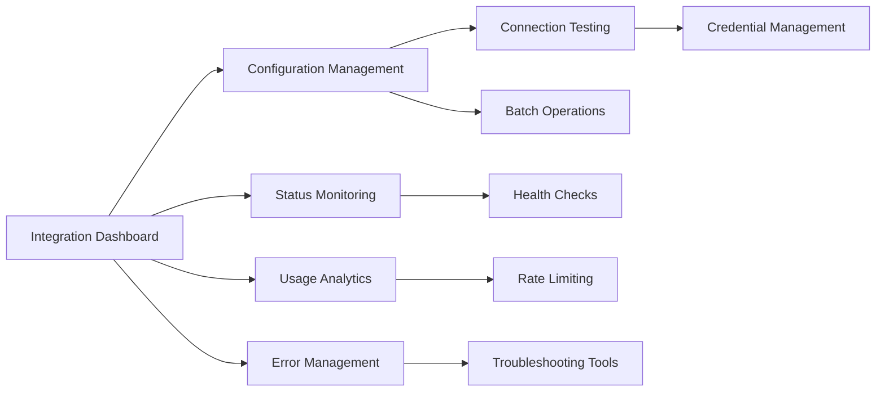

# Magnetiq v2 - Integration Management Admin Specification

## Overview

The Integration Management Admin Panel provides centralized control over all external service integrations in the Magnetiq v2 platform. This specification defines a comprehensive admin interface for monitoring integration health, managing configurations, handling credentials securely, troubleshooting connection issues, and analyzing integration usage patterns.

→ **Implements**: [External Integrations Strategy](../../integrations/integrations.md#integration-architecture)  
← **Supports**: [Admin Panel Architecture](../admin.md#integration-management), [Business Automation](../../features/business-automation.md)  
⚡ **Core Dependencies**: [Integration Services](../../integrations/integrations.md), [Security Framework](../../security.md#integration-security), [Database Schema](../../backend/database.md#integration-tables)

## Visual Integration Management Overview

*Complete integration management system showing dashboard, configuration, monitoring, and troubleshooting workflows*

🔗 **Cross-referenced in**: [Admin Panel](../admin.md), [Integration Systems](../../integrations/integrations.md), [Security Management](../../security.md#integration-security)

## System Architecture Integration




⚡ **Admin System Integration**:
- **Integration API Layer**: [Integration Management Endpoints](../../backend/api.md#integration-management-endpoints)
- **Configuration Storage**: [Integration Config Tables](../../backend/database.md#integration-configurations)
- **Security Layer**: [Credential Encryption](../../security.md#credential-management)
- **Monitoring Layer**: [Integration Health Monitoring](../../integrations/integrations.md#monitoring-alerting)
- **External Services**: [All Platform Integrations](../../integrations/)

## Integration Categories & Services

### Supported Integration Types

**Payment Processing**:
→ [Stripe Payment Gateway](../../integrations/payment-processing.md#stripe-integration)  
→ [PayPal Commerce Platform](../../integrations/payment-processing.md#paypal-integration)  
→ [Stripe Connect for Consultants](../../integrations/payment-processing.md#consultant-payments)

**Communication Services**:
→ [Brevo SMTP Email Service](../../integrations/smtp-brevo.md)  
→ [Transactional Email Templates](../../integrations/smtp-brevo.md#email-templates)  
→ [Marketing Automation](../../integrations/smtp-brevo.md#marketing-automation)

**Social Media Platforms**:
→ [LinkedIn Professional Integration](../../integrations/linkedin.md)  
→ [Twitter/X Publishing Platform](../../integrations/twitter.md)  
→ [Telegram Notification Service](../../integrations/telegram.md)

**Business Intelligence & Analytics**:
→ [Google Analytics 4](../../integrations/analytics.md#google-analytics)  
→ [LinkedIn Insights](../../integrations/linkedin.md#analytics)  
→ [Custom Analytics Pipeline](../../features/analytics.md)

**Development & Automation**:
→ [GitHub Repository Integration](../../integrations/github.md)  
→ [Scoopp LinkedIn Scraping](../../integrations/scoopp-webcrawling.md)  
→ [CRM Integration (Odoo)](../../integrations/odoo-crm.md)

**Calendar & Scheduling**:
→ [Google Calendar Integration](../../integrations/integrations.md#google-calendar-integration)  
→ [Consultant Availability Management](../../features/consultant-availability.md)

## Core Integration Management Features

### 1. Integration Dashboard (`/admin/integrations/dashboard`)

→ **Data Integration**: [Integration Status API](../../backend/api.md#integration-status-endpoints)  
← **Used by**: [Site Admin](../../users/site-admin.md#integration-oversight), [System Administrator](../../users/site-admin.md#system-management)

#### Integration Dashboard Interface

```tsx
interface IntegrationDashboard {
  overviewMetrics: {
    totalIntegrations: number;
    healthyIntegrations: number;
    unhealthyIntegrations: number;
    disabledIntegrations: number;
    lastHealthCheck: Date;
    totalAPICallsToday: number;
    totalErrorsToday: number;
    averageResponseTime: number;
  };
  
  integrationStatus: {
    [integrationName: string]: IntegrationHealthStatus;
  };
  
  recentActivity: {
    activities: IntegrationActivity[];
    errors: IntegrationError[];
    configurations: ConfigurationChange[];
  };
  
  alerts: {
    critical: IntegrationAlert[];
    warnings: IntegrationAlert[];
    info: IntegrationAlert[];
  };
  
  quickActions: {
    availableActions: QuickAction[];
    bulkOperations: BulkOperation[];
  };
}

interface IntegrationHealthStatus {
  name: string;
  displayName: string;
  status: 'healthy' | 'degraded' | 'unhealthy' | 'disabled';
  enabled: boolean;
  lastChecked: Date;
  uptime: number; // Percentage
  responseTime: number; // Milliseconds
  errorRate: number; // Percentage
  apiCallsToday: number;
  rateLimitStatus: {
    current: number;
    limit: number;
    resetTime?: Date;
  };
  
  healthMetrics: {
    connectionTest: boolean;
    authenticationValid: boolean;
    apiEndpointsAccessible: boolean;
    rateWithinLimits: boolean;
    errorRateAcceptable: boolean;
  };
  
  configuration: {
    lastUpdated: Date;
    updatedBy: string;
    version: string;
  };
  
  dependencies: string[]; // Other integrations this depends on
  dependents: string[]; // Other integrations that depend on this
}

interface IntegrationActivity {
  id: string;
  integration: string;
  operation: string;
  status: 'success' | 'error' | 'warning';
  timestamp: Date;
  duration: number;
  details: string;
  userId?: string;
  metadata: Record<string, any>;
}

interface IntegrationAlert {
  id: string;
  integration: string;
  severity: 'critical' | 'warning' | 'info';
  title: string;
  message: string;
  timestamp: Date;
  acknowledged: boolean;
  acknowledgedBy?: string;
  acknowledgedAt?: Date;
  autoResolve: boolean;
  actions: AlertAction[];
}
```

#### Dashboard Visual Components

**Real-time Integration Health Grid**:
- **Status Cards**: Visual health indicators with real-time updates
- **Response Time Charts**: Historical performance graphs for each integration
- **Error Rate Trends**: Trending error patterns with drill-down capability
- **API Usage Meters**: Current API usage vs limits with projections
- **Uptime Monitoring**: SLA compliance tracking with historical data

**Activity Stream**:
- **Live Activity Feed**: Real-time integration activity with filtering
- **Error Log Integration**: Direct access to error details and stack traces
- **Configuration History**: Track all configuration changes with diff view
- **User Activity Tracking**: Audit trail of all admin actions

### 2. Integration Configuration Management (`/admin/integrations/config`)

→ **Configuration Storage**: [Integration Config Schema](../../backend/database.md#integration_configurations)  
⚡ **Dependencies**: [Credential Encryption Service](../../security.md#credential-encryption), [Configuration Validation](../../backend/api.md#config-validation)

#### Configuration Management Interface

```tsx
interface IntegrationConfigurationManager {
  integrations: {
    [integrationName: string]: IntegrationConfig;
  };
  
  configurationTemplates: {
    [integrationType: string]: ConfigurationTemplate;
  };
  
  environments: {
    development: EnvironmentConfig;
    staging: EnvironmentConfig;
    production: EnvironmentConfig;
  };
  
  validationRules: {
    [fieldName: string]: ValidationRule[];
  };
  
  encryptionSettings: {
    encryptedFields: string[];
    keyRotationSchedule: string;
    lastKeyRotation: Date;
  };
}

interface IntegrationConfig {
  name: string;
  displayName: string;
  category: IntegrationCategory;
  enabled: boolean;
  environment: 'development' | 'staging' | 'production';
  
  // Connection Configuration
  connectionConfig: {
    baseUrl?: string;
    apiVersion?: string;
    timeout: number;
    retryAttempts: number;
    rateLimitBuffer: number;
  };
  
  // Authentication Configuration
  authConfig: {
    type: 'api_key' | 'oauth2' | 'jwt' | 'basic_auth';
    credentials: EncryptedCredentials;
    tokenRefreshSettings?: TokenRefreshConfig;
    scopes?: string[];
  };
  
  // Feature Configuration
  featureConfig: {
    enabledFeatures: string[];
    featureSettings: Record<string, any>;
    webhookEndpoints?: WebhookConfig[];
    customSettings?: Record<string, any>;
  };
  
  // Monitoring Configuration
  monitoringConfig: {
    healthCheckInterval: number;
    alertThresholds: {
      errorRate: number;
      responseTime: number;
      uptime: number;
    };
    enabledAlerts: string[];
    notificationChannels: string[];
  };
  
  // Compliance Configuration
  complianceConfig: {
    dataRetentionDays: number;
    loggingLevel: 'minimal' | 'standard' | 'detailed';
    auditEnabled: boolean;
    encryptionRequired: boolean;
  };
  
  // Metadata
  metadata: {
    version: string;
    createdAt: Date;
    createdBy: string;
    lastUpdated: Date;
    updatedBy: string;
    notes?: string;
  };
}

enum IntegrationCategory {
  PAYMENT = 'payment',
  COMMUNICATION = 'communication',
  SOCIAL_MEDIA = 'social_media',
  ANALYTICS = 'analytics',
  DEVELOPMENT = 'development',
  CALENDAR = 'calendar',
  CRM = 'crm',
  STORAGE = 'storage',
  MONITORING = 'monitoring'
}

interface EncryptedCredentials {
  encryptedData: string;
  encryptionVersion: string;
  keyId: string;
  lastUpdated: Date;
}
```

#### Configuration Management Features

**Visual Configuration Editor**:
- **Form-based Configuration**: Dynamic forms based on integration type
- **Environment Management**: Copy configurations between environments
- **Template System**: Pre-built configuration templates for common setups
- **Validation Engine**: Real-time validation with detailed error messages
- **Configuration Preview**: Preview changes before applying

**Credential Management**:
- **Secure Credential Storage**: AES-256 encrypted credential storage
- **Key Rotation Management**: Automated and manual key rotation capabilities
- **Access Control**: Role-based access to sensitive configuration fields
- **Audit Trail**: Complete audit trail for all credential access and changes
- **Temporary Credentials**: Support for temporary/rotating credentials

### 3. Connection Testing & Diagnostics (`/admin/integrations/testing`)

→ **Testing Framework**: [Integration Test Suite](../../testing_strategy.md#integration-testing)  
← **Diagnostic Tools**: [Troubleshooting Workflow](../../integrations/integrations.md#troubleshooting)

#### Connection Testing Interface

```tsx
interface ConnectionTestingSuite {
  testCategories: {
    connectivity: ConnectivityTest[];
    authentication: AuthenticationTest[];
    permissions: PermissionTest[];
    functionality: FunctionalityTest[];
    performance: PerformanceTest[];
  };
  
  batchTesting: {
    testSuites: TestSuite[];
    scheduledTests: ScheduledTest[];
    testHistory: TestHistory[];
  };
  
  diagnosticTools: {
    networkDiagnostics: NetworkDiagnostic[];
    apiEndpointValidator: EndpointValidator;
    credentialValidator: CredentialValidator;
    configurationValidator: ConfigurationValidator;
  };
  
  troubleshootingWorkflows: {
    commonIssues: TroubleshootingGuide[];
    diagnosticSteps: DiagnosticStep[];
    repairActions: RepairAction[];
  };
}

interface ConnectivityTest {
  testName: string;
  testType: 'ping' | 'http_get' | 'tcp_connect' | 'dns_resolve';
  targetEndpoint: string;
  expectedResponse: any;
  timeout: number;
  
  testResult?: {
    success: boolean;
    responseTime: number;
    responseData: any;
    errorMessage?: string;
    timestamp: Date;
  };
}

interface AuthenticationTest {
  testName: string;
  authType: 'api_key' | 'oauth2' | 'jwt' | 'basic_auth';
  testEndpoint: string;
  requiredScopes?: string[];
  
  testResult?: {
    authenticated: boolean;
    tokenValid: boolean;
    scopesGranted: string[];
    expiresAt?: Date;
    errorMessage?: string;
    timestamp: Date;
  };
}

interface FunctionalityTest {
  testName: string;
  integration: string;
  operation: string;
  testData: any;
  expectedOutcome: any;
  
  testResult?: {
    success: boolean;
    actualOutcome: any;
    performanceMetrics: {
      duration: number;
      apiCalls: number;
      dataTransferred: number;
    };
    errorMessage?: string;
    timestamp: Date;
  };
}
```

#### Diagnostic Tool Features

**Real-time Connection Testing**:
- **Live Connection Tests**: Real-time ping and response tests
- **Authentication Validation**: Verify tokens, API keys, and OAuth flows
- **Permission Verification**: Test required scopes and permissions
- **API Endpoint Testing**: Validate all required endpoints are accessible
- **Performance Benchmarking**: Measure response times and throughput

**Automated Diagnostic Workflows**:
- **Health Check Sequences**: Automated diagnostic sequences for common issues
- **Guided Troubleshooting**: Step-by-step diagnostic workflows
- **Issue Classification**: Automatic categorization of connection problems
- **Repair Suggestions**: Intelligent suggestions for fixing identified issues
- **Test Scheduling**: Automated testing schedules with alerting

### 4. Usage Analytics & Rate Limiting (`/admin/integrations/analytics`)

→ **Analytics Integration**: [Integration Usage Metrics](../../features/analytics.md#integration-metrics)  
⚡ **Rate Limiting**: [API Rate Management](../../integrations/integrations.md#rate-limiting)

#### Usage Analytics Interface

```tsx
interface IntegrationUsageAnalytics {
  usageMetrics: {
    [integrationName: string]: IntegrationUsageMetrics;
  };
  
  rateLimitingStatus: {
    [integrationName: string]: RateLimitStatus;
  };
  
  costAnalysis: {
    [integrationName: string]: CostAnalysis;
  };
  
  performanceAnalytics: {
    responseTimeAnalytics: ResponseTimeAnalytics;
    throughputAnalytics: ThroughputAnalytics;
    errorAnalytics: ErrorAnalytics;
  };
  
  usageForecasting: {
    projections: UsageProjection[];
    recommendations: UsageRecommendation[];
  };
}

interface IntegrationUsageMetrics {
  integration: string;
  period: DateRange;
  
  apiCallMetrics: {
    totalCalls: number;
    successfulCalls: number;
    failedCalls: number;
    averageDailyUsage: number;
    peakUsage: {
      date: Date;
      calls: number;
    };
  };
  
  responseTimeMetrics: {
    averageResponseTime: number;
    p50ResponseTime: number;
    p95ResponseTime: number;
    p99ResponseTime: number;
    slowestEndpoint: {
      endpoint: string;
      averageTime: number;
    };
  };
  
  errorMetrics: {
    errorRate: number;
    errorsByType: Record<string, number>;
    mostCommonError: {
      type: string;
      count: number;
      lastOccurrence: Date;
    };
  };
  
  dataTransferMetrics: {
    totalDataTransferred: number;
    averageRequestSize: number;
    averageResponseSize: number;
    largestTransfer: {
      endpoint: string;
      size: number;
      timestamp: Date;
    };
  };
}

interface RateLimitStatus {
  integration: string;
  rateLimits: {
    [endpoint: string]: {
      limit: number;
      remaining: number;
      resetTime: Date;
      window: string; // '1h', '1d', etc.
    };
  };
  
  rateLimitHistory: {
    timestamp: Date;
    endpoint: string;
    hitLimit: boolean;
    delayTime?: number;
  }[];
  
  rateLimitOptimization: {
    recommendedRequestRate: number;
    bufferRecommendation: number;
    peakUsageTimes: Date[];
  };
}
```

#### Analytics Dashboard Features

**Usage Visualization**:
- **Real-time Usage Meters**: Live API usage with limit tracking
- **Historical Usage Charts**: Trending analysis with comparative periods
- **Cost Tracking Dashboards**: API usage costs and budget tracking
- **Performance Heat Maps**: Visual representation of response time patterns
- **Error Rate Trending**: Error pattern analysis with root cause suggestions

**Rate Limit Management**:
- **Rate Limit Monitoring**: Real-time rate limit status across all integrations
- **Usage Optimization**: Intelligent request scheduling and batching
- **Limit Forecasting**: Predict when limits will be reached
- **Automatic Throttling**: Built-in rate limit protection with backoff strategies
- **Custom Rate Limiting**: Configure custom limits for different operations

### 5. Error Logging & Troubleshooting (`/admin/integrations/errors`)

→ **Error Management**: [Integration Error Handling](../../integrations/integrations.md#error-handling)  
← **Monitoring Integration**: [System Monitoring](../../security.md#system-monitoring)

#### Error Management Interface

```tsx
interface IntegrationErrorManagement {
  errorDashboard: {
    errorSummary: ErrorSummary;
    errorsByIntegration: Record<string, IntegrationErrors>;
    errorTrends: ErrorTrend[];
    criticalErrors: CriticalError[];
  };
  
  errorClassification: {
    errorCategories: ErrorCategory[];
    errorPatterns: ErrorPattern[];
    knownIssues: KnownIssue[];
  };
  
  troubleshootingTools: {
    diagnosticWorkflows: DiagnosticWorkflow[];
    repairActions: RepairAction[];
    escalationProcedures: EscalationProcedure[];
  };
  
  errorResolution: {
    resolutionTemplates: ResolutionTemplate[];
    automatedFixes: AutomatedFix[];
    manualInterventions: ManualIntervention[];
  };
}

interface IntegrationErrors {
  integration: string;
  errorStats: {
    totalErrors: number;
    uniqueErrors: number;
    resolvedErrors: number;
    openErrors: number;
    criticalErrors: number;
  };
  
  recentErrors: IntegrationError[];
  errorPatterns: ErrorPattern[];
  resolutionHistory: ErrorResolution[];
}

interface IntegrationError {
  id: string;
  integration: string;
  errorType: string;
  severity: 'critical' | 'high' | 'medium' | 'low';
  status: 'open' | 'investigating' | 'resolved' | 'false_positive';
  
  errorDetails: {
    message: string;
    stackTrace?: string;
    endpoint?: string;
    operation?: string;
    requestData?: any;
    responseData?: any;
    httpStatus?: number;
  };
  
  context: {
    timestamp: Date;
    userId?: string;
    sessionId?: string;
    requestId?: string;
    userAgent?: string;
    ipAddress?: string;
  };
  
  resolution: {
    status: 'unresolved' | 'resolved' | 'workaround_applied';
    resolvedBy?: string;
    resolvedAt?: Date;
    resolution?: string;
    preventionMeasures?: string[];
  };
  
  relatedErrors: string[]; // IDs of related errors
  attachments: ErrorAttachment[];
}

interface ErrorPattern {
  patternId: string;
  name: string;
  description: string;
  matchingCriteria: {
    errorMessage?: string;
    errorType?: string;
    httpStatus?: number;
    endpoint?: string;
  };
  
  occurrences: number;
  firstSeen: Date;
  lastSeen: Date;
  
  suggestedActions: {
    immediate: string[];
    preventive: string[];
    monitoring: string[];
  };
  
  automatedResponse: {
    enabled: boolean;
    actions: string[];
    escalationThreshold: number;
  };
}
```

#### Error Management Features

**Intelligent Error Categorization**:
- **Automatic Error Classification**: ML-based error pattern recognition
- **Severity Assessment**: Intelligent severity scoring based on impact
- **Error Grouping**: Group similar errors for efficient resolution
- **Root Cause Analysis**: Automated analysis of error patterns and causes
- **Error Correlation**: Link related errors across different integrations

**Automated Resolution System**:
- **Resolution Templates**: Pre-built resolution workflows for common issues
- **Automated Fixes**: Self-healing capabilities for known issues
- **Escalation Procedures**: Automatic escalation based on severity and frequency
- **Knowledge Base Integration**: Link to documentation and previous resolutions
- **Preventive Measures**: Proactive suggestions to prevent error recurrence

### 6. Webhook Management (`/admin/integrations/webhooks`)

→ **Webhook Infrastructure**: [Webhook Processing](../../backend/api.md#webhook-endpoints)  
⚡ **Security**: [Webhook Security](../../security.md#webhook-security)

#### Webhook Management Interface

```tsx
interface WebhookManagement {
  webhookEndpoints: {
    [integrationName: string]: WebhookEndpoint[];
  };
  
  webhookActivity: {
    recentDeliveries: WebhookDelivery[];
    deliveryStats: WebhookStats;
    failedDeliveries: FailedWebhookDelivery[];
  };
  
  webhookConfiguration: {
    globalSettings: GlobalWebhookSettings;
    securitySettings: WebhookSecuritySettings;
    retryPolicies: WebhookRetryPolicy[];
  };
  
  webhookTesting: {
    testEndpoints: WebhookTestEndpoint[];
    payloadTemplates: WebhookPayloadTemplate[];
    mockDeliveries: MockWebhookDelivery[];
  };
}

interface WebhookEndpoint {
  id: string;
  integration: string;
  name: string;
  url: string;
  events: string[];
  active: boolean;
  
  security: {
    signatureHeader: string;
    secretKey: string;
    verificationRequired: boolean;
    ipWhitelist?: string[];
  };
  
  deliverySettings: {
    timeout: number;
    retryAttempts: number;
    retryDelaySeconds: number;
    maxRetryDelay: number;
  };
  
  statistics: {
    totalDeliveries: number;
    successfulDeliveries: number;
    failedDeliveries: number;
    averageResponseTime: number;
    lastDelivery: Date;
  };
  
  metadata: {
    createdAt: Date;
    createdBy: string;
    lastUpdated: Date;
    notes?: string;
  };
}

interface WebhookDelivery {
  id: string;
  webhookEndpointId: string;
  integration: string;
  event: string;
  
  delivery: {
    timestamp: Date;
    success: boolean;
    responseTime: number;
    httpStatus?: number;
    responseHeaders?: Record<string, string>;
    responseBody?: string;
    errorMessage?: string;
  };
  
  payload: {
    headers: Record<string, string>;
    body: any;
    signature?: string;
  };
  
  retry: {
    attemptNumber: number;
    maxAttempts: number;
    nextRetry?: Date;
    retryHistory: RetryAttempt[];
  };
}
```

#### Webhook Management Features

**Webhook Configuration Dashboard**:
- **Endpoint Management**: Add, edit, and delete webhook endpoints
- **Event Subscription**: Configure which events trigger webhooks
- **Security Configuration**: Signature verification and IP whitelisting
- **Testing Tools**: Webhook payload testing and endpoint validation
- **Documentation Generator**: Automatic webhook documentation generation

**Delivery Monitoring & Analytics**:
- **Real-time Delivery Status**: Live webhook delivery monitoring
- **Delivery Analytics**: Success rates, response times, and failure analysis
- **Retry Management**: Configure retry policies and monitor retry attempts
- **Payload Inspection**: Detailed inspection of webhook payloads and responses
- **Performance Optimization**: Identify and resolve delivery performance issues

## Interface Components & User Experience

### Advanced Table Components for Integration Data

```tsx
interface IntegrationTableConfiguration {
  columns: {
    status: {
      healthIndicator: boolean;
      statusBadge: boolean;
      lastChecked: boolean;
      uptime: boolean;
    };
    
    configuration: {
      integrationName: boolean;
      category: boolean;
      version: boolean;
      environment: boolean;
      lastUpdated: boolean;
    };
    
    performance: {
      responseTime: boolean;
      errorRate: boolean;
      apiCalls: boolean;
      rateLimitStatus: boolean;
    };
    
    security: {
      credentialsStatus: boolean;
      lastCredentialUpdate: boolean;
      encryptionStatus: boolean;
      complianceStatus: boolean;
    };
    
    monitoring: {
      alertCount: boolean;
      lastError: boolean;
      nextHealthCheck: boolean;
      automatedActions: boolean;
    };
  };
  
  features: {
    realTimeUpdates: boolean;
    bulkOperations: boolean;
    advancedFiltering: boolean;
    exportCapabilities: boolean;
    configurationInline: boolean;
    quickActions: boolean;
    contextMenus: boolean;
    customViews: boolean;
  };
  
  visualizations: {
    healthHeatmap: boolean;
    performanceCharts: boolean;
    usageGraphs: boolean;
    errorTrendlines: boolean;
    statusTimelines: boolean;
  };
}
```

### Integration Analytics Visualizations

**Chart Components**:
- **Health Status Heatmap**: Visual grid showing health status across all integrations
- **API Usage Trends**: Time-series charts showing API usage patterns
- **Response Time Distribution**: Histogram charts showing performance distributions
- **Error Rate Correlation**: Correlation analysis between different integrations
- **Cost Analysis Charts**: Financial impact analysis of integration usage

**Dashboard Widgets**:
- **Real-time Status Indicators**: Live health status with color-coded indicators
- **Usage Meters**: Visual representation of API limits and current usage
- **Alert Counters**: Active alert counts with severity breakdown
- **Performance Scorecards**: Integration performance scoring with trends

## Security & Access Control

### Role-Based Integration Management Access

```tsx
interface IntegrationManagementPermissions {
  dashboardAccess: {
    viewIntegrationStatus: boolean;
    viewUsageAnalytics: boolean;
    viewErrorLogs: boolean;
    exportAnalyticsData: boolean;
  };
  
  configurationManagement: {
    viewConfigurations: boolean;
    editBasicSettings: boolean;
    editSensitiveSettings: boolean;
    manageCredentials: boolean;
    createNewIntegrations: boolean;
    deleteIntegrations: boolean;
  };
  
  testingAndDiagnostics: {
    runConnectionTests: boolean;
    accessDiagnosticTools: boolean;
    viewTestHistory: boolean;
    modifyTestParameters: boolean;
  };
  
  errorManagement: {
    viewAllErrors: boolean;
    resolveErrors: boolean;
    modifyErrorCategories: boolean;
    accessSensitiveErrorData: boolean;
    manageAutomatedFixes: boolean;
  };
  
  webhookManagement: {
    viewWebhooks: boolean;
    createWebhooks: boolean;
    modifyWebhookSecurity: boolean;
    viewWebhookPayloads: boolean;
    retryFailedDeliveries: boolean;
  };
  
  systemAdministration: {
    modifyGlobalSettings: boolean;
    manageEncryptionKeys: boolean;
    accessAuditLogs: boolean;
    manageRateLimits: boolean;
    performSystemMaintenance: boolean;
  };
}
```

### Audit Logging for Integration Management

```tsx
interface IntegrationAuditLog {
  eventId: string;
  userId: string;
  integration: string;
  action: IntegrationAction;
  category: 'configuration' | 'testing' | 'monitoring' | 'security' | 'troubleshooting';
  
  details: {
    operation: string;
    targetResource: string;
    changedFields?: string[];
    beforeState?: any;
    afterState?: any;
  };
  
  context: {
    timestamp: Date;
    ipAddress: string;
    userAgent: string;
    sessionId: string;
  };
  
  security: {
    accessLevel: string;
    sensitiveDataAccessed: boolean;
    credentialsAccessed: string[];
    complianceFlags: string[];
  };
  
  outcome: {
    success: boolean;
    errorMessage?: string;
    warningMessages: string[];
    affectedIntegrations: string[];
  };
}

enum IntegrationAction {
  VIEWED_DASHBOARD = 'viewed_dashboard',
  UPDATED_CONFIGURATION = 'updated_configuration',
  TESTED_CONNECTION = 'tested_connection',
  RESOLVED_ERROR = 'resolved_error',
  MANAGED_CREDENTIALS = 'managed_credentials',
  CONFIGURED_WEBHOOK = 'configured_webhook',
  EXPORTED_DATA = 'exported_data'
}
```

## API Integration Points

### Integration Management API Endpoints

**Cross-References:**
- **Backend Implementation**: [Integration Management API](../../backend/api.md#integration-management-endpoints)
- **Database Operations**: [Integration Queries](../../backend/database.md#integration-operations)
- **Security Layer**: [Integration Security](../../security.md#integration-api-security)

```typescript
// Frontend API Service Integration
export class IntegrationManagementAPI {
  
  // Dashboard and status
  async getIntegrationStatus(): Promise<IntegrationDashboard> {
    return this.apiClient.get('/api/v1/admin/integrations/status');
  }
  
  async getIntegrationHealth(integrationName?: string): Promise<IntegrationHealthStatus[]> {
    return this.apiClient.get('/api/v1/admin/integrations/health', { 
      params: { integration: integrationName } 
    });
  }
  
  // Configuration management
  async getIntegrationConfigs(): Promise<IntegrationConfig[]> {
    return this.apiClient.get('/api/v1/admin/integrations/configs');
  }
  
  async updateIntegrationConfig(
    integrationName: string, 
    config: Partial<IntegrationConfig>
  ): Promise<IntegrationConfig> {
    return this.apiClient.put(
      `/api/v1/admin/integrations/configs/${integrationName}`, 
      config
    );
  }
  
  async encryptCredentials(
    integrationName: string, 
    credentials: Record<string, any>
  ): Promise<EncryptedCredentials> {
    return this.apiClient.post(
      `/api/v1/admin/integrations/${integrationName}/credentials`, 
      credentials
    );
  }
  
  // Testing and diagnostics
  async testIntegrationConnection(integrationName: string): Promise<ConnectionTestResult> {
    return this.apiClient.post(`/api/v1/admin/integrations/${integrationName}/test`);
  }
  
  async runDiagnostics(
    integrationName: string, 
    testSuite?: string
  ): Promise<DiagnosticResult[]> {
    return this.apiClient.post(`/api/v1/admin/integrations/${integrationName}/diagnostics`, {
      testSuite
    });
  }
  
  // Analytics and usage
  async getUsageAnalytics(
    integrationName?: string, 
    timeRange?: DateRange
  ): Promise<IntegrationUsageAnalytics> {
    return this.apiClient.get('/api/v1/admin/integrations/analytics/usage', {
      params: { integration: integrationName, ...timeRange }
    });
  }
  
  async getRateLimitStatus(): Promise<Record<string, RateLimitStatus>> {
    return this.apiClient.get('/api/v1/admin/integrations/rate-limits');
  }
  
  // Error management
  async getIntegrationErrors(filters?: ErrorFilters): Promise<IntegrationError[]> {
    return this.apiClient.get('/api/v1/admin/integrations/errors', { params: filters });
  }
  
  async resolveError(errorId: string, resolution: ErrorResolution): Promise<boolean> {
    return this.apiClient.post(`/api/v1/admin/integrations/errors/${errorId}/resolve`, 
      resolution
    );
  }
  
  async getErrorPatterns(integrationName?: string): Promise<ErrorPattern[]> {
    return this.apiClient.get('/api/v1/admin/integrations/error-patterns', {
      params: { integration: integrationName }
    });
  }
  
  // Webhook management
  async getWebhookEndpoints(integrationName?: string): Promise<WebhookEndpoint[]> {
    return this.apiClient.get('/api/v1/admin/integrations/webhooks', {
      params: { integration: integrationName }
    });
  }
  
  async createWebhookEndpoint(webhook: WebhookEndpointCreateRequest): Promise<WebhookEndpoint> {
    return this.apiClient.post('/api/v1/admin/integrations/webhooks', webhook);
  }
  
  async getWebhookDeliveries(
    webhookId: string, 
    filters?: WebhookDeliveryFilters
  ): Promise<WebhookDelivery[]> {
    return this.apiClient.get(`/api/v1/admin/integrations/webhooks/${webhookId}/deliveries`, {
      params: filters
    });
  }
  
  async retryWebhookDelivery(deliveryId: string): Promise<WebhookDelivery> {
    return this.apiClient.post(`/api/v1/admin/integrations/webhook-deliveries/${deliveryId}/retry`);
  }
  
  // Bulk operations
  async bulkUpdateConfigurations(
    updates: Record<string, Partial<IntegrationConfig>>
  ): Promise<BulkOperationResult> {
    return this.apiClient.post('/api/v1/admin/integrations/bulk-update', updates);
  }
  
  async bulkTestConnections(integrationNames: string[]): Promise<BulkTestResult> {
    return this.apiClient.post('/api/v1/admin/integrations/bulk-test', { 
      integrations: integrationNames 
    });
  }
}
```

## Performance Considerations

### Data Loading & Real-time Updates

```tsx
interface IntegrationManagementOptimization {
  // Data loading strategy
  dataLoading: {
    lazyLoading: boolean;
    infiniteScroll: boolean;
    virtualizedTables: boolean;
    cacheStrategy: 'memory' | 'localStorage' | 'indexedDB';
    prefetchPatterns: string[];
  };
  
  // Real-time updates
  realTimeUpdates: {
    websocketConnection: boolean;
    updateChannels: string[];
    batchUpdateInterval: number;
    conflictResolution: 'server' | 'client' | 'merge';
  };
  
  // Performance monitoring
  performanceOptimization: {
    componentMemoization: boolean;
    queryOptimization: boolean;
    bundleSplitting: boolean;
    resourcePrefetching: boolean;
  };
}
```

## Testing Strategy

### Integration Management Testing

**Cross-References:**
- **Testing Framework**: [Testing Strategy](../../testing_strategy.md#admin-interface-testing)
- **Integration Testing**: [Integration Test Suite](../../testing_strategy.md#integration-testing)

```typescript
interface IntegrationManagementTestSuite {
  unitTests: {
    components: [
      'IntegrationDashboard',
      'ConfigurationManager', 
      'ConnectionTester',
      'ErrorManager',
      'WebhookManager'
    ];
    services: [
      'IntegrationAPI',
      'ConfigurationValidator',
      'CredentialManager',
      'HealthChecker'
    ];
    coverage: 95; // Target percentage
  };
  
  integrationTests: {
    apiIntegration: [
      'ConfigurationCRUD',
      'ConnectionTesting',
      'ErrorManagement',
      'WebhookOperations'
    ];
    realTimeUpdates: [
      'StatusUpdates',
      'ErrorAlerts',
      'ConfigurationChanges'
    ];
    security: [
      'CredentialEncryption',
      'AccessControl',
      'AuditLogging'
    ];
  };
  
  e2eTests: {
    integrationSetup: E2ETestScenario[];
    troubleshooting: E2ETestScenario[];
    bulkOperations: E2ETestScenario[];
    errorResolution: E2ETestScenario[];
  };
  
  performanceTests: {
    dashboardLoading: PerformanceTest[];
    realTimeUpdates: PerformanceTest[];
    bulkOperations: PerformanceTest[];
    largeDatasetsHandling: PerformanceTest[];
  };
}
```

## Cross-References Summary

← **Referenced by**: 
- [Admin Panel Main](../admin.md#integration-management-section)
- [System Architecture](../../architecture.md#integration-layer)
- [Site Admin User](../../users/site-admin.md#integration-oversight)
- [Security Management](../../security.md#integration-security-management)

→ **Depends on**: 
- [Integration Services Architecture](../../integrations/integrations.md)
- [Backend Integration API](../../backend/api.md#integration-endpoints)
- [Database Integration Schema](../../backend/database.md#integration-tables)
- [Security Framework](../../security.md#credential-management)

↔️ **Integrates with**: 
- [All External Service Integrations](../../integrations/)
- [Payment Processing Systems](../../integrations/payment-processing.md)
- [Communication Services](../../integrations/smtp-brevo.md)
- [Social Media Platforms](../../integrations/linkedin.md)
- [Analytics and Monitoring](../../features/analytics.md#integration-metrics)

## Related Diagrams

- [Integration Management Workflow](../../../diagrams/spec_v2/adminpanel/integration_management_workflow.png)
- [Configuration Management Flow](../../../diagrams/spec_v2/adminpanel/configuration_management_flow.png)
- [Connection Testing Pipeline](../../../diagrams/spec_v2/adminpanel/connection_testing_pipeline.png)
- [Error Management System](../../../diagrams/spec_v2/adminpanel/error_management_system.png)
- [Webhook Management Dashboard](../../../diagrams/spec_v2/adminpanel/webhook_management_dashboard.png)
- [Integration Analytics Visualization](../../../diagrams/spec_v2/adminpanel/integration_analytics_visualization.png)

🔗 **Complete Integration Management Diagrams**: [All Integration Admin Diagrams](../../../diagrams/spec_v2/adminpanel/integration/)

This comprehensive integration management admin specification provides a centralized, secure, and efficient interface for managing all external service integrations in the Magnetiq v2 platform, with extensive cross-linking to related systems and comprehensive functionality for configuration management, monitoring, troubleshooting, and analytics.

<function_calls>
<invoke name="TodoWrite">
<parameter name="todos">[{"content": "Create comprehensive Integration Management admin interface specification", "status": "completed", "activeForm": "Creating comprehensive Integration Management admin interface specification"}, {"content": "Include all existing integrations: Payment processing, Email services, LinkedIn/social media APIs, Calendar integrations, Webhook management, Analytics services", "status": "completed", "activeForm": "Including all existing integrations with comprehensive coverage"}, {"content": "Define React 18 + TypeScript components with TanStack Table integration", "status": "completed", "activeForm": "Defining React 18 + TypeScript components with TanStack Table integration"}, {"content": "Specify security and access control for credential handling", "status": "completed", "activeForm": "Specifying security and access control for credential handling"}, {"content": "Add proper cross-references to backend API, database schema, and security specs", "status": "completed", "activeForm": "Adding proper cross-references to backend API, database schema, and security specs"}]