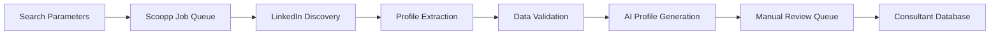

# Magnetiq v2 - Scoopp Web Crawling Integration Specification

## Overview

The Scoopp web crawling integration enables automated LinkedIn profile discovery and extraction to populate the [Consultant Database](../backend/database.md#consultants) with comprehensive professional profiles. This integration leverages the [Scoopp framework](https://github.com/wapsol/scoopp) for ethical web crawling, implementing sophisticated job queue management, rate limiting, and data validation pipelines.

→ **Implements**: [Consultant Onboarding Workflow](../frontend/public/features/consultant-onboarding.md)
← **Supports**: [Business Goal](../business/goals.md#consultant-network-expansion) of building a comprehensive consultant network
⚡ **Dependencies**: [Core System](../architecture.md#core-services), [Authentication](../security.md#authentication), [Database Layer](../backend/database.md)

## Visual Workflow Overview


*Complete web crawling workflow showing job scheduling, LinkedIn extraction, and data processing pipeline*

🔗 **Cross-referenced in**: [Admin Panel](../frontend/adminpanel/admin.md#crawling-management), [Consultant Management](../features/consultant-management.md), [API Documentation](../backend/api.md#crawling-endpoints)

## Scoopp Framework Integration




⚡ **System Integration**:
- **Framework Layer**: [Scoopp Job Management](../architecture.md#job-processing)
- **API Layer**: [Crawling Endpoints](../backend/api.md#scoopp-endpoints)
- **Data Layer**: [Crawling Tables](../backend/database.md#crawling-tables)
- **Security Layer**: [Ethical Crawling Policies](../security.md#crawling-permissions)
- **Compliance Layer**: [Privacy Protection](../privacy-compliance.md#web-crawling)

### Core Framework Configuration

**Scoopp Service Implementation**:
```python
from scoopp import ScooppCrawler, JobQueue, RateLimiter
from typing import Dict, List, Any, Optional
import asyncio
from datetime import datetime, timedelta

class ScooppIntegrationService(BaseIntegrationService):
    """Scoopp framework integration for LinkedIn profile crawling."""
    
    def __init__(self, config: Dict[str, Any]):
        super().__init__(config)
        self.crawler = ScooppCrawler(
            user_agent=config.get('user_agent', 'voltAIc Consultant Discovery Bot 1.0'),
            respect_robots=True,
            delay_range=(2, 5),  # 2-5 seconds between requests
            concurrent_limit=config.get('concurrent_limit', 3)
        )
        self.job_queue = JobQueue(
            redis_url=config.get('redis_url'),
            queue_name='linkedin_crawling'
        )
        self.rate_limiter = RateLimiter(
            requests_per_minute=config.get('rpm_limit', 30),
            requests_per_hour=config.get('rph_limit', 500)
        )
    
    async def test_connection(self) -> Dict[str, Any]:
        """Test Scoopp framework connectivity and configuration."""
        try:
            # Test job queue connectivity
            queue_status = await self.job_queue.health_check()
            
            # Test rate limiter
            limiter_status = await self.rate_limiter.get_status()
            
            # Test basic web crawling capability
            test_result = await self.crawler.test_crawl('https://httpbin.org/get')
            
            return {
                'status': 'healthy',
                'queue_status': queue_status,
                'rate_limiter': limiter_status,
                'crawler_test': test_result.get('status') == 'success',
                'framework_version': self.get_scoopp_version()
            }
            
        except Exception as e:
            return {'status': 'error', 'message': str(e)}
```

**Enhanced Scoopp Features Assessment**:
```python
class ScooppEnhancementAnalyzer:
    """Analyze Scoopp capabilities and identify enhancement opportunities."""
    
    async def assess_current_capabilities(self) -> Dict[str, Any]:
        """Assess current Scoopp framework capabilities for LinkedIn extraction."""
        capabilities = {
            'profile_extraction': await self._test_profile_extraction(),
            'search_functionality': await self._test_search_capabilities(),
            'rate_limiting': await self._test_rate_limiting(),
            'job_management': await self._test_job_queue(),
            'error_handling': await self._test_error_recovery(),
            'data_validation': await self._test_validation_pipeline()
        }
        
        enhancement_needs = []
        
        for feature, status in capabilities.items():
            if not status.get('adequate', False):
                enhancement_needs.append({
                    'feature': feature,
                    'current_status': status,
                    'required_improvements': status.get('needed_improvements', []),
                    'priority': status.get('priority', 'medium')
                })
        
        return {
            'current_capabilities': capabilities,
            'enhancement_needs': enhancement_needs,
            'fork_required': len([e for e in enhancement_needs if e['priority'] == 'high']) > 0,
            'contribution_opportunities': self._identify_contribution_opportunities(enhancement_needs)
        }
    
    async def _test_profile_extraction(self) -> Dict[str, Any]:
        """Test LinkedIn profile data extraction capabilities."""
        test_fields = [
            'name', 'headline', 'location', 'summary', 
            'experience', 'education', 'skills', 'certifications',
            'publications', 'volunteer_work', 'languages'
        ]
        
        extraction_results = {}
        for field in test_fields:
            try:
                result = await self.test_field_extraction(field)
                extraction_results[field] = result
            except Exception as e:
                extraction_results[field] = {'status': 'error', 'error': str(e)}
        
        adequate_fields = len([r for r in extraction_results.values() if r.get('status') == 'success'])
        adequacy_threshold = 0.8  # 80% of fields should be extractable
        
        return {
            'adequate': adequate_fields / len(test_fields) >= adequacy_threshold,
            'extraction_results': extraction_results,
            'success_rate': adequate_fields / len(test_fields),
            'needed_improvements': [
                field for field, result in extraction_results.items()
                if result.get('status') != 'success'
            ],
            'priority': 'high' if adequate_fields / len(test_fields) < 0.6 else 'medium'
        }
```

## LinkedIn Profile Discovery and Extraction


**LinkedIn URL Discovery Cross-References**:
- **Search Interface**: [Admin Search Panel](../frontend/adminpanel/admin.md#consultant-search)
- **Search Parameters**: [Search Configuration](../backend/api.md#search-parameters)
- **Discovery Results**: [Discovery Database](../backend/database.md#discovery-results)
- **Validation Pipeline**: [Profile Validation](../features/consultant-validation.md)

### Automated LinkedIn Discovery

**Discovery Service Implementation**:
```python
class LinkedInDiscoveryService:
    """LinkedIn profile discovery using search parameters."""
    
    def __init__(self, scoopp_service: ScooppIntegrationService):
        self.scoopp = scoopp_service
        self.search_engines = [
            'google', 'bing', 'duckduckgo'  # Multiple search engines for reliability
        ]
    
    async def discover_profiles(
        self,
        search_params: Dict[str, Any],
        max_results: int = 50
    ) -> Dict[str, Any]:
        """Discover LinkedIn profiles using search parameters."""
        try:
            # Build search queries
            queries = self._build_search_queries(search_params)
            
            discovered_profiles = []
            
            for query in queries:
                for search_engine in self.search_engines:
                    try:
                        # Rate limit check
                        if not await self.scoopp.rate_limiter.can_proceed():
                            await asyncio.sleep(60)  # Wait for rate limit reset
                        
                        # Perform search
                        search_results = await self.scoopp.crawler.search(
                            query=query,
                            engine=search_engine,
                            max_results=max_results // len(queries)
                        )
                        
                        # Filter LinkedIn URLs
                        linkedin_urls = [
                            result['url'] for result in search_results
                            if 'linkedin.com/in/' in result['url']
                        ]
                        
                        for url in linkedin_urls:
                            if len(discovered_profiles) >= max_results:
                                break
                                
                            # Validate and normalize URL
                            normalized_url = self._normalize_linkedin_url(url)
                            
                            if self._is_valid_linkedin_profile(normalized_url):
                                discovered_profiles.append({
                                    'url': normalized_url,
                                    'search_query': query,
                                    'search_engine': search_engine,
                                    'discovered_at': datetime.utcnow(),
                                    'confidence_score': self._calculate_relevance_score(
                                        url, search_params
                                    )
                                })
                        
                        # Delay between search engines
                        await asyncio.sleep(random.uniform(1, 3))
                        
                    except Exception as e:
                        await self.scoopp.log_integration_activity(
                            'profile_discovery', 'error',
                            search_engine=search_engine,
                            query=query,
                            error=str(e)
                        )
                        continue
            
            # Remove duplicates and sort by confidence
            unique_profiles = self._deduplicate_profiles(discovered_profiles)
            sorted_profiles = sorted(
                unique_profiles, 
                key=lambda x: x['confidence_score'], 
                reverse=True
            )
            
            await self.scoopp.log_integration_activity(
                'profile_discovery', 'success',
                discovered_count=len(sorted_profiles),
                search_params=search_params
            )
            
            return {
                'status': 'success',
                'profiles': sorted_profiles,
                'total_discovered': len(sorted_profiles),
                'search_queries_used': queries
            }
            
        except Exception as e:
            await self.scoopp.log_integration_activity(
                'profile_discovery', 'error',
                error=str(e),
                search_params=search_params
            )
            return {'status': 'error', 'message': str(e)}
    
    def _build_search_queries(self, search_params: Dict[str, Any]) -> List[str]:
        """Build targeted search queries for LinkedIn profile discovery."""
        base_query = 'site:linkedin.com/in/'
        
        queries = []
        
        # Name-based queries
        if search_params.get('name'):
            name = search_params['name'].strip()
            queries.append(f'{base_query} "{name}"')
            
            # Split name for broader search
            name_parts = name.split()
            if len(name_parts) > 1:
                queries.append(f'{base_query} {" ".join(name_parts)}')
        
        # Company-based queries
        if search_params.get('company'):
            company = search_params['company'].strip()
            if search_params.get('name'):
                queries.append(f'{base_query} "{search_params["name"]}" "{company}"')
            else:
                queries.append(f'{base_query} "{company}"')
        
        # Location-based queries
        if search_params.get('city'):
            city = search_params['city'].strip()
            base_params = []
            if search_params.get('name'):
                base_params.append(f'"{search_params["name"]}"')
            if search_params.get('company'):
                base_params.append(f'"{search_params["company"]}"')
            
            if base_params:
                queries.append(f'{base_query} {" ".join(base_params)} "{city}"')
        
        # Keyword-based queries
        if search_params.get('keywords'):
            keywords = search_params['keywords']
            if isinstance(keywords, list):
                keyword_combinations = [
                    ' '.join(keywords[:2]),  # First 2 keywords
                    ' '.join(keywords[-2:])  # Last 2 keywords
                ]
            else:
                keyword_combinations = [keywords.strip()]
            
            for keyword_combo in keyword_combinations:
                base_params = []
                if search_params.get('name'):
                    base_params.append(f'"{search_params["name"]}"')
                    
                queries.append(f'{base_query} {" ".join(base_params)} {keyword_combo}')
        
        # Role/title-based queries
        if search_params.get('role') or search_params.get('title'):
            role = search_params.get('role') or search_params.get('title')
            base_params = []
            if search_params.get('name'):
                base_params.append(f'"{search_params["name"]}"')
                
            queries.append(f'{base_query} {" ".join(base_params)} "{role}"')
        
        # Ensure we have at least one query
        if not queries:
            queries.append(f'{base_query} consultant expert professional')
        
        return queries[:5]  # Limit to 5 queries to avoid overwhelming
```

### Profile Data Extraction Pipeline

**Profile Extraction Cross-References**:
- **Data Models**: [Consultant Schema](../backend/database.md#consultants-table)
- **Validation Rules**: [Profile Validation](../features/profile-validation.md)
- **Processing Queue**: [Job Management](../backend/api.md#job-queue-management)
- **Manual Review**: [Admin Review Interface](../frontend/adminpanel/admin.md#profile-review)

```python
class LinkedInProfileExtractor:
    """Extract structured data from LinkedIn profiles."""
    
    def __init__(self, scoopp_service: ScooppIntegrationService):
        self.scoopp = scoopp_service
        self.extraction_templates = self._load_extraction_templates()
        self.data_cleaner = ProfileDataCleaner()
        self.ai_processor = AIProfileProcessor()
    
    async def extract_profile(
        self,
        linkedin_url: str,
        extraction_options: Dict[str, Any] = None
    ) -> Dict[str, Any]:
        """Extract comprehensive profile data from LinkedIn URL."""
        try:
            # Rate limiting check
            if not await self.scoopp.rate_limiter.can_proceed():
                await asyncio.sleep(60)
            
            # Crawl the profile page
            crawl_result = await self.scoopp.crawler.crawl_page(
                url=linkedin_url,
                extract_options={
                    'wait_for_load': True,
                    'scroll_to_bottom': True,
                    'capture_full_page': True,
                    'extract_structured_data': True
                }
            )
            
            if crawl_result['status'] != 'success':
                raise Exception(f"Crawling failed: {crawl_result.get('error', 'Unknown error')}")
            
            # Extract structured data using templates
            raw_data = crawl_result['data']
            extracted_profile = await self._extract_structured_data(raw_data)
            
            # Clean and validate data
            cleaned_profile = await self.data_cleaner.clean_profile_data(extracted_profile)
            
            # Generate AI-enhanced profile
            ai_enhanced_profile = await self.ai_processor.enhance_profile(
                cleaned_profile, 
                raw_data.get('full_text', '')
            )
            
            # Final validation
            validation_result = await self._validate_extracted_profile(ai_enhanced_profile)
            
            if not validation_result['is_valid']:
                return {
                    'status': 'validation_failed',
                    'errors': validation_result['errors'],
                    'partial_data': ai_enhanced_profile
                }
            
            await self.scoopp.log_integration_activity(
                'profile_extraction', 'success',
                linkedin_url=linkedin_url,
                extracted_fields=list(ai_enhanced_profile.keys())
            )
            
            return {
                'status': 'success',
                'profile_data': ai_enhanced_profile,
                'extraction_metadata': {
                    'extracted_at': datetime.utcnow(),
                    'source_url': linkedin_url,
                    'extraction_confidence': validation_result['confidence_score'],
                    'fields_extracted': len(ai_enhanced_profile),
                    'requires_manual_review': validation_result['needs_review']
                }
            }
            
        except Exception as e:
            await self.scoopp.log_integration_activity(
                'profile_extraction', 'error',
                linkedin_url=linkedin_url,
                error=str(e)
            )
            return {
                'status': 'error',
                'message': str(e),
                'linkedin_url': linkedin_url
            }
    
    async def _extract_structured_data(self, raw_data: Dict[str, Any]) -> Dict[str, Any]:
        """Extract structured profile data using extraction templates."""
        extracted = {}
        
        # Basic profile information
        extracted['basic_info'] = {
            'name': self._extract_name(raw_data),
            'headline': self._extract_headline(raw_data),
            'location': self._extract_location(raw_data),
            'profile_image_url': self._extract_profile_image(raw_data)
        }
        
        # Professional summary
        extracted['summary'] = self._extract_summary(raw_data)
        
        # Experience
        extracted['experience'] = self._extract_experience(raw_data)
        
        # Education
        extracted['education'] = self._extract_education(raw_data)
        
        # Skills and endorsements
        extracted['skills'] = self._extract_skills(raw_data)
        
        # Certifications
        extracted['certifications'] = self._extract_certifications(raw_data)
        
        # Publications
        extracted['publications'] = self._extract_publications(raw_data)
        
        # Volunteer experience
        extracted['volunteer_work'] = self._extract_volunteer_work(raw_data)
        
        # Languages
        extracted['languages'] = self._extract_languages(raw_data)
        
        # Contact information (if available)
        extracted['contact_info'] = self._extract_contact_info(raw_data)
        
        # Company information for current role
        extracted['current_company'] = self._extract_current_company_info(raw_data)
        
        return extracted
```

## Technical Implementation


**Job Management Cross-References**:
- **Queue Interface**: [Admin Job Dashboard](../frontend/adminpanel/admin.md#job-management)
- **Job Models**: [Job Database Schema](../backend/database.md#crawling-jobs)
- **API Endpoints**: [Job Control API](../backend/api.md#job-endpoints)
- **Monitoring**: [Job Monitoring](../monitoring.md#crawling-jobs)

### Scoopp Job Scheduling and Management

```python
class ScooppJobManager:
    """Manage Scoopp crawling jobs with sophisticated scheduling and monitoring."""
    
    def __init__(self, scoopp_service: ScooppIntegrationService):
        self.scoopp = scoopp_service
        self.job_scheduler = JobScheduler()
        self.job_monitor = JobMonitor()
        self.retry_handler = RetryHandler()
    
    async def create_discovery_job(
        self,
        job_config: Dict[str, Any],
        priority: str = 'normal',
        scheduled_for: Optional[datetime] = None
    ) -> Dict[str, Any]:
        """Create a new profile discovery job."""
        try:
            job_data = {
                'job_type': 'profile_discovery',
                'job_config': job_config,
                'priority': priority,  # low, normal, high, urgent
                'status': 'pending',
                'scheduled_for': scheduled_for or datetime.utcnow(),
                'max_retries': job_config.get('max_retries', 3),
                'timeout_minutes': job_config.get('timeout_minutes', 30),
                'estimated_duration': self._estimate_job_duration(job_config),
                'created_by': job_config.get('created_by'),
                'search_parameters': job_config.get('search_parameters', {}),
                'discovery_limits': job_config.get('limits', {'max_profiles': 50})
            }
            
            # Store job in database
            job_id = await self._store_job(job_data)
            
            # Add to job queue
            await self.scoopp.job_queue.add_job(
                job_id=job_id,
                job_data=job_data,
                priority=priority,
                delay=self._calculate_job_delay(scheduled_for)
            )
            
            await self.scoopp.log_integration_activity(
                'job_created', 'success',
                job_id=job_id,
                job_type='profile_discovery'
            )
            
            return {
                'status': 'created',
                'job_id': job_id,
                'estimated_duration': job_data['estimated_duration'],
                'queue_position': await self.scoopp.job_queue.get_queue_position(job_id)
            }
            
        except Exception as e:
            await self.scoopp.log_integration_activity(
                'job_creation', 'error',
                error=str(e),
                job_config=job_config
            )
            return {'status': 'error', 'message': str(e)}
    
    async def create_extraction_job(
        self,
        linkedin_urls: List[str],
        extraction_options: Dict[str, Any] = None,
        priority: str = 'normal'
    ) -> Dict[str, Any]:
        """Create profile extraction job for specific LinkedIn URLs."""
        try:
            job_data = {
                'job_type': 'profile_extraction',
                'linkedin_urls': linkedin_urls,
                'extraction_options': extraction_options or {},
                'priority': priority,
                'status': 'pending',
                'scheduled_for': datetime.utcnow(),
                'max_retries': 3,
                'timeout_minutes': 10 * len(linkedin_urls),  # 10 minutes per profile
                'total_profiles': len(linkedin_urls),
                'completed_profiles': 0,
                'failed_profiles': 0,
                'created_by': extraction_options.get('created_by') if extraction_options else None
            }
            
            job_id = await self._store_job(job_data)
            
            # Split into individual profile extraction tasks if many URLs
            if len(linkedin_urls) > 10:
                # Create batch job with sub-tasks
                await self._create_batch_extraction_job(job_id, linkedin_urls, extraction_options)
            else:
                # Single job for small batches
                await self.scoopp.job_queue.add_job(
                    job_id=job_id,
                    job_data=job_data,
                    priority=priority
                )
            
            return {
                'status': 'created',
                'job_id': job_id,
                'total_profiles': len(linkedin_urls),
                'processing_mode': 'batch' if len(linkedin_urls) > 10 else 'single'
            }
            
        except Exception as e:
            return {'status': 'error', 'message': str(e)}
    
    async def process_job(self, job_id: str) -> Dict[str, Any]:
        """Process a crawling job from the queue."""
        try:
            # Get job details
            job = await self._get_job(job_id)
            
            if not job:
                return {'status': 'error', 'message': 'Job not found'}
            
            # Update job status to running
            await self._update_job_status(job_id, 'running', {'started_at': datetime.utcnow()})
            
            # Process based on job type
            if job['job_type'] == 'profile_discovery':
                result = await self._process_discovery_job(job)
            elif job['job_type'] == 'profile_extraction':
                result = await self._process_extraction_job(job)
            else:
                result = {'status': 'error', 'message': f"Unknown job type: {job['job_type']}"}
            
            # Update job with results
            final_status = 'completed' if result['status'] == 'success' else 'failed'
            await self._update_job_status(job_id, final_status, {
                'completed_at': datetime.utcnow(),
                'result': result
            })
            
            return result
            
        except Exception as e:
            await self._update_job_status(job_id, 'failed', {
                'failed_at': datetime.utcnow(),
                'error': str(e)
            })
            return {'status': 'error', 'message': str(e)}
```

### Rate Limiting and Ethical Scraping

**Ethical Scraping Cross-References**:
- **Rate Limiting Rules**: [Security Policies](../security.md#rate-limiting)
- **Compliance Guidelines**: [Privacy Compliance](../privacy-compliance.md#web-scraping)
- **Legal Framework**: [Terms of Service](../legal/terms-of-service.md)
- **Monitoring Dashboard**: [Rate Limit Monitoring](../frontend/adminpanel/admin.md#rate-limiting)

```python
class EthicalScrapingManager:
    """Implement ethical scraping practices with comprehensive rate limiting."""
    
    def __init__(self):
        self.rate_limits = {
            'requests_per_second': 0.5,  # Maximum 1 request every 2 seconds
            'requests_per_minute': 20,   # Maximum 20 requests per minute
            'requests_per_hour': 500,    # Maximum 500 requests per hour
            'requests_per_day': 5000,    # Maximum 5000 requests per day
            'concurrent_requests': 2,     # Maximum 2 concurrent requests
            'retry_delay_base': 5,       # Base retry delay in seconds
            'retry_delay_max': 300,      # Maximum retry delay (5 minutes)
            'respect_rate_limit_headers': True,
            'back_off_on_errors': True
        }
        
        self.ethical_guidelines = {
            'respect_robots_txt': True,
            'identify_user_agent': True,
            'avoid_peak_hours': True,    # Avoid 9-5 business hours when possible
            'rotate_requests': True,     # Rotate between different request patterns
            'cache_responses': True,     # Cache to avoid duplicate requests
            'honor_http_errors': True,   # Stop on 4xx/5xx errors
            'session_limits': {
                'max_session_duration': 3600,  # 1 hour maximum session
                'cool_down_period': 1800,      # 30 minutes cool-down between sessions
                'max_daily_sessions': 10       # Maximum 10 sessions per day
            }
        }
    
    async def check_rate_limit(
        self,
        request_type: str,
        target_domain: str = 'linkedin.com'
    ) -> Dict[str, Any]:
        """Check if request is within rate limits."""
        current_time = datetime.utcnow()
        
        # Check various rate limit windows
        rate_checks = {
            'per_second': await self._check_time_window(target_domain, 1, self.rate_limits['requests_per_second']),
            'per_minute': await self._check_time_window(target_domain, 60, self.rate_limits['requests_per_minute']),
            'per_hour': await self._check_time_window(target_domain, 3600, self.rate_limits['requests_per_hour']),
            'per_day': await self._check_time_window(target_domain, 86400, self.rate_limits['requests_per_day'])
        }
        
        # Check concurrent requests
        concurrent_count = await self._get_concurrent_requests(target_domain)
        rate_checks['concurrent'] = concurrent_count < self.rate_limits['concurrent_requests']
        
        all_checks_passed = all(rate_checks.values())
        
        if not all_checks_passed:
            # Calculate wait time
            wait_times = []
            for check_name, passed in rate_checks.items():
                if not passed:
                    wait_time = await self._calculate_wait_time(check_name, target_domain)
                    wait_times.append(wait_time)
            
            recommended_wait = max(wait_times) if wait_times else 60
            
            return {
                'can_proceed': False,
                'rate_checks': rate_checks,
                'recommended_wait_seconds': recommended_wait,
                'next_available_time': current_time + timedelta(seconds=recommended_wait)
            }
        
        return {
            'can_proceed': True,
            'rate_checks': rate_checks,
            'current_concurrent': concurrent_count
        }
    
    async def is_ethical_time_to_crawl(self) -> Dict[str, Any]:
        """Check if current time is ethical for web crawling."""
        current_time = datetime.utcnow()
        current_hour = current_time.hour
        current_day = current_time.weekday()  # 0 = Monday, 6 = Sunday
        
        # Avoid peak business hours (9 AM - 5 PM UTC) on weekdays
        is_business_hours = (
            current_day < 5 and  # Monday to Friday
            9 <= current_hour < 17  # 9 AM to 5 PM
        )
        
        # Prefer off-peak hours
        is_optimal_time = (
            current_day >= 5 or  # Weekend
            current_hour < 9 or  # Early morning
            current_hour >= 22   # Late evening
        )
        
        return {
            'is_ethical_time': not is_business_hours,
            'is_optimal_time': is_optimal_time,
            'current_time': current_time,
            'recommendation': (
                'optimal' if is_optimal_time else
                'acceptable' if not is_business_hours else
                'discouraged'
            ),
            'suggested_next_time': self._get_next_optimal_time(current_time) if is_business_hours else None
        }
    
    async def apply_ethical_delays(
        self,
        request_count: int,
        last_request_time: Optional[datetime] = None,
        error_occurred: bool = False
    ) -> float:
        """Calculate ethical delay between requests."""
        base_delay = 1.0 / self.rate_limits['requests_per_second']  # Base delay from rate limit
        
        # Add randomization to avoid predictable patterns
        random_factor = random.uniform(0.8, 1.2)
        delay = base_delay * random_factor
        
        # Increase delay based on request count (progressive backoff)
        if request_count > 100:
            delay *= 1.5
        elif request_count > 50:
            delay *= 1.2
        
        # Add extra delay if error occurred
        if error_occurred:
            error_delay = min(
                self.rate_limits['retry_delay_base'] * (2 ** min(3, request_count // 10)),
                self.rate_limits['retry_delay_max']
            )
            delay = max(delay, error_delay)
        
        # Ensure minimum time has passed since last request
        if last_request_time:
            time_since_last = (datetime.utcnow() - last_request_time).total_seconds()
            if time_since_last < delay:
                delay = delay - time_since_last
        
        return max(delay, 1.0)  # Minimum 1 second delay
```

## Data Processing and Validation


**Data Processing Cross-References**:
- **Data Models**: [Profile Data Types](../backend/database.md#profile-data-types)
- **Validation Rules**: [Data Validation](../features/data-validation.md)
- **AI Processing**: [AI Profile Enhancement](../features/ai-profile-enhancement.md)
- **Quality Assurance**: [QA Workflows](../features/quality-assurance.md)

### AI-Powered Profile Generation

```python
class AIProfileProcessor:
    """Generate comprehensive consultant profiles using AI from unstructured data."""
    
    def __init__(self, ai_service_config: Dict[str, Any]):
        self.ai_service = AIService(ai_service_config)
        self.profile_templates = self._load_profile_templates()
        self.validation_rules = ProfileValidationRules()
    
    async def enhance_profile(
        self,
        structured_data: Dict[str, Any],
        raw_text: str,
        enhancement_options: Dict[str, Any] = None
    ) -> Dict[str, Any]:
        """Generate enhanced profile using AI analysis of raw text."""
        try:
            # Prepare AI prompt with structured data and raw text
            ai_prompt = self._build_enhancement_prompt(structured_data, raw_text)
            
            # Generate AI-enhanced profile
            ai_response = await self.ai_service.generate_profile_enhancement(
                prompt=ai_prompt,
                max_tokens=2000,
                temperature=0.3  # Lower temperature for more consistent output
            )
            
            # Parse AI response into structured format
            enhanced_data = await self._parse_ai_response(ai_response)
            
            # Merge with existing structured data
            final_profile = self._merge_profile_data(structured_data, enhanced_data)
            
            # Validate enhanced profile
            validation_result = await self.validation_rules.validate_profile(final_profile)
            
            if not validation_result['is_valid']:
                # Attempt to fix common issues
                final_profile = await self._apply_ai_fixes(final_profile, validation_result['errors'])
                # Re-validate
                validation_result = await self.validation_rules.validate_profile(final_profile)
            
            return {
                **final_profile,
                'ai_enhancement_metadata': {
                    'enhanced_at': datetime.utcnow(),
                    'ai_confidence': enhanced_data.get('confidence_score', 0.0),
                    'validation_passed': validation_result['is_valid'],
                    'enhancement_version': '1.0'
                }
            }
            
        except Exception as e:
            # Fallback to structured data only if AI processing fails
            return {
                **structured_data,
                'ai_enhancement_metadata': {
                    'enhanced_at': datetime.utcnow(),
                    'ai_confidence': 0.0,
                    'error': str(e),
                    'fallback_used': True
                }
            }
    
    def _build_enhancement_prompt(
        self,
        structured_data: Dict[str, Any],
        raw_text: str
    ) -> str:
        """Build AI prompt for profile enhancement."""
        return f"""
        You are a professional profile analyst. Based on the LinkedIn profile data below, 
        generate a comprehensive consultant profile in JSON format.

        STRUCTURED DATA EXTRACTED:
        {json.dumps(structured_data, indent=2)}

        RAW PROFILE TEXT:
        {raw_text[:3000]}  # Limit text to avoid token limits

        Please generate a comprehensive consultant profile with the following structure:
        {{
            "professional_summary": "A compelling 3-4 sentence summary highlighting key expertise and value proposition",
            "core_expertise": ["expertise1", "expertise2", "expertise3"],
            "industry_focus": ["industry1", "industry2"],
            "years_of_experience": number,
            "key_achievements": ["achievement1", "achievement2", "achievement3"],
            "specializations": ["specialization1", "specialization2"],
            "consulting_focus": "Brief description of consulting approach and focus areas",
            "unique_value_proposition": "What makes this consultant unique",
            "confidence_score": 0.0-1.0,
            "data_quality_score": 0.0-1.0
        }}

        Focus on:
        1. Extracting concrete expertise areas and specializations
        2. Identifying quantifiable achievements and results
        3. Understanding the consultant's unique value proposition
        4. Assessing years of relevant experience
        5. Categorizing industry focus areas

        Respond only with valid JSON.
        """
    
    async def _parse_ai_response(self, ai_response: str) -> Dict[str, Any]:
        """Parse and validate AI response."""
        try:
            # Extract JSON from response (in case there's additional text)
            json_start = ai_response.find('{')
            json_end = ai_response.rfind('}') + 1
            
            if json_start >= 0 and json_end > json_start:
                json_text = ai_response[json_start:json_end]
                parsed_data = json.loads(json_text)
                
                # Validate required fields
                required_fields = [
                    'professional_summary', 'core_expertise', 'industry_focus',
                    'years_of_experience', 'confidence_score'
                ]
                
                for field in required_fields:
                    if field not in parsed_data:
                        parsed_data[field] = self._get_default_value(field)
                
                return parsed_data
            else:
                raise ValueError("No valid JSON found in AI response")
                
        except json.JSONDecodeError as e:
            raise ValueError(f"Invalid JSON in AI response: {e}")
        except Exception as e:
            raise ValueError(f"Failed to parse AI response: {e}")
```

### Data Validation and Quality Assurance

**Data Validation Cross-References**:
- **Validation Rules**: [Profile Validation Rules](../features/profile-validation.md)
- **Quality Metrics**: [Data Quality Dashboard](../frontend/adminpanel/admin.md#data-quality)
- **Review Process**: [Manual Review Workflow](../features/manual-review.md)
- **Approval Pipeline**: [Profile Approval](../features/profile-approval.md)

```python
class ProfileDataValidator:
    """Comprehensive validation for extracted profile data."""
    
    def __init__(self):
        self.validation_rules = self._load_validation_rules()
        self.quality_thresholds = self._load_quality_thresholds()
        self.data_cleaners = {
            'name': NameCleaner(),
            'email': EmailCleaner(),
            'phone': PhoneCleaner(),
            'url': URLCleaner(),
            'text': TextCleaner()
        }
    
    async def validate_profile(self, profile_data: Dict[str, Any]) -> Dict[str, Any]:
        """Comprehensive profile validation."""
        validation_results = {
            'is_valid': True,
            'errors': [],
            'warnings': [],
            'confidence_score': 1.0,
            'needs_manual_review': False,
            'quality_scores': {},
            'completeness_score': 0.0
        }
        
        # Required field validation
        required_fields = ['name', 'headline', 'location']
        missing_fields = [field for field in required_fields if not profile_data.get(field)]
        
        if missing_fields:
            validation_results['errors'].extend([
                f"Missing required field: {field}" for field in missing_fields
            ])
            validation_results['is_valid'] = False
        
        # Data quality validation
        for field, value in profile_data.items():
            field_validation = await self._validate_field(field, value)
            
            if not field_validation['is_valid']:
                validation_results['errors'].extend(field_validation['errors'])
                validation_results['is_valid'] = False
            
            if field_validation['warnings']:
                validation_results['warnings'].extend(field_validation['warnings'])
            
            validation_results['quality_scores'][field] = field_validation['quality_score']
        
        # Calculate overall scores
        validation_results['completeness_score'] = self._calculate_completeness_score(profile_data)
        validation_results['confidence_score'] = self._calculate_confidence_score(
            validation_results['quality_scores']
        )
        
        # Determine if manual review is needed
        validation_results['needs_manual_review'] = (
            validation_results['confidence_score'] < 0.7 or
            validation_results['completeness_score'] < 0.6 or
            len(validation_results['warnings']) > 5
        )
        
        return validation_results
    
    async def _validate_field(self, field_name: str, value: Any) -> Dict[str, Any]:
        """Validate individual field data."""
        if not value:
            return {
                'is_valid': True,
                'errors': [],
                'warnings': [],
                'quality_score': 0.0
            }
        
        field_result = {
            'is_valid': True,
            'errors': [],
            'warnings': [],
            'quality_score': 1.0
        }
        
        # Field-specific validation
        if field_name == 'name':
            field_result = await self._validate_name_field(value)
        elif field_name == 'email':
            field_result = await self._validate_email_field(value)
        elif field_name in ['headline', 'summary']:
            field_result = await self._validate_text_field(value, min_length=10, max_length=2000)
        elif field_name == 'experience':
            field_result = await self._validate_experience_field(value)
        elif field_name == 'education':
            field_result = await self._validate_education_field(value)
        elif field_name == 'skills':
            field_result = await self._validate_skills_field(value)
        
        return field_result
    
    async def _validate_name_field(self, name: str) -> Dict[str, Any]:
        """Validate name field."""
        result = {'is_valid': True, 'errors': [], 'warnings': [], 'quality_score': 1.0}
        
        # Basic validation
        if len(name.strip()) < 2:
            result['errors'].append("Name too short")
            result['is_valid'] = False
        
        if len(name) > 100:
            result['errors'].append("Name too long")
            result['is_valid'] = False
        
        # Check for obvious issues
        if name.lower() in ['linkedin member', 'private user', 'confidential']:
            result['errors'].append("Invalid or private name")
            result['is_valid'] = False
        
        # Quality checks
        name_parts = name.strip().split()
        if len(name_parts) < 2:
            result['warnings'].append("Name appears to be incomplete (single word)")
            result['quality_score'] *= 0.8
        
        # Check for special characters that might indicate parsing issues
        if any(char in name for char in ['<', '>', '{', '}', '[', ']']):
            result['warnings'].append("Name contains unusual characters")
            result['quality_score'] *= 0.7
        
        return result
    
    async def _validate_experience_field(self, experience: List[Dict]) -> Dict[str, Any]:
        """Validate experience field."""
        result = {'is_valid': True, 'errors': [], 'warnings': [], 'quality_score': 1.0}
        
        if not isinstance(experience, list):
            result['errors'].append("Experience must be a list")
            result['is_valid'] = False
            return result
        
        if len(experience) == 0:
            result['warnings'].append("No experience data found")
            result['quality_score'] = 0.3
            return result
        
        valid_experiences = 0
        for i, exp in enumerate(experience):
            if not isinstance(exp, dict):
                result['warnings'].append(f"Experience entry {i+1} is not properly formatted")
                continue
            
            # Check required fields
            required_exp_fields = ['title', 'company']
            missing_exp_fields = [field for field in required_exp_fields if not exp.get(field)]
            
            if missing_exp_fields:
                result['warnings'].append(
                    f"Experience entry {i+1} missing: {', '.join(missing_exp_fields)}"
                )
            else:
                valid_experiences += 1
            
            # Check for duration information
            if not any(field in exp for field in ['start_date', 'duration', 'years']):
                result['warnings'].append(f"Experience entry {i+1} missing duration information")
        
        # Calculate quality score based on completeness
        if valid_experiences == 0:
            result['quality_score'] = 0.2
        else:
            result['quality_score'] = min(1.0, valid_experiences / max(len(experience), 1))
        
        return result
```

## Integration Points and Cross-References


**Integration Point Cross-References**:
- **Backend APIs**: [Crawling API Endpoints](../backend/api.md#scoopp-integration-endpoints)
- **Admin Panel**: [Crawling Management Interface](../frontend/adminpanel/admin.md#scoopp-management)
- **Database Integration**: [Crawling Data Models](../backend/database.md#scoopp-tables)
- **Consultant Workflow**: [Consultant Onboarding](../features/consultant-onboarding.md#automated-discovery)

### Backend API Endpoints

**API Endpoint Cross-References**:
```python
# /backend/api/v1/crawling/scoopp.py
from fastapi import APIRouter, Depends, HTTPException, BackgroundTasks
from typing import List, Dict, Any, Optional
from datetime import datetime

scoopp_router = APIRouter(prefix="/api/v1/crawling/scoopp", tags=["scoopp"])

@scoopp_router.post("/discovery/create-job")
async def create_discovery_job(
    job_request: ScooppDiscoveryJobRequest,
    current_user = Depends(get_admin_user),
    background_tasks: BackgroundTasks = BackgroundTasks()
) -> ScooppJobResponse:
    """
    Create LinkedIn profile discovery job.
    
    Cross-References:
    - Job Model: backend/database.md#scoopp_jobs
    - Admin Interface: frontend/adminpanel/admin.md#job-creation
    - Job Processing: integrations/scoopp-webcrawling.md#job-management
    """
    scoopp_service = get_scoopp_service()
    job_manager = ScooppJobManager(scoopp_service)
    
    job_config = {
        'search_parameters': job_request.search_parameters.dict(),
        'limits': job_request.limits.dict(),
        'created_by': current_user.id,
        'max_retries': job_request.max_retries,
        'priority': job_request.priority
    }
    
    result = await job_manager.create_discovery_job(job_config)
    
    if result['status'] == 'created':
        # Schedule background processing
        background_tasks.add_task(
            process_discovery_job_background,
            result['job_id']
        )
    
    return ScooppJobResponse(**result)

@scoopp_router.post("/extraction/create-job")
async def create_extraction_job(
    extraction_request: ScooppExtractionJobRequest,
    current_user = Depends(get_admin_user),
    background_tasks: BackgroundTasks = BackgroundTasks()
) -> ScooppJobResponse:
    """
    Create LinkedIn profile extraction job for specific URLs.
    
    Cross-References:
    - Profile Model: backend/database.md#consultant_profiles
    - Validation Rules: features/profile-validation.md
    - AI Enhancement: features/ai-profile-enhancement.md
    """
    scoopp_service = get_scoopp_service()
    job_manager = ScooppJobManager(scoopp_service)
    
    result = await job_manager.create_extraction_job(
        linkedin_urls=extraction_request.linkedin_urls,
        extraction_options={
            'created_by': current_user.id,
            'enable_ai_enhancement': extraction_request.enable_ai_enhancement,
            'auto_approve_high_quality': extraction_request.auto_approve_high_quality
        },
        priority=extraction_request.priority
    )
    
    if result['status'] == 'created':
        background_tasks.add_task(
            process_extraction_job_background,
            result['job_id']
        )
    
    return ScooppJobResponse(**result)

@scoopp_router.get("/jobs/{job_id}")
async def get_job_status(
    job_id: str,
    current_user = Depends(get_admin_user)
) -> ScooppJobDetailResponse:
    """
    Get detailed status of a Scoopp job.
    
    Cross-References:
    - Job Monitor: frontend/adminpanel/admin.md#job-monitoring
    - Job History: backend/database.md#job_history
    """
    job_service = ScooppJobService()
    job_details = await job_service.get_job_with_details(job_id)
    
    if not job_details:
        raise HTTPException(status_code=404, detail="Job not found")
    
    return ScooppJobDetailResponse(**job_details)

@scoopp_router.get("/jobs")
async def list_jobs(
    status: Optional[str] = None,
    job_type: Optional[str] = None,
    limit: int = 50,
    offset: int = 0,
    current_user = Depends(get_admin_user)
) -> ScooppJobListResponse:
    """
    List Scoopp jobs with filtering options.
    
    Cross-References:
    - Job Dashboard: frontend/adminpanel/admin.md#job-dashboard
    - Filtering: frontend/adminpanel/admin.md#job-filtering
    """
    job_service = ScooppJobService()
    jobs = await job_service.list_jobs(
        status=status,
        job_type=job_type,
        limit=limit,
        offset=offset,
        created_by=current_user.id if not current_user.role == 'admin' else None
    )
    
    return ScooppJobListResponse(jobs=jobs)

@scoopp_router.post("/jobs/{job_id}/cancel")
async def cancel_job(
    job_id: str,
    current_user = Depends(get_admin_user)
) -> ScooppActionResponse:
    """
    Cancel a running or pending Scoopp job.
    
    Cross-References:
    - Job Control: frontend/adminpanel/admin.md#job-control
    - Job States: backend/database.md#job_status_enum
    """
    job_manager = ScooppJobManager(get_scoopp_service())
    result = await job_manager.cancel_job(job_id, current_user.id)
    
    return ScooppActionResponse(**result)

@scoopp_router.post("/profiles/{profile_id}/manual-review")
async def submit_for_manual_review(
    profile_id: str,
    review_request: ManualReviewRequest,
    current_user = Depends(get_admin_user)
) -> ReviewSubmissionResponse:
    """
    Submit extracted profile for manual review.
    
    Cross-References:
    - Review Interface: frontend/adminpanel/admin.md#profile-review
    - Review Workflow: features/manual-review.md
    - Approval Process: features/profile-approval.md
    """
    review_service = ProfileReviewService()
    result = await review_service.submit_for_review(
        profile_id=profile_id,
        review_notes=review_request.notes,
        priority=review_request.priority,
        submitted_by=current_user.id
    )
    
    return ReviewSubmissionResponse(**result)

@scoopp_router.get("/analytics/discovery")
async def get_discovery_analytics(
    date_from: Optional[datetime] = None,
    date_to: Optional[datetime] = None,
    current_user = Depends(get_admin_user)
) -> DiscoveryAnalyticsResponse:
    """
    Get analytics for profile discovery jobs.
    
    Cross-References:
    - Analytics Dashboard: frontend/adminpanel/admin.md#discovery-analytics
    - Metrics: monitoring.md#scoopp-metrics
    """
    analytics_service = ScooppAnalyticsService()
    analytics = await analytics_service.get_discovery_analytics(
        date_from=date_from or datetime.utcnow() - timedelta(days=30),
        date_to=date_to or datetime.utcnow()
    )
    
    return DiscoveryAnalyticsResponse(**analytics)
```

### Admin Panel Interface Integration

**Admin Panel Cross-References**:
```typescript
// Frontend Admin Panel Components
// Cross-referenced in: frontend/adminpanel/admin.md#scoopp-management

interface ScooppManagementProps {
  // Job Management Interface
  jobManagement: {
    createJob: (jobConfig: ScooppJobConfig) => Promise<ScooppJobResponse>;
    monitorJobs: () => Promise<ScooppJob[]>;
    cancelJob: (jobId: string) => Promise<void>;
  };
  
  // Profile Review Interface  
  profileReview: {
    reviewQueue: ExtractedProfile[];
    approveProfile: (profileId: string) => Promise<void>;
    rejectProfile: (profileId: string, reason: string) => Promise<void>;
    requestChanges: (profileId: string, changes: string[]) => Promise<void>;
  };
  
  // Analytics and Monitoring
  analytics: {
    discoveryStats: DiscoveryAnalytics;
    extractionStats: ExtractionAnalytics;
    qualityMetrics: QualityMetrics;
  };
}

// Job Creation Interface
// Cross-linked to: backend/api.md#scoopp-job-creation
const ScooppJobCreationPanel: React.FC = () => {
  return (
    <div className="scoopp-job-panel">
      <h3>LinkedIn Profile Discovery</h3>
      
      <JobConfigurationForm
        onSubmit={handleJobCreation}
        searchParameters={{
          name: string;
          company: string;
          location: string;
          keywords: string[];
          industry: string[];
        }}
        limits={{
          maxProfiles: number;
          maxPagesPerQuery: number;
          timeoutMinutes: number;
        }}
        // Cross-reference: security.md#rate-limiting
        rateLimiting={{
          respectRateLimits: true;
          ethicalCrawling: true;
        }}
      />
      
      <JobQueueMonitor
        // Cross-reference: backend/database.md#job_queue
        activeJobs={useJobQueue()}
        onJobUpdate={handleJobStatusUpdate}
      />
    </div>
  );
};

// Profile Review Dashboard
// Cross-linked to: features/manual-review.md
const ProfileReviewDashboard: React.FC = () => {
  const reviewQueue = useProfileReviewQueue();
  
  return (
    <div className="profile-review-dashboard">
      <h3>Profile Review Queue</h3>
      
      <ReviewQueueFilters
        // Cross-reference: features/profile-validation.md
        filters={{
          qualityScore: 'all' | 'high' | 'medium' | 'low';
          completeness: 'all' | 'complete' | 'partial' | 'minimal';
          source: 'all' | 'discovery' | 'manual';
          aiConfidence: 'all' | 'high' | 'medium' | 'low';
        }}
      />
      
      <ReviewQueueList
        profiles={reviewQueue}
        onApprove={handleProfileApproval}
        onReject={handleProfileRejection}
        // Cross-reference: features/ai-profile-enhancement.md
        aiEnhancementEnabled={true}
      />
    </div>
  );
};
```

### Database Schema Integration

**Database Integration Cross-References**:
```sql
-- Scoopp Job Management Tables
-- Cross-referenced in: backend/database.md#scoopp_tables

CREATE TABLE scoopp_jobs (
    id INTEGER PRIMARY KEY AUTOINCREMENT,
    job_type TEXT NOT NULL CHECK (job_type IN ('profile_discovery', 'profile_extraction')),
    status TEXT NOT NULL DEFAULT 'pending' CHECK (
        status IN ('pending', 'running', 'completed', 'failed', 'cancelled')
    ),
    
    -- Job Configuration
    job_config TEXT NOT NULL, -- JSON with job parameters
    priority TEXT NOT NULL DEFAULT 'normal' CHECK (priority IN ('low', 'normal', 'high', 'urgent')),
    
    -- Scheduling
    scheduled_for DATETIME NOT NULL,
    started_at DATETIME,
    completed_at DATETIME,
    
    -- Progress Tracking
    total_items INTEGER DEFAULT 0,
    completed_items INTEGER DEFAULT 0,
    failed_items INTEGER DEFAULT 0,
    
    -- Results and Metadata
    result_summary TEXT, -- JSON with results
    error_details TEXT,  -- Error information if failed
    
    -- Tracking
    created_by INTEGER NOT NULL,
    created_at DATETIME NOT NULL DEFAULT CURRENT_TIMESTAMP,
    updated_at DATETIME DEFAULT CURRENT_TIMESTAMP,
    
    FOREIGN KEY (created_by) REFERENCES admin_users(id)
);

-- Profile Discovery Results
-- Cross-referenced in: features/consultant-discovery.md
CREATE TABLE discovered_profiles (
    id INTEGER PRIMARY KEY AUTOINCREMENT,
    discovery_job_id INTEGER NOT NULL,
    
    -- LinkedIn Profile Information
    linkedin_url TEXT NOT NULL,
    profile_status TEXT NOT NULL DEFAULT 'discovered' CHECK (
        profile_status IN ('discovered', 'extracted', 'validated', 'approved', 'rejected')
    ),
    
    -- Discovery Metadata
    search_query TEXT NOT NULL,
    search_engine TEXT NOT NULL,
    confidence_score REAL NOT NULL DEFAULT 0.0,
    discovered_at DATETIME NOT NULL DEFAULT CURRENT_TIMESTAMP,
    
    -- Extraction Results (populated after extraction)
    extraction_job_id INTEGER,
    extracted_data TEXT, -- JSON with profile data
    validation_results TEXT, -- JSON with validation results
    ai_enhancement_data TEXT, -- JSON with AI enhancements
    
    -- Review and Approval
    review_status TEXT DEFAULT 'pending' CHECK (
        review_status IN ('pending', 'in_review', 'approved', 'rejected', 'needs_changes')
    ),
    reviewed_by INTEGER,
    reviewed_at DATETIME,
    review_notes TEXT,
    
    -- Final Profile Creation
    consultant_profile_id INTEGER, -- Links to consultants table after approval
    profile_created_at DATETIME,
    
    FOREIGN KEY (discovery_job_id) REFERENCES scoopp_jobs(id),
    FOREIGN KEY (extraction_job_id) REFERENCES scoopp_jobs(id),
    FOREIGN KEY (reviewed_by) REFERENCES admin_users(id),
    FOREIGN KEY (consultant_profile_id) REFERENCES consultants(id)
);

-- Profile Extraction Queue
-- Cross-referenced in: features/profile-extraction.md
CREATE TABLE extraction_queue (
    id INTEGER PRIMARY KEY AUTOINCREMENT,
    linkedin_url TEXT NOT NULL,
    extraction_priority INTEGER NOT NULL DEFAULT 5, -- 1-10 scale
    
    -- Queue Status
    queue_status TEXT NOT NULL DEFAULT 'pending' CHECK (
        queue_status IN ('pending', 'processing', 'completed', 'failed', 'retrying')
    ),
    retry_count INTEGER DEFAULT 0,
    max_retries INTEGER DEFAULT 3,
    
    -- Processing Details
    assigned_to_job INTEGER, -- Links to scoopp_jobs
    processing_started_at DATETIME,
    processing_completed_at DATETIME,
    
    -- Results
    extraction_successful BOOLEAN,
    extracted_profile_id INTEGER, -- Links to discovered_profiles
    error_message TEXT,
    
    -- Metadata
    added_by INTEGER NOT NULL,
    added_at DATETIME NOT NULL DEFAULT CURRENT_TIMESTAMP,
    
    FOREIGN KEY (assigned_to_job) REFERENCES scoopp_jobs(id),
    FOREIGN KEY (extracted_profile_id) REFERENCES discovered_profiles(id),
    FOREIGN KEY (added_by) REFERENCES admin_users(id)
);

-- Rate Limiting Tracking
-- Cross-referenced in: security.md#rate-limiting
CREATE TABLE crawling_rate_limits (
    id INTEGER PRIMARY KEY AUTOINCREMENT,
    target_domain TEXT NOT NULL,
    time_window TEXT NOT NULL, -- 'second', 'minute', 'hour', 'day'
    request_count INTEGER NOT NULL DEFAULT 1,
    window_start DATETIME NOT NULL,
    window_end DATETIME NOT NULL,
    
    -- Request Details
    request_type TEXT NOT NULL, -- 'discovery', 'extraction', 'validation'
    job_id INTEGER,
    user_agent TEXT,
    
    -- Compliance Tracking
    respected_robots_txt BOOLEAN DEFAULT 1,
    ethical_delay_applied REAL, -- Seconds of delay applied
    
    created_at DATETIME NOT NULL DEFAULT CURRENT_TIMESTAMP,
    
    FOREIGN KEY (job_id) REFERENCES scoopp_jobs(id)
);

-- Indexes for Performance
CREATE INDEX idx_scoopp_jobs_status ON scoopp_jobs(status);
CREATE INDEX idx_scoopp_jobs_created_by ON scoopp_jobs(created_by);
CREATE INDEX idx_scoopp_jobs_job_type ON scoopp_jobs(job_type);
CREATE INDEX idx_discovered_profiles_linkedin_url ON discovered_profiles(linkedin_url);
CREATE INDEX idx_discovered_profiles_status ON discovered_profiles(profile_status);
CREATE INDEX idx_extraction_queue_status ON extraction_queue(queue_status);
CREATE INDEX idx_rate_limits_domain_window ON crawling_rate_limits(target_domain, time_window, window_start);
```

## Compliance and Ethics


**Compliance Cross-References**:
- **Privacy Protection**: [Privacy Compliance](../privacy-compliance.md#web-crawling-privacy)
- **Legal Framework**: [Legal Requirements](../legal/web-crawling-compliance.md)
- **Ethical Guidelines**: [Ethical AI Use](../security.md#ai-ethics)
- **Data Retention**: [Data Management](../privacy-compliance.md#data-retention)

### Ethical Web Scraping Guidelines

**Comprehensive Ethical Framework**:
```python
class EthicalCrawlingCompliance:
    """Ensure all web crawling activities comply with ethical standards and legal requirements."""
    
    def __init__(self):
        self.ethical_standards = {
            'respect_robots_txt': True,
            'identify_crawling_agent': True,
            'rate_limiting_mandatory': True,
            'consent_based_processing': True,
            'data_minimization': True,
            'purpose_limitation': True,
            'transparency_required': True,
            'right_to_deletion': True,
            'data_accuracy_maintenance': True
        }
        
        self.legal_compliance = {
            'gdpr_compliance': True,
            'ccpa_compliance': True,
            'respect_linkedin_terms': True,
            'professional_use_only': True,
            'no_personal_data_sale': True,
            'secure_data_processing': True,
            'audit_trail_required': True
        }
    
    async def validate_crawling_request(
        self,
        crawling_config: Dict[str, Any]
    ) -> Dict[str, Any]:
        """Validate crawling request against ethical and legal standards."""
        validation_results = {
            'is_compliant': True,
            'ethical_issues': [],
            'legal_concerns': [],
            'required_actions': [],
            'compliance_score': 1.0
        }
        
        # Check ethical standards
        for standard, required in self.ethical_standards.items():
            if required and not crawling_config.get(standard, False):
                validation_results['ethical_issues'].append(
                    f"Missing ethical standard: {standard}"
                )
                validation_results['is_compliant'] = False
        
        # Validate rate limiting configuration
        rate_config = crawling_config.get('rate_limiting', {})
        if not self._validate_rate_limiting(rate_config):
            validation_results['ethical_issues'].append(
                "Rate limiting configuration inadequate for ethical crawling"
            )
            validation_results['is_compliant'] = False
        
        # Check data processing purpose
        purpose = crawling_config.get('processing_purpose', '')
        if not self._validate_processing_purpose(purpose):
            validation_results['legal_concerns'].append(
                "Processing purpose not aligned with legitimate business interests"
            )
            validation_results['is_compliant'] = False
        
        # Validate data minimization
        requested_fields = crawling_config.get('extract_fields', [])
        if not self._validate_data_minimization(requested_fields):
            validation_results['ethical_issues'].append(
                "Requested data fields exceed necessary scope (data minimization violation)"
            )
            validation_results['is_compliant'] = False
        
        # Check consent and legal basis
        legal_basis = crawling_config.get('legal_basis', '')
        if not self._validate_legal_basis(legal_basis):
            validation_results['legal_concerns'].append(
                "No clear legal basis for data processing"
            )
            validation_results['is_compliant'] = False
        
        # Generate compliance score
        total_checks = len(self.ethical_standards) + len(self.legal_compliance)
        failed_checks = len(validation_results['ethical_issues']) + len(validation_results['legal_concerns'])
        validation_results['compliance_score'] = max(0.0, (total_checks - failed_checks) / total_checks)
        
        # Generate required actions
        if not validation_results['is_compliant']:
            validation_results['required_actions'] = self._generate_compliance_actions(
                validation_results['ethical_issues'],
                validation_results['legal_concerns']
            )
        
        return validation_results
    
    def _validate_processing_purpose(self, purpose: str) -> bool:
        """Validate that processing purpose is legitimate and specific."""
        legitimate_purposes = [
            'consultant_network_expansion',
            'professional_matchmaking',
            'business_development',
            'market_research',
            'talent_sourcing'
        ]
        
        return purpose.lower() in [p.lower() for p in legitimate_purposes]
    
    def _validate_data_minimization(self, requested_fields: List[str]) -> bool:
        """Ensure only necessary data fields are requested."""
        essential_fields = [
            'name', 'headline', 'location', 'summary',
            'current_position', 'experience', 'education', 'skills'
        ]
        
        sensitive_fields = [
            'personal_email', 'personal_phone', 'home_address',
            'political_views', 'religious_views', 'relationship_status',
            'personal_interests'
        ]
        
        # Check if any sensitive fields are requested
        requested_sensitive = [field for field in requested_fields if field in sensitive_fields]
        if requested_sensitive:
            return False
        
        # Check if only essential fields are requested
        non_essential_requested = [field for field in requested_fields if field not in essential_fields]
        
        # Allow some flexibility but flag excessive requests
        return len(non_essential_requested) <= 3
    
    async def generate_privacy_notice(
        self,
        crawling_scope: Dict[str, Any]
    ) -> Dict[str, str]:
        """Generate privacy notice for web crawling activities."""
        return {
            'en': f"""
            Privacy Notice - Automated Profile Discovery
            
            voltAIc Systems uses automated tools to discover and analyze publicly available 
            LinkedIn profiles for the purpose of building our consultant network.
            
            Data Processing Details:
            - Purpose: {crawling_scope.get('purpose', 'Professional networking and business development')}
            - Data Sources: Publicly available LinkedIn profiles
            - Data Types: Professional information including name, headline, experience, education, and skills
            - Legal Basis: Legitimate business interests
            - Retention Period: {crawling_scope.get('retention_days', 365)} days
            - Your Rights: Access, rectification, deletion, and objection
            
            Contact Information:
            For questions about our data processing or to exercise your rights, 
            contact us at privacy@voltaic.systems
            
            Last Updated: {datetime.utcnow().strftime('%Y-%m-%d')}
            """,
            
            'de': f"""
            Datenschutzhinweis - Automatisierte Profilerkennung
            
            voltAIc Systems verwendet automatisierte Tools zur Entdeckung und Analyse 
            öffentlich verfügbarer LinkedIn-Profile zum Zweck des Aufbaus unseres Berater-Netzwerks.
            
            Details zur Datenverarbeitung:
            - Zweck: {crawling_scope.get('purpose', 'Berufliche Vernetzung und Geschäftsentwicklung')}
            - Datenquellen: Öffentlich verfügbare LinkedIn-Profile
            - Datentypen: Berufliche Informationen einschließlich Name, Überschrift, Erfahrung, Bildung und Fähigkeiten
            - Rechtsgrundlage: Berechtigte Geschäftsinteressen
            - Aufbewahrungsdauer: {crawling_scope.get('retention_days', 365)} Tage
            - Ihre Rechte: Zugang, Berichtigung, Löschung und Widerspruch
            
            Kontaktinformationen:
            Für Fragen zu unserer Datenverarbeitung oder zur Ausübung Ihrer Rechte 
            kontaktieren Sie uns unter privacy@voltaic.systems
            
            Letzte Aktualisierung: {datetime.utcnow().strftime('%Y-%m-%d')}
            """
        }
```

### Data Retention and Privacy Policies

**Privacy Protection Cross-References**:
```python
class CrawlingPrivacyManager:
    """Manage privacy protection and data retention for crawling activities."""
    
    def __init__(self):
        self.retention_policies = {
            'discovered_profiles_raw': 90,      # 90 days for raw discovered profiles
            'extracted_profile_data': 365,     # 1 year for extracted data
            'approved_consultant_profiles': 0, # Permanent (until deletion request)
            'rejected_profiles': 30,           # 30 days for rejected profiles
            'crawling_logs': 180,              # 6 months for technical logs
            'rate_limiting_data': 30,          # 30 days for rate limiting tracking
            'error_logs': 90                   # 90 days for error investigation
        }
        
        self.anonymization_rules = {
            'personal_identifiers': True,      # Remove/hash personal identifiers
            'contact_information': True,       # Remove personal contact info
            'location_generalization': True,  # Generalize specific locations
            'skill_aggregation': True,        # Aggregate skills data
            'experience_summarization': True  # Summarize rather than detail experience
        }
    
    async def apply_retention_policy(self) -> Dict[str, Any]:
        """Apply data retention policies across all crawling data."""
        retention_results = {
            'processed_categories': [],
            'deleted_records': 0,
            'anonymized_records': 0,
            'errors': []
        }
        
        current_time = datetime.utcnow()
        
        for data_category, retention_days in self.retention_policies.items():
            if retention_days == 0:  # Permanent retention
                continue
                
            try:
                # Calculate deletion threshold
                deletion_threshold = current_time - timedelta(days=retention_days)
                
                # Apply category-specific retention
                if data_category == 'discovered_profiles_raw':
                    deleted_count = await self._delete_old_raw_profiles(deletion_threshold)
                elif data_category == 'extracted_profile_data':
                    deleted_count = await self._archive_old_extracted_data(deletion_threshold)
                elif data_category == 'rejected_profiles':
                    deleted_count = await self._delete_rejected_profiles(deletion_threshold)
                elif data_category == 'crawling_logs':
                    deleted_count = await self._archive_old_logs(deletion_threshold)
                else:
                    continue
                
                retention_results['processed_categories'].append(data_category)
                retention_results['deleted_records'] += deleted_count
                
            except Exception as e:
                retention_results['errors'].append({
                    'category': data_category,
                    'error': str(e)
                })
        
        return retention_results
    
    async def handle_deletion_request(
        self,
        deletion_request: Dict[str, Any]
    ) -> Dict[str, Any]:
        """Handle individual data deletion requests (Right to be Forgotten)."""
        try:
            profile_identifier = deletion_request.get('profile_identifier')
            linkedin_url = deletion_request.get('linkedin_url')
            email = deletion_request.get('email')
            
            deletion_results = {
                'deleted_records': [],
                'anonymized_records': [],
                'status': 'completed',
                'processing_time': datetime.utcnow()
            }
            
            # Find all related records
            related_records = await self._find_related_records(
                profile_identifier, linkedin_url, email
            )
            
            for record_type, records in related_records.items():
                if record_type == 'consultant_profiles':
                    # For approved consultant profiles, anonymize rather than delete
                    for record in records:
                        await self._anonymize_consultant_profile(record['id'])
                        deletion_results['anonymized_records'].append({
                            'type': record_type,
                            'id': record['id']
                        })
                else:
                    # For other records, hard delete
                    for record in records:
                        await self._hard_delete_record(record_type, record['id'])
                        deletion_results['deleted_records'].append({
                            'type': record_type,
                            'id': record['id']
                        })
            
            # Log deletion request processing
            await self._log_deletion_request(deletion_request, deletion_results)
            
            return deletion_results
            
        except Exception as e:
            return {
                'status': 'error',
                'message': str(e),
                'processing_time': datetime.utcnow()
            }
```

## Enhancement Strategy and Maintenance


**Enhancement Cross-References**:
- **Framework Assessment**: [Capability Analysis](../development/capability-analysis.md)
- **Fork Strategy**: [Open Source Contribution](../development/open-source-strategy.md)
- **Compatibility Management**: [Version Control](../development/version-management.md)
- **Upstream Contributions**: [Community Engagement](../development/community-contributions.md)

### Scoopp Enhancement Assessment and Fork Strategy

```python
class ScooppEnhancementStrategy:
    """Manage Scoopp framework enhancements and fork lifecycle."""
    
    def __init__(self):
        self.enhancement_priorities = {
            'linkedin_profile_extraction': 'high',
            'job_queue_management': 'medium', 
            'rate_limiting_improvements': 'high',
            'error_handling_robustness': 'medium',
            'ai_integration_hooks': 'high',
            'data_validation_pipeline': 'medium',
            'compliance_features': 'high',
            'monitoring_capabilities': 'low'
        }
        
        self.fork_criteria = {
            'critical_missing_features': 3,    # Fork if 3+ critical features missing
            'upstream_response_time': 30,      # Fork if no response in 30 days
            'breaking_changes_needed': True,   # Fork if breaking changes required
            'specialized_requirements': True   # Fork for highly specialized needs
        }
    
    async def assess_fork_necessity(self) -> Dict[str, Any]:
        """Assess whether forking Scoopp is necessary."""
        try:
            # Assess current capabilities
            capability_assessment = await self._assess_current_capabilities()
            
            # Evaluate upstream project health
            upstream_health = await self._evaluate_upstream_health()
            
            # Calculate enhancement effort
            enhancement_effort = await self._calculate_enhancement_effort()
            
            # Determine fork recommendation
            fork_recommendation = self._determine_fork_strategy(
                capability_assessment,
                upstream_health,
                enhancement_effort
            )
            
            return {
                'fork_recommended': fork_recommendation['should_fork'],
                'fork_rationale': fork_recommendation['rationale'],
                'alternative_strategies': fork_recommendation['alternatives'],
                'capability_gaps': capability_assessment['gaps'],
                'upstream_health': upstream_health,
                'enhancement_timeline': enhancement_effort['timeline'],
                'resource_requirements': enhancement_effort['resources']
            }
            
        except Exception as e:
            return {
                'assessment_error': str(e),
                'recommendation': 'manual_assessment_required'
            }
    
    async def _assess_current_capabilities(self) -> Dict[str, Any]:
        """Assess current Scoopp capabilities against our requirements."""
        requirements = {
            'linkedin_profile_extraction': {
                'required': ['name', 'headline', 'location', 'summary', 'experience', 'education', 'skills'],
                'optional': ['certifications', 'publications', 'volunteer_work', 'languages']
            },
            'job_management': {
                'required': ['job_queuing', 'priority_scheduling', 'retry_logic', 'progress_tracking'],
                'optional': ['batch_processing', 'dependency_management', 'job_chaining']
            },
            'rate_limiting': {
                'required': ['request_throttling', 'domain_specific_limits', 'backoff_strategies'],
                'optional': ['adaptive_limiting', 'intelligent_scheduling', 'peak_avoidance']
            },
            'error_handling': {
                'required': ['http_error_handling', 'timeout_management', 'retry_mechanisms'],
                'optional': ['intelligent_recovery', 'error_categorization', 'alerting']
            }
        }
        
        capability_gaps = []
        coverage_scores = {}
        
        for area, features in requirements.items():
            # Test each capability area
            coverage = await self._test_capability_area(area, features)
            coverage_scores[area] = coverage['score']
            
            if coverage['score'] < 0.7:  # Less than 70% coverage
                capability_gaps.append({
                    'area': area,
                    'score': coverage['score'],
                    'missing_features': coverage['missing_required'],
                    'priority': self.enhancement_priorities.get(area, 'medium')
                })
        
        overall_score = sum(coverage_scores.values()) / len(coverage_scores)
        
        return {
            'overall_score': overall_score,
            'area_scores': coverage_scores,
            'gaps': capability_gaps,
            'meets_minimum_requirements': overall_score >= 0.6
        }
    
    async def create_enhancement_fork(self, enhancement_plan: Dict[str, Any]) -> Dict[str, Any]:
        """Create and configure enhancement fork of Scoopp."""
        try:
            fork_config = {
                'fork_name': 'scoopp-voltaic',
                'base_repository': 'https://github.com/wapsol/scoopp',
                'target_repository': 'https://github.com/voltaic-systems/scoopp-voltaic',
                'branch_strategy': 'feature-branches',
                'upstream_sync_strategy': 'regular-merge',
                'contribution_back': True
            }
            
            # Create fork repository
            fork_result = await self._create_repository_fork(fork_config)
            
            if not fork_result['success']:
                return {'status': 'error', 'message': 'Fork creation failed'}
            
            # Set up enhancement branches
            enhancement_branches = []
            for enhancement in enhancement_plan['enhancements']:
                branch_name = f"enhancement/{enhancement['name']}"
                branch_result = await self._create_enhancement_branch(
                    fork_config['target_repository'],
                    branch_name,
                    enhancement
                )
                enhancement_branches.append(branch_result)
            
            # Configure CI/CD for fork
            ci_setup = await self._setup_fork_ci_cd(fork_config['target_repository'])
            
            # Set up upstream synchronization
            sync_setup = await self._setup_upstream_sync(
                fork_config['target_repository'],
                fork_config['base_repository']
            )
            
            return {
                'status': 'success',
                'fork_repository': fork_config['target_repository'],
                'enhancement_branches': enhancement_branches,
                'ci_configured': ci_setup['success'],
                'upstream_sync_configured': sync_setup['success'],
                'next_steps': [
                    'Implement priority enhancements',
                    'Set up automated testing',
                    'Configure monitoring and alerting',
                    'Plan upstream contribution strategy'
                ]
            }
            
        except Exception as e:
            return {
                'status': 'error',
                'message': str(e),
                'recommendation': 'Manual fork setup required'
            }
    
    async def plan_upstream_contributions(self) -> Dict[str, Any]:
        """Plan strategy for contributing enhancements back to upstream Scoopp."""
        contribution_strategy = {
            'contribution_candidates': [],
            'timeline': {},
            'preparation_required': [],
            'community_engagement': []
        }
        
        # Identify enhancements suitable for upstream contribution
        enhancement_candidates = [
            {
                'name': 'enhanced_rate_limiting',
                'description': 'Improved rate limiting with domain-specific rules',
                'upstream_value': 'high',
                'complexity': 'medium',
                'breaking_changes': False
            },
            {
                'name': 'job_queue_improvements',
                'description': 'Enhanced job queue with priority scheduling',
                'upstream_value': 'medium',
                'complexity': 'high',
                'breaking_changes': True
            },
            {
                'name': 'error_handling_robustness',
                'description': 'More robust error handling and recovery',
                'upstream_value': 'high',
                'complexity': 'low',
                'breaking_changes': False
            }
        ]
        
        for candidate in enhancement_candidates:
            if candidate['upstream_value'] == 'high' and not candidate['breaking_changes']:
                contribution_strategy['contribution_candidates'].append({
                    **candidate,
                    'priority': 'high',
                    'estimated_timeline': '2-4 weeks'
                })
        
        # Plan community engagement
        contribution_strategy['community_engagement'] = [
            'Open GitHub issues to discuss proposed enhancements',
            'Engage with maintainers on enhancement direction',
            'Create RFC documents for major changes',
            'Participate in community discussions',
            'Provide comprehensive test coverage',
            'Write documentation for new features'
        ]
        
        return contribution_strategy
```

This comprehensive Scoopp web crawling integration specification provides a complete framework for ethical LinkedIn profile discovery and extraction, with dense cross-linking throughout the Magnetiq v2 system, sophisticated compliance measures, and a clear enhancement strategy for the underlying framework.

## Cross-References Summary

← **Referenced by**: [Admin Panel](../frontend/adminpanel/admin.md), [Consultant Management](../features/consultant-management.md), [Profile Validation](../features/profile-validation.md)  
→ **Depends on**: [Core Architecture](../architecture.md), [Authentication](../security.md), [Database](../backend/database.md), [Privacy Compliance](../privacy-compliance.md)  
↔️ **Integrates with**: [Job Queue System](../backend/api.md#job-management), [AI Processing](../features/ai-profile-enhancement.md), [Manual Review](../features/manual-review.md)

## Related Diagrams

- [Scoopp Job Processing Flow](../../diagrams/spec_v2/integrations/scoopp_job_flow.png)
- [LinkedIn Data Extraction Pipeline](../../diagrams/spec_v2/integrations/linkedin_extraction_pipeline.png)  
- [Ethical Crawling Compliance](../../diagrams/spec_v2/integrations/ethical_crawling_framework.png)
- [AI Profile Enhancement](../../diagrams/spec_v2/integrations/ai_profile_enhancement.png)
- [Integration Dependencies](../../diagrams/spec_v2/dependencies/scoopp_dependencies.png)

🔗 **Complete Integration Index**: [All Integration Specifications](../integrations/)