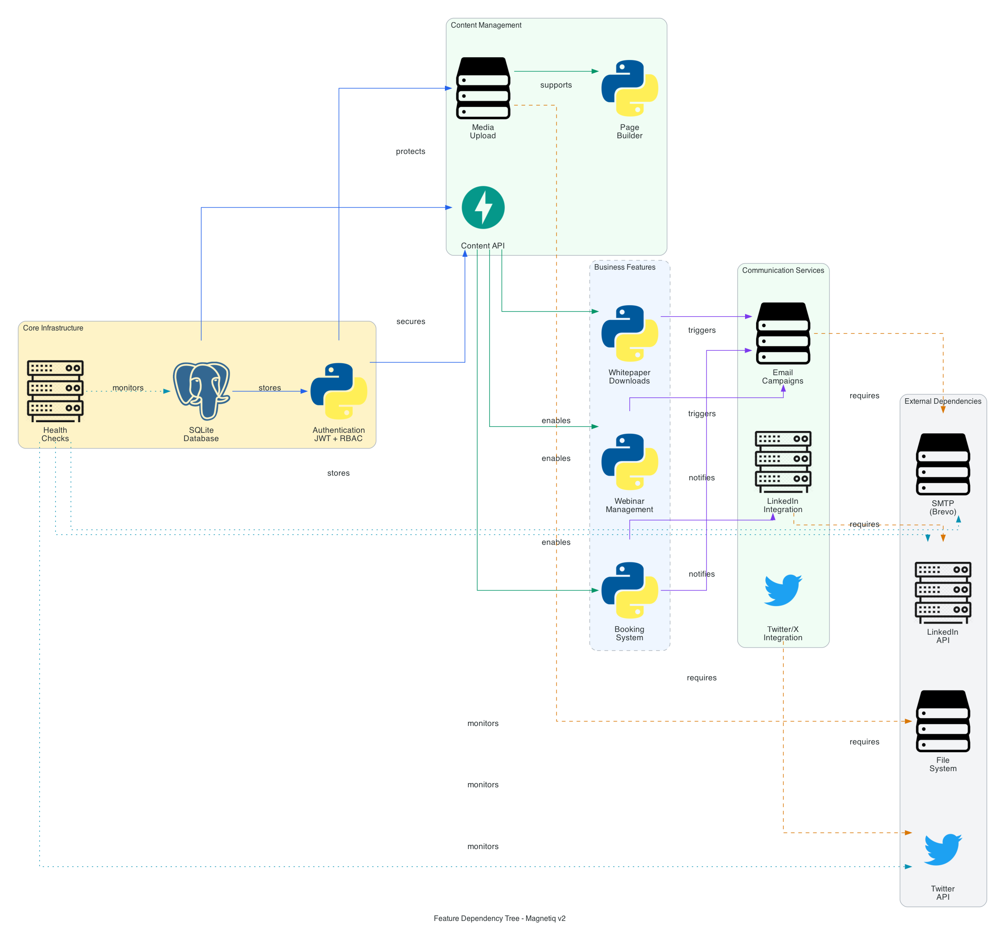
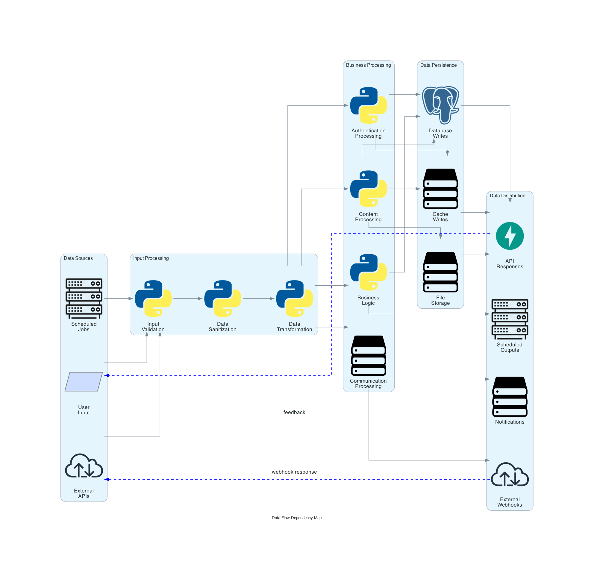

# Magnetiq v2 - System Architecture Specification

## Executive Summary

Magnetiq v2 is a streamlined Content Management System (CMS) with integrated business automation features including webinars, whitepapers, and consultation booking. This specification defines a simple, maintainable, and production-ready 3-tier architecture optimized for rapid development and deployment.

## Technology Stack

### Backend
- **Language**: Python 3.11+
- **Framework**: FastAPI 0.104+ with async/await support (Port 3036)
- **ORM**: SQLAlchemy 2.0 with Alembic migrations
- **Database**: SQLite (all environments - development, testing, production) (see [Database Schema](./backend/database.md))
- **API Documentation**: OpenAPI 3.0 with auto-generated Swagger UI (see [Backend API Specification](./backend/api.md))
- **Validation**: Pydantic v2 for request/response validation
- **Authentication**: JWT with RS256 algorithm and refresh tokens

### Frontend
- **Framework**: React 18 with TypeScript 5.0+
- **State Management**: Redux Toolkit with RTK Query for API state
- **UI Framework**: Tailwind CSS 3.0+ with Headless UI components
- **Build Tool**: Vite 5.0+ for fast development and builds
- **Testing**: Vitest + React Testing Library + Playwright (E2E) (see [Testing Strategy](./testing_strategy.md))
- **Form Handling**: React Hook Form with Zod validation
- **Routing**: React Router v6 with nested routing
- **Internationalization**: React i18next for multilingual support (see [Multilingual Support](./frontend/multilingual.md))
- **Port Configuration**: Single port (8036) with routing for public/admin

### Infrastructure
- **Containerization**: Docker with multi-stage builds and Docker Compose
- **Web Server**: Nginx with HTTP/2, compression, and caching
- **Process Manager**: Gunicorn with Uvicorn async workers
- **File Storage**: Local filesystem with backup capabilities
- **Security**: Let's Encrypt SSL, security headers, rate limiting (see [Security Specification](./security.md))

## System Architecture

### Feature Dependency Architecture


The system implements a clear dependency hierarchy from core infrastructure (auth, database, health checks) through content management to business features and external integrations.

### Simple 3-Tier Architecture

```
┌─────────────────────────────────────────────────────────────┐
│                    Nginx Web Server                         │
│           SSL Termination & Static File Serving             │
└────────────┬──────────────────────────────┬─────────────────┘
             │                              │
             ▼                              ▼
┌─────────────────────────┐    ┌──────────────────────────┐
│   Public Frontend       │    │    Admin Panel           │
│   (React SPA)          │    │   (React Admin)          │
│   Port: 8036           │    │   Same Port/Routing      │
└───────────┬─────────────┘    └───────────┬──────────────┘
            │                               │
            └───────────┬───────────────────┘
                        │
                        ▼
            ┌───────────────────────────┐
            │     FastAPI Backend       │
            │   (Monolithic API)        │
            │      Port: 3036          │
            └───────────┬───────────────┘
                        │
                        ▼
            ┌───────────────────────────┐
            │      SQLite Database      │
            │    (Single File DB)       │
            │   With Write-Ahead Log    │
            └───────────────────────────┘
```

### Data Flow Dependencies


Data flows through validation, transformation, business processing, and persistence layers with proper distribution to API responses, notifications, and external webhooks.

## Service Architecture

### 1. Authentication & Authorization Service
See [Security Specification](./security.md) for detailed implementation.
- **JWT Authentication**: RS256 tokens with 15-minute access and 7-day refresh tokens
- **Role-Based Access Control**: Simple hierarchical permissions (Admin > Editor > Viewer)
- **Session Management**: Database-backed session store
- **Security Features**: Password reset, account lockout, basic audit logging
- **API Security**: Rate limiting, CORS, input validation, SQL injection prevention

### 2. Content Management Service
See [Frontend Public Specification](./frontend/public/public.md) and [Admin Panel Specification](./frontend/adminpanel/admin.md) for UI details.
- **Page Builder**: Simple component-based page construction
- **Multilingual Support**: JSONB-based content storage for EN/DE localization
- **Media Library**: File management with basic optimization
- **Version Control**: Simple content versioning with rollback capabilities
- **SEO Optimization**: Meta tags, basic structured data, sitemap generation (see [Sitemap Specification](./frontend/public/sitemap.md))
- **Publishing Workflow**: Draft/published states with simple approval

### 3. Business Operations Service
- **Webinar Management**: Topic creation, session scheduling, registration handling (see [Webinars Feature](./frontend/public/features/webinars.md))
- **Whitepapers**: Whitepaper distribution with basic lead capture (see [Whitepapers Feature](./frontend/public/features/whitepapers.md))
- **Booking System**: Simple consultation scheduling (see [Booking Feature](./frontend/public/features/book-a-meeting.md))
- **Basic Analytics**: Simple metrics on engagement and conversions

### 4. Communication Services
See [Communication Services Specification](./frontend/public/features/communication.md) for detailed implementation.
- **Email Marketing**: Transactional and marketing email campaigns via SMTP
- **LinkedIn Integration**: Professional content publishing, company page management, engagement analytics
- **Twitter/X Integration**: Tweet publishing, thread management, multimedia content support
- **Platform-Specific Content**: Tailored content formats, media optimization per platform
- **Cross-Platform Analytics**: Unified engagement metrics and campaign performance
- **Content Automation**: Scheduled publishing, content templates, AI-powered generation

## API Design Principles

For complete API documentation, see [Backend API Specification](./backend/api.md).

### RESTful Standards
- **Resource-based URLs**: `/api/v1/resources/{id}` with integer identifiers
- **HTTP Methods**: GET (read), POST (create), PUT (replace), PATCH (update), DELETE (soft delete)
- **Status Codes**: Standard HTTP status codes with consistent error responses
- **Content Negotiation**: JSON primary, with support for file downloads

### API Structure
- **Versioning**: URL path versioning `/api/v1/`
- **Documentation**: Auto-generated OpenAPI 3.0 specs
- **Pagination**: Offset-based pagination for simplicity
- **Filtering**: Query parameter-based filtering

### Response Format
```json
{
  "success": true,
  "data": {},
  "message": "Operation successful",
  "pagination": {
    "page": 1,
    "per_page": 20,
    "total": 100
  }
}
```

### Error Format
```json
{
  "success": false,
  "error": {
    "code": "VALIDATION_ERROR",
    "message": "Invalid input data",
    "details": [{
      "field": "email",
      "message": "Invalid email format"
    }]
  }
}
```

## Database Architecture

For complete database schema and table definitions, see [Database Schema Specification](./backend/database.md).

### SQLite Design
- **Single File Database**: Simplified deployment and backup
- **Write-Ahead Logging**: Improved concurrent read performance
- **Data Integrity**: Foreign key constraints, check constraints
- **Audit Trail**: Soft deletes with basic audit logging
- **Temporal Data**: created_at, updated_at timestamps
- **Full-text Search**: SQLite FTS5 for content search
- **Multilingual**: JSON fields for language-specific content (see [Multilingual Support](./frontend/multilingual.md))

### Performance Optimization
- **Connection Management**: Connection pooling with SQLAlchemy
- **Indexing Strategy**: Basic indexes for common query patterns
- **Query Optimization**: Eager loading and N+1 prevention
- **File Size Management**: Regular VACUUM operations for optimization

### Backup & Maintenance
- **File-based Backups**: Simple file copy backups
- **Point-in-time Recovery**: WAL file retention
- **Database Maintenance**: Scheduled VACUUM and ANALYZE operations

## Security Architecture

For comprehensive security implementation details, see [Security Specification](./security.md).

### Authentication & Authorization
- **JWT Implementation**: RS256 algorithm with RSA key pair
- **Token Lifecycle**: 15-minute access tokens, 7-day refresh tokens
- **Role-Based Access Control**: Simple permissions with resource-level granularity
- **Session Security**: Basic session management with logout capabilities

### Data Protection
- **Password Security**: bcrypt hashing with configurable rounds
- **Input Validation**: Pydantic validation for all inputs
- **SQL Injection Prevention**: Parameterized queries via SQLAlchemy
- **File Upload Security**: Type validation and size limits

### Application Security
- **Security Headers**: Basic CSP, HSTS, X-Frame-Options
- **CORS Policy**: Configured origin whitelisting
- **Rate Limiting**: Basic rate limiting per endpoint
- **HTTPS**: SSL/TLS encryption in production

## Performance Requirements

### Response Time Targets
- **API Endpoints**: < 300ms (p95), < 150ms (p50)
- **Page Load Time**: < 3 seconds (First Contentful Paint)
- **Database Queries**: < 200ms (p95)
- **File Operations**: Progressive upload with feedback

### Scalability Considerations & Limitations

#### SQLite Performance Characteristics
- **Concurrent Reads**: Excellent performance (unlimited concurrent readers)
- **Concurrent Writes**: **Limited** - SQLite serializes all write operations
- **Recommended Limits**: 
  - Maximum concurrent users: **100 active sessions**
  - Write operations rate: **<50 writes/second system-wide**
  - Database file size: **<100GB** for optimal performance
  - Login attempts: **<10 attempts/second** (security operations)

#### Performance Trade-offs
- **Response Time**: May increase under high concurrent write load
- **Brief Delays**: Possible during database maintenance operations (VACUUM, etc.)
- **Write Bottlenecks**: Login storms, bulk data imports may cause temporary slowdowns

#### Scaling Solutions
- **Vertical Scaling**: CPU and storage optimization (recommended approach)
- **Read Replicas**: File-based backups for read-only operations
- **Caching**: Basic in-memory caching for frequently accessed data
- **Static Assets**: Nginx caching and compression
- **Database Optimization**: Regular VACUUM, WAL mode, proper indexing

#### When to Consider Migration
Consider migrating to PostgreSQL (v3) when:
- Sustained >100 concurrent users
- >100 write operations/second required
- Multi-server deployment needed
- Complex reporting queries affecting performance

## Development Standards

### Project Structure
```
magnetiq2/
├── backend/
│   ├── app/
│   │   ├── main.py           # FastAPI application entry
│   │   ├── config.py         # Configuration management
│   │   ├── database.py       # Database setup
│   │   ├── api/
│   │   │   └── v1/           # API version 1
│   │   │       ├── auth/     # Authentication endpoints
│   │   │       ├── content/  # Content management
│   │   │       ├── business/ # Business operations
│   │   │       └── admin/    # Admin panel APIs
│   │   ├── models/           # SQLAlchemy ORM models
│   │   ├── schemas/          # Pydantic models
│   │   ├── services/         # Business logic services
│   │   └── utils/            # Shared utilities
│   ├── migrations/           # Alembic database migrations
│   └── tests/               # Test suites
├── frontend/
│   ├── public/              # Static assets
│   ├── src/
│   │   ├── components/      # Reusable UI components
│   │   ├── features/        # Feature-based modules
│   │   ├── hooks/           # Custom React hooks
│   │   ├── services/        # API service layer
│   │   ├── store/           # Redux store configuration
│   │   └── utils/           # Utility functions
│   └── tests/               # Frontend tests
└── docs/
    └── spec_v2/             # System specifications
        ├── architecture.md      # System architecture (this document)
        ├── deployment.md        # Deployment procedures
        ├── security.md          # Security policies and implementation
        ├── testing_strategy.md  # Testing approach and procedures
        ├── backend/
        │   ├── api.md           # API endpoints and documentation
        │   └── database.md      # Database tables and relationships
        └── frontend/
            ├── multilingual.md  # Internationalization support
            ├── public/
            │   ├── public.md    # Public frontend specification
            │   ├── sitemap.md   # SEO and navigation structure
            │   ├── integrations.md # External service integrations
            │   └── features/
            │       ├── book-a-meeting.md      # Booking system specification
            │       ├── communication.md # Communication services
            │       ├── webinars.md     # Webinar management
            │       └── whitepapers.md  # Whitepaper distribution
            └── adminpanel/
                └── admin.md     # Admin panel specification
```

### Naming Conventions
- Python files: snake_case.py
- TypeScript files: PascalCase.tsx, camelCase.ts
- Database tables: snake_case
- API endpoints: kebab-case
- Environment variables: UPPER_SNAKE_CASE

## External Integrations

For detailed integration patterns and implementation, see [Integrations Specification](./integrations/integrations.md).

### Simple HTTP Client Integrations
- **Email Service**: SMTP client for transactional emails
- **Payment Processing**: Direct HTTP API calls to payment providers
- **Calendar Integration**: Basic OAuth 2.0 flow for calendar access
- **Analytics**: Simple event tracking via HTTP requests

### Integration Patterns
- **HTTP Client**: Basic async HTTP client with timeout handling
- **Retry Logic**: Simple exponential backoff for failed requests
- **Error Handling**: Graceful degradation when services unavailable
- **Configuration**: Environment-based service configuration

## Deployment Architecture

For detailed deployment procedures and configurations, see [Deployment Specification](./deployment.md).

### Environment Strategy
- **Development**: Local SQLite with Docker Compose
- **Production**: Single-server deployment with SQLite
- **Staging**: Replica of production environment

### Docker Configuration
- **Multi-stage builds**: Optimized production images
- **Volume mounts**: Database file and media storage
- **Environment variables**: Configuration management
- **Health checks**: Basic service health monitoring

### Monitoring & Logging
- **Application Logs**: Structured JSON logging
- **Access Logs**: Nginx access and error logs
- **Health Checks**: Basic endpoint monitoring
- **File System**: Database file size and growth monitoring

## Migration Path to v3

### v3 Evolution (Future)
For enterprises requiring advanced integration capabilities, Magnetiq v3 will provide:
- **Lightweight ESB**: PostgreSQL + Redis + basic message queuing
- **Enhanced Integrations**: More sophisticated external service connections
- **Advanced Analytics**: Improved reporting and metrics
- **Scalability**: Multi-server deployment capabilities

See [Magnetiq v3 Integration Specification](../spec_v3/integration.md) for advanced integration patterns.

v2 is forward compatible with v3. 
v3's main feature will be to introduce ESB.

### Upgrade Considerations
- **Database Migration**: SQLite → PostgreSQL migration tools
- **Feature Compatibility**: API compatibility maintained during upgrade
- **Data Export/Import**: Simple data migration utilities
- **Configuration Changes**: Environment variable updates for v3 features

## Conclusion

Magnetiq v2 provides a solid, simplified foundation focusing on core CMS and business automation features. The architecture prioritizes simplicity, maintainability, and rapid deployment while providing a clear evolution path to more advanced integration capabilities in v3.
