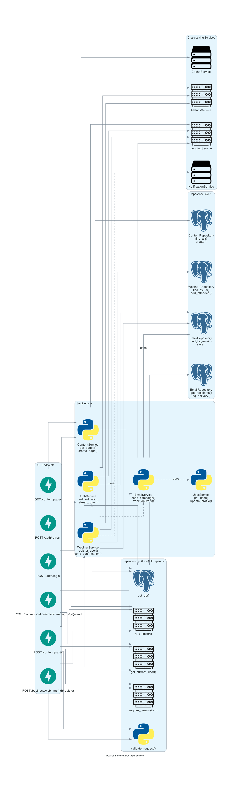
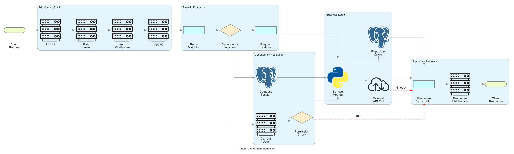
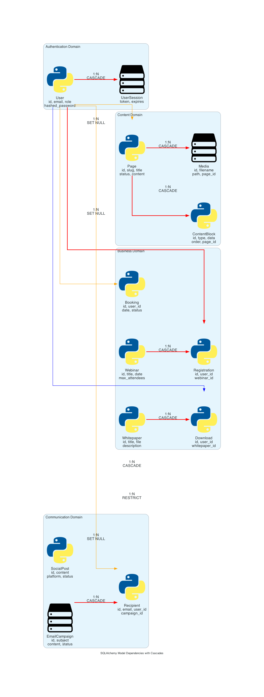

# Magnetiq v2 - Backend API Specification

## Overview

The Magnetiq v2 backend is a streamlined, production-ready API built with Python and FastAPI. It provides secure, RESTful endpoints for all system functionality including authentication, content management, communications and business operations using a simple SQLite database.

## Technical Foundation

### Technology Stack
- **Framework**: FastAPI 0.104+ with async/await
- **Python Version**: 3.11+
- **ASGI Server**: Uvicorn with Gunicorn workers
- **ORM**: SQLAlchemy 2.0 with async support
- **Database**: SQLite (all environments)
- **Content Format**: PortableText for structured content
- **Validation**: Pydantic v2 with JSON Schema + PortableText validation
- **Authentication**: JWT with RS256 algorithm
- **Documentation**: Auto-generated OpenAPI 3.0

### Port Configuration
- **Development**: Port 3036 (unified backend port)
- **Production**: Port 3036 (behind Nginx reverse proxy)
- **Health Checks**: Dedicated endpoints with basic dependency monitoring
- **API Documentation**: Swagger UI available at `/docs`

### Project Structure
```
backend/
├── app/
│   ├── main.py              # FastAPI application entry
│   ├── config.py            # Configuration management  
│   ├── database.py          # SQLite database setup and connection
│   ├── dependencies.py      # Dependency injection
│   ├── exceptions.py        # Custom exception handlers
│   ├── middleware.py        # Custom middleware
│   ├── api/                 # API routes (all under /api/)
│   │   ├── v1/
│   │   │   ├── auth/        # Authentication endpoints
│   │   │   ├── content/     # Content management
│   │   │   ├── business/    # Business features
│   │   │   ├── communication/ # Communication services
│   │   │   │   ├── email/   # Email marketing
│   │   │   │   ├── linkedin/# LinkedIn integration
│   │   │   │   └── twitter/ # Twitter/X integration
│   │   │   ├── admin/       # Admin panel APIs
│   │   │   └── public/      # Public-facing APIs
│   ├── core/                # Core functionality
│   │   ├── auth.py          # Authentication logic
│   │   ├── permissions.py   # RBAC implementation
│   │   ├── security.py      # Security utilities
│   │   └── logging.py       # Logging configuration
│   ├── models/              # SQLAlchemy models
│   ├── schemas/             # Pydantic request/response models
│   ├── services/            # Business logic services
│   └── utils/               # Shared utilities
├── migrations/              # Alembic database migrations
├── tests/                   # Test suites
├── requirements.txt         # Python dependencies
└── alembic.ini             # Database migration configuration
```

## Database Configuration

### SQLite Setup
```python
# database.py
from sqlalchemy.ext.asyncio import create_async_engine, AsyncSession
from sqlalchemy.orm import sessionmaker, declarative_base

# SQLite with WAL mode for better concurrency
DATABASE_URL = "sqlite+aiosqlite:///./magnetiq.db"

engine = create_async_engine(
    DATABASE_URL,
    echo=False,  # Set to True for SQL logging in development
    connect_args={
        "check_same_thread": False,
        "timeout": 30,
    }
)

SessionLocal = sessionmaker(
    autocommit=False,
    autoflush=False,
    bind=engine,
    class_=AsyncSession
)

Base = declarative_base()

# Enable WAL mode for better concurrent performance
async def enable_wal_mode():
    async with engine.begin() as conn:
        await conn.execute(text("PRAGMA journal_mode=WAL;"))
        await conn.execute(text("PRAGMA foreign_keys=ON;"))
        await conn.execute(text("PRAGMA synchronous=NORMAL;"))
```

### Database Management
- **Migrations**: Alembic for schema version control
- **Connections**: Connection pooling via SQLAlchemy
- **Transactions**: Async transaction support
- **Backup**: Simple file-based backup strategy
- **Maintenance**: Regular VACUUM operations for optimization

## API Architecture

### Service Dependency Map


The service layer implements a clean dependency injection pattern using FastAPI's `Depends()` system, with clear separation between API endpoints, service logic, repository patterns, and cross-cutting concerns.

### Request Lifecycle


Each request flows through middleware, dependency injection, business logic, and response processing with proper error handling at each stage.

### Base URL Structure
- **Development**: `http://localhost:3036/api/v1/`
- **Production**: `https://api.voltAIc.systems/api/v1/`

### Admin Authentication Endpoints
```
POST   /api/v1/admin/auth/login     # Admin login
POST   /api/v1/admin/auth/refresh   # Admin token refresh
POST   /api/v1/admin/auth/logout    # Admin logout
GET    /api/v1/admin/auth/me        # Get current admin profile
POST   /api/v1/admin/auth/change-password # Admin password change
```

**Note**: The public frontend operates without authentication. All authentication endpoints are for admin panel access only. For detailed admin authentication specifications, see: `/frontend/adminpanel/authentication.md`

### Content Management Endpoints
```
GET    /api/v1/content/pages        # List pages
POST   /api/v1/content/pages        # Create page (with PortableText)
GET    /api/v1/content/pages/{id}   # Get page details
PUT    /api/v1/content/pages/{id}   # Update page (with PortableText)
DELETE /api/v1/content/pages/{id}   # Delete page (soft delete)

# PortableText Serialization
GET    /api/v1/content/pages/{id}/html        # Get page as HTML
GET    /api/v1/content/pages/{id}/markdown    # Get page as Markdown
GET    /api/v1/content/pages/{id}/plain-text  # Get page as plain text

GET    /api/v1/content/media        # List media files
POST   /api/v1/content/media        # Upload media
DELETE /api/v1/content/media/{id}   # Delete media file

# PortableText Assets
GET    /api/v1/content/portable-assets       # List PortableText-referenced assets
POST   /api/v1/content/portable-assets       # Upload assets for PortableText blocks
```

### Business Operations Endpoints
```
# Webinars
GET    /api/v1/business/webinars              # List webinars
POST   /api/v1/business/webinars              # Create webinar (with PortableText)
GET    /api/v1/business/webinars/{id}         # Get webinar details
POST   /api/v1/business/webinars/{id}/register # Register for webinar
GET    /api/v1/business/webinars/{id}/description-html # Get description as HTML

# Whitepapers - Public API
GET    /api/v1/public/whitepapers                    # List published whitepapers with filtering
GET    /api/v1/public/whitepapers/{id}               # Get whitepaper details and landing page
GET    /api/v1/public/whitepapers/{slug}             # Get whitepaper by slug
POST   /api/v1/public/whitepapers/{id}/download      # Lead capture and download token generation
GET    /api/v1/public/whitepapers/download/{token}   # Secure file download with token
GET    /api/v1/public/whitepapers/categories         # List whitepaper categories
GET    /api/v1/public/whitepapers/tags               # List available tags
GET    /api/v1/public/whitepapers/search             # Full-text search whitepapers
GET    /api/v1/public/whitepapers/featured           # Featured whitepapers
GET    /api/v1/public/whitepapers/recent             # Recently published whitepapers
GET    /api/v1/public/whitepapers/analytics/{id}     # Public analytics (view/download counts)

# Whitepapers - Admin API
GET    /api/v1/admin/whitepapers                     # List all whitepapers with management info
POST   /api/v1/admin/whitepapers                     # Create new whitepaper
GET    /api/v1/admin/whitepapers/{id}                # Get whitepaper with admin details
PUT    /api/v1/admin/whitepapers/{id}                # Update whitepaper
DELETE /api/v1/admin/whitepapers/{id}                # Delete whitepaper
PUT    /api/v1/admin/whitepapers/{id}/activate       # Activate whitepaper
PUT    /api/v1/admin/whitepapers/{id}/deactivate     # Deactivate whitepaper
POST   /api/v1/admin/whitepapers/{id}/generate-pdf   # Generate PDF from content
PUT    /api/v1/admin/whitepapers/{id}/content        # Update content using markdown editor
GET    /api/v1/admin/whitepapers/{id}/analytics      # Detailed analytics for whitepaper
GET    /api/v1/admin/whitepapers/{id}/leads          # Leads generated by this whitepaper
POST   /api/v1/admin/whitepapers/bulk-action         # Bulk activate/deactivate/delete

# Lead Management API
GET    /api/v1/admin/leads                           # List captured leads with filtering
GET    /api/v1/admin/leads/{id}                      # Get lead details
PUT    /api/v1/admin/leads/{id}/score                # Update lead score
PUT    /api/v1/admin/leads/{id}/qualify              # Mark lead as qualified
POST   /api/v1/admin/leads/bulk-export               # Bulk export to Odoo CRM
POST   /api/v1/admin/leads/{id}/export-odoo          # Export individual lead to Odoo
GET    /api/v1/admin/leads/{id}/download-history     # Lead's download history
DELETE /api/v1/admin/leads/{id}                      # Delete lead (GDPR compliance)

# Email Submission Processing
POST   /api/v1/admin/whitepapers/email-submission    # Process email submissions from authors
GET    /api/v1/admin/whitepapers/email-queue         # List pending email submissions
POST   /api/v1/admin/whitepapers/email-queue/{id}/process  # Process specific email submission
POST   /api/v1/admin/whitepapers/email-queue/{id}/approve  # Approve and publish from email
DELETE /api/v1/admin/whitepapers/email-queue/{id}         # Reject email submission

# Bookings (existing endpoints)
GET    /api/v1/business/bookings              # List bookings
POST   /api/v1/business/bookings              # Create booking (with PortableText messages)
GET    /api/v1/business/bookings/{id}         # Get booking details
PUT    /api/v1/business/bookings/{id}         # Update booking status
GET    /api/v1/business/bookings/{id}/message-html # Get message as HTML
```

### Communication Services Endpoints

#### Email Marketing
```
GET    /api/v1/communication/email/campaigns           # List email campaigns
POST   /api/v1/communication/email/campaigns           # Create email campaign  
GET    /api/v1/communication/email/campaigns/{id}      # Get campaign details
PUT    /api/v1/communication/email/campaigns/{id}      # Update campaign
DELETE /api/v1/communication/email/campaigns/{id}      # Delete campaign
POST   /api/v1/communication/email/campaigns/{id}/send # Send campaign

GET    /api/v1/communication/email/templates           # List email templates
POST   /api/v1/communication/email/templates           # Create email template (with PortableText)
GET    /api/v1/communication/email/templates/{id}      # Get template
PUT    /api/v1/communication/email/templates/{id}      # Update template (with PortableText)
DELETE /api/v1/communication/email/templates/{id}      # Delete template
GET    /api/v1/communication/email/templates/{id}/html # Render template as HTML
POST   /api/v1/communication/email/templates/{id}/preview # Preview template with data
```

#### LinkedIn Integration
```
GET    /api/v1/communication/linkedin/accounts         # List connected LinkedIn accounts
POST   /api/v1/communication/linkedin/accounts         # Connect LinkedIn account
DELETE /api/v1/communication/linkedin/accounts/{id}    # Disconnect account

GET    /api/v1/communication/linkedin/content          # List LinkedIn posts
POST   /api/v1/communication/linkedin/content          # Create LinkedIn post (with PortableText)
GET    /api/v1/communication/linkedin/content/{id}     # Get post details
PUT    /api/v1/communication/linkedin/content/{id}     # Update scheduled post (with PortableText)
DELETE /api/v1/communication/linkedin/content/{id}     # Delete/cancel post
POST   /api/v1/communication/linkedin/content/{id}/publish # Publish post immediately
GET    /api/v1/communication/linkedin/content/{id}/formatted # Get formatted content for LinkedIn

POST   /api/v1/communication/linkedin/media            # Upload LinkedIn media
GET    /api/v1/communication/linkedin/engagement       # Get engagement analytics
GET    /api/v1/communication/linkedin/engagement/{post_id} # Get post-specific analytics
```

#### Twitter/X Integration
```
GET    /api/v1/communication/twitter/accounts          # List connected Twitter accounts  
POST   /api/v1/communication/twitter/accounts          # Connect Twitter account
DELETE /api/v1/communication/twitter/accounts/{id}     # Disconnect account

GET    /api/v1/communication/twitter/content           # List tweets/threads
POST   /api/v1/communication/twitter/content           # Create tweet/thread (with PortableText)
GET    /api/v1/communication/twitter/content/{id}      # Get tweet details
PUT    /api/v1/communication/twitter/content/{id}      # Update scheduled tweet (with PortableText)
DELETE /api/v1/communication/twitter/content/{id}      # Delete/cancel tweet
POST   /api/v1/communication/twitter/content/{id}/publish # Publish tweet immediately
GET    /api/v1/communication/twitter/content/{id}/formatted # Get formatted content for Twitter

POST   /api/v1/communication/twitter/media             # Upload Twitter media
GET    /api/v1/communication/twitter/engagement        # Get engagement analytics
GET    /api/v1/communication/twitter/engagement/{tweet_id} # Get tweet-specific analytics
```

### Admin Panel Endpoints
```
GET    /api/v1/admin/users          # List admin users
POST   /api/v1/admin/users          # Create admin user
PUT    /api/v1/admin/users/{id}     # Update user
DELETE /api/v1/admin/users/{id}     # Deactivate user

GET    /api/v1/admin/analytics      # Basic analytics data
GET    /api/v1/admin/system-health  # System status
```

### Consultant Management Endpoints

#### Admin Consultant Management
```
GET    /api/v1/admin/consultants                     # List all consultant profiles
POST   /api/v1/admin/consultants                     # Create new consultant profile
GET    /api/v1/admin/consultants/{id}                # Get consultant details
PUT    /api/v1/admin/consultants/{id}                # Update consultant profile
DELETE /api/v1/admin/consultants/{id}                # Deactivate consultant (soft delete)
PUT    /api/v1/admin/consultants/{id}/status         # Update consultant status
GET    /api/v1/admin/consultants/{id}/statistics     # Get consultant performance stats

# LinkedIn Integration via Scoopp
POST   /api/v1/admin/consultants/{id}/linkedin-scraping    # Start LinkedIn profile scraping
GET    /api/v1/admin/consultants/{id}/linkedin-profile     # Get scraped LinkedIn data
PUT    /api/v1/admin/consultants/{id}/linkedin-sync        # Sync updates from LinkedIn

# Payment & KYC Management
POST   /api/v1/admin/consultants/{id}/payment-setup        # Setup payment account
GET    /api/v1/admin/consultants/{id}/payment-status       # Get payment setup status
PUT    /api/v1/admin/consultants/{id}/kyc-verification     # Update KYC verification status
GET    /api/v1/admin/consultants/{id}/payouts              # List consultant payouts
POST   /api/v1/admin/consultants/{id}/payouts              # Create manual payout
GET    /api/v1/admin/consultants/{id}/earnings             # Get earnings summary

# Scraping Job Management
GET    /api/v1/admin/consultants/scraping-jobs             # List all scraping jobs
GET    /api/v1/admin/consultants/scraping-jobs/{job_id}    # Get job status
POST   /api/v1/admin/consultants/scraping-jobs/{job_id}/retry  # Retry failed job
DELETE /api/v1/admin/consultants/scraping-jobs/{job_id}     # Cancel job
```

#### Public Consultant APIs
```
GET    /api/v1/public/consultants                    # List public consultant profiles
GET    /api/v1/public/consultants/{id}               # Individual consultant profile
GET    /api/v1/public/consultants/{id}/whitepapers   # Consultant's published whitepapers
GET    /api/v1/public/consultants/{id}/webinars      # Consultant's upcoming/past webinars
GET    /api/v1/public/consultants/{id}/testimonials  # Consultant testimonials/reviews
GET    /api/v1/public/consultants/{id}/availability  # Check consultant availability

# Search & Discovery
GET    /api/v1/public/consultants/search             # Search consultants by expertise
GET    /api/v1/public/consultants/categories         # List consultant categories
GET    /api/v1/public/consultants/featured           # Featured consultants
GET    /api/v1/public/consultants/by-expertise/{expertise}  # Filter by expertise

# 30-for-30 Booking
POST   /api/v1/public/consultants/{id}/book-30for30  # Book 30-minute consultation
GET    /api/v1/public/consultants/{id}/time-slots    # Available time slots
POST   /api/v1/public/consultants/{id}/calendar-sync # Sync with consultant calendar
```

### Payment & Booking Management

#### Payment Processing
```
POST   /api/v1/public/payment/process                # Process consultation payment
POST   /api/v1/public/payment/validate               # Validate payment details
GET    /api/v1/public/payment/methods                # Available payment methods
POST   /api/v1/public/payment/setup-intent          # Create Stripe setup intent
POST   /api/v1/public/payment/confirm                # Confirm payment intent

# Webhook Handling
POST   /api/v1/public/payment/webhooks/stripe        # Stripe webhook handler
POST   /api/v1/public/payment/webhooks/paypal        # PayPal webhook handler
POST   /api/v1/public/payment/webhooks/brevo         # Brevo payment notifications

# Booking Management
GET    /api/v1/public/bookings/{booking_id}          # Get booking details
PUT    /api/v1/public/bookings/{booking_id}/reschedule  # Reschedule booking
DELETE /api/v1/public/bookings/{booking_id}/cancel   # Cancel booking
POST   /api/v1/public/bookings/{booking_id}/confirm  # Confirm booking attendance
```

#### Admin Payment Management
```
GET    /api/v1/admin/payments/transactions           # List all transactions
GET    /api/v1/admin/payments/transactions/{id}      # Get transaction details
PUT    /api/v1/admin/payments/transactions/{id}/status  # Update transaction status
GET    /api/v1/admin/payments/disputes               # List payment disputes
POST   /api/v1/admin/payments/disputes/{id}/resolve  # Resolve payment dispute
GET    /api/v1/admin/payments/refunds                # List refund requests
POST   /api/v1/admin/payments/refunds                # Process refund

# Financial Reporting
GET    /api/v1/admin/payments/reports/daily          # Daily financial reports
GET    /api/v1/admin/payments/reports/monthly        # Monthly financial reports
GET    /api/v1/admin/payments/reconciliation         # Payment reconciliation data
GET    /api/v1/admin/payments/tax-reports            # Tax reporting data
```

### Coupon Management

#### Public Coupon Validation
```
POST   /api/v1/public/coupons/validate               # Validate coupon code for booking
POST   /api/v1/public/coupons/apply                  # Apply coupon to booking (creates coupon_usage record)
GET    /api/v1/public/coupons/{code}/info           # Get public coupon information (if valid)
```

**Request/Response Examples:**

```typescript
// POST /api/v1/public/coupons/validate
interface CouponValidationRequest {
  coupon_code: string;
  user_email: string;
  service_type: 'book_a_meeting' | '30_for_30';
  consultant_id?: number;
  original_amount_usd: number;
}

interface CouponValidationResponse {
  valid: boolean;
  coupon?: {
    code: string;
    discount_type: 'percentage' | 'fixed_amount' | 'free_session';
    discount_value: number;
    discount_amount_usd: number;
    final_amount_usd: number;
    description?: string;
  };
  errors?: string[];
  user_eligibility: {
    is_first_time_user: boolean;
    previous_coupon_usage: number;
    eligible: boolean;
  };
}

// POST /api/v1/public/coupons/apply
interface CouponApplicationRequest {
  coupon_code: string;
  user_email: string;
  consultant_booking_id: number;
  user_session_id?: string;
  referrer_url?: string;
  utm_source?: string;
  utm_medium?: string;
  utm_campaign?: string;
}

interface CouponApplicationResponse {
  success: boolean;
  coupon_usage_id?: number;
  discount_applied_usd: number;
  final_amount_usd: number;
  message: string;
  errors?: string[];
}
```

#### Admin Coupon Management
```
GET    /api/v1/admin/coupons                         # List all coupons with filtering
POST   /api/v1/admin/coupons                         # Create new coupon
GET    /api/v1/admin/coupons/{id}                    # Get coupon details
PUT    /api/v1/admin/coupons/{id}                    # Update coupon
DELETE /api/v1/admin/coupons/{id}                    # Soft delete coupon
POST   /api/v1/admin/coupons/{id}/activate           # Activate coupon
POST   /api/v1/admin/coupons/{id}/deactivate         # Deactivate coupon
POST   /api/v1/admin/coupons/bulk                    # Bulk create coupons

# Coupon Usage Analytics
GET    /api/v1/admin/coupons/{id}/usage              # Coupon usage history
GET    /api/v1/admin/coupons/{id}/analytics          # Detailed coupon performance
GET    /api/v1/admin/coupons/analytics/summary       # System-wide coupon analytics
GET    /api/v1/admin/coupons/usage                   # All coupon usage records
GET    /api/v1/admin/coupons/fraud-detection         # Suspicious coupon usage

# Campaign Management
GET    /api/v1/admin/coupons/campaigns               # List coupon campaigns
POST   /api/v1/admin/coupons/campaigns               # Create coupon campaign
GET    /api/v1/admin/coupons/campaigns/{id}/performance # Campaign performance metrics
```

**Admin Request/Response Examples:**

```typescript
// POST /api/v1/admin/coupons
interface CreateCouponRequest {
  code: string; // Must be unique and URL-safe
  internal_name: string;
  description?: {
    en: string;
    de?: string;
  };
  discount_type: 'percentage' | 'fixed_amount' | 'free_session';
  discount_value: number;
  max_discount_amount?: number;
  minimum_order_value?: number;
  max_uses_total?: number;
  max_uses_per_user?: number;
  valid_from: string; // ISO datetime
  valid_until?: string; // ISO datetime
  applicable_to: 'all' | 'book_a_meeting' | '30_for_30' | 'specific_consultants' | 'first_time_users';
  consultant_restrictions?: number[]; // Array of consultant IDs
  service_type_restrictions?: string[]; // Array of session types
  campaign_source?: string;
  utm_source?: string;
  utm_medium?: string;
  utm_campaign?: string;
  notes?: string;
}

interface CouponResponse {
  id: number;
  code: string;
  internal_name: string;
  description?: object;
  discount_type: string;
  discount_value: number;
  max_discount_amount?: number;
  minimum_order_value: number;
  max_uses_total?: number;
  max_uses_per_user: number;
  current_usage_count: number;
  valid_from: string;
  valid_until?: string;
  is_active: boolean;
  applicable_to: string;
  consultant_restrictions?: number[];
  service_type_restrictions?: string[];
  campaign_source?: string;
  utm_source?: string;
  utm_medium?: string;
  utm_campaign?: string;
  generated_revenue_usd: number;
  conversion_rate: number;
  created_by: {
    id: number;
    email: string;
    name: string;
  };
  notes?: string;
  created_at: string;
  updated_at: string;
  deactivated_at?: string;
}

// GET /api/v1/admin/coupons/{id}/analytics
interface CouponAnalyticsResponse {
  coupon: CouponResponse;
  usage_statistics: {
    total_attempts: number;
    successful_uses: number;
    failed_attempts: number;
    success_rate_percent: number;
    unique_users: number;
    repeat_users: number;
  };
  financial_impact: {
    total_discounts_given: number;
    revenue_generated: number;
    average_discount_per_use: number;
    estimated_revenue_without_coupon: number;
  };
  conversion_metrics: {
    bookings_completed: number;
    sessions_attended: number;
    attendance_rate_percent: number;
    conversion_to_paid_customer: number;
  };
  usage_timeline: Array<{
    date: string;
    attempts: number;
    successful_uses: number;
    revenue_generated: number;
  }>;
  fraud_analysis: {
    suspicious_usage_count: number;
    flagged_users: string[];
    risk_score_average: number;
  };
}

// GET /api/v1/admin/coupons/analytics/summary
interface SystemCouponAnalytics {
  overview: {
    total_coupons: number;
    active_coupons: number;
    expired_coupons: number;
    total_usage_attempts: number;
    successful_redemptions: number;
    overall_success_rate: number;
  };
  financial_summary: {
    total_discounts_given: number;
    revenue_generated_from_coupons: number;
    average_discount_per_coupon: number;
    estimated_revenue_impact: number;
  };
  top_performing_coupons: Array<{
    coupon_code: string;
    usage_count: number;
    revenue_generated: number;
    success_rate: number;
  }>;
  recent_activity: Array<{
    date: string;
    coupon_attempts: number;
    successful_redemptions: number;
    new_coupons_created: number;
  }>;
  fraud_detection_summary: {
    flagged_attempts: number;
    blocked_users: number;
    risk_score_average: number;
  };
}
```

#### Coupon Security & Fraud Prevention
```
POST   /api/v1/admin/coupons/fraud/flag-user         # Flag user for suspicious activity
GET    /api/v1/admin/coupons/fraud/reports           # Generate fraud analysis reports
POST   /api/v1/admin/coupons/fraud/whitelist         # Whitelist user from fraud detection
DELETE /api/v1/admin/coupons/fraud/whitelist/{user_id} # Remove user from whitelist

# Rate Limiting & Security
GET    /api/v1/admin/coupons/security/rate-limits    # Current rate limiting status
POST   /api/v1/admin/coupons/security/reset-user     # Reset rate limits for user
GET    /api/v1/admin/coupons/security/blocked-ips    # List blocked IP addresses
POST   /api/v1/admin/coupons/security/block-ip       # Block IP address
DELETE /api/v1/admin/coupons/security/block-ip/{ip}  # Unblock IP address
```

### Analytics & Statistics

#### Consultant Analytics
```
GET    /api/v1/admin/consultants/{id}/analytics      # Individual consultant metrics
GET    /api/v1/admin/consultants/statistics          # System-wide consultant stats
GET    /api/v1/admin/consultants/performance         # Performance rankings
GET    /api/v1/admin/consultants/retention           # Consultant retention metrics
GET    /api/v1/admin/consultants/engagement          # Client engagement metrics

# Platform Analytics
GET    /api/v1/admin/analytics/bookings              # Booking statistics
GET    /api/v1/admin/analytics/revenue               # Revenue analytics
GET    /api/v1/admin/analytics/conversion            # Conversion funnel metrics
GET    /api/v1/admin/analytics/user-behavior         # User behavior analytics
```

## Authentication & Security

### JWT Implementation
```python
# auth.py
from jose import JWTError, jwt
from passlib.context import CryptContext
from datetime import datetime, timedelta

# RS256 algorithm for better security
PRIVATE_KEY_PATH = "/secrets/jwt_private_key.pem"  # RSA private key
PUBLIC_KEY_PATH = "/secrets/jwt_public_key.pem"   # RSA public key
ALGORITHM = "RS256"
ACCESS_TOKEN_EXPIRE_MINUTES = 15
REFRESH_TOKEN_EXPIRE_DAYS = 7

pwd_context = CryptContext(schemes=["bcrypt"], deprecated="auto")

def create_access_token(data: dict, expires_delta: timedelta = None):
    to_encode = data.copy()
    if expires_delta:
        expire = datetime.utcnow() + expires_delta
    else:
        expire = datetime.utcnow() + timedelta(minutes=ACCESS_TOKEN_EXPIRE_MINUTES)
    to_encode.update({"exp": expire, "type": "access"})
    encoded_jwt = jwt.encode(to_encode, SECRET_KEY, algorithm=ALGORITHM)
    return encoded_jwt

def create_refresh_token(data: dict):
    to_encode = data.copy()
    expire = datetime.utcnow() + timedelta(days=REFRESH_TOKEN_EXPIRE_DAYS)
    to_encode.update({"exp": expire, "type": "refresh"})
    encoded_jwt = jwt.encode(to_encode, SECRET_KEY, algorithm=ALGORITHM)
    return encoded_jwt
```

### Role-Based Access Control
```python
# permissions.py
from enum import Enum
from functools import wraps

class UserRole(Enum):
    ADMIN = "admin"
    EDITOR = "editor"
    VIEWER = "viewer"

class Permission(Enum):
    READ = "read"
    WRITE = "write"
    DELETE = "delete"
    ADMIN = "admin"

ROLE_PERMISSIONS = {
    UserRole.ADMIN: [Permission.READ, Permission.WRITE, Permission.DELETE, Permission.ADMIN],
    UserRole.EDITOR: [Permission.READ, Permission.WRITE],
    UserRole.VIEWER: [Permission.READ],
}

def require_permission(permission: Permission):
    def decorator(func):
        @wraps(func)
        async def wrapper(*args, **kwargs):
            current_user = kwargs.get('current_user')
            if not current_user:
                raise HTTPException(status_code=401, detail="Authentication required")
            
            user_permissions = ROLE_PERMISSIONS.get(current_user.role, [])
            if permission not in user_permissions:
                raise HTTPException(status_code=403, detail="Insufficient permissions")
            
            return await func(*args, **kwargs)
        return wrapper
    return decorator
```

## Data Models

### Model Relationships and Dependencies


The data models implement proper cascade behaviors (CASCADE, SET NULL, RESTRICT) to maintain referential integrity and prevent orphaned records.

### User Model
```python
# models/user.py
from sqlalchemy import Column, Integer, String, DateTime, Enum, Boolean
from sqlalchemy.sql import func
from app.database import Base
from app.core.permissions import UserRole

class User(Base):
    __tablename__ = "admin_users"

    id = Column(Integer, primary_key=True, index=True)
    email = Column(String(255), unique=True, index=True, nullable=False)
    hashed_password = Column(String(255), nullable=False)
    
    # Profile Information
    first_name = Column(String(100), nullable=False)
    last_name = Column(String(100), nullable=False)
    role = Column(Enum(UserRole), default=UserRole.VIEWER)
    
    # Status
    is_active = Column(Boolean, default=True)
    last_login = Column(DateTime(timezone=True))
    
    # Timestamps
    created_at = Column(DateTime(timezone=True), server_default=func.now())
    updated_at = Column(DateTime(timezone=True), onupdate=func.now())
    deleted_at = Column(DateTime(timezone=True), nullable=True)
```

### Content Model
```python
# models/content.py
from sqlalchemy import Column, Integer, String, Text, JSON, DateTime, Boolean
from sqlalchemy.sql import func
from app.database import Base

class Page(Base):
    __tablename__ = "pages"

    id = Column(Integer, primary_key=True, index=True)
    slug = Column(String(255), unique=True, index=True)
    
    # Multilingual PortableText content stored as JSON
    title = Column(JSON, nullable=False)  # {"en": "Title", "de": "Titel"}
    content = Column(JSON, nullable=False)  # PortableText JSON: {"en": [...blocks], "de": [...blocks]}
    excerpt = Column(JSON, nullable=True)  # PortableText JSON: {"en": [...blocks], "de": [...blocks]}
    meta_description = Column(JSON, nullable=True)
    
    # Status
    status = Column(String(20), default="draft")  # draft, published
    is_published = Column(Boolean, default=False)
    published_at = Column(DateTime(timezone=True), nullable=True)
    
    # SEO
    seo_title = Column(JSON, nullable=True)
    seo_keywords = Column(JSON, nullable=True)
    structured_data = Column(JSON, nullable=True)  # Auto-generated from PortableText
    
    # Timestamps
    created_at = Column(DateTime(timezone=True), server_default=func.now())
    updated_at = Column(DateTime(timezone=True), onupdate=func.now())
    deleted_at = Column(DateTime(timezone=True), nullable=True)
```

### Consultant Model
```python
# models/consultant.py
from sqlalchemy import Column, Integer, String, Text, JSON, DateTime, Boolean, Decimal, ForeignKey
from sqlalchemy.sql import func
from sqlalchemy.orm import relationship
from app.database import Base
from enum import Enum

class ConsultantStatus(Enum):
    PENDING = "pending"
    ACTIVE = "active"
    INACTIVE = "inactive"
    SUSPENDED = "suspended"
    REJECTED = "rejected"

class PaymentSetupStatus(Enum):
    NOT_STARTED = "not_started"
    IN_PROGRESS = "in_progress"
    PENDING_VERIFICATION = "pending_verification"
    COMPLETED = "completed"
    FAILED = "failed"

class KYCStatus(Enum):
    NOT_SUBMITTED = "not_submitted"
    SUBMITTED = "submitted"
    UNDER_REVIEW = "under_review"
    APPROVED = "approved"
    REJECTED = "rejected"
    REQUIRES_UPDATE = "requires_update"

class Consultant(Base):
    __tablename__ = "consultants"

    id = Column(Integer, primary_key=True, index=True)
    
    # Basic Profile Information
    first_name = Column(String(100), nullable=False)
    last_name = Column(String(100), nullable=False)
    email = Column(String(255), unique=True, index=True, nullable=False)
    phone = Column(String(20), nullable=True)
    bio = Column(JSON, nullable=True)  # Multilingual PortableText: {"en": [...], "de": [...]}
    
    # Professional Information
    title = Column(String(200), nullable=True)
    company = Column(String(200), nullable=True)
    expertise_areas = Column(JSON, nullable=True)  # Array of expertise tags
    years_experience = Column(Integer, nullable=True)
    hourly_rate = Column(Decimal(10, 2), nullable=True)
    consultation_types = Column(JSON, nullable=True)  # ["30for30", "strategy", "audit"]
    
    # LinkedIn Integration
    linkedin_url = Column(String(500), nullable=True)
    linkedin_scraped_data = Column(JSON, nullable=True)  # Scoopp scraped data
    linkedin_last_sync = Column(DateTime(timezone=True), nullable=True)
    linkedin_sync_status = Column(String(50), default="not_synced")
    
    # Media & Assets
    profile_image_url = Column(String(500), nullable=True)
    portfolio_images = Column(JSON, nullable=True)  # Array of image URLs
    resume_url = Column(String(500), nullable=True)
    
    # Status & Verification
    status = Column(String(20), default=ConsultantStatus.PENDING.value)
    is_featured = Column(Boolean, default=False)
    is_verified = Column(Boolean, default=False)
    verification_notes = Column(Text, nullable=True)
    
    # Payment & KYC
    payment_setup_status = Column(String(30), default=PaymentSetupStatus.NOT_STARTED.value)
    kyc_status = Column(String(30), default=KYCStatus.NOT_SUBMITTED.value)
    stripe_account_id = Column(String(100), nullable=True)
    paypal_account_id = Column(String(100), nullable=True)
    bank_account_verified = Column(Boolean, default=False)
    
    # Availability & Calendar
    timezone = Column(String(50), default="UTC")
    availability_schedule = Column(JSON, nullable=True)  # Weekly schedule
    calendar_integration = Column(JSON, nullable=True)  # Google/Outlook integration
    booking_buffer_minutes = Column(Integer, default=15)
    max_bookings_per_day = Column(Integer, default=10)
    
    # Performance Metrics
    total_consultations = Column(Integer, default=0)
    total_revenue = Column(Decimal(10, 2), default=0.00)
    average_rating = Column(Decimal(3, 2), nullable=True)
    total_reviews = Column(Integer, default=0)
    response_time_hours = Column(Decimal(5, 2), nullable=True)
    
    # SEO & Discovery
    slug = Column(String(255), unique=True, index=True, nullable=True)
    meta_description = Column(JSON, nullable=True)  # Multilingual
    keywords = Column(JSON, nullable=True)  # SEO keywords
    
    # Relationships
    whitepapers = relationship("Whitepaper", back_populates="consultant")
    webinars = relationship("Webinar", back_populates="consultant")
    bookings = relationship("ConsultationBooking", back_populates="consultant")
    payouts = relationship("ConsultantPayout", back_populates="consultant")
    
    # Timestamps
    created_at = Column(DateTime(timezone=True), server_default=func.now())
    updated_at = Column(DateTime(timezone=True), onupdate=func.now())
    deleted_at = Column(DateTime(timezone=True), nullable=True)

class ConsultationBooking(Base):
    __tablename__ = "consultation_bookings"

    id = Column(Integer, primary_key=True, index=True)
    consultant_id = Column(Integer, ForeignKey("consultants.id"), nullable=False)
    
    # Booking Details
    booking_type = Column(String(50), nullable=False)  # "30for30", "strategy", etc.
    scheduled_date = Column(DateTime(timezone=True), nullable=False)
    duration_minutes = Column(Integer, nullable=False)
    timezone = Column(String(50), nullable=False)
    
    # Client Information
    client_name = Column(String(200), nullable=False)
    client_email = Column(String(255), nullable=False)
    client_phone = Column(String(20), nullable=True)
    client_company = Column(String(200), nullable=True)
    client_message = Column(JSON, nullable=True)  # PortableText message
    
    # Payment Information
    payment_amount = Column(Decimal(10, 2), nullable=False)
    payment_currency = Column(String(3), default="USD")
    payment_status = Column(String(30), default="pending")
    payment_intent_id = Column(String(100), nullable=True)
    payment_method = Column(String(50), nullable=True)  # "stripe", "paypal"
    
    # Meeting Details
    meeting_link = Column(String(500), nullable=True)
    meeting_platform = Column(String(50), nullable=True)  # "zoom", "teams", "meet"
    meeting_notes = Column(JSON, nullable=True)  # PortableText notes
    
    # Status Tracking
    status = Column(String(30), default="confirmed")  # confirmed, completed, cancelled, no_show
    confirmation_sent = Column(Boolean, default=False)
    reminder_sent = Column(Boolean, default=False)
    follow_up_sent = Column(Boolean, default=False)
    
    # Feedback & Rating
    client_rating = Column(Integer, nullable=True)  # 1-5 stars
    client_feedback = Column(Text, nullable=True)
    consultant_notes = Column(Text, nullable=True)
    
    # Relationships
    consultant = relationship("Consultant", back_populates="bookings")
    
    # Timestamps
    created_at = Column(DateTime(timezone=True), server_default=func.now())
    updated_at = Column(DateTime(timezone=True), onupdate=func.now())

class ConsultantPayout(Base):
    __tablename__ = "consultant_payouts"

    id = Column(Integer, primary_key=True, index=True)
    consultant_id = Column(Integer, ForeignKey("consultants.id"), nullable=False)
    
    # Payout Details
    amount = Column(Decimal(10, 2), nullable=False)
    currency = Column(String(3), default="USD")
    payout_period_start = Column(DateTime(timezone=True), nullable=False)
    payout_period_end = Column(DateTime(timezone=True), nullable=False)
    
    # Payment Processing
    payout_method = Column(String(50), nullable=False)  # "stripe", "paypal", "bank_transfer"
    external_payout_id = Column(String(100), nullable=True)
    status = Column(String(30), default="pending")  # pending, processing, completed, failed
    processed_date = Column(DateTime(timezone=True), nullable=True)
    failure_reason = Column(Text, nullable=True)
    
    # Breakdown
    gross_earnings = Column(Decimal(10, 2), nullable=False)
    platform_fee = Column(Decimal(10, 2), nullable=False)
    tax_withholding = Column(Decimal(10, 2), default=0.00)
    other_deductions = Column(Decimal(10, 2), default=0.00)
    
    # Metadata
    consultations_count = Column(Integer, nullable=False)
    consultation_ids = Column(JSON, nullable=True)  # Array of booking IDs
    notes = Column(Text, nullable=True)
    
    # Relationships
    consultant = relationship("Consultant", back_populates="payouts")
    
    # Timestamps
    created_at = Column(DateTime(timezone=True), server_default=func.now())
    updated_at = Column(DateTime(timezone=True), onupdate=func.now())

class ScrappingJob(Base):
    __tablename__ = "scraping_jobs"

    id = Column(Integer, primary_key=True, index=True)
    consultant_id = Column(Integer, ForeignKey("consultants.id"), nullable=False)
    
    # Job Details
    job_type = Column(String(50), nullable=False)  # "linkedin_profile", "linkedin_posts"
    target_url = Column(String(500), nullable=False)
    status = Column(String(30), default="pending")  # pending, running, completed, failed
    
    # Scoopp Integration
    scoopp_job_id = Column(String(100), nullable=True)
    scoopp_webhook_url = Column(String(500), nullable=True)
    
    # Results
    scraped_data = Column(JSON, nullable=True)
    error_message = Column(Text, nullable=True)
    retry_count = Column(Integer, default=0)
    max_retries = Column(Integer, default=3)
    
    # Timing
    started_at = Column(DateTime(timezone=True), nullable=True)
    completed_at = Column(DateTime(timezone=True), nullable=True)
    next_retry_at = Column(DateTime(timezone=True), nullable=True)
    
    # Timestamps
    created_at = Column(DateTime(timezone=True), server_default=func.now())
    updated_at = Column(DateTime(timezone=True), onupdate=func.now())
```

## Request/Response Schemas

### Authentication Schemas
```python
# schemas/auth.py
from pydantic import BaseModel, EmailStr
from typing import Optional
from datetime import datetime

class LoginRequest(BaseModel):
    email: EmailStr
    password: str

class TokenResponse(BaseModel):
    access_token: str
    refresh_token: str
    token_type: str = "bearer"
    expires_in: int

class UserResponse(BaseModel):
    id: int
    email: str
    first_name: str
    last_name: str
    role: str
    is_active: bool
    last_login: Optional[datetime]
    created_at: datetime

    class Config:
        from_attributes = True
```

### Content Schemas
```python
# schemas/content.py
from pydantic import BaseModel, validator
from typing import Dict, List, Any, Optional, Union
from datetime import datetime

# PortableText block type definitions
class PortableTextSpan(BaseModel):
    _type: str = "span"
    text: str
    marks: Optional[List[str]] = None

class PortableTextBlock(BaseModel):
    _type: str
    _key: str
    children: Optional[List[PortableTextSpan]] = None
    style: Optional[str] = None
    level: Optional[int] = None
    listItem: Optional[str] = None

class PortableTextContent(BaseModel):
    """Multilingual PortableText content structure"""
    en: List[Union[PortableTextBlock, Dict[str, Any]]]  # English content (required)
    de: Optional[List[Union[PortableTextBlock, Dict[str, Any]]]] = None  # German content (optional)
    
    @validator('en')
    def validate_english_required(cls, v):
        if not v:
            raise ValueError('English content is required')
        return v

class PageCreate(BaseModel):
    slug: str
    title: Dict[str, str]  # {"en": "Title", "de": "Titel"}
    content: PortableTextContent  # PortableText structure
    excerpt: Optional[PortableTextContent] = None  # PortableText structure
    meta_description: Optional[Dict[str, str]] = None
    status: str = "draft"

class PageResponse(BaseModel):
    id: int
    slug: str
    title: Dict[str, str]
    content: PortableTextContent  # PortableText structure
    excerpt: Optional[PortableTextContent] = None
    status: str
    is_published: bool
    created_at: datetime
    updated_at: Optional[datetime]

    class Config:
        from_attributes = True

# Serialization response schemas
class PageHTMLResponse(BaseModel):
    id: int
    slug: str
    title: str  # Rendered for specific language
    content_html: str  # Serialized PortableText to HTML
    excerpt_html: Optional[str] = None
    language: str

class PageMarkdownResponse(BaseModel):
    id: int
    slug: str
    title: str
    content_markdown: str  # Serialized PortableText to Markdown
    excerpt_markdown: Optional[str] = None
    language: str

class PagePlainTextResponse(BaseModel):
    id: int
    slug: str
    title: str
    content_text: str  # Serialized PortableText to plain text
    excerpt_text: Optional[str] = None
    language: str
```

### PortableText Validation Service
```python
# services/portable_text.py
from typing import List, Dict, Any, Optional
import json
from pydantic import ValidationError

class PortableTextValidator:
    """Validates PortableText structure and content"""
    
    ALLOWED_BLOCK_TYPES = {
        'block',      # Standard text block
        'heading',    # Heading block
        'image',      # Image block
        'video',      # Video block
        'cta',        # Call-to-action block
        'form',       # Form embed block
        'code',       # Code block
        'seo'         # SEO metadata block
    }
    
    ALLOWED_MARKS = {
        'strong',     # Bold text
        'em',         # Italic text
        'underline',  # Underlined text
        'strike',     # Strikethrough text
        'code',       # Inline code
        'link'        # Links
    }
    
    def validate_structure(self, blocks: List[Dict[str, Any]]) -> bool:
        """Validate PortableText block structure"""
        try:
            for block in blocks:
                if not self._validate_block(block):
                    return False
            return True
        except Exception:
            return False
    
    def _validate_block(self, block: Dict[str, Any]) -> bool:
        """Validate individual PortableText block"""
        # Every block must have _type
        if '_type' not in block:
            return False
        
        block_type = block['_type']
        
        # Validate block type
        if block_type not in self.ALLOWED_BLOCK_TYPES:
            return False
        
        # Validate text blocks
        if block_type == 'block':
            return self._validate_text_block(block)
        
        # Validate custom blocks
        elif block_type in ['image', 'video', 'cta', 'form', 'code']:
            return self._validate_custom_block(block, block_type)
        
        return True
    
    def _validate_text_block(self, block: Dict[str, Any]) -> bool:
        """Validate text block structure"""
        if 'children' not in block:
            return False
        
        children = block['children']
        if not isinstance(children, list):
            return False
        
        for child in children:
            if not self._validate_span(child):
                return False
        
        return True
    
    def _validate_span(self, span: Dict[str, Any]) -> bool:
        """Validate text span structure"""
        if span.get('_type') != 'span':
            return False
        
        if 'text' not in span:
            return False
        
        # Validate marks if present
        if 'marks' in span:
            marks = span['marks']
            if not isinstance(marks, list):
                return False
            
            for mark in marks:
                if mark not in self.ALLOWED_MARKS:
                    return False
        
        return True
    
    def _validate_custom_block(self, block: Dict[str, Any], block_type: str) -> bool:
        """Validate custom block types"""
        if block_type == 'image':
            return 'asset' in block and 'alt' in block
        elif block_type == 'video':
            return 'url' in block
        elif block_type == 'cta':
            return 'text' in block and 'url' in block
        elif block_type == 'form':
            return 'formType' in block
        elif block_type == 'code':
            return 'code' in block and 'language' in block
        
        return True

class PortableTextSerializer:
    """Serializes PortableText to various formats"""
    
    def to_html(self, blocks: List[Dict[str, Any]]) -> str:
        """Convert PortableText to HTML"""
        html_parts = []
        
        for block in blocks:
            html_parts.append(self._block_to_html(block))
        
        return '\n'.join(html_parts)
    
    def to_plain_text(self, blocks: List[Dict[str, Any]]) -> str:
        """Convert PortableText to plain text"""
        text_parts = []
        
        for block in blocks:
            text_parts.append(self._block_to_text(block))
        
        return ' '.join(text_parts)
    
    def to_markdown(self, blocks: List[Dict[str, Any]]) -> str:
        """Convert PortableText to Markdown"""
        md_parts = []
        
        for block in blocks:
            md_parts.append(self._block_to_markdown(block))
        
        return '\n\n'.join(md_parts)
    
    def _block_to_html(self, block: Dict[str, Any]) -> str:
        """Convert single block to HTML"""
        block_type = block.get('_type')
        
        if block_type == 'block':
            return self._text_block_to_html(block)
        elif block_type == 'image':
            return self._image_block_to_html(block)
        elif block_type == 'video':
            return self._video_block_to_html(block)
        elif block_type == 'cta':
            return self._cta_block_to_html(block)
        elif block_type == 'code':
            return self._code_block_to_html(block)
        
        return ''
    
    def _text_block_to_html(self, block: Dict[str, Any]) -> str:
        """Convert text block to HTML"""
        style = block.get('style', 'normal')
        children = block.get('children', [])
        
        # Convert spans to HTML
        content = ''.join(self._span_to_html(span) for span in children)
        
        # Wrap in appropriate tag
        if style == 'normal':
            return f'<p>{content}</p>'
        elif style.startswith('h'):
            level = style[1]
            return f'<h{level}>{content}</h{level}>'
        elif style == 'blockquote':
            return f'<blockquote>{content}</blockquote>'
        
        return f'<p>{content}</p>'
    
    def _span_to_html(self, span: Dict[str, Any]) -> str:
        """Convert text span to HTML"""
        text = span.get('text', '')
        marks = span.get('marks', [])
        
        # Apply marks
        for mark in marks:
            if mark == 'strong':
                text = f'<strong>{text}</strong>'
            elif mark == 'em':
                text = f'<em>{text}</em>'
            elif mark == 'underline':
                text = f'<u>{text}</u>'
            elif mark == 'strike':
                text = f'<s>{text}</s>'
            elif mark == 'code':
                text = f'<code>{text}</code>'
        
        return text
    
    def _image_block_to_html(self, block: Dict[str, Any]) -> str:
        """Convert image block to HTML"""
        asset = block.get('asset', {})
        alt = block.get('alt', '')
        caption = block.get('caption', '')
        
        src = f"/api/v1/media/{asset.get('_ref', '')}"
        img_html = f''
        
        if caption:
            return f'<figure>{img_html}<figcaption>{caption}</figcaption></figure>'
        
        return img_html
    
    def _video_block_to_html(self, block: Dict[str, Any]) -> str:
        """Convert video block to HTML"""
        url = block.get('url', '')
        title = block.get('title', '')
        
        return f'<video controls><source src="{url}" />{title}</video>'
    
    def _cta_block_to_html(self, block: Dict[str, Any]) -> str:
        """Convert CTA block to HTML"""
        text = block.get('text', '')
        url = block.get('url', '')
        style = block.get('style', 'primary')
        
        return f'<a href="{url}" class="cta-{style}">{text}</a>'
    
    def _code_block_to_html(self, block: Dict[str, Any]) -> str:
        """Convert code block to HTML"""
        code = block.get('code', '')
        language = block.get('language', '')
        
        return f'<pre><code class="language-{language}">{code}</code></pre>'
    
    def _block_to_text(self, block: Dict[str, Any]) -> str:
        """Convert block to plain text"""
        if block.get('_type') == 'block':
            children = block.get('children', [])
            return ' '.join(span.get('text', '') for span in children)
        return ''
    
    def _block_to_markdown(self, block: Dict[str, Any]) -> str:
        """Convert block to Markdown"""
        block_type = block.get('_type')
        
        if block_type == 'block':
            style = block.get('style', 'normal')
            children = block.get('children', [])
            text = ' '.join(span.get('text', '') for span in children)
            
            if style == 'normal':
                return text
            elif style.startswith('h'):
                level = int(style[1])
                return f"{'#' * level} {text}"
            elif style == 'blockquote':
                return f"> {text}"
        
        return ''
```

### Consultant Schemas
```python
# schemas/consultant.py
from pydantic import BaseModel, EmailStr, validator, Field
from typing import Dict, List, Any, Optional, Union
from datetime import datetime, time
from decimal import Decimal
from enum import Enum

class ConsultantStatusEnum(str, Enum):
    PENDING = "pending"
    ACTIVE = "active"
    INACTIVE = "inactive"
    SUSPENDED = "suspended"
    REJECTED = "rejected"

class PaymentSetupStatusEnum(str, Enum):
    NOT_STARTED = "not_started"
    IN_PROGRESS = "in_progress"
    PENDING_VERIFICATION = "pending_verification"
    COMPLETED = "completed"
    FAILED = "failed"

class KYCStatusEnum(str, Enum):
    NOT_SUBMITTED = "not_submitted"
    SUBMITTED = "submitted"
    UNDER_REVIEW = "under_review"
    APPROVED = "approved"
    REJECTED = "rejected"
    REQUIRES_UPDATE = "requires_update"

class BookingStatusEnum(str, Enum):
    CONFIRMED = "confirmed"
    COMPLETED = "completed"
    CANCELLED = "cancelled"
    NO_SHOW = "no_show"
    RESCHEDULED = "rescheduled"

# Base schemas for consultant operations
class ConsultantBase(BaseModel):
    first_name: str = Field(..., min_length=1, max_length=100)
    last_name: str = Field(..., min_length=1, max_length=100)
    email: EmailStr
    phone: Optional[str] = Field(None, max_length=20)
    bio: Optional[Dict[str, List[Dict[str, Any]]]] = None  # Multilingual PortableText
    title: Optional[str] = Field(None, max_length=200)
    company: Optional[str] = Field(None, max_length=200)
    expertise_areas: Optional[List[str]] = None
    years_experience: Optional[int] = Field(None, ge=0, le=50)
    hourly_rate: Optional[Decimal] = Field(None, ge=0, le=10000)
    consultation_types: Optional[List[str]] = ["30for30"]
    linkedin_url: Optional[str] = Field(None, max_length=500)
    timezone: str = Field("UTC", max_length=50)

class ConsultantCreate(ConsultantBase):
    """Schema for creating new consultant"""
    pass

class ConsultantUpdate(BaseModel):
    """Schema for updating consultant (all fields optional)"""
    first_name: Optional[str] = Field(None, min_length=1, max_length=100)
    last_name: Optional[str] = Field(None, min_length=1, max_length=100)
    email: Optional[EmailStr] = None
    phone: Optional[str] = Field(None, max_length=20)
    bio: Optional[Dict[str, List[Dict[str, Any]]]] = None
    title: Optional[str] = Field(None, max_length=200)
    company: Optional[str] = Field(None, max_length=200)
    expertise_areas: Optional[List[str]] = None
    years_experience: Optional[int] = Field(None, ge=0, le=50)
    hourly_rate: Optional[Decimal] = Field(None, ge=0, le=10000)
    consultation_types: Optional[List[str]] = None
    linkedin_url: Optional[str] = Field(None, max_length=500)
    timezone: Optional[str] = Field(None, max_length=50)
    status: Optional[ConsultantStatusEnum] = None
    is_featured: Optional[bool] = None
    is_verified: Optional[bool] = None

class ConsultantResponse(ConsultantBase):
    """Complete consultant profile response"""
    id: int
    slug: Optional[str] = None
    status: ConsultantStatusEnum
    is_featured: bool
    is_verified: bool
    payment_setup_status: PaymentSetupStatusEnum
    kyc_status: KYCStatusEnum
    
    # Performance metrics
    total_consultations: int
    total_revenue: Decimal
    average_rating: Optional[Decimal] = None
    total_reviews: int
    response_time_hours: Optional[Decimal] = None
    
    # Profile assets
    profile_image_url: Optional[str] = None
    portfolio_images: Optional[List[str]] = None
    resume_url: Optional[str] = None
    
    # LinkedIn data
    linkedin_scraped_data: Optional[Dict[str, Any]] = None
    linkedin_last_sync: Optional[datetime] = None
    linkedin_sync_status: str
    
    # Timestamps
    created_at: datetime
    updated_at: Optional[datetime] = None
    
    class Config:
        from_attributes = True

class ConsultantPublicResponse(BaseModel):
    """Public consultant profile (filtered sensitive data)"""
    id: int
    first_name: str
    last_name: str
    title: Optional[str] = None
    company: Optional[str] = None
    bio: Optional[Dict[str, List[Dict[str, Any]]]] = None
    expertise_areas: Optional[List[str]] = None
    years_experience: Optional[int] = None
    consultation_types: Optional[List[str]] = None
    profile_image_url: Optional[str] = None
    portfolio_images: Optional[List[str]] = None
    slug: Optional[str] = None
    
    # Public metrics only
    total_consultations: int
    average_rating: Optional[Decimal] = None
    total_reviews: int
    is_verified: bool
    
    # Availability
    timezone: str
    
    class Config:
        from_attributes = True

class ConsultantSearchResponse(BaseModel):
    """Consultant search result with minimal info"""
    id: int
    first_name: str
    last_name: str
    title: Optional[str] = None
    company: Optional[str] = None
    expertise_areas: Optional[List[str]] = None
    hourly_rate: Optional[Decimal] = None
    profile_image_url: Optional[str] = None
    average_rating: Optional[Decimal] = None
    total_reviews: int
    is_verified: bool
    is_featured: bool
    slug: Optional[str] = None
    
    class Config:
        from_attributes = True

# LinkedIn Integration Schemas
class LinkedInScrapingRequest(BaseModel):
    linkedin_url: str = Field(..., max_length=500)
    scrape_posts: bool = False
    scrape_connections: bool = False
    webhook_url: Optional[str] = Field(None, max_length=500)

class LinkedInScrapingResponse(BaseModel):
    job_id: str
    status: str
    estimated_completion: Optional[datetime] = None
    webhook_url: Optional[str] = None

class ScrapingJobResponse(BaseModel):
    id: int
    consultant_id: int
    job_type: str
    target_url: str
    status: str
    scoopp_job_id: Optional[str] = None
    scraped_data: Optional[Dict[str, Any]] = None
    error_message: Optional[str] = None
    retry_count: int
    started_at: Optional[datetime] = None
    completed_at: Optional[datetime] = None
    created_at: datetime
    
    class Config:
        from_attributes = True

# Payment & KYC Schemas
class PaymentSetupRequest(BaseModel):
    payment_method: str = Field(..., regex="^(stripe|paypal|bank_transfer)$")
    account_details: Dict[str, Any]
    kyc_documents: Optional[Dict[str, str]] = None  # document_type -> file_url

class PaymentSetupResponse(BaseModel):
    setup_status: PaymentSetupStatusEnum
    account_id: Optional[str] = None
    verification_url: Optional[str] = None
    required_documents: Optional[List[str]] = None
    next_steps: List[str]

class KYCVerificationUpdate(BaseModel):
    status: KYCStatusEnum
    verification_notes: Optional[str] = None
    required_documents: Optional[List[str]] = None

# Booking Schemas
class TimeSlot(BaseModel):
    start_time: datetime
    end_time: datetime
    is_available: bool
    booking_id: Optional[int] = None

class AvailabilityResponse(BaseModel):
    consultant_id: int
    date: str  # YYYY-MM-DD format
    timezone: str
    time_slots: List[TimeSlot]

class BookingRequest(BaseModel):
    consultant_id: int
    booking_type: str = Field(..., regex="^(30for30|strategy|audit|custom)$")
    scheduled_date: datetime
    duration_minutes: int = Field(30, ge=15, le=240)
    timezone: str = Field(..., max_length=50)
    
    # Client information
    client_name: str = Field(..., min_length=1, max_length=200)
    client_email: EmailStr
    client_phone: Optional[str] = Field(None, max_length=20)
    client_company: Optional[str] = Field(None, max_length=200)
    client_message: Optional[Dict[str, List[Dict[str, Any]]]] = None  # PortableText
    
    # Meeting preferences
    meeting_platform: Optional[str] = Field("zoom", regex="^(zoom|teams|meet|phone)$")

class BookingResponse(BaseModel):
    id: int
    consultant_id: int
    booking_type: str
    scheduled_date: datetime
    duration_minutes: int
    timezone: str
    status: BookingStatusEnum
    
    # Client information (filtered for privacy)
    client_name: str
    client_email: str
    client_company: Optional[str] = None
    
    # Payment information
    payment_amount: Decimal
    payment_currency: str
    payment_status: str
    
    # Meeting details
    meeting_link: Optional[str] = None
    meeting_platform: Optional[str] = None
    
    created_at: datetime
    updated_at: Optional[datetime] = None
    
    class Config:
        from_attributes = True

class BookingUpdateRequest(BaseModel):
    scheduled_date: Optional[datetime] = None
    status: Optional[BookingStatusEnum] = None
    meeting_link: Optional[str] = Field(None, max_length=500)
    consultant_notes: Optional[str] = None
    client_rating: Optional[int] = Field(None, ge=1, le=5)

# Payment Processing Schemas
class PaymentProcessRequest(BaseModel):
    booking_id: int
    payment_method: str = Field(..., regex="^(stripe|paypal)$")
    payment_method_id: Optional[str] = None  # For saved payment methods
    billing_details: Optional[Dict[str, Any]] = None
    return_url: Optional[str] = None

class PaymentProcessResponse(BaseModel):
    payment_intent_id: str
    client_secret: Optional[str] = None
    status: str
    amount: Decimal
    currency: str
    confirmation_url: Optional[str] = None
    
class PaymentWebhookRequest(BaseModel):
    event_type: str
    payment_intent_id: Optional[str] = None
    booking_id: Optional[int] = None
    status: str
    metadata: Optional[Dict[str, Any]] = None

# Payout Schemas
class PayoutRequest(BaseModel):
    consultant_id: int
    amount: Decimal = Field(..., gt=0)
    payout_method: str = Field(..., regex="^(stripe|paypal|bank_transfer)$")
    notes: Optional[str] = None

class PayoutResponse(BaseModel):
    id: int
    consultant_id: int
    amount: Decimal
    currency: str
    payout_method: str
    status: str
    gross_earnings: Decimal
    platform_fee: Decimal
    tax_withholding: Decimal
    consultations_count: int
    created_at: datetime
    processed_date: Optional[datetime] = None
    
    class Config:
        from_attributes = True

# Analytics Schemas
class ConsultantStatistics(BaseModel):
    consultant_id: int
    total_consultations: int
    total_revenue: Decimal
    average_rating: Optional[Decimal] = None
    total_reviews: int
    response_time_hours: Optional[Decimal] = None
    completion_rate: Decimal
    client_retention_rate: Decimal
    monthly_bookings: Dict[str, int]  # "YYYY-MM" -> count
    revenue_by_month: Dict[str, Decimal]  # "YYYY-MM" -> amount

class PlatformAnalytics(BaseModel):
    total_consultants: int
    active_consultants: int
    total_bookings: int
    total_revenue: Decimal
    average_booking_value: Decimal
    conversion_rate: Decimal
    top_expertise_areas: List[Dict[str, Union[str, int]]]
    monthly_growth: Dict[str, Dict[str, Union[int, Decimal]]]

# Search and Filter Schemas
class ConsultantSearchRequest(BaseModel):
    query: Optional[str] = None
    expertise_areas: Optional[List[str]] = None
    min_rating: Optional[Decimal] = Field(None, ge=0, le=5)
    max_hourly_rate: Optional[Decimal] = Field(None, ge=0)
    min_experience: Optional[int] = Field(None, ge=0)
    consultation_types: Optional[List[str]] = None
    is_verified: Optional[bool] = None
    is_featured: Optional[bool] = None
    timezone: Optional[str] = None
    available_date: Optional[str] = None  # YYYY-MM-DD
    limit: int = Field(20, ge=1, le=100)
    offset: int = Field(0, ge=0)
    sort_by: str = Field("rating", regex="^(rating|experience|price|reviews|featured)$")
    sort_order: str = Field("desc", regex="^(asc|desc)$")

class ConsultantSearchResult(BaseModel):
    consultants: List[ConsultantSearchResponse]
    total_count: int
    has_more: bool
    filters_applied: Dict[str, Any]
```

## Error Handling

### Exception Classes
```python
# exceptions.py
from fastapi import HTTPException, Request
from fastapi.responses import JSONResponse
from sqlalchemy.exc import IntegrityError
import logging

logger = logging.getLogger(__name__)

class DatabaseError(Exception):
    pass

class ValidationError(Exception):
    def __init__(self, message: str, field: str = None):
        self.message = message
        self.field = field
        super().__init__(message)

class PortableTextError(Exception):
    def __init__(self, message: str, block_index: int = None):
        self.message = message
        self.block_index = block_index
        super().__init__(message)

async def database_error_handler(request: Request, exc: IntegrityError):
    logger.error(f"Database error: {exc}")
    return JSONResponse(
        status_code=500,
        content={
            "success": False,
            "error": {
                "code": "DATABASE_ERROR",
                "message": "A database error occurred"
            }
        }
    )

async def validation_error_handler(request: Request, exc: ValidationError):
    return JSONResponse(
        status_code=400,
        content={
            "success": False,
            "error": {
                "code": "VALIDATION_ERROR",
                "message": exc.message,
                "field": exc.field
            }
        }
    )

async def portable_text_error_handler(request: Request, exc: PortableTextError):
    return JSONResponse(
        status_code=400,
        content={
            "success": False,
            "error": {
                "code": "PORTABLE_TEXT_ERROR",
                "message": exc.message,
                "block_index": exc.block_index
            }
        }
    )
```

### Consultant API Implementation Examples

#### Admin Consultant Management
```python
# api/v1/admin/consultants.py
from fastapi import APIRouter, Depends, HTTPException, Query, status
from sqlalchemy.ext.asyncio import AsyncSession
from sqlalchemy import select, func, and_, or_
from typing import List, Optional
from app.database import get_db
from app.core.auth import get_current_admin_user
from app.core.permissions import require_permission, Permission
from app.models.consultant import Consultant, ConsultationBooking, ConsultantPayout, ScrappingJob
from app.schemas.consultant import (
    ConsultantCreate, ConsultantUpdate, ConsultantResponse,
    ConsultantStatistics, PayoutRequest, PayoutResponse,
    LinkedInScrapingRequest, LinkedInScrapingResponse,
    ScrapingJobResponse, PaymentSetupRequest, PaymentSetupResponse
)
from app.services.scoopp import ScooppService
from app.services.payment import PaymentService

router = APIRouter(prefix="/admin/consultants", tags=["admin-consultants"])
scoopp_service = ScooppService()
payment_service = PaymentService()

@router.get("/", response_model=List[ConsultantResponse])
@require_permission(Permission.READ)
async def list_consultants(
    skip: int = Query(0, ge=0),
    limit: int = Query(50, ge=1, le=100),
    status: Optional[str] = Query(None),
    is_verified: Optional[bool] = Query(None),
    search: Optional[str] = Query(None),
    db: AsyncSession = Depends(get_db),
    current_user = Depends(get_current_admin_user)
):
    """List all consultant profiles with admin filters"""
    
    query = select(Consultant).where(Consultant.deleted_at.is_(None))
    
    # Apply filters
    if status:
        query = query.where(Consultant.status == status)
    if is_verified is not None:
        query = query.where(Consultant.is_verified == is_verified)
    if search:
        search_term = f"%{search}%"
        query = query.where(
            or_(
                Consultant.first_name.ilike(search_term),
                Consultant.last_name.ilike(search_term),
                Consultant.email.ilike(search_term),
                Consultant.company.ilike(search_term)
            )
        )
    
    # Apply pagination
    query = query.offset(skip).limit(limit).order_by(Consultant.created_at.desc())
    
    result = await db.execute(query)
    consultants = result.scalars().all()
    
    return consultants

@router.post("/", response_model=ConsultantResponse, status_code=status.HTTP_201_CREATED)
@require_permission(Permission.WRITE)
async def create_consultant(
    consultant_data: ConsultantCreate,
    db: AsyncSession = Depends(get_db),
    current_user = Depends(get_current_admin_user)
):
    """Create new consultant profile"""
    
    # Check if email already exists
    existing = await db.execute(
        select(Consultant).where(Consultant.email == consultant_data.email)
    )
    if existing.scalar_one_or_none():
        raise HTTPException(
            status_code=status.HTTP_400_BAD_REQUEST,
            detail="Consultant with this email already exists"
        )
    
    # Create consultant
    consultant = Consultant(**consultant_data.dict())
    consultant.slug = await generate_unique_slug(consultant_data.first_name, consultant_data.last_name, db)
    
    db.add(consultant)
    await db.commit()
    await db.refresh(consultant)
    
    return consultant

@router.get("/{consultant_id}", response_model=ConsultantResponse)
@require_permission(Permission.READ)
async def get_consultant(
    consultant_id: int,
    db: AsyncSession = Depends(get_db),
    current_user = Depends(get_current_admin_user)
):
    """Get consultant details by ID"""
    
    consultant = await get_consultant_or_404(consultant_id, db)
    return consultant

@router.put("/{consultant_id}", response_model=ConsultantResponse)
@require_permission(Permission.WRITE)
async def update_consultant(
    consultant_id: int,
    consultant_data: ConsultantUpdate,
    db: AsyncSession = Depends(get_db),
    current_user = Depends(get_current_admin_user)
):
    """Update consultant profile"""
    
    consultant = await get_consultant_or_404(consultant_id, db)
    
    # Check email uniqueness if changed
    if consultant_data.email and consultant_data.email != consultant.email:
        existing = await db.execute(
            select(Consultant).where(
                and_(
                    Consultant.email == consultant_data.email,
                    Consultant.id != consultant_id
                )
            )
        )
        if existing.scalar_one_or_none():
            raise HTTPException(
                status_code=status.HTTP_400_BAD_REQUEST,
                detail="Email already in use by another consultant"
            )
    
    # Update fields
    update_data = consultant_data.dict(exclude_unset=True)
    for field, value in update_data.items():
        setattr(consultant, field, value)
    
    await db.commit()
    await db.refresh(consultant)
    
    return consultant

@router.delete("/{consultant_id}", status_code=status.HTTP_204_NO_CONTENT)
@require_permission(Permission.DELETE)
async def deactivate_consultant(
    consultant_id: int,
    db: AsyncSession = Depends(get_db),
    current_user = Depends(get_current_admin_user)
):
    """Deactivate consultant (soft delete)"""
    
    consultant = await get_consultant_or_404(consultant_id, db)
    consultant.deleted_at = func.now()
    consultant.status = "inactive"
    
    await db.commit()

@router.get("/{consultant_id}/statistics", response_model=ConsultantStatistics)
@require_permission(Permission.READ)
async def get_consultant_statistics(
    consultant_id: int,
    db: AsyncSession = Depends(get_db),
    current_user = Depends(get_current_admin_user)
):
    """Get consultant performance statistics"""
    
    consultant = await get_consultant_or_404(consultant_id, db)
    
    # Get booking statistics
    bookings_query = select(func.count(ConsultationBooking.id)).where(
        ConsultationBooking.consultant_id == consultant_id
    )
    total_bookings = (await db.execute(bookings_query)).scalar()
    
    # Get completed bookings
    completed_query = select(func.count(ConsultationBooking.id)).where(
        and_(
            ConsultationBooking.consultant_id == consultant_id,
            ConsultationBooking.status == "completed"
        )
    )
    completed_bookings = (await db.execute(completed_query)).scalar()
    
    # Calculate completion rate
    completion_rate = (completed_bookings / total_bookings * 100) if total_bookings > 0 else 0
    
    # Get monthly statistics (placeholder - implement actual monthly aggregation)
    monthly_bookings = {}  # Implement monthly booking counts
    revenue_by_month = {}  # Implement monthly revenue calculations
    
    return ConsultantStatistics(
        consultant_id=consultant_id,
        total_consultations=consultant.total_consultations,
        total_revenue=consultant.total_revenue,
        average_rating=consultant.average_rating,
        total_reviews=consultant.total_reviews,
        response_time_hours=consultant.response_time_hours,
        completion_rate=completion_rate,
        client_retention_rate=0.0,  # Implement retention calculation
        monthly_bookings=monthly_bookings,
        revenue_by_month=revenue_by_month
    )

# LinkedIn Integration Endpoints
@router.post("/{consultant_id}/linkedin-scraping", response_model=LinkedInScrapingResponse)
@require_permission(Permission.WRITE)
async def start_linkedin_scraping(
    consultant_id: int,
    scraping_request: LinkedInScrapingRequest,
    db: AsyncSession = Depends(get_db),
    current_user = Depends(get_current_admin_user)
):
    """Start LinkedIn profile scraping using Scoopp"""
    
    consultant = await get_consultant_or_404(consultant_id, db)
    
    # Create scraping job
    job = ScrappingJob(
        consultant_id=consultant_id,
        job_type="linkedin_profile",
        target_url=scraping_request.linkedin_url,
        scoopp_webhook_url=scraping_request.webhook_url
    )
    
    # Start Scoopp job
    scoopp_response = await scoopp_service.start_scraping_job(
        url=scraping_request.linkedin_url,
        webhook_url=scraping_request.webhook_url,
        job_type="linkedin_profile"
    )
    
    job.scoopp_job_id = scoopp_response["job_id"]
    job.status = "running"
    job.started_at = func.now()
    
    db.add(job)
    await db.commit()
    
    return LinkedInScrapingResponse(
        job_id=str(job.id),
        status="running",
        estimated_completion=scoopp_response.get("estimated_completion"),
        webhook_url=scraping_request.webhook_url
    )

# Payment Setup Endpoints
@router.post("/{consultant_id}/payment-setup", response_model=PaymentSetupResponse)
@require_permission(Permission.WRITE)
async def setup_payment_account(
    consultant_id: int,
    payment_request: PaymentSetupRequest,
    db: AsyncSession = Depends(get_db),
    current_user = Depends(get_current_admin_user)
):
    """Setup payment account for consultant"""
    
    consultant = await get_consultant_or_404(consultant_id, db)
    
    # Process payment setup based on method
    if payment_request.payment_method == "stripe":
        response = await payment_service.setup_stripe_account(
            consultant=consultant,
            account_details=payment_request.account_details,
            kyc_documents=payment_request.kyc_documents
        )
        
        consultant.stripe_account_id = response["account_id"]
        consultant.payment_setup_status = response["status"]
        
    elif payment_request.payment_method == "paypal":
        response = await payment_service.setup_paypal_account(
            consultant=consultant,
            account_details=payment_request.account_details
        )
        
        consultant.paypal_account_id = response["account_id"]
        consultant.payment_setup_status = response["status"]
    
    await db.commit()
    
    return PaymentSetupResponse(
        setup_status=response["status"],
        account_id=response.get("account_id"),
        verification_url=response.get("verification_url"),
        required_documents=response.get("required_documents"),
        next_steps=response.get("next_steps", [])
    )

# Helper functions
async def get_consultant_or_404(consultant_id: int, db: AsyncSession) -> Consultant:
    """Get consultant by ID or raise 404"""
    result = await db.execute(
        select(Consultant).where(
            and_(
                Consultant.id == consultant_id,
                Consultant.deleted_at.is_(None)
            )
        )
    )
    consultant = result.scalar_one_or_none()
    if not consultant:
        raise HTTPException(
            status_code=status.HTTP_404_NOT_FOUND,
            detail="Consultant not found"
        )
    return consultant

async def generate_unique_slug(first_name: str, last_name: str, db: AsyncSession) -> str:
    """Generate unique slug for consultant"""
    base_slug = f"{first_name.lower()}-{last_name.lower()}".replace(" ", "-")
    slug = base_slug
    counter = 1
    
    while True:
        existing = await db.execute(
            select(Consultant).where(Consultant.slug == slug)
        )
        if not existing.scalar_one_or_none():
            break
        slug = f"{base_slug}-{counter}"
        counter += 1
    
    return slug
```

#### Public Consultant APIs
```python
# api/v1/public/consultants.py
from fastapi import APIRouter, Depends, HTTPException, Query, status
from sqlalchemy.ext.asyncio import AsyncSession
from sqlalchemy import select, func, and_, or_
from typing import List, Optional
from app.database import get_db
from app.models.consultant import Consultant, ConsultationBooking
from app.schemas.consultant import (
    ConsultantPublicResponse, ConsultantSearchResponse, ConsultantSearchRequest,
    ConsultantSearchResult, AvailabilityResponse, BookingRequest, BookingResponse
)
from app.services.booking import BookingService
from app.services.availability import AvailabilityService

router = APIRouter(prefix="/public/consultants", tags=["public-consultants"])
booking_service = BookingService()
availability_service = AvailabilityService()

@router.get("/", response_model=List[ConsultantPublicResponse])
async def list_public_consultants(
    skip: int = Query(0, ge=0),
    limit: int = Query(20, ge=1, le=50),
    featured_only: bool = Query(False),
    expertise: Optional[str] = Query(None),
    db: AsyncSession = Depends(get_db)
):
    """List public consultant profiles"""
    
    query = select(Consultant).where(
        and_(
            Consultant.status == "active",
            Consultant.deleted_at.is_(None)
        )
    )
    
    if featured_only:
        query = query.where(Consultant.is_featured == True)
    
    if expertise:
        # JSON search for expertise areas
        query = query.where(
            Consultant.expertise_areas.contains([expertise])
        )
    
    query = query.offset(skip).limit(limit).order_by(
        Consultant.is_featured.desc(),
        Consultant.average_rating.desc().nulls_last(),
        Consultant.total_reviews.desc()
    )
    
    result = await db.execute(query)
    consultants = result.scalars().all()
    
    return consultants

@router.get("/search", response_model=ConsultantSearchResult)
async def search_consultants(
    search_params: ConsultantSearchRequest = Depends(),
    db: AsyncSession = Depends(get_db)
):
    """Advanced consultant search with filters"""
    
    query = select(Consultant).where(
        and_(
            Consultant.status == "active",
            Consultant.deleted_at.is_(None)
        )
    )
    
    # Apply search filters
    if search_params.query:
        search_term = f"%{search_params.query}%"
        query = query.where(
            or_(
                Consultant.first_name.ilike(search_term),
                Consultant.last_name.ilike(search_term),
                Consultant.title.ilike(search_term),
                Consultant.company.ilike(search_term)
            )
        )
    
    if search_params.expertise_areas:
        for expertise in search_params.expertise_areas:
            query = query.where(
                Consultant.expertise_areas.contains([expertise])
            )
    
    if search_params.min_rating:
        query = query.where(Consultant.average_rating >= search_params.min_rating)
    
    if search_params.max_hourly_rate:
        query = query.where(Consultant.hourly_rate <= search_params.max_hourly_rate)
    
    if search_params.min_experience:
        query = query.where(Consultant.years_experience >= search_params.min_experience)
    
    if search_params.is_verified is not None:
        query = query.where(Consultant.is_verified == search_params.is_verified)
    
    if search_params.is_featured is not None:
        query = query.where(Consultant.is_featured == search_params.is_featured)
    
    # Get total count before pagination
    count_query = select(func.count()).select_from(query.subquery())
    total_count = (await db.execute(count_query)).scalar()
    
    # Apply sorting
    if search_params.sort_by == "rating":
        order_col = Consultant.average_rating.desc().nulls_last()
    elif search_params.sort_by == "experience":
        order_col = Consultant.years_experience.desc().nulls_last()
    elif search_params.sort_by == "price":
        order_col = Consultant.hourly_rate.asc().nulls_last()
    elif search_params.sort_by == "reviews":
        order_col = Consultant.total_reviews.desc()
    elif search_params.sort_by == "featured":
        order_col = Consultant.is_featured.desc()
    else:
        order_col = Consultant.average_rating.desc().nulls_last()
    
    if search_params.sort_order == "asc" and search_params.sort_by != "featured":
        order_col = order_col.asc()
    
    # Apply pagination
    query = query.order_by(order_col).offset(search_params.offset).limit(search_params.limit)
    
    result = await db.execute(query)
    consultants = result.scalars().all()
    
    return ConsultantSearchResult(
        consultants=consultants,
        total_count=total_count,
        has_more=(search_params.offset + len(consultants)) < total_count,
        filters_applied=search_params.dict(exclude_unset=True)
    )

@router.get("/{consultant_id}", response_model=ConsultantPublicResponse)
async def get_public_consultant(
    consultant_id: int,
    db: AsyncSession = Depends(get_db)
):
    """Get individual consultant profile"""
    
    result = await db.execute(
        select(Consultant).where(
            and_(
                Consultant.id == consultant_id,
                Consultant.status == "active",
                Consultant.deleted_at.is_(None)
            )
        )
    )
    consultant = result.scalar_one_or_none()
    
    if not consultant:
        raise HTTPException(
            status_code=status.HTTP_404_NOT_FOUND,
            detail="Consultant not found"
        )
    
    return consultant

@router.get("/{consultant_id}/availability", response_model=AvailabilityResponse)
async def get_consultant_availability(
    consultant_id: int,
    date: str = Query(..., regex=r"^\d{4}-\d{2}-\d{2}$"),
    db: AsyncSession = Depends(get_db)
):
    """Get consultant availability for specific date"""
    
    consultant = await get_public_consultant(consultant_id, db)
    availability = await availability_service.get_availability(
        consultant_id=consultant_id,
        date=date,
        db=db
    )
    
    return availability

@router.post("/{consultant_id}/book-30for30", response_model=BookingResponse)
async def book_consultation(
    consultant_id: int,
    booking_request: BookingRequest,
    db: AsyncSession = Depends(get_db)
):
    """Book 30-minute consultation with payment"""
    
    # Validate consultant is available and active
    consultant = await get_public_consultant(consultant_id, db)
    
    # Check availability for requested time
    is_available = await availability_service.check_availability(
        consultant_id=consultant_id,
        requested_time=booking_request.scheduled_date,
        duration_minutes=booking_request.duration_minutes,
        db=db
    )
    
    if not is_available:
        raise HTTPException(
            status_code=status.HTTP_400_BAD_REQUEST,
            detail="Requested time slot is not available"
        )
    
    # Create booking
    booking = await booking_service.create_booking(
        booking_request=booking_request,
        consultant=consultant,
        db=db
    )
    
    return booking
```

### Authentication & Authorization

#### Rate Limiting Configuration
```python
# middleware/rate_limiting.py
from fastapi import Request, HTTPException, status
from starlette.middleware.base import BaseHTTPMiddleware
import time
from collections import defaultdict
from typing import Dict, Tuple

class RateLimitMiddleware(BaseHTTPMiddleware):
    """Rate limiting middleware for API endpoints"""
    
    def __init__(self, app, calls_per_minute: int = 60):
        super().__init__(app)
        self.calls_per_minute = calls_per_minute
        self.calls: Dict[str, list] = defaultdict(list)
        
        # Different rate limits for different endpoint types
        self.rate_limits = {
            "/api/v1/admin/": 120,  # Higher limits for admin
            "/api/v1/public/consultants/search": 30,  # Lower for search
            "/api/v1/public/payment/": 10,  # Very low for payments
            "/api/v1/admin/consultants/scraping": 5,  # Very low for scraping
        }
    
    async def dispatch(self, request: Request, call_next):
        client_ip = request.client.host
        endpoint = request.url.path
        current_time = time.time()
        
        # Determine rate limit for this endpoint
        rate_limit = self.calls_per_minute
        for pattern, limit in self.rate_limits.items():
            if endpoint.startswith(pattern):
                rate_limit = limit
                break
        
        # Clean old calls (older than 1 minute)
        key = f"{client_ip}:{endpoint}"
        self.calls[key] = [
            call_time for call_time in self.calls[key]
            if current_time - call_time < 60
        ]
        
        # Check rate limit
        if len(self.calls[key]) >= rate_limit:
            raise HTTPException(
                status_code=status.HTTP_429_TOO_MANY_REQUESTS,
                detail=f"Rate limit exceeded. Max {rate_limit} requests per minute."
            )
        
        # Record this call
        self.calls[key].append(current_time)
        
        response = await call_next(request)
        return response
```

#### Permission-Based Access Control
```python
# core/permissions.py - Enhanced for consultant management
from enum import Enum
from functools import wraps
from fastapi import HTTPException, status
from typing import List, Optional

class Permission(Enum):
    # Basic permissions
    READ = "read"
    WRITE = "write"
    DELETE = "delete"
    ADMIN = "admin"
    
    # Consultant-specific permissions
    CONSULTANT_CREATE = "consultant_create"
    CONSULTANT_EDIT = "consultant_edit"
    CONSULTANT_DELETE = "consultant_delete"
    CONSULTANT_PAYMENT_SETUP = "consultant_payment_setup"
    CONSULTANT_KYC_MANAGE = "consultant_kyc_manage"
    CONSULTANT_PAYOUT_MANAGE = "consultant_payout_manage"
    CONSULTANT_SCRAPING = "consultant_scraping"
    
    # Payment permissions
    PAYMENT_PROCESS = "payment_process"
    PAYMENT_REFUND = "payment_refund"
    PAYMENT_DISPUTE = "payment_dispute"
    
    # Analytics permissions
    ANALYTICS_VIEW = "analytics_view"
    ANALYTICS_EXPORT = "analytics_export"

class UserRole(Enum):
    SUPER_ADMIN = "super_admin"
    ADMIN = "admin"
    CONSULTANT_MANAGER = "consultant_manager"
    PAYMENT_MANAGER = "payment_manager"
    ANALYTICS_VIEWER = "analytics_viewer"
    EDITOR = "editor"
    VIEWER = "viewer"

# Enhanced role permissions for consultant management
ROLE_PERMISSIONS = {
    UserRole.SUPER_ADMIN: [
        Permission.ADMIN,
        Permission.READ, Permission.WRITE, Permission.DELETE,
        Permission.CONSULTANT_CREATE, Permission.CONSULTANT_EDIT, Permission.CONSULTANT_DELETE,
        Permission.CONSULTANT_PAYMENT_SETUP, Permission.CONSULTANT_KYC_MANAGE,
        Permission.CONSULTANT_PAYOUT_MANAGE, Permission.CONSULTANT_SCRAPING,
        Permission.PAYMENT_PROCESS, Permission.PAYMENT_REFUND, Permission.PAYMENT_DISPUTE,
        Permission.ANALYTICS_VIEW, Permission.ANALYTICS_EXPORT
    ],
    UserRole.ADMIN: [
        Permission.READ, Permission.WRITE, Permission.DELETE,
        Permission.CONSULTANT_CREATE, Permission.CONSULTANT_EDIT,
        Permission.CONSULTANT_PAYMENT_SETUP, Permission.CONSULTANT_KYC_MANAGE,
        Permission.PAYMENT_PROCESS, Permission.ANALYTICS_VIEW
    ],
    UserRole.CONSULTANT_MANAGER: [
        Permission.READ, Permission.WRITE,
        Permission.CONSULTANT_CREATE, Permission.CONSULTANT_EDIT,
        Permission.CONSULTANT_SCRAPING, Permission.ANALYTICS_VIEW
    ],
    UserRole.PAYMENT_MANAGER: [
        Permission.READ,
        Permission.CONSULTANT_PAYMENT_SETUP, Permission.CONSULTANT_KYC_MANAGE,
        Permission.CONSULTANT_PAYOUT_MANAGE,
        Permission.PAYMENT_PROCESS, Permission.PAYMENT_REFUND, Permission.PAYMENT_DISPUTE,
        Permission.ANALYTICS_VIEW
    ],
    UserRole.ANALYTICS_VIEWER: [
        Permission.READ, Permission.ANALYTICS_VIEW
    ],
    UserRole.EDITOR: [Permission.READ, Permission.WRITE],
    UserRole.VIEWER: [Permission.READ],
}

def require_permissions(permissions: List[Permission]):
    """Require multiple permissions"""
    def decorator(func):
        @wraps(func)
        async def wrapper(*args, **kwargs):
            current_user = kwargs.get('current_user')
            if not current_user:
                raise HTTPException(
                    status_code=status.HTTP_401_UNAUTHORIZED,
                    detail="Authentication required"
                )
            
            user_permissions = ROLE_PERMISSIONS.get(current_user.role, [])
            
            # Check if user has all required permissions
            missing_permissions = [
                perm for perm in permissions 
                if perm not in user_permissions
            ]
            
            if missing_permissions:
                raise HTTPException(
                    status_code=status.HTTP_403_FORBIDDEN,
                    detail=f"Missing required permissions: {[p.value for p in missing_permissions]}"
                )
            
            return await func(*args, **kwargs)
        return wrapper
    return decorator

def require_consultant_access(consultant_field: str = "consultant_id"):
    """Require access to specific consultant (for consultant-specific operations)"""
    def decorator(func):
        @wraps(func)
        async def wrapper(*args, **kwargs):
            current_user = kwargs.get('current_user')
            consultant_id = kwargs.get(consultant_field)
            
            if not current_user:
                raise HTTPException(
                    status_code=status.HTTP_401_UNAUTHORIZED,
                    detail="Authentication required"
                )
            
            # Super admins and admins can access any consultant
            if current_user.role in [UserRole.SUPER_ADMIN, UserRole.ADMIN]:
                return await func(*args, **kwargs)
            
            # For consultant-specific roles, implement additional checks here
            # (e.g., consultant can only access their own data)
            
            return await func(*args, **kwargs)
        return wrapper
    return decorator
```

## Health Checks & Monitoring

### Comprehensive Health Check Dependencies


The health monitoring system tracks core dependencies, external services, and feature availability to provide comprehensive system status.

### Health Check Endpoint
```python
# api/v1/health.py
from fastapi import APIRouter, Depends
from sqlalchemy.ext.asyncio import AsyncSession
from sqlalchemy import text
from app.database import get_db
import os

router = APIRouter()

@router.get("/health")
async def health_check():
    """Basic health check"""
    return {
        "status": "healthy",
        "version": "2.0.0",
        "environment": os.getenv("ENVIRONMENT", "development")
    }

@router.get("/health/detailed")
async def detailed_health_check(db: AsyncSession = Depends(get_db)):
    """Detailed health check with database"""
    health_status = {
        "status": "healthy",
        "version": "2.0.0",
        "services": {}
    }
    
    # Database health
    try:
        result = await db.execute(text("SELECT 1"))
        health_status["services"]["database"] = {
            "status": "healthy",
            "type": "SQLite"
        }
    except Exception as e:
        health_status["services"]["database"] = {
            "status": "unhealthy",
            "error": str(e)
        }
        health_status["status"] = "degraded"
    
    # File system health
    try:
        db_path = "magnetiq.db"
        if os.path.exists(db_path):
            db_size = os.path.getsize(db_path)
            health_status["services"]["filesystem"] = {
                "status": "healthy",
                "database_size_mb": round(db_size / 1024 / 1024, 2)
            }
        else:
            health_status["services"]["filesystem"] = {
                "status": "warning",
                "message": "Database file not found"
            }
    except Exception as e:
        health_status["services"]["filesystem"] = {
            "status": "unhealthy",
            "error": str(e)
        }
    
    return health_status
```

### Integration Requirements for Consultant Management

#### Database Integration
The consultant management endpoints integrate with existing database tables through foreign key relationships:

**Cross-References:**
- **Database Schema**: [Consultant Tables](../database.md#consultant-tables)
- **User Management**: [Admin User Authentication](../security.md#admin-authentication)
- **Content Management**: [Whitepaper and Webinar Relations](../database.md#content-relationships)

#### External Service Integrations

##### Scoopp LinkedIn Scraping Integration
```python
# services/scoopp.py
class ScooppService:
    """Integration with Scoopp API for LinkedIn scraping"""
    
    def __init__(self):
        self.api_key = settings.SCOOPP_API_KEY
        self.base_url = "https://api.scoopp.com/v1"
        
    async def start_scraping_job(self, url: str, webhook_url: str, job_type: str):
        """Start LinkedIn profile scraping job"""
        # Implementation details for Scoopp API integration
        pass
```

**Cross-References:**
- **Integration Specification**: [LinkedIn Integration](../integrations/linkedin.md#scoopp-integration)
- **Webhook Handling**: [Scoopp Webhooks](../integrations/webhooks.md#scoopp-webhooks)

##### Stripe Payment Integration
```python
# services/payment.py
class PaymentService:
    """Payment processing and account setup"""
    
    async def setup_stripe_account(self, consultant, account_details, kyc_documents):
        """Setup Stripe Connect account for consultant"""
        # Implementation details for Stripe Connect
        pass
```

**Cross-References:**
- **Payment Integration**: [Stripe Connect Setup](../integrations/stripe.md#connect-accounts)
- **KYC Process**: [Identity Verification](../integrations/stripe.md#kyc-verification)

#### Frontend Integration Points

**Admin Panel Integration:**
- **Consultant Management UI**: [Admin Consultant Components](../frontend/adminpanel/admin.md#consultant-management)
- **Payment Setup Interface**: [Payment Configuration UI](../frontend/adminpanel/admin.md#payment-setup)
- **Analytics Dashboard**: [Consultant Analytics](../frontend/adminpanel/admin.md#analytics)

**Public Frontend Integration:**
- **Consultant Directory**: [Public Consultant Listing](../frontend/public.md#consultant-directory)
- **Booking Interface**: [30-for-30 Booking Flow](../frontend/public.md#booking-system)
- **Payment Processing**: [Stripe Integration](../frontend/public.md#payment-processing)

#### Security & Privacy Compliance

**Authentication Requirements:**
- **Admin Endpoints**: Require valid JWT token with appropriate permissions
- **Public Endpoints**: Rate-limited, no authentication required
- **Payment Endpoints**: Enhanced security with payment-specific validation

**Privacy Considerations:**
- **Data Filtering**: Public APIs filter sensitive consultant information
- **GDPR Compliance**: Support for data export and deletion requests
- **PCI Compliance**: Payment data handled according to PCI DSS standards

**Cross-References:**
- **Security Specification**: [API Security](../security.md#api-security)
- **Privacy Compliance**: [Consultant Data Protection](../privacy-compliance.md#consultant-data)

### Error Handling & Status Codes

#### Consultant-Specific Error Responses
```python
# Consultant Management Specific Errors
CONSULTANT_ERRORS = {
    "CONSULTANT_NOT_FOUND": {
        "code": "CONSULTANT_NOT_FOUND",
        "message": "Consultant profile not found",
        "status_code": 404
    },
    "CONSULTANT_EMAIL_EXISTS": {
        "code": "CONSULTANT_EMAIL_EXISTS", 
        "message": "Email address already registered",
        "status_code": 400
    },
    "CONSULTANT_INACTIVE": {
        "code": "CONSULTANT_INACTIVE",
        "message": "Consultant profile is not active",
        "status_code": 403
    },
    "PAYMENT_SETUP_INCOMPLETE": {
        "code": "PAYMENT_SETUP_INCOMPLETE",
        "message": "Payment account setup required",
        "status_code": 400
    },
    "BOOKING_UNAVAILABLE": {
        "code": "BOOKING_UNAVAILABLE",
        "message": "Requested time slot is not available",
        "status_code": 409
    },
    "SCRAPING_JOB_FAILED": {
        "code": "SCRAPING_JOB_FAILED",
        "message": "LinkedIn scraping job failed",
        "status_code": 500
    }
}
```

#### HTTP Status Code Usage
- **200 OK**: Successful GET requests
- **201 Created**: Successful consultant creation
- **204 No Content**: Successful deletions/deactivations  
- **400 Bad Request**: Invalid request data or business logic violations
- **401 Unauthorized**: Missing or invalid authentication
- **403 Forbidden**: Insufficient permissions
- **404 Not Found**: Consultant or resource not found
- **409 Conflict**: Booking conflicts or duplicate emails
- **422 Unprocessable Entity**: Validation errors
- **429 Too Many Requests**: Rate limiting exceeded
- **500 Internal Server Error**: System or integration failures

### Testing Strategy

#### Unit Tests
```python
# tests/test_consultant_api.py
class TestConsultantAPI:
    """Unit tests for consultant management endpoints"""
    
    async def test_create_consultant_success(self):
        """Test successful consultant creation"""
        pass
        
    async def test_create_consultant_duplicate_email(self):
        """Test duplicate email validation"""
        pass
        
    async def test_linkedin_scraping_integration(self):
        """Test LinkedIn scraping job creation"""
        pass
```

#### Integration Tests
```python
# tests/integration/test_consultant_flow.py
class TestConsultantBookingFlow:
    """Integration tests for complete booking workflow"""
    
    async def test_full_booking_workflow(self):
        """Test complete consultant booking and payment flow"""
        pass
```

**Cross-References:**
- **Testing Strategy**: [API Testing Approach](../testing_strategy.md#api-testing)
- **Integration Testing**: [Service Integration Tests](../testing_strategy.md#integration-tests)

### Performance & Monitoring

#### Performance Considerations
- **Database Indexing**: Optimized queries on consultant search fields
- **Caching**: Redis caching for frequently accessed consultant profiles
- **Pagination**: Efficient pagination for large consultant datasets
- **Search Optimization**: Full-text search capabilities for consultant discovery

#### Monitoring & Analytics
- **API Metrics**: Request/response times, error rates, throughput
- **Business Metrics**: Consultant conversion rates, booking success rates
- **Payment Monitoring**: Payment success/failure rates, fraud detection
- **Integration Health**: Scoopp job success rates, Stripe API health

**Cross-References:**
- **Monitoring Strategy**: [API Monitoring](../monitoring.md#api-monitoring)
- **Performance Optimization**: [Database Performance](../database.md#performance-optimization)

### API Documentation Standards

All consultant management endpoints follow OpenAPI 3.0 specification with:
- Comprehensive request/response examples
- Detailed error response documentation  
- Authentication requirements clearly specified
- Rate limiting information included
- Integration requirements documented

**Cross-References:**
- **API Documentation**: Auto-generated at `/docs` endpoint
- **Integration Examples**: [Implementation Examples](../integrations/examples.md)
- **Frontend Integration**: [API Usage Patterns](../frontend/public.md#api-integration)

### PortableText API Implementation Example

```python
# api/v1/content.py
from fastapi import APIRouter, Depends, HTTPException, Query
from sqlalchemy.ext.asyncio import AsyncSession
from typing import Optional
from app.database import get_db
from app.schemas.content import (
    PageCreate, PageResponse, PageHTMLResponse, 
    PageMarkdownResponse, PagePlainTextResponse
)
from app.services.portable_text import PortableTextValidator, PortableTextSerializer
from app.models.content import Page
from app.core.auth import get_current_user

router = APIRouter(prefix="/content", tags=["content"])
validator = PortableTextValidator()
serializer = PortableTextSerializer()

@router.post("/pages", response_model=PageResponse)
async def create_page(
    page_data: PageCreate,
    db: AsyncSession = Depends(get_db),
    current_user = Depends(get_current_user)
):
    """Create a new page with PortableText content"""
    
    # Validate PortableText structure
    if not validator.validate_structure(page_data.content.en):
        raise HTTPException(400, "Invalid PortableText structure in English content")
    
    if page_data.content.de and not validator.validate_structure(page_data.content.de):
        raise HTTPException(400, "Invalid PortableText structure in German content")
    
    # Create page record
    page = Page(
        slug=page_data.slug,
        title=page_data.title,
        content=page_data.content.dict(),
        excerpt=page_data.excerpt.dict() if page_data.excerpt else None,
        meta_description=page_data.meta_description,
        status=page_data.status,
        author_id=current_user.id
    )
    
    db.add(page)
    await db.commit()
    await db.refresh(page)
    
    return page

@router.get("/pages/{page_id}/html", response_model=PageHTMLResponse)
async def get_page_html(
    page_id: int,
    language: str = Query("en", enum=["en", "de"]),
    db: AsyncSession = Depends(get_db)
):
    """Get page content serialized as HTML"""
    
    page = await db.get(Page, page_id)
    if not page:
        raise HTTPException(404, "Page not found")
    
    # Get content for requested language with fallback
    content_blocks = page.content.get(language) or page.content.get("en")
    excerpt_blocks = None
    
    if page.excerpt:
        excerpt_blocks = page.excerpt.get(language) or page.excerpt.get("en")
    
    # Serialize to HTML
    content_html = serializer.to_html(content_blocks)
    excerpt_html = serializer.to_html(excerpt_blocks) if excerpt_blocks else None
    title = page.title.get(language) or page.title.get("en")
    
    return PageHTMLResponse(
        id=page.id,
        slug=page.slug,
        title=title,
        content_html=content_html,
        excerpt_html=excerpt_html,
        language=language
    )

@router.get("/pages/{page_id}/markdown", response_model=PageMarkdownResponse)
async def get_page_markdown(
    page_id: int,
    language: str = Query("en", enum=["en", "de"]),
    db: AsyncSession = Depends(get_db)
):
    """Get page content serialized as Markdown"""
    
    page = await db.get(Page, page_id)
    if not page:
        raise HTTPException(404, "Page not found")
    
    # Get content for requested language with fallback
    content_blocks = page.content.get(language) or page.content.get("en")
    excerpt_blocks = None
    
    if page.excerpt:
        excerpt_blocks = page.excerpt.get(language) or page.excerpt.get("en")
    
    # Serialize to Markdown
    content_markdown = serializer.to_markdown(content_blocks)
    excerpt_markdown = serializer.to_markdown(excerpt_blocks) if excerpt_blocks else None
    title = page.title.get(language) or page.title.get("en")
    
    return PageMarkdownResponse(
        id=page.id,
        slug=page.slug,
        title=title,
        content_markdown=content_markdown,
        excerpt_markdown=excerpt_markdown,
        language=language
    )

@router.get("/pages/{page_id}/plain-text", response_model=PagePlainTextResponse)
async def get_page_plain_text(
    page_id: int,
    language: str = Query("en", enum=["en", "de"]),
    db: AsyncSession = Depends(get_db)
):
    """Get page content serialized as plain text"""
    
    page = await db.get(Page, page_id)
    if not page:
        raise HTTPException(404, "Page not found")
    
    # Get content for requested language with fallback
    content_blocks = page.content.get(language) or page.content.get("en")
    excerpt_blocks = None
    
    if page.excerpt:
        excerpt_blocks = page.excerpt.get(language) or page.excerpt.get("en")
    
    # Serialize to plain text
    content_text = serializer.to_plain_text(content_blocks)
    excerpt_text = serializer.to_plain_text(excerpt_blocks) if excerpt_blocks else None
    title = page.title.get(language) or page.title.get("en")
    
    return PagePlainTextResponse(
        id=page.id,
        slug=page.slug,
        title=title,
        content_text=content_text,
        excerpt_text=excerpt_text,
        language=language
    )

@router.post("/portable-assets")
async def upload_portable_asset(
    file: UploadFile = File(...),
    alt_text: str = Form(...),
    caption: Optional[str] = Form(None),
    db: AsyncSession = Depends(get_db),
    current_user = Depends(get_current_user)
):
    """Upload media asset for use in PortableText blocks"""
    
    # Validate file type
    allowed_types = ['image/jpeg', 'image/png', 'image/gif', 'video/mp4']
    if file.content_type not in allowed_types:
        raise HTTPException(400, f"File type {file.content_type} not allowed")
    
    # Save file (implementation depends on storage strategy)
    file_path = await save_uploaded_file(file)
    
    # Create media record with PortableText metadata
    media = MediaFile(
        filename=file.filename,
        file_path=file_path,
        mime_type=file.content_type,
        alt_text={"en": alt_text},  # Multilingual alt text
        description={"en": caption} if caption else None,
        uploaded_by=current_user.id
    )
    
    db.add(media)
    await db.commit()
    await db.refresh(media)
    
    # Return reference for PortableText blocks
    return {
        "success": True,
        "asset": {
            "_ref": str(media.id),
            "_type": "reference",
            "url": f"/api/v1/media/{media.id}",
            "alt": alt_text,
            "caption": caption,
            "mimeType": file.content_type
        }
    }
```

## Development Configuration

### Environment Variables
```bash
# .env (development)
ENVIRONMENT=development
SECRET_KEY=your-development-secret-key-here
DATABASE_URL=sqlite+aiosqlite:///./magnetiq_dev.db
DEBUG=true

# CORS settings
ALLOWED_ORIGINS=http://localhost:8036,http://localhost:3000
ALLOWED_METHODS=GET,POST,PUT,PATCH,DELETE
ALLOWED_HEADERS=*

# Email settings (development)
SMTP_HOST=smtp.mailtrap.io
SMTP_PORT=587
SMTP_USER=your-mailtrap-user
SMTP_PASSWORD=your-mailtrap-password
SMTP_FROM_EMAIL=noreply@magnetiq.local

# File upload settings
MAX_FILE_SIZE=10485760  # 10MB
ALLOWED_FILE_TYPES=jpg,jpeg,png,gif,pdf,docx
UPLOAD_DIR=./media
```

### Production Configuration
```bash
# .env (production)
ENVIRONMENT=production
SECRET_KEY=your-super-secure-production-secret-key
DATABASE_URL=sqlite+aiosqlite:///./data/magnetiq_prod.db
DEBUG=false

# CORS settings
ALLOWED_ORIGINS=https://voltAIc.systems,https://www.voltAIc.systems
ALLOWED_METHODS=GET,POST,PUT,PATCH,DELETE
ALLOWED_HEADERS=*

# Email settings (production)
SMTP_HOST=smtp-relay.brevo.com
SMTP_PORT=587
SMTP_USER=your-brevo-user
SMTP_PASSWORD=your-brevo-password
SMTP_FROM_EMAIL=noreply@voltAIc.systems

# File upload settings
MAX_FILE_SIZE=52428800  # 50MB
ALLOWED_FILE_TYPES=jpg,jpeg,png,gif,pdf,docx,xlsx,pptx
UPLOAD_DIR=./data/media
```

## API Testing

### Development Server
```bash
# Start development server
cd backend
pip install -r requirements.txt
uvicorn app.main:app --reload --port 3036

# Run database migrations
alembic upgrade head

# Create admin user (via CLI script)
python scripts/create_admin.py --email admin@voltAIc.systems --password securepassword
```

### API Documentation
- **Swagger UI**: `http://localhost:3036/docs`
- **ReDoc**: `http://localhost:3036/redoc`
- **OpenAPI JSON**: `http://localhost:3036/openapi.json`

### Testing Endpoints
```bash
# Health check
curl http://localhost:3036/api/v1/health

# Login
curl -X POST http://localhost:3036/api/v1/auth/login \
  -H "Content-Type: application/json" \
  -d '{"email": "admin@voltAIc.systems", "password": "securepassword"}'

# Get pages (with auth token)
curl -H "Authorization: Bearer YOUR_ACCESS_TOKEN" \
  http://localhost:3036/api/v1/content/pages

# Create page with PortableText content
curl -X POST http://localhost:3036/api/v1/content/pages \
  -H "Authorization: Bearer YOUR_ACCESS_TOKEN" \
  -H "Content-Type: application/json" \
  -d '{
    "slug": "sample-page",
    "title": {"en": "Sample Page", "de": "Beispielseite"},
    "content": {
      "en": [
        {
          "_type": "block",
          "_key": "block1",
          "style": "h1",
          "children": [
            {"_type": "span", "text": "Welcome to Our Page", "marks": []}
          ]
        },
        {
          "_type": "block",
          "_key": "block2",
          "style": "normal",
          "children": [
            {"_type": "span", "text": "This is a ", "marks": []},
            {"_type": "span", "text": "sample page", "marks": ["strong"]},
            {"_type": "span", "text": " with PortableText content.", "marks": []}
          ]
        }
      ]
    },
    "status": "published"
  }'

# Get page as HTML
curl -H "Authorization: Bearer YOUR_ACCESS_TOKEN" \
  "http://localhost:3036/api/v1/content/pages/1/html?language=en"

# Get page as Markdown
curl -H "Authorization: Bearer YOUR_ACCESS_TOKEN" \
  "http://localhost:3036/api/v1/content/pages/1/markdown?language=en"

# Upload asset for PortableText
curl -X POST http://localhost:3036/api/v1/content/portable-assets \
  -H "Authorization: Bearer YOUR_ACCESS_TOKEN" \
  -F "file=@image.jpg" \
  -F "alt_text=Sample Image" \
  -F "caption=This is a sample image"
```

## Migration from Complex v2 to Simple v2

For teams migrating from the previous complex v2 architecture:

### Key Changes
- **Database**: PostgreSQL → SQLite (single file)
- **Caching**: Redis removed → In-memory caching only
- **Background Tasks**: Celery removed → Synchronous operations
- **Authentication**: RS256 (enhanced key pair security)
- **Complexity**: Microservices → Monolithic API

### Migration Benefits
- **Simplified Deployment**: Single database file, no external dependencies
- **Reduced Infrastructure**: No Redis, Celery, or complex orchestration
- **Faster Development**: Fewer moving parts, easier debugging
- **Cost Effective**: Reduced hosting requirements and maintenance

### Evolution Path
For advanced integration capabilities, consider upgrading to [Magnetiq v3](../spec_v3/integration.md) which provides lightweight ESB functionality while maintaining reasonable complexity.

## Conclusion

The Magnetiq v2 backend provides a robust, production-ready API while maintaining simplicity through SQLite and monolithic architecture. This approach enables rapid development and deployment while providing a clear path to more advanced capabilities in v3.
