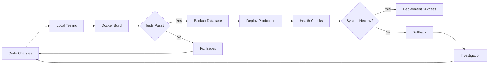
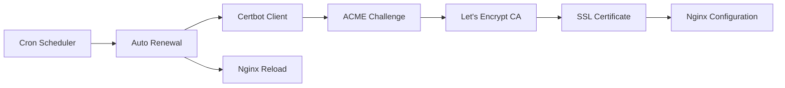

# Magnetiq v2 - Deployment Specification

## Architecture Overview


Magnetiq v2 deployment supports both traditional Docker-based deployment and modern Kubernetes with ArgoCD GitOps workflows. This specification covers all deployment scenarios from localhost development to production Kubernetes clusters using Longhorn persistent storage.

### Simple Stack Architecture
- **Frontend**: React SPA served via Nginx (Port 8036)
- **Backend**: FastAPI application (Port 3036)
- **Database**: SQLite file-based database with WAL mode
- **Web Server**: Nginx for static files and reverse proxy
- **No External Dependencies**: No Redis, Celery, or message queuing systems

## Environment Requirements

### Development Environment
- **Docker & Docker Compose** for containerized development
- **Node.js 18+** for frontend development tooling
- **Python 3.11+** for backend development
- **4GB RAM minimum** for comfortable development
- **10GB free disk space** for containers and data

### Production Environment Options

#### Traditional Docker Deployment
- **Linux server** (Ubuntu 20.04+ recommended)
- **Docker & Docker Compose** for container orchestration
- **2GB RAM minimum** for production workload
- **20GB free disk space** for application data and backups
- **SSL certificate** (Let's Encrypt recommended)
- **Domain name** configured with proper DNS records

#### Kubernetes Deployment
- **Kubernetes cluster** (v1.24+ recommended)
- **ArgoCD** for GitOps deployment automation
- **Longhorn storage** for persistent volume management
- **cert-manager** for automated SSL certificate management
- **Container registry access** for image storage
- **4GB RAM minimum** per node for K8s overhead
- **50GB persistent storage** via Longhorn volumes

#### Performance Expectations
- **Optimal User Load**: Up to 100 concurrent users
- **Write Operations**: <50 writes/second for optimal performance
- **Storage Growth**: Plan for database file size <100GB
- **Backup Requirements**: Daily full database backups recommended

## Docker Configuration

### Container Architecture


The application runs as three primary Docker containers:
- **Frontend Container**: React application with static file serving
- **Backend Container**: FastAPI application with Python runtime
- **Nginx Container**: Reverse proxy and SSL termination

All containers communicate through a dedicated Docker bridge network with persistent volume mounts for data storage.

### Deployment Dependency Chain


The deployment follows a strict dependency order: infrastructure setup → system dependencies → configuration → database initialization → application startup → web server configuration → monitoring setup.

### Development Environment


The development environment provides:
- **Hot reload capabilities** for both frontend and backend
- **Volume mounting** for real-time code changes
- **Development database** with debugging enabled
- **Simplified networking** without SSL complexity
- **Direct port access** for debugging and testing

### Production Environment  


The production environment includes:
- **SSL termination** at the Nginx layer
- **Health checks** for container monitoring
- **Persistent data volumes** for database and media storage
- **Automated restarts** for container reliability
- **Security headers** and hardened configurations
- **Backup systems** for data protection

## Kubernetes Deployment with ArgoCD

### Kubernetes Architecture
For production environments requiring scalability, monitoring, and GitOps workflows, Magnetiq v2 can be deployed on Kubernetes clusters with ArgoCD for automated deployment management.

#### Kubernetes Manifest Structure
```
k8s/
├── namespace.yaml           # Dedicated namespace isolation
├── configmap.yaml          # Non-sensitive configuration
├── secrets.yaml            # Sensitive configuration (DATABASE_URL, SECRET_KEY)
├── backend/
│   ├── deployment.yaml     # Backend FastAPI deployment
│   ├── service.yaml        # Backend service definition
│   └── pvc.yaml           # Persistent Volume Claim for database
├── frontend/
│   ├── deployment.yaml     # Frontend React deployment
│   └── service.yaml        # Frontend service definition
├── ingress.yaml            # Traffic routing and SSL termination
└── storage.yaml            # Longhorn StorageClass configuration
```

#### Persistent Storage with Longhorn
- **Database Volume**: Longhorn PVC for SQLite database file persistence
- **Media Volume**: Longhorn PVC for uploaded media files
- **Backup Strategy**: Longhorn snapshots for point-in-time recovery
- **Volume Expansion**: Dynamic storage expansion as data grows
- **Replication**: Longhorn replica configuration for data durability

#### Container Configuration
- **Backend Image**: Multi-stage production build targeting Gunicorn server
- **Frontend Image**: Nginx-based static file serving from build artifacts
- **Resource Limits**: CPU/Memory limits configured for optimal performance
- **Health Checks**: Liveness and readiness probes for service availability
- **Security Context**: Non-root user execution with proper filesystem permissions

### ArgoCD GitOps Workflow

#### Application Configuration
```yaml
apiVersion: argoproj.io/v1alpha1
kind: Application
metadata:
  name: magnetiq-v2
  namespace: argocd
spec:
  project: default
  source:
    repoURL: https://github.com/your-org/magnetiq2
    targetRevision: main
    path: k8s
  destination:
    server: https://kubernetes.default.svc
    namespace: magnetiq-v2
  syncPolicy:
    automated:
      prune: true
      selfHeal: true
    syncOptions:
    - CreateNamespace=true
```

#### Deployment Process
1. **Git Repository**: Kubernetes manifests committed to version control
2. **ArgoCD Sync**: Automated deployment triggered by git commits
3. **Health Monitoring**: ArgoCD tracks application and resource health
4. **Rollback Capability**: Automatic rollback on deployment failures
5. **Drift Detection**: Configuration drift detection and correction

### SSL Certificate Management
- **cert-manager Integration**: Automated Let's Encrypt certificate provisioning
- **DNS Challenge**: Automated domain validation for wildcard certificates
- **Certificate Renewal**: Automatic certificate renewal before expiry
- **TLS Configuration**: Ingress controller TLS termination setup

### Production Deployment Process

#### Phase 1: Infrastructure Preparation
1. **Kubernetes Cluster Setup**: Ensure cluster meets minimum requirements
2. **ArgoCD Installation**: Deploy ArgoCD in dedicated namespace
3. **Longhorn Installation**: Configure persistent storage backend
4. **cert-manager Setup**: Install certificate management automation

#### Phase 2: Container Registry Setup
1. **Build Production Images**:
   ```bash
   docker build --target production -t registry.example.com/magnetiq-backend:v2.x.x ./backend
   docker build --target production -t registry.example.com/magnetiq-frontend:v2.x.x ./frontend
   ```
2. **Push to Registry**: Upload images to accessible container registry
3. **Image Pull Secrets**: Configure K8s authentication for private registries

#### Phase 3: Kubernetes Manifest Creation
1. **Environment Configuration**: Create ConfigMaps and Secrets
2. **Storage Configuration**: Define PVCs with Longhorn StorageClass
3. **Service Definitions**: Configure internal service networking
4. **Ingress Configuration**: Set up external traffic routing with SSL

#### Phase 4: ArgoCD Application Setup
1. **Git Repository**: Commit K8s manifests to version control
2. **ArgoCD Application**: Create Application resource pointing to manifests
3. **Sync Policies**: Configure automatic or manual sync preferences
4. **RBAC Setup**: Configure ArgoCD permissions and project boundaries

#### Phase 5: Database Migration
1. **Data Export**: Export SQLite database from localhost development
2. **Pod Access**: Use `kubectl exec` to access backend pod
3. **Database Import**: Import data into production SQLite volume
4. **Data Verification**: Validate data integrity post-migration

### Monitoring and Observability
- **Health Endpoints**: Application health checks via `/health` endpoint
- **ArgoCD Dashboard**: Deployment status and application health monitoring
- **Kubernetes Events**: Resource events and pod lifecycle tracking
- **Longhorn Dashboard**: Storage utilization and volume health
- **Ingress Monitoring**: SSL certificate status and traffic metrics

## Nginx Configuration

### Request Routing
Nginx handles all incoming requests and routes them appropriately:
- **Static assets** served directly from filesystem
- **API requests** proxied to FastAPI backend
- **SPA routes** handled with fallback to index.html
- **SSL certificates** managed automatically
- **Compression** enabled for text-based content

### Security Configuration
Production Nginx includes comprehensive security measures:
- **HTTPS redirection** for all HTTP requests
- **Security headers** (HSTS, X-Frame-Options, CSP)
- **SSL protocols** limited to TLS 1.2 and 1.3
- **Strong cipher suites** for encryption
- **Rate limiting** for API endpoints

## Environment Configuration

### Development Environment Variables
Development configuration emphasizes ease of use and debugging:
- **Debug mode enabled** for detailed error messages
- **Local database** with development seed data
- **Permissive CORS** for frontend development
- **Development SMTP** using services like Mailtrap
- **Social media sandbox** credentials for testing

### Production Environment Variables
Production configuration prioritizes security and performance:
- **Debug mode disabled** for security
- **Production database** with optimized settings
- **Restricted CORS** to allowed domains only
- **Production SMTP** for transactional emails
- **Live social media** credentials with proper rate limiting
- **Enhanced security** with encryption keys and secrets management

## Deployment Process

### Deployment Workflow




### Development Deployment Process
1. **Repository clone** with development branch
2. **Docker Compose startup** using development configuration
3. **Database initialization** with development schema
4. **Admin user creation** for testing access
5. **Service verification** through health check endpoints

### Production Deployment Process
1. **Server preparation** with required system packages
2. **Application setup** with production configuration
3. **Docker image building** for frontend and backend
4. **SSL certificate acquisition** through Let's Encrypt
5. **Environment configuration** with production secrets
6. **Application deployment** with health monitoring
7. **Database initialization** with production schema
8. **Admin account creation** with secure credentials

## Database Management

### Database Management & Backup Flow


### SQLite Operations
SQLite serves as the primary database with the following characteristics:
- **WAL mode enabled** for better concurrent access
- **VACUUM operations** run weekly for optimization
- **Integrity checks** performed regularly
- **Size monitoring** with automated alerts
- **Backup automation** with retention policies

### Migration Management
Database schema changes are handled through:
- **Alembic migrations** for schema versioning
- **Backup creation** before migration execution
- **Rollback procedures** for migration failures
- **Testing protocols** for migration validation

## SSL Certificate Management

### SSL Certificate Flow




### Certificate Lifecycle
- **Initial certificate acquisition** through domain validation
- **Automated renewal** via cron jobs every 12 hours
- **Certificate validation** before deployment
- **Nginx reloading** without service interruption
- **Monitoring alerts** for certificate expiry

## Monitoring & Health Checks

### Comprehensive Health Check Tree


The health monitoring system tracks all critical dependencies including core system health, external services, and feature availability with appropriate alerting thresholds.

### Application Health Monitoring
- **Health check endpoints** for service status verification
- **Database connectivity** monitoring and alerting
- **Disk space monitoring** with threshold alerts
- **Log aggregation** and rotation management
- **Performance metrics** collection and analysis

### Operational Procedures
- **Log management** with automated rotation
- **System resource monitoring** for capacity planning
- **Backup verification** and restoration testing
- **Security updates** and patch management
- **Performance optimization** based on metrics

## Backup & Recovery

### Backup Strategy
- **Daily database backups** with timestamp naming
- **Media file backups** compressed for storage efficiency
- **Configuration backups** including environment files
- **Retention policies** maintaining 7-day backup history
- **Backup verification** through automated testing

### Recovery Procedures

#### Failure Cascade Analysis


Understanding failure cascades helps identify root causes and implement appropriate recovery strategies including graceful degradation, circuit breakers, and fallback services.

- **Service shutdown** during restoration process
- **Database restoration** from specified backup point
- **Media file restoration** preserving directory structure
- **Configuration restoration** with environment validation
- **Service restart** with health verification

## Performance Optimization

### System-Level Optimizations
- **File descriptor limits** increased for high concurrency
- **Network connection limits** optimized for load
- **Docker resource limits** configured for stability
- **Kernel parameters** tuned for web workloads

### Application-Level Optimizations
- **SQLite WAL mode** for improved concurrent read performance
- **Nginx caching** with appropriate cache headers
- **Gzip compression** for text-based content delivery
- **Static asset optimization** with long-term caching
- **Database query optimization** with proper indexing

## Troubleshooting

### Common Issues & Resolutions
- **Database lock errors**: Resolved through connection pool optimization
- **High memory usage**: Addressed via SQLite cache tuning
- **SSL certificate problems**: Fixed through automated renewal verification
- **Container restart loops**: Diagnosed via health check analysis
- **Network connectivity issues**: Resolved through Docker network inspection

## Migration to v3 Architecture

### Future Architecture Considerations
When upgrading to Magnetiq v3 with Enterprise Service Bus capabilities:
- **Database transition**: SQLite to PostgreSQL with Redis caching
- **Message queuing**: Integration of background task systems (v3 only)
- **Service architecture**: Monolithic to microservices approach
- **Integration patterns**: HTTP clients to ESB-based communication
- **Deployment complexity**: Single container to multi-service orchestration

### Data Migration Strategy
- **Export procedures** for v2 data extraction
- **Schema mapping** between v2 and v3 data models
- **Incremental migration** for zero-downtime transitions
- **Validation procedures** for data integrity verification

## Support & Maintenance

### Regular Maintenance Schedule
- **Weekly tasks**: Database optimization and log review
- **Daily tasks**: Backup verification and system monitoring
- **Monthly tasks**: Security updates and dependency upgrades
- **Quarterly tasks**: Performance review and capacity planning

### Monitoring Checklist
- Application health endpoints responding correctly
- Database file size within acceptable limits
- System disk space availability above thresholds
- SSL certificate validity with adequate renewal lead time
- Backup completion status and restoration capability
- Log file rotation functioning properly
- Security patches applied and system updated

This deployment specification provides a comprehensive foundation for reliable Magnetiq v2 operations while maintaining simplicity and enabling future architectural evolution.