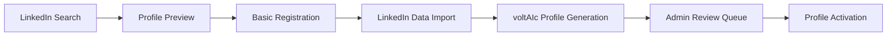

# Magnetiq v2 - Consultant Signup Specification

## Overview

The Consultant Signup feature provides a streamlined, LinkedIn-first registration process for consultants joining the Magnetiq platform. This specification emphasizes minimal barriers to entry with automated profile creation from LinkedIn data, eliminating KYC and payment setup requirements during the signup process.

→ **Business Model Integration**: [30-for-30 Consultation Service](./book-a-meeting.md#pricing-model)
← **Supported by**: [LinkedIn Integration](../../integrations/linkedin.md#consultant-onboarding), [voltAIc Profile Generation](../../integrations/voltaic-profile-generation.md)
⚡ **Core Dependencies**: [User Authentication](../../security.md#user-registration), [LinkedIn API](../../integrations/linkedin.md), [Admin Profile Completion](../../frontend/adminpanel/consultant-management.md#profile-completion-workflow)

## Visual Signup Flow Overview

*Complete consultant signup journey showing LinkedIn integration and automated profile generation*

🔗 **Cross-referenced in**: [knowhow-bearer Persona](../../users/knowhow-bearer.md), [Admin Panel](../../frontend/adminpanel/consultant-management.md), [LinkedIn Integration](../../integrations/linkedin.md)

## System Architecture




⚡ **System Integration**:
- **Frontend Layer**: [Signup Components](../public.md#consultant-signup-components)
- **API Layer**: [Registration Endpoints](../../backend/api.md#consultant-registration-endpoints)
- **LinkedIn Layer**: [Profile Data Extraction](../../integrations/linkedin.md#profile-extraction)
- **AI Layer**: [voltAIc Profile Generation](../../integrations/voltaic-profile-generation.md)
- **Admin Layer**: [Profile Completion Workflow](../../frontend/adminpanel/consultant-management.md#profile-completion-workflow)

## Core Signup Workflow

### Phase 1: LinkedIn Profile Discovery


**LinkedIn Profile Search Interface**:
```tsx
interface LinkedInProfileSearch {
  searchMethod: 'url_input' | 'name_search' | 'email_search';
  searchCriteria: {
    linkedinUrl?: string;
    fullName?: string;
    email?: string;
    company?: string;
    location?: string;
  };
  searchResults: LinkedInSearchResult[];
  selectedProfile?: LinkedInProfilePreview;
}

interface LinkedInSearchResult {
  profileUrl: string;
  fullName: string;
  headline: string;
  company: string;
  location: string;
  profilePhotoUrl?: string;
  connections: number;
  industry: string;
  matchConfidence: number; // 0-100 quality score
}

interface LinkedInProfilePreview {
  basicInfo: {
    firstName: string;
    lastName: string;
    headline: string;
    location: string;
    profilePhoto: string;
  };
  professionalSummary: {
    currentPosition: string;
    company: string;
    industry: string;
    experienceYears: number;
    keySkills: string[];
  };
  qualityIndicators: {
    profileCompleteness: number; // 0-100
    professionalNetworkSize: number;
    activityLevel: 'low' | 'medium' | 'high';
    contentQuality: number; // Based on posts, articles
  };
}
```

**LinkedIn Search Features**:
- **URL-Based Lookup**: Direct LinkedIn profile URL input with validation
- **Name & Company Search**: Find profiles by name and company combination
- **Email-Based Discovery**: Locate LinkedIn profiles associated with email addresses
- **Profile Quality Assessment**: Automated scoring of profile completeness and professional quality
- **Multiple Results Handling**: Present ranked options when multiple profiles match search criteria
- **Profile Preview**: Rich preview showing key professional information before selection

### Phase 2: Minimal Registration Process


**Streamlined Registration Form**:
```tsx
interface ConsultantRegistrationForm {
  linkedinProfile: LinkedInProfilePreview;
  basicRegistration: {
    email: string; // Primary contact email
    confirmEmail: string;
    password: string;
    confirmPassword: string;
    acceptTerms: boolean;
    acceptPrivacyPolicy: boolean;
    marketingConsent: boolean; // Optional
  };
  profilePreferences: {
    primaryLanguage: 'en' | 'de';
    timezone: string;
    availabilityStatus: 'immediate' | 'within_week' | 'within_month' | 'planning_phase';
  };
  // NO KYC fields
  // NO payment setup fields
  // NO detailed professional information (comes from LinkedIn)
}
```

**Registration Features**:
- **Pre-populated Data**: Automatically fill fields from LinkedIn profile where possible
- **Email Verification**: Required email confirmation for account activation
- **Password Security**: Strong password requirements with validation
- **Terms Acceptance**: Clear legal agreements with expandable text
- **Language Selection**: Primary language preference for platform interface
- **Timezone Detection**: Automatic timezone detection with manual override option
- **Availability Indication**: Initial availability status for admin prioritization

### Phase 3: LinkedIn Data Import & Processing


**Automated Data Extraction**:
```tsx
interface LinkedInDataImport {
  extractionProcess: {
    profileUrl: string;
    extractionMethod: 'api' | 'scraping' | 'manual_input';
    extractedData: {
      personalInfo: PersonalInformation;
      professionalInfo: ProfessionalInformation;
      experienceData: WorkExperience[];
      educationData: Education[];
      skillsData: Skill[];
      networkMetrics: NetworkMetrics;
    };
    extractionQuality: {
      completeness: number; // 0-100%
      confidence: number; // 0-100%
      missingFields: string[];
      qualityIssues: string[];
    };
  };
  
  dataValidation: {
    duplicateCheck: DuplicateCheckResult;
    profileVerification: VerificationResult;
    contentModeration: ModerationResult;
    complianceCheck: ComplianceResult;
  };
  
  processingStatus: {
    extractionComplete: boolean;
    validationPassed: boolean;
    readyForGeneration: boolean;
    requiresReview: boolean;
    errorMessages: string[];
  };
}
```

**Data Import Features**:
- **Comprehensive Extraction**: Pull all available professional information from LinkedIn
- **Quality Assessment**: Automated evaluation of data completeness and accuracy
- **Duplicate Detection**: Check for existing consultant profiles to prevent duplicates
- **Content Validation**: Verify professional information meets platform standards
- **Error Handling**: Graceful handling of extraction failures with manual fallback options
- **Privacy Compliance**: Ensure data extraction complies with LinkedIn terms and privacy regulations

### Phase 4: voltAIc Profile Generation


**Automated Profile Creation**:
```tsx
interface VoltaicProfileGeneration {
  generationInput: {
    linkedinData: LinkedInProfileData;
    userPreferences: ProfileGenerationPreferences;
    brandGuidelines: BrandGuidelinesConfig;
  };
  
  generationConfig: {
    contentStyle: {
      biographyLength: 'concise' | 'standard' | 'comprehensive';
      toneOfVoice: 'professional' | 'approachable' | 'authoritative';
      focusAreas: string[];
      personalityIncluded: boolean;
    };
    brandAlignment: {
      voltaicBranding: boolean;
      consultantPersonalization: boolean;
      industrySpecific: boolean;
      keywordOptimization: boolean;
    };
    qualityControls: {
      factChecking: boolean;
      grammarValidation: boolean;
      plagiarismCheck: boolean;
      brandConsistency: boolean;
    };
  };
  
  generatedProfile: {
    biography: PortableTextContent;
    shortBio: string; // 150 characters for listings
    specializations: ExpertiseArea[];
    keySkills: string[];
    uniqueValueProposition: string;
    professionalHighlights: string[];
    workingStyle: WorkingStyleDescription;
    qualityScore: number; // 0-100
    generationNotes: string[];
  };
  
  reviewQueue: {
    autoApproved: boolean;
    requiresReview: boolean;
    reviewPriority: 'high' | 'medium' | 'low';
    qualityIssues: QualityIssue[];
    reviewAssignment?: string; // Admin ID
  };
}
```

**voltAIc Generation Features**:
- **AI-Powered Biography**: Generate compelling professional biographies from LinkedIn data
- **Skill Extraction**: Identify and categorize key professional skills and expertise areas
- **Specialization Mapping**: Create structured specialization descriptions
- **Brand Voice Consistency**: Ensure generated content aligns with Magnetiq brand voice
- **Quality Scoring**: Automated assessment of generated content quality
- **Review Queue Management**: Route profiles requiring manual review to appropriate admins
- **Content Optimization**: SEO and engagement optimization for profile discoverability

### Phase 5: Admin Review & Activation Queue


**Profile Review Management**:
```tsx
interface AdminReviewQueue {
  pendingProfiles: PendingConsultantProfile[];
  reviewWorkflow: {
    autoActivationThreshold: number; // Quality score threshold
    reviewPriority: ReviewPriorityConfig;
    assignmentRules: AdminAssignmentRules;
    approvalWorkflow: ApprovalWorkflowConfig;
  };
  
  bulkOperations: {
    bulkApproval: (profileIds: string[]) => Promise<void>;
    bulkReject: (profileIds: string[], reason: string) => Promise<void>;
    bulkAssign: (profileIds: string[], adminId: string) => Promise<void>;
    bulkKYCInitiate: (profileIds: string[]) => Promise<void>;
  };
  
  qualityMetrics: {
    averageQualityScore: number;
    approvalRate: number;
    reviewTurnaroundTime: number;
    adminWorkload: AdminWorkloadMetrics;
  };
}

interface PendingConsultantProfile {
  consultantId: string;
  signupDate: Date;
  linkedinData: LinkedInProfileData;
  generatedProfile: GeneratedProfileContent;
  qualityScore: number;
  reviewStatus: 'pending' | 'in_review' | 'approved' | 'rejected' | 'needs_revision';
  assignedReviewer?: string;
  reviewNotes: string[];
  activationPriority: 'high' | 'medium' | 'low';
  estimatedValue: number; // Potential consultant value
}
```

**Admin Review Features**:
- **Automated Prioritization**: Rank profiles by quality score and potential business value
- **Quality Threshold Approval**: Automatically approve high-quality profiles above threshold
- **Review Assignment**: Intelligent assignment of profiles to admin team members
- **Bulk Operations**: Mass approval, rejection, or assignment operations
- **Performance Tracking**: Monitor review turnaround times and approval rates
- **Quality Improvement**: Feedback loop to improve AI generation quality

## User Experience Design

### Progressive Disclosure Interface


**Step-by-Step User Journey**:
1. **Landing Page**: Clear value proposition and "Join as Consultant" call-to-action
2. **LinkedIn Discovery**: Simple profile search with instant preview
3. **Profile Confirmation**: Review extracted data with editing capabilities
4. **Basic Registration**: Minimal form with pre-populated data
5. **Success Confirmation**: Clear next steps and timeline expectations
6. **Onboarding Email**: Welcome email with platform introduction and next steps

**UX Principles**:
- **Minimal Friction**: Reduce signup steps to absolute minimum
- **Instant Gratification**: Show profile preview immediately after LinkedIn discovery
- **Clear Expectations**: Explain what happens after signup (admin review, completion process)
- **Professional Trust**: LinkedIn integration builds immediate credibility and trust
- **Mobile Optimized**: Responsive design for mobile LinkedIn profile searches

### Error Handling & Edge Cases


**Error Scenarios & Solutions**:
```tsx
interface ErrorHandling {
  linkedinErrors: {
    profileNotFound: ErrorHandlerConfig;
    privateProfile: ErrorHandlerConfig;
    invalidUrl: ErrorHandlerConfig;
    extractionFailed: ErrorHandlerConfig;
  };
  
  registrationErrors: {
    duplicateEmail: ErrorHandlerConfig;
    weakPassword: ErrorHandlerConfig;
    emailValidationFailed: ErrorHandlerConfig;
    linkedinAlreadyUsed: ErrorHandlerConfig;
  };
  
  systemErrors: {
    aiGenerationFailed: ErrorHandlerConfig;
    databaseError: ErrorHandlerConfig;
    integrationTimeout: ErrorHandlerConfig;
    reviewQueueFull: ErrorHandlerConfig;
  };
  
  recoveryOptions: {
    manualProfileEntry: boolean;
    alternateEmailOption: boolean;
    adminEscalation: boolean;
    fallbackGeneration: boolean;
  };
}
```

**Error Handling Features**:
- **LinkedIn Profile Issues**: Graceful handling of private or inaccessible profiles
- **Duplicate Prevention**: Check for existing consultants and offer account recovery
- **AI Generation Fallbacks**: Manual profile creation when AI generation fails
- **System Resilience**: Retry mechanisms and graceful degradation
- **User Communication**: Clear error messages with actionable next steps

## API Integration

### Registration Endpoints
→ **API Documentation**: [Consultant Registration API](../../backend/api.md#consultant-registration)
← **Database Operations**: [Consultant Tables](../../backend/database.md#consultant-signup-tables)

**Core API Endpoints**:
```python
from fastapi import APIRouter, Depends, HTTPException
from typing import List, Optional
from app.models.consultant import ConsultantSignup, LinkedInProfile
from app.services.linkedin import LinkedInService
from app.services.voltaic import VoltaicProfileService

router = APIRouter(prefix="/api/consultant-signup", tags=["consultant-signup"])

@router.post("/linkedin-search")
async def search_linkedin_profiles(
    search_request: LinkedInSearchRequest,
    current_user: User = Depends(get_current_user)
) -> LinkedInSearchResponse:
    """Search for LinkedIn profiles by URL, name, or email."""
    # Implementation for LinkedIn profile search

@router.post("/register")
async def register_consultant(
    registration_data: ConsultantRegistrationRequest,
    linkedin_service: LinkedInService = Depends()
) -> ConsultantRegistrationResponse:
    """Register new consultant with LinkedIn profile integration."""
    # Implementation for consultant registration

@router.get("/profile-preview/{linkedin_url}")
async def get_profile_preview(
    linkedin_url: str,
    linkedin_service: LinkedInService = Depends()
) -> LinkedInProfilePreview:
    """Get LinkedIn profile preview for signup process."""
    # Implementation for profile preview

@router.post("/generate-voltaic-profile")
async def generate_voltaic_profile(
    generation_request: VoltaicGenerationRequest,
    voltaic_service: VoltaicProfileService = Depends(),
    admin_user: AdminUser = Depends(require_admin_permission)
) -> VoltaicProfileResponse:
    """Generate voltAIc profile from LinkedIn data."""
    # Implementation for AI profile generation
```

### Integration Dependencies
⚡ **Service Dependencies**:
- **LinkedIn Integration**: [LinkedIn Profile Extraction](../../integrations/linkedin.md#profile-extraction)
- **voltAIc Generation**: [AI Profile Creation](../../integrations/voltaic-profile-generation.md)
- **Email Service**: [Registration Confirmation](../../integrations/smtp-brevo.md#consultant-onboarding)
- **Admin Notifications**: [Review Queue Alerts](../../integrations/notifications.md#admin-alerts)

## Security & Privacy Considerations

### Data Protection
← **Security Framework**: [Data Protection Policies](../../security.md#consultant-data-protection)
→ **Privacy Compliance**: [LinkedIn Data Usage](../../privacy-compliance.md#linkedin-data-processing)

**Security Measures**:
- **LinkedIn Data Encryption**: Encrypt all LinkedIn profile data at rest and in transit
- **Email Verification**: Required email confirmation prevents unauthorized registrations
- **Password Security**: Strong password requirements with hashing and salting
- **Rate Limiting**: Prevent automated signup abuse with rate limiting
- **Data Minimization**: Only collect essential data during signup process
- **Audit Logging**: Log all signup activities for security monitoring

**Privacy Protections**:
- **Consent Management**: Clear consent for LinkedIn data processing and storage
- **Right to Deletion**: Support for profile deletion requests during review process
- **Data Retention**: Define retention periods for incomplete signup data
- **Third-Party Compliance**: Ensure LinkedIn data usage complies with their terms of service

## Performance & Monitoring

### Success Metrics
📋 **Analytics Integration**: [Signup Analytics](../../backend/analytics.md#consultant-signup-metrics)

**Key Performance Indicators**:
```tsx
interface SignupMetrics {
  conversionMetrics: {
    landingPageToSearch: number; // Conversion rate to LinkedIn search
    searchToPreview: number; // Conversion rate to profile preview
    previewToRegistration: number; // Conversion rate to registration
    registrationToActivation: number; // Admin approval rate
    overallConversionRate: number; // End-to-end conversion
  };
  
  qualityMetrics: {
    averageProfileQuality: number; // AI-generated profile quality
    autoApprovalRate: number; // Profiles approved automatically
    reviewTurnaroundTime: number; // Time from signup to activation
    consultantRetentionRate: number; // Retention after activation
  };
  
  userExperienceMetrics: {
    averageSignupTime: number; // Time to complete signup
    linkedinExtractionSuccessRate: number;
    voltaicGenerationSuccessRate: number;
    userSatisfactionScore: number;
  };
  
  systemMetrics: {
    apiResponseTimes: ApiPerformanceMetrics;
    errorRates: ErrorRateMetrics;
    systemUptime: number;
    peakUsageHandling: LoadMetrics;
  };
}
```

**Monitoring Dashboard**:
- **Real-time Signup Flow**: Live monitoring of signup completions and failures
- **Quality Trends**: Track AI-generated profile quality over time
- **Admin Workload**: Monitor review queue depth and processing times
- **Conversion Funnel**: Detailed analysis of signup conversion steps
- **Error Tracking**: Comprehensive error logging and alerting system

## Testing Strategy

### Automated Testing
→ **Testing Framework**: [Consultant Signup Tests](../../testing_strategy.md#consultant-signup-testing)

**Test Coverage**:
- **Unit Tests**: Individual component and service testing
- **Integration Tests**: LinkedIn API and voltAIc service integration
- **E2E Tests**: Complete signup flow validation
- **Performance Tests**: Load testing for peak signup volumes
- **Security Tests**: Vulnerability and penetration testing
- **Accessibility Tests**: WCAG compliance validation

## Cross-References Summary

← **Referenced by**:
- [knowhow-bearer Persona](../../users/knowhow-bearer.md#simplified-onboarding)
- [Admin Panel](../../frontend/adminpanel/consultant-management.md#profile-completion-workflow)
- [LinkedIn Integration](../../integrations/linkedin.md#consultant-onboarding)
- [voltAIc Generation](../../integrations/voltaic-profile-generation.md)

→ **References**:
- [User Registration](../../security.md#user-registration)
- [Database Schema](../../backend/database.md#consultant-tables)
- [API Documentation](../../backend/api.md#consultant-registration-endpoints)
- [LinkedIn Integration](../../integrations/linkedin.md#profile-extraction)
- [Admin Workflows](../../frontend/adminpanel/consultant-management.md)

↔️ **Related Features**:
- [Book-a-Meeting](./book-a-meeting.md#consultant-profiles)
- [Consultant Profiles](../public.md#consultant-profiles)
- [Content Creation](./whitepapers.md#consultant-authorship)
- [Admin Dashboard](../../frontend/adminpanel/admin.md#consultant-management)

## Visual Documentation


*Complete signup system architecture showing all components and data flows*

### Related Diagrams
- [LinkedIn Integration Flow](../../../diagrams/spec_v2/integrations/linkedin_consultant_flow.png)
- [voltAIc Profile Generation](../../../diagrams/spec_v2/features/voltaic_generation_process.png)
- [Admin Review Workflow](../../../diagrams/spec_v2/features/admin_review_workflow.png)
- [Signup Conversion Funnel](../../../diagrams/spec_v2/analytics/signup_conversion_funnel.png)
- [Security & Privacy Flow](../../../diagrams/spec_v2/security/consultant_signup_security.png)

🔗 **Complete Feature Index**: [All Public Features](../features/)