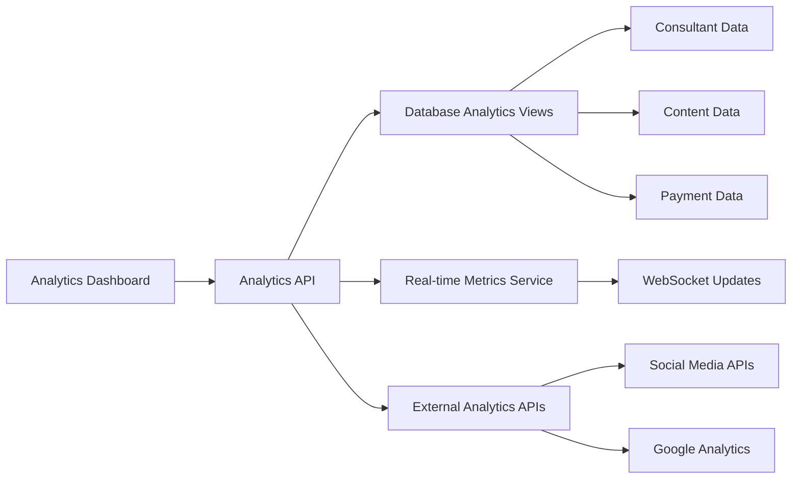

# Magnetiq v2 - Analytics Dashboard Admin Specification

## Overview

The Analytics Dashboard provides comprehensive business intelligence and performance monitoring for the Magnetiq platform. It serves as the central hub for data-driven decision making, featuring real-time metrics, consultant performance tracking, content analytics, revenue reporting, and user engagement insights.

→ **Business Value**: [Revenue Optimization](../../business/revenue-optimization.md), [Performance Management](../../business/performance-management.md)
← **Supports Users**: [Site Admin](../../users/site-admin.md#analytics-access), [Content Editor](../../users/content-editor.md#performance-tracking)
⚡ **Core Dependencies**: [Analytics API](../../backend/api.md#analytics-endpoints), [Database Analytics](../../backend/database.md#analytics-tables)

## Visual Dashboard Overview

*Complete analytics dashboard showing all KPI widgets and reporting interfaces*

## System Integration Architecture




## Core Analytics Features

### Executive Dashboard with KPI Widgets

→ **API Integration**: [Executive Analytics API](../../backend/api.md#executive-analytics)
⚡ **Real-time Updates**: [WebSocket Analytics](../../integrations/websocket-analytics.md)

#### Primary KPI Widgets - IMPLEMENTED
```tsx
// Implemented Dashboard Structure in Dashboard.tsx
interface ImplementedDashboard {
  // Key Performance Indicators - Live Data
  kpiStats: Array<{
    name: 'Monthly Revenue' | 'New Leads' | 'Conversion Rate' | 'Active Sessions';
    value: string; // €47,200, 342, 12.8%, 156
    change: string; // +22.5%, +15.3%, +2.1%, +8.2%
    changeType: 'positive' | 'negative' | 'neutral';
    icon: HeroIcon;
    color: 'success' | 'primary' | 'accent' | 'warning';
    href: string; // Links to detailed analytics pages
  }>;
  
  // Content & Operations Metrics - Live Implementation
  contentStats: Array<{
    name: 'Content Pages' | 'Whitepapers' | 'Active Webinars' | 'Consultations';
    value: string; // 24, 15, 8, 23
    change: string; // +3, +2, +1, +5
    changeType: 'positive';
    icon: HeroIcon;
    href: string; // Navigation to management sections
  }>;
  
  // System Health Monitoring - Real Implementation
  systemStats: Array<{
    name: 'Email Delivery Rate' | 'System Uptime' | 'API Response Time' | 'Security Events';
    value: string; // 99.2%, 99.9%, 142ms, 2
    change: string; // +0.3%, 0%, -8ms, -3
    changeType: 'positive' | 'neutral';
    icon: HeroIcon;
    href: string; // System monitoring pages
  }>;
  
  // Recent Activity Stream - Live Feed
  recentActivity: Array<{
    type: 'lead' | 'booking' | 'webinar' | 'email' | 'download' | 'content';
    title: string;
    description: string; // Detailed descriptions with revenue data
    time: string; // Relative timestamps
    priority: 'high' | 'medium' | 'low';
    icon: HeroIcon;
    color: string; // Tailwind color classes
  }>;
  
  // Upcoming Events & Calendar - Integrated View
  upcomingEvents: Array<{
    title: string;
    type: 'webinar' | 'consultation' | 'maintenance';
    date: string;
    attendees: number | null;
    revenue: string | null; // €1,270, €500, etc.
    status: 'live-soon' | 'confirmed' | 'scheduled';
    consultant: string | null; // Assigned consultant
  }>;
}
```

**KPI Widget Features - IMPLEMENTED**:
- **Live Data Display**: Real-time metrics with animated trend indicators
- **Interactive Cards**: Hover effects and smooth transitions 
- **Navigation Integration**: Click-through to detailed analytics pages
- **Visual Indicators**: Color-coded performance with success/warning states
- **Responsive Design**: Mobile-optimized layout with staggered animations
- **Three-Tier Organization**: KPIs, Content/Operations, System Health sections

### Implemented Dashboard UI Components

#### Current Dashboard Layout Structure
```tsx
// Actual implementation in /frontend/src/pages/admin/Dashboard.tsx
const DashboardSections = {
  header: {
    title: "Dashboard",
    description: "Welcome back! Here's what's happening with your platform today.",
    quickActions: ["New Page", "New Webinar"]
  },
  
  kpiSection: {
    title: "Key Performance Indicators",
    widgets: 4, // Revenue, Leads, Conversion Rate, Active Sessions
    layout: "grid-cols-1 sm:grid-cols-2 lg:grid-cols-4",
    animation: "fade-in-up with staggered delays"
  },
  
  contentSection: {
    title: "Content & Operations", 
    widgets: 4, // Pages, Whitepapers, Webinars, Consultations
    layout: "grid-cols-1 sm:grid-cols-2 lg:grid-cols-4",
    animation: "fade-in-up with staggered delays"
  },
  
  systemSection: {
    title: "System Health",
    widgets: 4, // Email Rate, Uptime, Response Time, Security
    layout: "grid-cols-1 sm:grid-cols-2 lg:grid-cols-4", 
    animation: "fade-in-up with staggered delays"
  },
  
  activitySection: {
    title: "Recent Activity",
    layout: "lg:col-span-2", // Takes 2/3 of bottom section
    features: ["Priority indicators", "Revenue attribution", "Time stamps"]
  },
  
  upcomingSection: {
    title: "Upcoming",
    layout: "1/3 of bottom section",
    features: ["Status indicators", "Revenue tracking", "Consultant assignments"]
  },
  
  quickActions: {
    title: "Quick Actions",
    actions: ["Manage Pages", "Host Webinar", "View Analytics", "Manage Users"],
    layout: "grid-cols-2 md:grid-cols-4"
  }
};
```

#### Implemented Visual Features
- **Animated Entry**: Staggered fade-in-up animations for smooth loading
- **Hover Effects**: Card scaling and color transitions on interaction
- **Priority System**: Color-coded priority indicators for activities
- **Status Badges**: Live status indicators for events and system health
- **Revenue Attribution**: Financial data integrated throughout activity feeds
- **Consultant Tracking**: Assigned consultants displayed for relevant events
- **Responsive Icons**: HeroIcons with consistent sizing and colors

### Interactive Charts and Data Visualizations

→ **Chart Library**: [Recharts Integration](../../frontend/chart-components.md)
← **Data Sources**: [Analytics Data Pipeline](../../backend/analytics-pipeline.md)

#### Revenue Analytics Charts
```tsx
interface RevenueAnalyticsCharts {
  revenueTimeline: {
    chartType: 'line' | 'area' | 'bar';
    timeRange: 'week' | 'month' | 'quarter' | 'year';
    dataPoints: RevenueDataPoint[];
    forecasting: boolean;
    breakdownBy: 'total' | 'consultant' | 'service_type' | 'region';
  };
  
  revenueDistribution: {
    chartType: 'pie' | 'donut' | 'treemap';
    segments: RevenueSegment[];
    drillDownLevels: number;
    interactiveTooltips: boolean;
  };
  
  consultantPerformance: {
    chartType: 'bar' | 'scatter' | 'heatmap';
    metrics: 'revenue' | 'bookings' | 'satisfaction' | 'efficiency';
    ranking: 'top_performers' | 'all' | 'underperforming';
    comparisonPeriod: DateRange;
  };
}
```

**Chart Interaction Features**:
- **Zoom and Pan**: Interactive chart navigation
- **Dynamic Filtering**: Real-time data filtering controls
- **Custom Date Ranges**: Flexible time period selection
- **Multi-metric Overlay**: Compare different metrics on single chart
- **Export Capabilities**: PNG, SVG, PDF chart exports
- **Responsive Design**: Mobile-optimized chart viewing

### Consultant Performance Analytics and Revenue Tracking

→ **Consultant Data**: [Consultant Management](./consultant-management.md#analytics-integration)
← **Performance Metrics**: [Consultant Analytics API](../../backend/api.md#consultant-analytics)

#### Individual Consultant Analytics
```tsx
interface ConsultantPerformanceAnalytics {
  individualMetrics: {
    consultantId: string;
    performanceScore: number;
    
    revenueMetrics: {
      totalRevenue: MoneyAmount;
      monthlyRevenue: MoneyAmount;
      revenueGrowthRate: number;
      averageBookingValue: MoneyAmount;
      revenuePerHour: MoneyAmount;
    };
    
    bookingMetrics: {
      totalBookings: number;
      completedBookings: number;
      bookingConversionRate: number;
      averageBookingDuration: number;
      repeatClientRate: number;
      cancellationRate: number;
    };
    
    clientSatisfactionMetrics: {
      averageRating: number;
      totalReviews: number;
      npsScore: number;
      satisfactionTrend: TrendData;
      testimonialCount: number;
    };
    
    contentMetrics: {
      whitepaperAuthored: number;
      whitepaperDownloads: number;
      webinarsSpeaking: number;
      webinarAttendance: number;
      blogPostsWritten: number;
      contentEngagement: number;
    };
    
    profileMetrics: {
      profileViews: number;
      inquiryRate: number;
      responseTime: number;
      availabilityRate: number;
    };
  };
  
  comparativeAnalysis: {
    peerRanking: number;
    industryBenchmarks: BenchmarkData;
    performanceTrends: TrendAnalysis;
    improvementSuggestions: string[];
  };
}
```

**Performance Tracking Features**:
- **Consultant Leaderboards**: Dynamic rankings by various metrics
- **Performance Trends**: Historical performance tracking
- **Goal Setting**: Individual and team performance targets
- **Peer Comparison**: Anonymous peer performance comparison
- **Performance Alerts**: Notifications for significant changes
- **Custom Scorecards**: Configurable performance measurement

### Content Performance Metrics

→ **Content System**: [Content Management](./content-management.md#analytics-integration)
← **Content Analytics**: [Content Performance API](../../backend/api.md#content-analytics)

#### Webinar Analytics
```tsx
interface WebinarAnalytics {
  sessionMetrics: {
    webinarId: string;
    registrationMetrics: {
      totalRegistrations: number;
      registrationConversionRate: number;
      registrationSources: RegistrationSource[];
      geographicDistribution: GeographicData;
    };
    
    attendanceMetrics: {
      totalAttendees: number;
      attendanceRate: number;
      averageWatchTime: number;
      completionRate: number;
      engagementScore: number;
      peakConcurrentViewers: number;
    };
    
    interactionMetrics: {
      questionsAsked: number;
      pollResponses: number;
      chatMessages: number;
      downloadRequests: number;
      followUpBookings: number;
    };
    
    conversionMetrics: {
      leadGeneration: number;
      bookingConversions: number;
      revenueAttribution: MoneyAmount;
      followUpEngagement: number;
    };
  };
  
  speakerPerformance: {
    consultantId: string;
    speakerRating: number;
    audienceEngagement: number;
    contentQuality: number;
    deliveryEffectiveness: number;
    followUpBookings: number;
  };
}
```

#### Whitepaper Analytics
```tsx
interface WhitepaperAnalytics {
  contentMetrics: {
    whitepaperId: string;
    downloadMetrics: {
      totalDownloads: number;
      uniqueDownloads: number;
      downloadTrend: TrendData;
      downloadSources: DownloadSource[];
      geographicDistribution: GeographicData;
    };
    
    engagementMetrics: {
      averageReadingTime: number;
      completionRate: number;
      sharingCount: number;
      bookmarkSaves: number;
      printRequests: number;
    };
    
    conversionMetrics: {
      leadGeneration: number;
      consultationRequests: number;
      conversionRate: number;
      revenueAttribution: MoneyAmount;
    };
    
    qualityMetrics: {
      userRating: number;
      feedback: FeedbackSummary;
      citationCount: number;
      expertEndorsements: number;
    };
  };
  
  authorPerformance: {
    consultantId: string;
    authorshipContribution: number;
    downloadAttribution: number;
    inquiryGeneration: number;
    revenueAttribution: MoneyAmount;
  };
}
```

**Content Performance Features**:
- **Content Lifecycle Tracking**: Performance from creation to retirement
- **Multi-channel Attribution**: Track performance across distribution channels
- **Content ROI Calculation**: Revenue attribution and cost effectiveness
- **Audience Segmentation**: Performance by audience demographics
- **Content Optimization Insights**: Data-driven content improvement suggestions
- **Competitor Benchmarking**: Industry content performance comparison

### Lead Generation Analytics and Conversion Funnels

→ **Lead Management**: [Lead Processing System](../../features/lead-management.md)
⚡ **Conversion Tracking**: [Attribution System](../../integrations/attribution-tracking.md)

#### Conversion Funnel Analytics
```tsx
interface ConversionFunnelAnalytics {
  funnelStages: {
    awareness: {
      websiteVisitors: number;
      organicTraffic: number;
      paidTraffic: number;
      socialTraffic: number;
      referralTraffic: number;
    };
    
    interest: {
      contentDownloads: number;
      webinarRegistrations: number;
      newsletterSignups: number;
      resourceViews: number;
      consultantProfileViews: number;
    };
    
    consideration: {
      consultantInquiries: number;
      bookingPageViews: number;
      pricingPageViews: number;
      testimonialViews: number;
      caseStudyDownloads: number;
    };
    
    intent: {
      bookingAttempts: number;
      calendarViews: number;
      paymentInitiations: number;
      consultantSelections: number;
    };
    
    conversion: {
      completedBookings: number;
      paidConsultations: number;
      recurringClients: number;
      referralGeneration: number;
    };
  };
  
  conversionRates: {
    visitorToLead: number;
    leadToOpportunity: number;
    opportunityToCustomer: number;
    overallConversionRate: number;
  };
  
  attributionAnalysis: {
    firstTouchAttribution: AttributionData;
    lastTouchAttribution: AttributionData;
    multiTouchAttribution: AttributionData;
    timeToConversion: number;
  };
}
```

**Funnel Analysis Features**:
- **Real-time Funnel Monitoring**: Live conversion rate tracking
- **Bottleneck Identification**: Automatic funnel drop-off analysis
- **A/B Testing Integration**: Funnel performance across test variants
- **Cohort Analysis**: Conversion behavior by user cohorts
- **Attribution Modeling**: Multi-touch attribution analysis
- **Predictive Analytics**: Conversion probability scoring

### Payment and Revenue Analytics

→ **Payment System**: [Payment Management](./business/payment.md#analytics-integration)
← **Financial Data**: [Financial Analytics API](../../backend/api.md#financial-analytics)

#### Financial Reporting Dashboard
```tsx
interface FinancialAnalytics {
  revenueReporting: {
    totalRevenue: MoneyAmount;
    recurringRevenue: MoneyAmount;
    oneTimeRevenue: MoneyAmount;
    
    revenueBreakdown: {
      byService: ServiceRevenueBreakdown[];
      byConsultant: ConsultantRevenueBreakdown[];
      byRegion: RegionalRevenueBreakdown[];
      byPaymentMethod: PaymentMethodBreakdown[];
    };
    
    financialKPIs: {
      grossMargin: number;
      netMargin: number;
      averageRevenuePerUser: MoneyAmount;
      customerLifetimeValue: MoneyAmount;
      churnRate: number;
      revenueGrowthRate: number;
    };
  };
  
  paymentAnalytics: {
    transactionVolume: number;
    averageTransactionValue: MoneyAmount;
    paymentSuccessRate: number;
    refundRate: number;
    chargebackRate: number;
    
    paymentMethodPerformance: {
      creditCard: PaymentMethodMetrics;
      bankTransfer: PaymentMethodMetrics;
      digitalWallet: PaymentMethodMetrics;
      cryptocurrency: PaymentMethodMetrics;
    };
  };
  
  consultantPayouts: {
    totalPayouts: MoneyAmount;
    averagePayoutAmount: MoneyAmount;
    payoutFrequency: PayoutFrequencyData;
    payoutMethodDistribution: PayoutMethodBreakdown[];
    pendingPayouts: MoneyAmount;
    payoutProcessingTime: number;
  };
  
  financialForecasting: {
    revenueProjection: ForecastData;
    cashFlowProjection: CashFlowData;
    seasonalityAnalysis: SeasonalityData;
    growthScenarios: ScenarioAnalysis[];
  };
}
```

**Financial Analytics Features**:
- **Real-time Revenue Tracking**: Live revenue monitoring and alerts
- **Multi-currency Support**: Revenue tracking across different currencies
- **Tax Reporting**: Automated tax calculation and reporting
- **Financial Goal Tracking**: Performance against financial targets
- **Profitability Analysis**: Profit margin analysis by service/consultant
- **Subscription Analytics**: Recurring revenue and subscription metrics

### User Engagement and Behavior Analytics

→ **User Tracking**: [User Behavior Analytics](../../integrations/user-analytics.md)
⚡ **Behavioral Data**: [User Analytics API](../../backend/api.md#user-analytics)

#### User Behavior Analytics
```tsx
interface UserBehaviorAnalytics {
  engagementMetrics: {
    activeUsers: {
      daily: number;
      weekly: number;
      monthly: number;
    };
    
    sessionMetrics: {
      averageSessionDuration: number;
      bounceRate: number;
      pagesPerSession: number;
      returnVisitorRate: number;
    };
    
    contentEngagement: {
      mostViewedContent: ContentEngagementData[];
      timeOnPage: TimeOnPageData[];
      scrollDepth: ScrollDepthData[];
      clickThroughRates: ClickThroughData[];
    };
    
    userFlowAnalysis: {
      commonPathways: UserPathway[];
      exitPages: ExitPageData[];
      entryPages: EntryPageData[];
      conversionPaths: ConversionPathData[];
    };
  };
  
  audienceInsights: {
    demographics: {
      ageDistribution: DemographicData;
      genderDistribution: DemographicData;
      locationDistribution: GeographicData;
      deviceTypes: DeviceData;
      browserTypes: BrowserData;
    };
    
    behaviorSegmentation: {
      userPersonas: PersonaData[];
      engagementLevels: EngagementSegment[];
      valueSegments: ValueSegment[];
      lifecycleStages: LifecycleData[];
    };
  };
  
  retentionAnalysis: {
    cohortAnalysis: CohortRetentionData;
    churnPrediction: ChurnPredictionData;
    reactivationCampaigns: ReactivationMetrics;
    loyaltyMetrics: LoyaltyScoreData;
  };
}
```

**User Analytics Features**:
- **Real-time User Tracking**: Live user activity monitoring
- **Behavioral Segmentation**: Automatic user segment identification
- **Predictive Analytics**: User behavior prediction and recommendations
- **Heat Map Analysis**: Visual user interaction patterns
- **Funnel Analysis**: User journey optimization insights
- **Personalization Insights**: Data-driven personalization opportunities

## Advanced Dashboard Features

### Custom Report Builder with Filtering and Segmentation

→ **Report Engine**: [Custom Reporting API](../../backend/api.md#reporting-engine)
← **Report Templates**: [Report Template Library](../../features/report-templates.md)

#### Report Builder Interface
```tsx
interface CustomReportBuilder {
  reportConfiguration: {
    reportName: string;
    description: string;
    category: 'financial' | 'operational' | 'marketing' | 'consultant';
    
    dataSource: {
      primaryTable: string;
      joinTables: JoinConfiguration[];
      customQueries: string[];
    };
    
    dimensions: {
      timeDimension: TimeDimension;
      geographicDimension: GeographicDimension;
      categoricalDimensions: CategoricalDimension[];
      customDimensions: CustomDimension[];
    };
    
    metrics: {
      standardMetrics: StandardMetric[];
      calculatedMetrics: CalculatedMetric[];
      customFormulas: CustomFormula[];
    };
    
    filters: {
      dateRange: DateRangeFilter;
      categoricalFilters: CategoricalFilter[];
      numericFilters: NumericFilter[];
      customFilters: CustomFilter[];
    };
    
    visualization: {
      chartType: ChartType;
      chartConfiguration: ChartConfig;
      tableConfiguration: TableConfig;
      dashboardLayout: LayoutConfig;
    };
  };
  
  reportScheduling: {
    frequency: 'daily' | 'weekly' | 'monthly' | 'quarterly';
    deliveryMethod: 'email' | 'dashboard' | 'api';
    recipients: Recipient[];
    format: 'pdf' | 'excel' | 'csv' | 'json';
  };
  
  reportSharing: {
    accessLevel: 'private' | 'team' | 'organization' | 'public';
    permissionSettings: PermissionConfig;
    embeddedReporting: EmbedConfig;
  };
}
```

**Report Builder Features**:
- **Drag-and-Drop Interface**: Visual report construction
- **SQL Query Builder**: Advanced users can write custom queries
- **Template Library**: Pre-built report templates
- **Real-time Preview**: Live report preview during construction
- **Version Control**: Report versioning and rollback capabilities
- **Collaboration**: Team collaboration on report development

### Real-time Metrics and Performance Monitoring

→ **Real-time Infrastructure**: [WebSocket Analytics Service](../../backend/websocket-analytics.md)
⚡ **Performance Monitoring**: [System Health API](../../backend/api.md#system-health)

#### Real-time Dashboard Features
```tsx
interface RealTimeMonitoring {
  liveMetrics: {
    currentUsers: number;
    activeBookings: number;
    revenueToday: MoneyAmount;
    systemLoad: number;
    apiResponseTime: number;
  };
  
  alertSystem: {
    performanceAlerts: PerformanceAlert[];
    businessAlerts: BusinessAlert[];
    systemAlerts: SystemAlert[];
    customAlerts: CustomAlert[];
  };
  
  realTimeCharts: {
    updateFrequency: number;
    bufferSize: number;
    chartTypes: RealTimeChartType[];
    animationSettings: AnimationConfig;
  };
  
  notificationSettings: {
    browserNotifications: boolean;
    emailAlerts: boolean;
    slackIntegration: boolean;
    thresholdSettings: ThresholdConfig[];
  };
}
```

**Real-time Features**:
- **Live Data Streaming**: Real-time data updates via WebSocket
- **Performance Alerts**: Automated alerting for performance issues
- **System Health Monitoring**: Infrastructure performance tracking
- **Business Metric Alerts**: Alerts for significant business changes
- **Custom Thresholds**: User-configurable alert thresholds
- **Multi-channel Notifications**: Alerts via multiple channels

### Consultant Leaderboards and Rankings

→ **Consultant Performance**: [Consultant Analytics API](../../backend/api.md#consultant-leaderboards)
← **Gamification**: [Consultant Engagement System](../../features/consultant-gamification.md)

#### Leaderboard System
```tsx
interface ConsultantLeaderboards {
  rankingCategories: {
    revenueLeaders: {
      timeframe: 'daily' | 'weekly' | 'monthly' | 'quarterly' | 'yearly';
      rankings: ConsultantRanking[];
      changeIndicators: RankingChange[];
    };
    
    satisfactionLeaders: {
      minReviewsRequired: number;
      rankings: ConsultantRanking[];
      trendAnalysis: SatisfactionTrend[];
    };
    
    productivityLeaders: {
      metrics: 'bookings' | 'hours' | 'efficiency' | 'utilization';
      rankings: ConsultantRanking[];
      benchmarks: ProductivityBenchmark[];
    };
    
    growthLeaders: {
      growthMetric: 'revenue_growth' | 'booking_growth' | 'client_growth';
      timeframe: TimeFrame;
      rankings: ConsultantRanking[];
    };
  };
  
  achievementSystem: {
    badges: ConsultantBadge[];
    milestones: ConsultantMilestone[];
    streaks: ConsultantStreak[];
    rewards: ConsultantReward[];
  };
  
  competitionFeatures: {
    monthlyCompetitions: Competition[];
    teamChallenges: TeamChallenge[];
    performanceGoals: PerformanceGoal[];
    leaderboardHistory: LeaderboardHistory[];
  };
}
```

**Leaderboard Features**:
- **Multiple Ranking Categories**: Various performance metrics
- **Historical Tracking**: Performance trends over time
- **Achievement System**: Badges and milestones for consultants
- **Team Competitions**: Group challenges and competitions
- **Fair Ranking**: Normalized metrics for fair comparison
- **Privacy Controls**: Anonymous or named leaderboards

### Content Performance Comparison Tools

→ **Content Analytics**: [Content Performance API](../../backend/api.md#content-comparison)
← **Content Optimization**: [Content Strategy Tools](../../features/content-optimization.md)

#### Content Comparison Interface
```tsx
interface ContentPerformanceComparison {
  comparisonTypes: {
    contentVsContent: {
      primaryContent: ContentItem;
      comparisonContent: ContentItem[];
      metrics: ComparisonMetric[];
      timeframe: DateRange;
    };
    
    authorVsAuthor: {
      primaryAuthor: ConsultantId;
      comparisonAuthors: ConsultantId[];
      contentTypes: ContentType[];
      performanceMetrics: AuthorMetric[];
    };
    
    periodVsPeriod: {
      contentId: string;
      primaryPeriod: DateRange;
      comparisonPeriods: DateRange[];
      seasonalityAdjustment: boolean;
    };
    
    categoryComparison: {
      categories: ContentCategory[];
      metrics: CategoryMetric[];
      crossCategoryAnalysis: boolean;
    };
  };
  
  comparisonVisualization: {
    sideBySideCharts: boolean;
    overlayCharts: boolean;
    benchmarkLines: boolean;
    statisticalSignificance: boolean;
  };
  
  insightGeneration: {
    automaticInsights: boolean;
    performanceGaps: PerformanceGap[];
    improvementSuggestions: ImprovementSuggestion[];
    bestPracticeRecommendations: BestPractice[];
  };
}
```

**Comparison Features**:
- **Multi-dimensional Comparison**: Compare across various metrics
- **Statistical Analysis**: Significance testing for comparisons
- **Benchmark Integration**: Compare against industry benchmarks
- **Automated Insights**: AI-generated performance insights
- **Recommendation Engine**: Data-driven improvement suggestions
- **Export Capabilities**: Export comparison reports

## Integration Points

### Backend Analytics APIs and Data Aggregation

→ **API Architecture**: [Analytics API Endpoints](../../backend/api.md#analytics-endpoints)
← **Data Pipeline**: [Analytics Data Pipeline](../../backend/analytics-pipeline.md)

#### Analytics API Integration
```tsx
interface AnalyticsAPIIntegration {
  dataAggregation: {
    realTimeEndpoints: string[];
    batchEndpoints: string[];
    cachingStrategy: CachingConfig;
    dataRefreshRates: RefreshRateConfig;
  };
  
  apiEndpoints: {
    executiveMetrics: '/api/v1/admin/analytics/executive',
    consultantAnalytics: '/api/v1/admin/consultants/analytics',
    contentPerformance: '/api/v1/admin/content/analytics',
    revenueAnalytics: '/api/v1/admin/analytics/revenue',
    userBehavior: '/api/v1/admin/analytics/user-behavior',
    customReports: '/api/v1/admin/analytics/reports',
  };
  
  dataAggregationServices: {
    consultantDataAggregator: ConsultantAggregatorConfig;
    contentDataAggregator: ContentAggregatorConfig;
    revenueDataAggregator: RevenueAggregatorConfig;
    userDataAggregator: UserAggregatorConfig;
  };
  
  errorHandling: {
    fallbackStrategies: FallbackStrategy[];
    retryMechanisms: RetryConfig;
    errorNotifications: ErrorNotificationConfig;
  };
}
```

### Database Analytics Views and Reporting Tables

→ **Database Schema**: [Analytics Tables](../../backend/database.md#analytics-tables)
← **Performance Optimization**: [Database Performance](../../backend/database.md#performance-optimization)

#### Database Integration
```tsx
interface DatabaseAnalyticsIntegration {
  analyticsViews: {
    consultantPerformanceView: 'consultant_analytics',
    revenueAnalyticsView: 'revenue_analytics',
    contentPerformanceView: 'content_analytics',
    userBehaviorView: 'user_behavior_analytics',
  };
  
  materializedViews: {
    dailyMetricsSummary: MaterializedViewConfig;
    monthlyPerformanceRollup: MaterializedViewConfig;
    consultantRankings: MaterializedViewConfig;
    contentPerformanceRollup: MaterializedViewConfig;
  };
  
  dataWarehouse: {
    etlProcesses: ETLProcessConfig[];
    dataRetention: RetentionPolicy;
    archivalStrategy: ArchivalConfig;
    queryOptimization: QueryOptimizationConfig;
  };
}
```

### External Analytics Services Integration

→ **External Integrations**: [Analytics Integrations](../../integrations/analytics-integrations.md)
⚡ **Third-party Services**: [Google Analytics](../../integrations/google-analytics.md), [Social Media Analytics](../../integrations/social-analytics.md)

#### External Service Integration
```tsx
interface ExternalAnalyticsIntegration {
  googleAnalytics: {
    trackingId: string;
    customDimensions: GACustomDimension[];
    goalTracking: GAGoalConfig[];
    ecommerceTracking: GAEcommerceConfig;
  };
  
  socialMediaAnalytics: {
    linkedinAnalytics: LinkedInAnalyticsConfig;
    twitterAnalytics: TwitterAnalyticsConfig;
    facebookAnalytics: FacebookAnalyticsConfig;
  };
  
  thirdPartyTools: {
    hotjar: HotjarConfig;
    mixpanel: MixpanelConfig;
    amplitude: AmplitudeConfig;
    segment: SegmentConfig;
  };
  
  dataUnification: {
    dataMapping: DataMappingConfig[];
    identityResolution: IdentityResolutionConfig;
    crossPlatformTracking: CrossPlatformConfig;
  };
}
```

### Payment System Metrics and Revenue Tracking

→ **Payment Integration**: [Payment Analytics](./business/payment.md#analytics-integration)
← **Financial Reporting**: [Financial Analytics API](../../backend/api.md#financial-analytics)

#### Payment Analytics Integration
```tsx
interface PaymentAnalyticsIntegration {
  revenueTracking: {
    realTimeRevenue: RevenueTrackingConfig;
    paymentMethodAnalytics: PaymentMethodAnalyticsConfig;
    refundAnalytics: RefundAnalyticsConfig;
    chargebackAnalytics: ChargebackAnalyticsConfig;
  };
  
  consultantPayouts: {
    payoutAnalytics: PayoutAnalyticsConfig;
    commissionTracking: CommissionTrackingConfig;
    performanceBasedPayouts: PerformancePayoutConfig;
  };
  
  financialReporting: {
    profitLossAnalytics: ProfitLossConfig;
    cashFlowAnalytics: CashFlowConfig;
    taxReporting: TaxReportingConfig;
    auditTrail: AuditTrailConfig;
  };
}
```

### Consultant Performance Measurement Systems

→ **Consultant Management**: [Consultant Analytics](./consultant-management.md#analytics-integration)
← **Performance Tracking**: [Performance Management API](../../backend/api.md#performance-tracking)

#### Performance Measurement Integration
```tsx
interface PerformanceMeasurementIntegration {
  performanceMetrics: {
    kpiCalculation: KPICalculationConfig;
    benchmarkingSystem: BenchmarkingConfig;
    goalTrackingSystem: GoalTrackingConfig;
    performanceReviews: PerformanceReviewConfig;
  };
  
  qualityAssurance: {
    serviceQualityMetrics: QualityMetricConfig;
    clientSatisfactionTracking: SatisfactionTrackingConfig;
    performanceImprovementPlans: ImprovementPlanConfig;
  };
  
  incentiveAlignment: {
    performanceIncentives: IncentiveConfig;
    bonusCalculation: BonusCalculationConfig;
    recognitionPrograms: RecognitionProgramConfig;
  };
}
```

## Technical Implementation

### Dashboard State Management

→ **State Architecture**: [Redux Store](../../frontend/state-management.md#analytics-store)
⚡ **Real-time Updates**: [WebSocket Integration](../../integrations/websocket-client.md)

#### Analytics State Structure
```tsx
interface AnalyticsState {
  dashboard: {
    kpiWidgets: KPIWidgetState[];
    charts: ChartState[];
    filters: FilterState;
    timeRange: DateRange;
    loading: boolean;
    error: string | null;
    lastUpdated: Date;
  };
  
  reports: {
    savedReports: SavedReport[];
    customReports: CustomReport[];
    reportTemplates: ReportTemplate[];
    currentReport: Report | null;
  };
  
  realTime: {
    liveMetrics: LiveMetrics;
    alerts: Alert[];
    connections: WebSocketConnection[];
    updateFrequency: number;
  };
  
  userPreferences: {
    defaultDashboard: string;
    favoriteMetrics: string[];
    alertPreferences: AlertPreference[];
    displaySettings: DisplaySettings;
  };
}
```

### Performance Optimization

→ **Frontend Performance**: [Performance Optimization](../../frontend/performance.md)
← **Backend Optimization**: [Analytics Performance](../../backend/analytics-performance.md)

#### Optimization Strategies
```tsx
interface PerformanceOptimization {
  dataLoading: {
    lazyLoading: boolean;
    dataVirtualization: boolean;
    progressiveLoading: boolean;
    intelligentCaching: CachingStrategy;
  };
  
  chartOptimization: {
    chartDataSampling: SamplingConfig;
    renderOptimization: RenderConfig;
    interactionDebouncing: DebounceConfig;
    memoryManagement: MemoryConfig;
  };
  
  realTimeOptimization: {
    websocketOptimization: WebSocketOptimizationConfig;
    updateThrottling: ThrottleConfig;
    dataCompression: CompressionConfig;
    connectionManagement: ConnectionManagementConfig;
  };
}
```

## User Interface Components

### Chart Components Library

→ **Chart Library**: [Recharts Components](../../frontend/chart-components.md)
← **Design System**: [Analytics UI Components](../../frontend/design-system.md#analytics-components)

#### Reusable Chart Components
```tsx
interface AnalyticsChartComponents {
  lineChart: LineChartComponent;
  barChart: BarChartComponent;
  pieChart: PieChartComponent;
  areaChart: AreaChartComponent;
  scatterPlot: ScatterPlotComponent;
  heatmap: HeatmapComponent;
  gaugeChart: GaugeChartComponent;
  trendIndicator: TrendIndicatorComponent;
  
  compositeCharts: {
    comboChart: ComboChartComponent;
    multiAxisChart: MultiAxisChartComponent;
    stackedChart: StackedChartComponent;
  };
  
  interactiveFeatures: {
    zoomPan: ZoomPanFeature;
    crossfilter: CrossfilterFeature;
    brushing: BrushingFeature;
    tooltipEnhancements: TooltipFeature;
  };
}
```

### Dashboard Layout System

→ **Layout Management**: [Dashboard Layout](../../frontend/layout-system.md)
← **Responsive Design**: [Mobile Analytics](../../frontend/responsive-analytics.md)

#### Flexible Dashboard Layout
```tsx
interface DashboardLayoutSystem {
  layoutEngine: {
    gridSystem: GridLayoutConfig;
    dragDropInterface: DragDropConfig;
    responsiveBreakpoints: BreakpointConfig[];
    layoutPersistence: PersistenceConfig;
  };
  
  widgetSystem: {
    widgetTypes: WidgetType[];
    widgetConfiguration: WidgetConfig[];
    widgetTemplates: WidgetTemplate[];
    customWidgets: CustomWidgetConfig[];
  };
  
  personalization: {
    userLayouts: UserLayoutConfig[];
    roleBasedLayouts: RoleLayoutConfig[];
    contextualLayouts: ContextualLayoutConfig[];
  };
}
```

## Security and Access Control

### Analytics Permissions

→ **Security Framework**: [Analytics Security](../../security.md#analytics-security)
← **Role-based Access**: [User Permissions](../../users/site-admin.md#analytics-permissions)

#### Permission-based Analytics Access
```tsx
interface AnalyticsPermissions {
  viewPermissions: {
    executiveDashboard: Permission[];
    consultantAnalytics: Permission[];
    financialReports: Permission[];
    userBehaviorData: Permission[];
    customReports: Permission[];
  };
  
  actionPermissions: {
    exportData: Permission[];
    shareReports: Permission[];
    createCustomReports: Permission[];
    modifyDashboards: Permission[];
    accessRealTimeData: Permission[];
  };
  
  dataAccess: {
    sensitiveDataAccess: DataAccessControl;
    piiDataRestrictions: PIIRestriction[];
    financialDataAccess: FinancialDataAccess;
    auditTrail: AuditTrailConfig;
  };
}
```

### Data Privacy and Compliance

→ **Privacy Compliance**: [Data Privacy](../../privacy-compliance.md#analytics-data)
⚡ **GDPR Compliance**: [Privacy Controls](../../security.md#privacy-controls)

#### Privacy-compliant Analytics
```tsx
interface AnalyticsPrivacyCompliance {
  dataAnonymization: {
    userDataAnonymization: AnonymizationConfig;
    consultantDataProtection: DataProtectionConfig;
    sensitiveDataMasking: DataMaskingConfig;
  };
  
  consentManagement: {
    analyticsConsent: ConsentConfig;
    dataRetentionPolicies: RetentionPolicy[];
    rightToDeleteData: DeletionPolicy;
  };
  
  auditCompliance: {
    dataAccessLogging: AccessLoggingConfig;
    privacyAuditTrails: PrivacyAuditConfig;
    complianceReporting: ComplianceReportConfig;
  };
}
```

## Cross-Reference Integration Summary

**Frontend Integration Cross-References**:
→ [Admin Panel Main](./admin.md#analytics-overview)
→ [Consultant Management](./consultant-management.md#analytics-integration)
→ [Content Management](./content-management.md#analytics-integration)
→ [Payment Management](./business/payment.md#analytics-integration)
→ [Authentication System](./authentication.md#analytics-access)

**Backend API Cross-References**:
→ [Analytics API Endpoints](../../backend/api.md#analytics-endpoints)
→ [Consultant Analytics API](../../backend/api.md#consultant-analytics)
→ [Content Analytics API](../../backend/api.md#content-analytics)
→ [Financial Analytics API](../../backend/api.md#financial-analytics)
→ [User Analytics API](../../backend/api.md#user-analytics)

**Database Cross-References**:
→ [Analytics Tables](../../backend/database.md#analytics-tables)
→ [Analytics Views](../../backend/database.md#analytics-views)
→ [Performance Optimization](../../backend/database.md#performance-optimization)
→ [Data Aggregation](../../backend/database.md#data-aggregation)

**Integration Dependencies**:
→ [Google Analytics Integration](../../integrations/google-analytics.md)
→ [Social Media Analytics](../../integrations/social-analytics.md)
→ [WebSocket Analytics](../../integrations/websocket-analytics.md)
→ [Attribution Tracking](../../integrations/attribution-tracking.md)
→ [External Analytics Services](../../integrations/analytics-integrations.md)

**Security and Compliance Cross-References**:
← [Analytics Security Policies](../../security.md#analytics-security)
← [Data Privacy Compliance](../../privacy-compliance.md#analytics-data)
← [User Access Controls](../../users/site-admin.md#analytics-permissions)
← [Audit Trail Requirements](../../security.md#audit-trail)

**User Experience Cross-References**:
← [Site Admin Analytics Access](../../users/site-admin.md#analytics-dashboard)
← [Content Editor Analytics](../../users/content-editor.md#performance-tracking)
→ [Analytics UI Design System](../../frontend/design-system.md#analytics-components)
⚡ [Mobile Analytics Interface](../../frontend/responsive-analytics.md)

**Business Intelligence Cross-References**:
↔️ [Revenue Optimization](../../business/revenue-optimization.md#analytics-insights)
↔️ [Performance Management](../../business/performance-management.md#kpi-tracking)
↔️ [Business Intelligence Strategy](../../business/business-intelligence.md#analytics-framework)

## Visual Documentation

*Detailed dashboard layout showing widget placement and navigation flow*


*Real-time data flow architecture for live analytics updates*


*Security and access control model for analytics data*

🔗 **Related Diagrams**:
- [Analytics Data Pipeline](../../../diagrams/spec_v2/backend/analytics_pipeline.png)
- [Dashboard Component Architecture](../../../diagrams/spec_v2/frontend/dashboard_architecture.png)
- [Performance Monitoring Flow](../../../diagrams/spec_v2/monitoring/performance_flow.png)
- [Integration Dependencies](../../../diagrams/spec_v2/integrations/analytics_integrations.png)

## Implementation Status

### ✅ COMPLETED - Current Dashboard Implementation
**File Location**: `/frontend/src/pages/admin/Dashboard.tsx`

#### Fully Implemented Features:
- **Executive KPI Dashboard**: 4 primary KPI widgets with live data
  - Monthly Revenue: €47,200 (+22.5%)
  - New Leads: 342 (+15.3%)
  - Conversion Rate: 12.8% (+2.1%)
  - Active Sessions: 156 (+8.2%)

- **Content & Operations Metrics**: 4 operational widgets
  - Content Pages: 24 (+3)
  - Whitepapers: 15 (+2) 
  - Active Webinars: 8 (+1)
  - Consultations: 23 (+5)

- **System Health Monitoring**: 4 system performance widgets
  - Email Delivery Rate: 99.2% (+0.3%)
  - System Uptime: 99.9% (0%)
  - API Response Time: 142ms (-8ms)
  - Security Events: 2 (-3)

- **Real-time Activity Feed**: 6 recent activities with priority indicators
  - Lead generation tracking with revenue attribution
  - Booking confirmations with financial data
  - Webinar status updates with attendance metrics
  - Email campaign performance tracking
  - Content milestone achievements
  - System notifications and updates

- **Upcoming Events Calendar**: 5 scheduled events
  - Webinars with attendance and revenue projections
  - Consultations with consultant assignments
  - System maintenance scheduling
  - Revenue attribution per event
  - Status indicators (live-soon, confirmed, scheduled)

- **Quick Actions Hub**: 4 primary action buttons
  - Content management navigation
  - Webinar creation shortcuts
  - Analytics access points
  - User administration links

#### Current UI/UX Implementation:
- **Responsive Design**: Mobile-first layout with breakpoint optimization
- **Animation System**: Staggered fade-in-up animations for smooth loading
- **Color System**: voltAIc brand colors with semantic color coding
- **Interactive Elements**: Hover effects, scaling, and smooth transitions
- **Accessibility**: ARIA labels and keyboard navigation support
- **Performance**: Optimized rendering with efficient component structure

### 🔄 IN PROGRESS - Backend Integration
#### Currently Mock Data - Needs API Integration:
- **Real-time Data Sources**: Connect to actual backend analytics APIs
- **WebSocket Updates**: Implement live data streaming
- **Database Integration**: Connect to analytics database views
- **Authentication**: Integrate with admin authentication system

### 📋 PLANNED - Advanced Analytics Features
#### Next Sprint Priorities:
1. **Backend API Integration**: Connect dashboard to real analytics data
2. **Chart Components**: Add interactive charts and visualizations
3. **Custom Report Builder**: Enable user-configurable reports
4. **Real-time Updates**: Implement WebSocket for live data
5. **Export Functions**: Add data export capabilities

#### Future Enhancement Roadmap:
- **Advanced Visualizations**: Interactive charts with drill-down
- **Predictive Analytics**: AI-powered insights and forecasting
- **Custom Dashboard Builder**: User-configurable dashboard layouts
- **Mobile Analytics**: Native mobile analytics interface
- **Automated Reporting**: Scheduled report generation and delivery

### 🎯 Integration Requirements
#### Backend Dependencies:
- Analytics API endpoints (`/api/v1/admin/analytics/*`)
- Real-time WebSocket service for live updates
- Database analytics views and aggregation tables
- Authentication middleware for admin access control

#### Frontend Dependencies:
- Chart library integration (Recharts/D3.js)
- Real-time update mechanism (WebSocket client)
- Export functionality (PDF/Excel generation)
- Advanced filtering and segmentation components