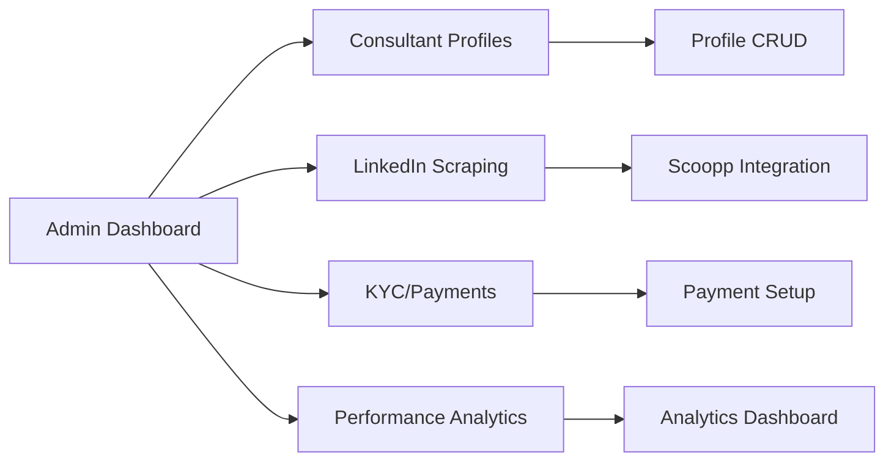
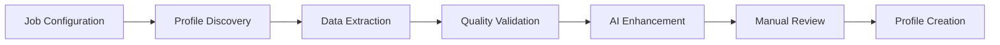

# Magnetiq v2 - Consultant Management Admin Specification

## Overview

The Consultant Management Admin Panel provides comprehensive tools for managing the consultant network, including profile CRUD operations, LinkedIn scraping integration, admin-managed KYC/payment workflows, performance analytics, and payout management. This specification focuses on the consultant-specific admin interfaces and workflows, particularly emphasizing the separation between consultant self-signup (LinkedIn-based only) and admin-managed profile completion.

→ **Implements**: [Consultant Network Strategy](../business/consultant-network.md) 
← **Supports**: [Admin Panel Architecture](./admin.md#consultant-management), [Business Automation](../features/business-automation.md)
⚡ **Dependencies**: [Authentication System](./authentication.md), [Consultant API](../../backend/api.md#consultant-endpoints), [Database Schema](../../backend/database.md#consultant-tables)

## Visual System Overview


*Complete consultant management system showing CRUD operations, scraping workflows, and payment processing*



⚡ **System Integration**:
- **API Layer**: [Consultant Endpoints](../../backend/api.md#consultant-management-endpoints)
- **Data Layer**: [Consultant Database Schema](../../backend/database.md#consultants)
- **Integration Layer**: [Scoopp LinkedIn Integration](../../integrations/scoopp-webcrawling.md)
- **Payment Layer**: [Payment Processing](../../integrations/payment-processing.md)
- **Security Layer**: [Admin Authentication](./authentication.md), [KYC Compliance](../../security.md#kyc-compliance)

## Tab Navigation Structure

### Main Consultant Management Interface (`/admin/consultants`)

```
├── Consultant Profiles (/admin/consultants/profiles)
├── LinkedIn Scraping (/admin/consultants/scraping)
├── Admin-Managed KYC & Payments (/admin/consultants/kyc-payments)
├── Performance Analytics (/admin/consultants/analytics)
├── Profile Completion Workflow (/admin/consultants/completion)
└── voltAIc Profile Generation (/admin/consultants/voltaic-profiles)
```

## 1. Consultant Profiles Tab (`/admin/consultants/profiles`)

→ **API Integration**: [Consultant Profile API](../../backend/api.md#consultant-profile-endpoints)
← **Data Source**: [Consultant Database Tables](../../backend/database.md#consultants)
⚡ **Dependencies**: [File Upload Service](../../integrations/file-storage.md), [User Authentication](../../security.md#authentication)

### Enhanced Consultant Profile Structure


```tsx
interface ConsultantProfile {
  id: string;
  
  // Personal Information → [Contact Management](../../features/contact-management.md)
  personalInfo: {
    firstName: string;
    lastName: string;
    title: string;
    email: string;
    phone?: string;
    photo: string;
    location: {
      country: string;
      city: string;
      timezone: string;
    };
  };
  
  // Professional Information ← [LinkedIn Data](../../integrations/linkedin.md)
  professionalInfo: {
    biography: PortableTextContent; // Rich biography with PortableText
    shortBio: string; // 150 character summary for listings
    expertise: string[];
    specializations: PortableTextContent; // Detailed specialization descriptions
    linkedin?: string;
    twitter?: string;
    website?: string;
    certifications: Certification[];
    languages: ('en' | 'de')[];
    yearsExperience: number;
    industryFocus: string[];
    consultingAreas: ConsultingArea[];
  };
  
  // LinkedIn Integration Data → [Scoopp Integration](../../integrations/scoopp-webcrawling.md)
  linkedinData: {
    profileUrl?: string;
    scrapingJobId?: string;
    lastScraped?: Date;
    profileData?: LinkedInProfileData;
    verificationStatus: 'pending' | 'verified' | 'failed' | 'manual';
    scraperNotes?: string;
  };
  
  // Availability & Booking → [Booking Management](./business/book-a-meeting.md#consultant-availability)
  availability: {
    // Consultant availability configuration
    // → Complete booking settings in [Booking Management](./business/book-a-meeting.md#availability-management)
    basicAvailability: ConsultantBasicAvailability;
  };
  
  // Payment & KYC Information ← [Payment Processing](../../integrations/payment-processing.md)
  paymentInfo: {
    kycStatus: 'not_started' | 'pending' | 'approved' | 'rejected';
    paymentMethodId?: string;
    taxId?: string;
    businessType: 'individual' | 'company';
    invoiceSettings: {
      companyName?: string;
      address: Address;
      vatNumber?: string;
    };
    kycDocuments: KYCDocument[];
  };
  
  // Content Associations ↔ [Content Management](../features/content-management.md)
  contentAssociations: {
    authoredWhitepapers: string[]; // → [Whitepaper System](../public/features/whitepapers.md)
    webinarSessions: string[]; // → [Webinar Management](./business/webinar.md)
    blogPosts: string[];
    caseStudies: string[];
  };
  
  // Performance Analytics ← [Analytics System](../../features/analytics.md)
  analytics: {
    // Basic performance metrics
    // → Complete booking analytics in [Booking Management](./business/book-a-meeting.md#consultant-analytics)
    performanceOverview: ConsultantPerformanceOverview;
    totalRatings: number;
    responseTime: number; // Average response time in minutes
    totalEarnings: number;
    currentMonthEarnings: number;
  };
  
  // System Metadata
  metadata: {
    createdAt: Date;
    createdBy: string;
    lastModified: Date;
    lastModifiedBy: string;
    status: 'draft' | 'active' | 'inactive' | 'suspended';
    verificationLevel: 'unverified' | 'email_verified' | 'profile_verified' | 'fully_verified';
    aiGeneratedContent: boolean; // Flag for AI-generated profiles
    manualReviewRequired: boolean;
    internalNotes: PortableTextContent;
  };
}
```

**Supporting Interfaces**:
```tsx
interface ConsultingArea {
  name: string;
  level: 'beginner' | 'intermediate' | 'expert';
  yearsExperience: number;
  description?: string;
}

interface KYCDocument {
  id: string;
  type: 'passport' | 'id_card' | 'business_license' | 'tax_document' | 'bank_statement';
  fileName: string;
  uploadDate: Date;
  verificationStatus: 'pending' | 'verified' | 'rejected';
  notes?: string;
}

interface LinkedInProfileData {
  headline: string;
  summary: string;
  experience: WorkExperience[];
  education: Education[];
  skills: string[];
  connections: number;
  profileImageUrl?: string;
  lastScrapedData: any; // Raw scraper response
}
```

### Consultant Profile Management Interface


**List View Features**:
- **Advanced Table Component**: Sortable, filterable consultant directory using [TanStack Table](./admin.md#table-components)
- **Status Indicators**: Visual status badges (online/offline, KYC status, verification level)
- **Quick Actions**: Edit profile, view details, toggle status, initiate scraping
- **Bulk Operations**: Mass status updates, export selected, bulk email
- **Smart Filtering**: By status, expertise, earnings, verification level
  - → Availability filtering in [Booking Management](./business/book-a-meeting.md#availability-filtering)
- **Search**: Full-text search across name, expertise, bio, and skills

**Card View Features**:
- **Profile Cards**: Photo, name, title, rating, and key metrics
- **Hover Actions**: Quick preview, edit, message, view analytics
- **Status Overlays**: Online status, new inquiry indicators
  - → Booking availability in [Booking Management](./business/book-a-meeting.md#consultant-availability-status)
- **Performance Metrics**: Revenue, rating display
  - → Booking count metrics in [Booking Management](./business/book-a-meeting.md#consultant-booking-metrics)

**Profile Detail View**:
- **Tabbed Interface**: Personal Info, Professional Info, LinkedIn Data, Payment Info, Analytics
- **Live LinkedIn Preview**: Side-by-side comparison with scraped data
- **Content Association Manager**: Link/unlink whitepapers, webinars, blog posts
- **Analytics Dashboard**: Performance charts, revenue trends
  - → Booking history and analytics in [Booking Management](./business/book-a-meeting.md#booking-analytics)
- **Communication Log**: Message history, admin notes
  - → Booking inquiries and communication in [Booking Management](./business/book-a-meeting.md#booking-communication)

## 2. LinkedIn Scraping Tab (`/admin/consultants/scraping`)

→ **API Integration**: [Scoopp Integration API](../../integrations/scoopp-webcrawling.md#api-endpoints)
← **Job Queue System**: [Background Jobs](../../backend/api.md#job-queue)
⚡ **Dependencies**: [Scoopp Framework](../../integrations/scoopp-webcrawling.md), [Webhook Processing](../../integrations/webhooks.md)

### Scoopp-Powered LinkedIn Scraping Wizard




**Scraping Job Configuration Interface**:
```tsx
interface ScrapingJobConfig {
  jobId: string;
  jobName: string;
  targetProfiles: {
    linkedinUrls: string[];
    searchCriteria?: {
      keywords: string[];
      location?: string;
      industry?: string[];
      experienceLevel?: 'entry' | 'mid' | 'senior' | 'executive';
      connectionLevel?: '1st' | '2nd' | '3rd';
    };
  };
  scrapingOptions: {
    includeExperience: boolean;
    includeEducation: boolean;
    includeSkills: boolean;
    includeConnections: boolean;
    includeRecommendations: boolean;
    fullProfileData: boolean;
  };
  processingOptions: {
    autoCreateProfiles: boolean;
    requireManualReview: boolean;
    aiEnhancement: boolean;
    duplicateDetection: boolean;
    qualityThreshold: number; // 1-10 scale
  };
  scheduling: {
    executeNow: boolean;
    scheduledFor?: Date;
    repeatInterval?: 'none' | 'weekly' | 'monthly';
  };
}
```

**Scraping Job Monitoring Dashboard**:
- **Active Jobs List**: Real-time status of running scraping jobs
- **Job Status Indicators**: Queued, running, completed, failed, paused
- **Progress Tracking**: Profiles scraped vs. total, success rate, errors
- **Real-time Log Viewer**: Live updates from [Scoopp scraping process](../../integrations/scoopp-webcrawling.md#monitoring)
- **Job Controls**: Pause, resume, cancel, restart failed jobs
- **Results Preview**: Quick preview of scraped data quality

**Scraping Results Management**:
```tsx
interface ScrapingResult {
  jobId: string;
  profileUrl: string;
  status: 'success' | 'failed' | 'partial' | 'requires_review';
  scrapedAt: Date;
  dataQuality: {
    score: number; // 1-10 quality score
    completeness: number; // Percentage of fields populated
    confidence: number; // AI confidence in data accuracy
    issues: string[]; // Detected data quality issues
  };
  extractedData: LinkedInProfileData;
  processingNotes: string[];
  reviewStatus: 'pending' | 'approved' | 'rejected' | 'needs_revision';
  assignedReviewer?: string;
  consultantProfileId?: string; // If auto-created or linked
}
```

**Manual Review Workflow Interface**:
- **Review Queue**: Scraped profiles requiring manual review
- **Side-by-Side Comparison**: Original LinkedIn vs. extracted data
- **Data Correction Tools**: Edit extracted fields, add missing information
- **Approval Actions**: Approve, reject, request revision, escalate
- **Bulk Review Tools**: Batch approval for high-quality results
- **Reviewer Assignment**: Assign specific profiles to team members

## 3. AI-Powered Profile Generation

→ **Integration**: [OpenAI API](../../integrations/openai-api.md)
⚡ **Dependencies**: [Content Validation](../../security.md#content-validation), [Privacy Protection](../../privacy-compliance.md#ai-processing)

### AI Profile Enhancement Features


**AI Profile Generator Interface**:
```tsx
interface AIProfileGenerator {
  inputData: {
    rawText?: string; // Unstructured resume/bio text
    linkedinData?: LinkedInProfileData;
    existingProfile?: Partial<ConsultantProfile>;
    additionalContext?: string;
  };
  generationOptions: {
    outputLanguage: 'en' | 'de' | 'both';
    biographyLength: 'short' | 'medium' | 'long';
    toneOfVoice: 'professional' | 'friendly' | 'authoritative' | 'approachable';
    focusAreas: string[]; // Emphasize specific expertise
    includePersonality: boolean;
    generateSpecializations: boolean;
  };
  qualityControls: {
    factChecking: boolean;
    grammarCheck: boolean;
    consistencyValidation: boolean;
    brandAlignment: boolean;
  };
}
```

**AI Generation Workflow**:
1. **Data Input**: Upload resume, paste bio text, or use scraped LinkedIn data
2. **Content Analysis**: AI analyzes and structures unstructured information
3. **Profile Generation**: Creates structured consultant profile with PortableText content
4. **Quality Review**: Automated checks for accuracy, consistency, and completeness
5. **Human Review**: Manual review and editing before profile activation
6. **A/B Testing**: Optional testing of different bio versions for performance

**Generated Content Quality Indicators**:
- **Accuracy Score**: AI confidence in factual accuracy
- **Completeness Meter**: Percentage of profile fields populated
- **Uniqueness Check**: Originality compared to existing profiles
- **Brand Alignment**: Consistency with company voice and values
- **SEO Optimization**: Keyword density and search optimization score

## 4. Admin-Managed KYC & Payments Tab (`/admin/consultants/kyc-payments`)

→ **Payment Integration**: [Payment Processing API](../../integrations/payment-processing.md)
← **Compliance**: [Privacy Policy](../../privacy-compliance.md#financial-data), [KYC Regulations](../../security.md#kyc-compliance)

### Admin-Managed KYC (Know Your Customer) Process


**KYC Management Interface for Admins**:

This interface allows site administrators to manually complete KYC processes for consultants who have signed up through the simplified LinkedIn-first signup process. Consultants do NOT complete KYC during signup.

**Admin KYC Workflow Interface**:
```tsx
interface KYCWorkflow {
  consultantId: string;
  kycLevel: 'basic' | 'enhanced' | 'premium';
  currentStage: {
    stage: 'identity' | 'address' | 'business' | 'financial' | 'review' | 'approved';
    status: 'pending' | 'in_progress' | 'completed' | 'rejected';
    completedAt?: Date;
    rejectionReason?: string;
    nextAction: string;
  };
  requiredDocuments: KYCRequirement[];
  submittedDocuments: KYCDocument[];
  verificationResults: {
    identityVerification: VerificationResult;
    addressVerification: VerificationResult;
    businessVerification?: VerificationResult;
    financialVerification?: VerificationResult;
  };
  complianceFlags: {
    sanctionsList: boolean;
    pepCheck: boolean; // Politically Exposed Person
    adverseMedia: boolean;
    riskLevel: 'low' | 'medium' | 'high';
  };
}
```

**Supporting Interfaces**:
```tsx
interface KYCRequirement {
  documentType: string;
  required: boolean;
  description: string;
  acceptedFormats: string[];
  maxFileSize: number;
  exampleUrl?: string;
}

interface VerificationResult {
  status: 'pending' | 'verified' | 'failed' | 'manual_review';
  verifiedAt?: Date;
  verificationMethod: 'automated' | 'manual' | 'third_party';
  confidence: number;
  details: any;
  reviewNotes?: string;
}
```

**Admin KYC Management Features**:
- **Consultant Selection Interface**: Choose consultants requiring KYC completion
- **Document Collection on Behalf**: Admins initiate KYC document requests to consultants
- **Verification Status Dashboard**: Real-time KYC progress tracking for all consultants
- **Document Review Interface**: Side-by-side document verification
- **Risk Assessment Tools**: Automated risk scoring and manual overrides
- **Compliance Reporting**: KYC status reports and audit trails
- **Integration Monitors**: Third-party KYC service status and results
- **Bulk KYC Initiation**: Start KYC processes for multiple consultants simultaneously

### Admin-Managed Payment Setup & Configuration


**Admin-Initiated Payment Method Configuration**:

Administrators manage payment setup for consultants who have completed the simplified signup process. Payment methods are NOT configured during consultant self-signup.

**Payment Setup Management Interface**:
```tsx
interface PaymentSetup {
  consultantId: string;
  paymentMethods: PaymentMethod[];
  defaultMethodId: string;
  payoutSchedule: {
    frequency: 'weekly' | 'bi_weekly' | 'monthly';
    dayOfWeek?: number; // For weekly
    dayOfMonth?: number; // For monthly
    minimumAmount: number;
  };
  taxInformation: {
    taxId: string;
    taxForm?: string; // W-9, W-8BEN, etc.
    taxClassification: string;
    backupWithholding: boolean;
    exemptPayee: boolean;
  };
  invoiceSettings: {
    automaticInvoicing: boolean;
    invoiceTemplate: string;
    includeDetails: boolean;
    brandingEnabled: boolean;
  };
}

interface PaymentMethod {
  id: string;
  type: 'bank_account' | 'paypal' | 'wise' | 'crypto';
  details: {
    accountName: string;
    routingNumber?: string;
    accountNumber?: string;
    iban?: string;
    swiftCode?: string;
    paypalEmail?: string;
    cryptoAddress?: string;
    cryptoCurrency?: string;
  };
  status: 'pending' | 'verified' | 'failed';
  isDefault: boolean;
  verifiedAt?: Date;
}
```

**Admin Payment Management Dashboard**:
- **Consultant Payment Status**: Overview of payment setup completion by consultant
- **Payout Calendar**: Visual calendar of scheduled payouts for all consultants
- **Payment Method Manager**: Add, edit, verify payment methods on behalf of consultants
- **Transaction History**: Complete payment and payout history for all consultants
- **Tax Document Generator**: Automatic 1099/tax form generation
- **Dispute Management**: Handle payment disputes and chargebacks
- **Payment Analytics**: Revenue trends, payout patterns, method performance
- **Bulk Payment Setup**: Initiate payment configuration for multiple consultants
- **Payment Method Verification**: Verify and approve consultant-provided payment details

### Payout Scheduling & Management

**Payout Management Interface**:
```tsx
interface PayoutManagement {
  scheduledPayouts: ScheduledPayout[];
  processedPayouts: ProcessedPayout[];
  failedPayouts: FailedPayout[];
  payoutRules: {
    minimumAmount: number;
    holdingPeriod: number; // Days to hold before payout
    disputeReserve: number; // Percentage held for disputes
    processingFee: number;
  };
  bulkOperations: {
    generatePayouts: () => void;
    processPayouts: () => void;
    cancelPayouts: (ids: string[]) => void;
    exportPayouts: (dateRange: DateRange) => void;
  };
}

interface ScheduledPayout {
  id: string;
  consultantId: string;
  amount: number;
  currency: string;
  scheduledDate: Date;
  paymentMethodId: string;
  includedBookings: string[];
  fees: {
    platformFee: number;
    processingFee: number;
    netAmount: number;
  };
  status: 'scheduled' | 'processing' | 'completed' | 'failed';
  notes?: string;
}
```

**Payout Features**:
- **Automated Payout Generation**: Rule-based payout calculation
- **Batch Processing**: Process multiple payouts simultaneously
- **Payout Validation**: Verify amounts, methods, and consultant status
- **Hold Management**: Manage payment holds and reserves
- **Reconciliation Tools**: Match payouts with bookings and fees
- **Export & Reporting**: Detailed payout reports for accounting

## 5. Profile Completion Workflow Tab (`/admin/consultants/completion`)

→ **Workflow Management**: [Admin Profile Completion](../../features/consultant-profile-completion.md)
← **Data Source**: [LinkedIn Profile Data](../../integrations/linkedin.md#profile-extraction)
⚡ **Dependencies**: [voltAIc Profile Generation](../../integrations/ai-profile-generation.md), [Manual Profile Review](./admin.md#profile-review-tools)

### Consultant Profile Completion Management


**Admin Profile Completion Dashboard**:
This interface manages the completion of consultant profiles after the simplified LinkedIn-first signup process.

```tsx
interface ProfileCompletionManagement {
  pendingProfiles: {
    consultantId: string;
    linkedinData: LinkedInProfileData;
    completionStatus: {
      basicInfo: 'completed' | 'pending' | 'needs_review';
      professionalInfo: 'completed' | 'pending' | 'needs_review';
      kycStatus: 'not_started' | 'in_progress' | 'completed';
      paymentSetup: 'not_started' | 'in_progress' | 'completed';
      profileGeneration: 'not_started' | 'in_progress' | 'completed';
    };
    assignedAdmin?: string;
    priorityLevel: 'high' | 'medium' | 'low';
    completionDeadline?: Date;
  }[];
  
  bulkOperations: {
    generateProfiles: (consultantIds: string[]) => Promise<void>;
    initiateKYC: (consultantIds: string[]) => Promise<void>;
    assignToAdmin: (consultantIds: string[], adminId: string) => Promise<void>;
    markForReview: (consultantIds: string[]) => Promise<void>;
  };
  
  automationRules: {
    autoGenerateProfiles: boolean;
    autoInitiateKYC: boolean;
    qualityThresholds: ProfileQualityThresholds;
    reviewRequirements: ReviewRequirement[];
  };
}
```

**Profile Completion Features**:
- **Completion Status Dashboard**: Visual overview of all consultant profile completion stages
- **Admin Task Assignment**: Assign specific consultants to admin team members for completion
- **Automated Profile Generation**: Trigger voltAIc profile generation for multiple consultants
- **KYC Initiation Queue**: Start KYC processes for consultants ready for payment setup
- **Bulk Operations**: Mass operations for profile completion tasks
- **Quality Control**: Review and approve AI-generated profiles before publication
- **Progress Tracking**: Timeline and milestone tracking for each consultant's completion
- **Notification System**: Alerts for completion deadlines and quality issues

## 6. voltAIc Profile Generation Tab (`/admin/consultants/voltaic-profiles`)

→ **AI Integration**: [voltAIc Profile Generation Service](../../integrations/voltaic-profile-generation.md)
← **Data Source**: [LinkedIn Extracted Data](../../integrations/linkedin.md#data-extraction)
⚡ **Dependencies**: [AI Content Generation](../../backend/api.md#ai-services), [Profile Quality Control](./admin.md#quality-assurance)

### Automated voltAIc Profile Creation


**voltAIc Profile Generation Interface**:
This specialized interface manages the automated creation of voltAIc consultant profiles using LinkedIn data extraction and AI-powered content generation.

```tsx
interface VoltaicProfileGeneration {
  generationQueue: {
    consultantId: string;
    linkedinData: LinkedInProfileData;
    generationStatus: 'queued' | 'processing' | 'completed' | 'failed' | 'review_required';
    generatedContent: {
      biography: PortableTextContent;
      specializations: string[];
      expertise: ExpertiseArea[];
      workExperience: WorkExperience[];
      qualityScore: number;
    };
    reviewNotes?: string;
    approvalStatus: 'pending' | 'approved' | 'needs_revision' | 'rejected';
  }[];
  
  generationSettings: {
    contentLength: 'concise' | 'detailed' | 'comprehensive';
    toneOfVoice: 'professional' | 'approachable' | 'authoritative';
    focusAreas: string[];
    includePersonality: boolean;
    brandAlignment: 'magnetiq' | 'consultant' | 'balanced';
  };
  
  qualityControls: {
    minimumQualityScore: number;
    factCheckingEnabled: boolean;
    plagiarismCheck: boolean;
    brandConsistency: boolean;
    grammarValidation: boolean;
  };
}
```

**voltAIc Profile Generation Features**:
- **Batch Profile Generation**: Process multiple LinkedIn profiles into voltAIc profiles simultaneously
- **AI Content Optimization**: Generate compelling biographies and specialization descriptions
- **Quality Assurance Pipeline**: Automated quality scoring and manual review workflows
- **Brand Alignment Tools**: Ensure generated profiles match voltAIc brand voice and standards
- **Content Versioning**: A/B test different profile versions for performance optimization
- **Approval Workflow**: Multi-stage review process for generated content
- **LinkedIn Data Integration**: Seamless import of LinkedIn profile data for enhancement
- **Profile Performance Tracking**: Monitor engagement and conversion rates of generated profiles

## 7. Performance Analytics Tab (`/admin/consultants/analytics`)

→ **Analytics Integration**: [Analytics Dashboard](../../features/analytics.md#consultant-metrics)
⚡ **Data Sources**: [Payment Data](../../integrations/payment-processing.md#analytics)
→ **Booking Data Sources**: [Booking Management Analytics](./business/book-a-meeting.md#data-sources)

### Consultant Performance Dashboard


**Key Performance Indicators**:
```tsx
interface ConsultantAnalytics {
  performanceMetrics: {
    totalRevenue: MoneyAmount;
    revenueGrowth: PercentageChange;
    // Booking metrics managed in [Booking Management](./business/book-a-meeting.md#consultant-booking-metrics)
    conversionRate: number;
    clientSatisfaction: {
      averageRating: number;
      totalReviews: number;
      npsScore: number;
    };
  };
  
  financialMetrics: {
    monthlyRecurringRevenue: MoneyAmount;
    averageDealSize: MoneyAmount;
    lifetimeValue: MoneyAmount;
    payoutHistory: PayoutSummary[];
    outstandingEarnings: MoneyAmount;
    feeBreakdown: {
      platformFees: MoneyAmount;
      processingFees: MoneyAmount;
      netEarnings: MoneyAmount;
    };
  };
  
  engagementMetrics: {
    responseTime: {
      average: number; // minutes
      median: number;
      percentile90: number;
    };
    // Availability and utilization metrics in [Booking Management](./business/book-a-meeting.md#consultant-utilization-metrics)
    repeatClientRate: number;
    cancellationRate: number;
  };
  
  contentMetrics: {
    whitepaperViews: number;
    webinarAttendance: number;
    blogPostEngagement: number;
    linkedinConnections: number;
    profileViews: number;
    // Booking conversion metrics in [Booking Management](./business/book-a-meeting.md#conversion-metrics)
  };
}
```

**Analytics Dashboard Components**:
- **Revenue Chart**: Monthly/quarterly revenue trends with projections
- → **Booking Analytics**: [Complete booking analytics](./business/book-a-meeting.md#booking-patterns-analysis)
- **Client Satisfaction Matrix**: Rating distribution, review analysis, NPS trends
- **Performance Comparison**: Consultant rankings and peer comparisons
- **Geographic Analysis**: Client distribution, regional performance
- **Content Performance**: Associated content engagement and conversion impact

**Advanced Analytics Features**:
- **Predictive Analytics**: Revenue forecasting
  - → **Booking Predictions**: [Booking demand forecasting](./business/book-a-meeting.md#predictive-booking-analytics)
- **Cohort Analysis**: Client retention and lifetime value analysis
- **Attribution Modeling**: Track which content/activities drive leads
  - → **Booking Attribution**: [Booking attribution modeling](./business/book-a-meeting.md#booking-attribution-analysis)
- **A/B Testing Results**: Profile optimization experiment results
- **Benchmarking**: Industry and internal performance comparisons
- **Custom Reports**: Configurable analytics dashboards per consultant

## Advanced Interface Components

### Enhanced Consultant Management Tables

The following table components have been enhanced to support the simplified signup and admin-managed completion workflow:

### Table Components for Consultant Listings

```tsx
interface ConsultantTableComponent {
  columns: {
    consultant: {
      photo: boolean;
      name: boolean;
      title: boolean;
      rating: boolean;
      status: boolean;
    };
    performance: {
      // Booking metrics in [Booking Management](./business/book-a-meeting.md#consultant-table-columns)
      revenue: boolean;
      conversionRate: boolean;
      responseTime: boolean;
    };
    // Availability columns in [Booking Management](./business/book-a-meeting.md#availability-table-columns)
    administrative: {
      signupStatus: boolean; // LinkedIn signup completion
      profileCompletionStatus: boolean; // Admin-managed completion
      kycStatus: boolean;
      paymentSetup: boolean;
      assignedAdmin: boolean; // Admin responsible for completion
      lastActivity: boolean;
      createdDate: boolean;
    };
  };
  features: {
    multiSort: boolean;
    columnFilters: boolean;
    globalSearch: boolean;
    rowSelection: boolean;
    bulkActions: boolean;
    exportOptions: boolean;
    columnVisibility: boolean;
    responsiveDesign: boolean;
  };
  actions: {
    quickEdit: boolean;
    viewProfile: boolean;
    viewAnalytics: boolean;
    messageConsultant: boolean;
    toggleStatus: boolean;
    initiateKYC: boolean;
    // Booking-related actions in [Booking Management](./business/book-a-meeting.md#consultant-booking-actions)
  };
}
```

### Form Components for Consultant Profile Editing

```tsx
interface ConsultantFormComponents {
  personalInfoForm: {
    basicDetails: FormSection;
    contactInformation: FormSection;
    locationSettings: FormSection;
    profilePhoto: FileUploadComponent;
  };
  professionalInfoForm: {
    biographyEditor: PortableTextEditor;
    expertiseSelector: MultiSelectComponent;
    certificationUploader: FileUploadComponent;
    experienceEditor: DynamicFormComponent;
  };
  // Availability forms managed in [Booking Management](./business/book-a-meeting.md#availability-form-components)
  paymentForm: {
    kycWizard: StepperComponent;
    paymentMethodManager: PaymentMethodComponent;
    taxInformationForm: TaxFormComponent;
    payoutSettings: PayoutConfigComponent;
  };
}
```

### LinkedIn Profile Preview and Validation Components

```tsx
interface LinkedInIntegrationComponents {
  profilePreview: {
    linkedinProfile: LinkedInProfileRenderer;
    extractedData: DataExtractionRenderer;
    comparisonView: SideBySideComparator;
    validationIndicators: ValidationStatusComponent;
  };
  
  scrapingInterface: {
    jobCreator: ScrapingJobWizard;
    jobMonitor: JobStatusTracker;
    resultReviewer: ScrapingResultReviewer;
    qualityAssessment: DataQualityAnalyzer;
  };
  
  dataValidation: {
    experienceValidator: ExperienceVerifier;
    skillsValidator: SkillsVerifier;
    educationValidator: EducationVerifier;
    connectionsValidator: ConnectionsVerifier;
  };
}
```

## Cross-Reference Integration Summary

### API Integration Cross-References
→ [Consultant Profile API](../../backend/api.md#consultant-profile-endpoints)
→ [LinkedIn Scraping API](../../backend/api.md#scraping-endpoints)
→ [Payment Processing API](../../backend/api.md#payment-endpoints)
→ [KYC Management API](../../backend/api.md#kyc-endpoints)
→ [Analytics API](../../backend/api.md#analytics-endpoints)

### Database Schema Cross-References
→ [Consultant Tables](../../backend/database.md#consultant-tables)
→ [Payment Tables](../../backend/database.md#payment-tables)
→ [Scraping Job Tables](../../backend/database.md#scraping-tables)
→ [KYC Document Tables](../../backend/database.md#kyc-tables)
→ [Analytics Tables](../../backend/database.md#analytics-tables)

### Integration Dependencies
→ [Scoopp LinkedIn Integration](../../integrations/scoopp-webcrawling.md)
→ [Payment Processing Integration](../../integrations/payment-processing.md)
→ [OpenAI API Integration](../../integrations/openai-api.md)
→ [File Storage Service](../../integrations/file-storage.md)
→ [Email Service Integration](../../integrations/smtp-brevo.md)

### Security and Compliance Cross-References
← [KYC Compliance Requirements](../../security.md#kyc-compliance)
← [Financial Data Protection](../../privacy-compliance.md#financial-data)
← [Payment Security](../../security.md#payment-security)
← [Data Retention Policies](../../privacy-compliance.md#data-retention)

### Feature Integration Cross-References
↔️ [Booking System Integration](./business/book-a-meeting.md#consultant-integration)
↔️ [Webinar Management Integration](./business/webinar.md#consultant-assignment)
↔️ [Whitepaper System Integration](../public/features/whitepapers.md#author-management)
↔️ [Content Marketing Integration](../../features/content-marketing.md#consultant-content)

### User Experience Cross-References
← [User Personas](../../users/) - All consultant management interfaces designed for [Site Admin](../../users/site-admin.md) and [Content Editor](../../users/content-editor.md) personas
→ [Design System](../design-system.md) - All components follow established design patterns
⚡ [Responsive Design](../public.md#responsive-design) - Mobile-friendly admin interfaces

## Technology Implementation

### Frontend Technology Stack
- **Framework**: React 18 with TypeScript → [Architecture](../../architecture.md#frontend)
- **State Management**: Redux Toolkit with RTK Query → [State Management](../public.md#state-management)
- **UI Components**: Tailwind CSS with Headless UI → [Design System](../design-system.md)
- **Tables**: TanStack Table v8 for advanced data grids → [Admin Panel](./admin.md#table-components)
- **Forms**: React Hook Form with Zod validation → [Form Components](./admin.md#form-management)
- **Charts**: Recharts for analytics visualization → [Analytics](./admin.md#analytics-reporting)

### Integration Requirements
- **API Client**: Axios with RTK Query integration
- **File Upload**: Drag-and-drop with progress tracking
- **Real-time Updates**: WebSocket connections for job monitoring
- **Export Functions**: CSV/Excel/PDF export capabilities
- **Bulk Operations**: Mass update and batch processing support

## Related Diagrams
- [Consultant Management System Flow](../../../diagrams/spec_v2/features/consultant_management_system.png)
- [LinkedIn Scraping Integration](../../../diagrams/spec_v2/integrations/linkedin_scraping_integration.png)
- [KYC and Payment Workflow](../../../diagrams/spec_v2/features/kyc_payment_workflow.png)
- [Performance Analytics Dashboard](../../../diagrams/spec_v2/features/performance_analytics_dashboard.png)
- [AI Profile Generation Process](../../../diagrams/spec_v2/features/ai_profile_generation_process.png)

🔗 **Complete Admin Panel Index**: [All Admin Panel Specifications](../)