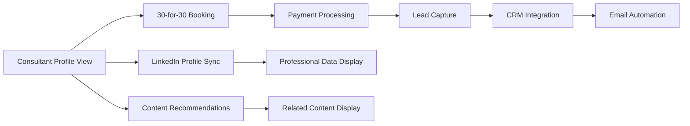

# Magnetiq v2 - Public Frontend Specification

## Overview

The public frontend is a responsive, multilingual website that serves as the primary interface for visitors to interact with voltAIc Systems' content and services. It provides access to webinars, whitepapers, consultation booking, and general company information.

**Important**: The public frontend operates without user authentication. All content and features are accessible without registration or login. Administrative functionality is handled separately through the dedicated admin panel at `/frontend/adminpanel/admin.md`.

## Technical Foundation

### Technology Stack
- **Framework**: React 18 with TypeScript
- **Content Format**: PortableText for structured content
- **Content Rendering**: @portabletext/react for PortableText serialization
- **Styling**: Tailwind CSS with custom design system
- **State Management**: Redux Toolkit with RTK Query
- **Routing**: React Router v6
- **Forms**: React Hook Form with Zod validation
- **Build Tool**: Vite with TypeScript support
- **Package Manager**: npm

### Development Environment
- **Port**: 8038 (development), 8036 (production)
- **Backend API**: Proxied to port 3036 via Vite proxy
- **Hot Reload**: Vite HMR
- **TypeScript**: Strict mode enabled
- **ESLint**: Airbnb configuration with custom rules
- **Prettier**: Code formatting

## Design System

### Responsive Design
- **Mobile First**: 320px+ (small phones)
- **Tablet**: 768px+ (tablets)
- **Desktop**: 1024px+ (laptops)
- **Large Desktop**: 1440px+ (desktop monitors)
- **Ultra Wide**: 1920px+ (large monitors)

### Color Scheme
```css
:root {
  /* Light Mode (Default) */
  --primary-50: #eff6ff;
  --primary-500: #3b82f6;
  --primary-900: #1e3a8a;
  
  /* Dark Mode */
  --dark-bg: #1a1a1a;
  --dark-surface: #2d2d2d;
  --dark-text: #ffffff;
  
  /* Semantic Colors */
  --success: #10b981;
  --warning: #f59e0b;
  --error: #ef4444;
  --info: #3b82f6;
}
```

### Typography
- **Headings**: Inter font family
- **Body**: System font stack with fallbacks
- **Code**: JetBrains Mono
- **Scale**: 1.25 modular scale

### Components Library
- Header with navigation
- Footer with multi-column layout
- Card components for content display
- Modal/Dialog system
- Form components with validation
- Button variants and states
- Loading states and skeletons

## Core Features

### 1. Header & Navigation

#### Logo Section
```tsx
interface LogoProps {
  variant: 'light' | 'dark';
  size: 'sm' | 'md' | 'lg';
}
```
- Responsive voltAIc Systems logo
- Dark/light mode variants
- Link to homepage

#### Primary Navigation
- **Dropdown menus** with smooth animations
- **Hover effects** with proper accessibility
- **Mobile hamburger menu** with slide-out drawer
- **Keyboard navigation** support

Menu Structure:
```
Home (/)
Services (/services) ▼
  ├── AI Consulting (/services/ai-consulting)
  ├── Digital Transformation (/services/digital-transformation)
  ├── Automation (/services/automation)
  └── Development (/services/development)
Solutions (/solutions) ▼
  ├── Industries (/solutions/industries)
  ├── Technology (/solutions/technology)
  └── Case Studies (/solutions/case-studies)
Resources (/resources) ▼
  ├── Webinars (/resources/webinars)
  ├── Whitepapers (/resources/whitepapers)
  ├── Blog (/resources/blog)
  └── Tools (/resources/tools)
About (/about) ▼
  ├── About Overview (/about) - Landing page with sub-section cards
  ├── Our Story (/about/story)
  ├── Team (/about/team)
  ├── Mission (/about/mission)
  ├── Careers (/about/careers)
  ├── Partners (/about/partners)
  └── News (/about/news)
Contact (/contact) ▼
  ├── Contact Overview (/contact) - Landing page with contact option cards
  ├── Booking (/contact/booking) - BookAMeetingPage
  ├── General (/contact/general)
  ├── Support (/contact/support)
  └── Locations (/contact/locations)
```

**German Routes (with /de prefix):**
```
Startseite (/de)
Dienstleistungen (/de/dienstleistungen) ▼
  ├── KI-Beratung (/de/dienstleistungen/ki-beratung)
  ├── Digitale Transformation (/de/dienstleistungen/digitale-transformation)
  ├── Automatisierung (/de/dienstleistungen/automatisierung)
  └── Entwicklung (/de/dienstleistungen/entwicklung)
Lösungen (/de/loesungen) ▼
  ├── Branchen (/de/loesungen/branchen)
  ├── Technologie (/de/loesungen/technologie)
  └── Fallstudien (/de/loesungen/fallstudien)
Ressourcen (/de/ressourcen) ▼
  ├── Webinare (/de/ressourcen/webinare)
  ├── Whitepapers (/de/ressourcen/whitepapers)
  ├── Blog (/de/ressourcen/blog)
  └── Tools (/de/ressourcen/tools)
Über uns (/de/ueber-uns) ▼
  ├── Übersicht (/de/ueber-uns) - Landing page with sub-section cards
  ├── Geschichte (/de/ueber-uns/geschichte)
  ├── Team (/de/ueber-uns/team)
  ├── Mission (/de/ueber-uns/mission)
  ├── Karriere (/de/ueber-uns/karriere)
  ├── Partner (/de/ueber-uns/partner)
  └── Presse (/de/ueber-uns/presse)
Kontakt (/de/kontakt) ▼
  ├── Kontakt Übersicht (/de/kontakt) - Landing page with contact option cards
  ├── Terminbuchung (/de/kontakt/terminbuchung)
  ├── Allgemein (/de/kontakt/allgemein)
  ├── Support (/de/kontakt/support)
  └── Standorte (/de/kontakt/standorte)
```

#### Call-to-Action
- **Primary CTA**: "Book Meeting" → `/contact/booking`
- **Secondary CTA**: Language switcher (DE/EN)  
- **Utility**: Theme toggle (Light/Dark)
- **Admin Access**: Login link in mobile menu → `/auth/login`

### 2. Theme System

#### Dark/Light Mode Toggle
```tsx
interface ThemeContextValue {
  theme: 'light' | 'dark';
  toggleTheme: () => void;
  systemPreference: 'light' | 'dark';
}
```

Features:
- System preference detection
- Persistent user choice in localStorage
- Smooth transitions between themes
- Accessible toggle button with proper labels
- Theme-aware image variants

### 3. Multilingual Support

#### Language Implementation
- **Default Language**: English
- **Secondary Language**: German
- **Fallback Strategy**: English content if German missing
- **URL Strategy**: Path-based (`/de/page`, `/en/page`)
- **SEO**: Proper hreflang tags for search engines

#### Content Structure
```tsx
// PortableText structure for multilingual content
interface PortableTextContent {
  en: PortableTextBlock[];
  de?: PortableTextBlock[];
  meta: {
    lastUpdated: string;
    translator?: string;
    aiGenerated?: boolean;
  };
}

// Base PortableText block types
interface PortableTextBlock {
  _type: string;
  _key: string;
}

// Text block with spans
interface TextBlock extends PortableTextBlock {
  _type: 'block';
  style?: 'normal' | 'h1' | 'h2' | 'h3' | 'h4' | 'h5' | 'h6' | 'blockquote';
  children: Span[];
  markDefs?: MarkDefinition[];
  level?: number;
  listItem?: 'bullet' | 'number';
}

// Text span with formatting
interface Span {
  _type: 'span';
  text: string;
  marks?: string[];
}

// Custom blocks for Magnetiq
interface CTABlock extends PortableTextBlock {
  _type: 'cta';
  text: string;
  url: string;
  style: 'primary' | 'secondary' | 'outline';
  size: 'small' | 'medium' | 'large';
}

interface ImageBlock extends PortableTextBlock {
  _type: 'image';
  asset: {
    _ref: string;
    _type: 'reference';
  };
  alt: string;
  caption?: string;
  crop?: CropData;
  hotspot?: HotspotData;
}

interface VideoBlock extends PortableTextBlock {
  _type: 'video';
  url: string;
  title?: string;
  thumbnail?: string;
  autoplay?: boolean;
}
```

#### Translation Features
- **Manual translations** for critical content
- **AI-generated translations** with ⚡️ indicator
- **Translation memory** for consistency
- **Context-aware translations** based on page type

### 4. Homepage Layout

#### Hero Section
```tsx
interface HeroSection {
  headline: PortableTextContent;
  subheadline: PortableTextContent;
  ctaButtons: CTAButton[];
  backgroundImage?: string;
  videoBackground?: string;
}
```

Features:
- Compelling value proposition
- Multiple CTA buttons with different priorities
- Background video or image support
- Animated text reveals
- Mobile-optimized layout

#### Features Section
- **Grid layout** showcasing key capabilities
- **Icon + title + description** format
- **Hover effects** with subtle animations
- **Responsive columns**: 1 (mobile) → 2 (tablet) → 3 (desktop)

#### Social Proof
- Client logos
- Testimonials carousel
- Case study highlights
- Industry certifications

### 5. Page Builder System

#### PortableText Content System
```tsx
// PortableText-based page content
interface PageContent {
  content: PortableTextContent; // Main PortableText blocks
  excerpt?: PortableTextContent; // Optional excerpt
  seo: SEOMetadata;
  structuredData?: any; // Auto-generated from PortableText
}

// PortableText renderer configuration
interface PortableTextComponents {
  types: {
    image: React.ComponentType<ImageBlockProps>;
    video: React.ComponentType<VideoBlockProps>;
    cta: React.ComponentType<CTABlockProps>;
    form: React.ComponentType<FormBlockProps>;
    code: React.ComponentType<CodeBlockProps>;
  };
  marks: {
    link: React.ComponentType<LinkMarkProps>;
    strong: React.ComponentType<StrongMarkProps>;
    em: React.ComponentType<EmMarkProps>;
  };
  block: {
    h1: React.ComponentType<BlockProps>;
    h2: React.ComponentType<BlockProps>;
    h3: React.ComponentType<BlockProps>;
    h4: React.ComponentType<BlockProps>;
    h5: React.ComponentType<BlockProps>;
    h6: React.ComponentType<BlockProps>;
    blockquote: React.ComponentType<BlockProps>;
    normal: React.ComponentType<BlockProps>;
  };
  list: {
    bullet: React.ComponentType<ListProps>;
    number: React.ComponentType<ListProps>;
  };
  listItem: {
    bullet: React.ComponentType<ListItemProps>;
    number: React.ComponentType<ListItemProps>;
  };
}
```

#### PortableText Rendering
- **Custom serializers** for each block type
- **Responsive image handling** with srcset
- **Lazy loading** for media blocks
- **SEO optimization** from PortableText structure
- **Performance optimization** with React.memo and useMemo
- **Accessibility features** built into block components

## Consultant Profile System

### 1. Consultant Profile Pages (`/consultants/{slug}`)

#### Profile Overview
Each consultant maintains a comprehensive professional profile showcasing their expertise, credentials, and service offerings.

```tsx
interface ConsultantProfile {
  id: string;
  slug: string;
  personalInfo: {
    firstName: string;
    lastName: string;
    title: string;
    bio: PortableTextContent; // Rich biography content
    profileImage: string;
    galleryImages?: string[]; // Professional photo gallery
  };
  professionalData: {
    linkedinProfile?: LinkedInProfile; // → [LinkedIn Integration](../../integrations/linkedin.md#profile-sync)
    expertiseAreas: ExpertiseArea[];
    certifications: Certification[];
    specializations: string[];
    yearsExperience: number;
    languages: string[];
    location: {
      city: string;
      country: string;
      timezone: string;
    };
  };
  statistics: {
    whitepapersPublished: number; // ← [Content Statistics](../../../backend/api.md#consultant-stats)
    webinarsConducted: number;
    totalAttendees: number;
    averageRating: number;
    totalConsultations: number;
  };
  socialProof: {
    testimonials: Testimonial[]; // → [Testimonial System](./features/testimonials.md)
    clientRating: number;
    endorsements: Endorsement[];
    caseStudies: string[]; // Links to case study content
  };
  contentPortfolio: {
    authoredWhitepapers: string[]; // → [Whitepaper System](./features/whitepapers.md)
    conductedWebinars: string[]; // → [Webinar System](./features/webinars.md)
    blogPosts: string[];
    speakingEngagements: string[];
  };
  availability: {
    isActive: boolean;
    consultationTypes: ConsultationType[]; // → [30-for-30 Service](./features/consultation-booking.md)
    timeSlots: AvailabilitySlot[];
    bookingSettings: BookingConfiguration;
  };
}

interface LinkedInProfile {
  profileUrl: string;
  headline: string;
  summary: string;
  currentPosition: string;
  company: string;
  skills: string[];
  recommendations: number;
  connections: number;
  lastSyncDate: Date;
} // ← Synced via [LinkedIn API](../../integrations/linkedin.md#profile-data)

interface ExpertiseArea {
  name: string;
  category: 'AI' | 'Digital Transformation' | 'Automation' | 'Strategy';
  proficiencyLevel: 'Beginner' | 'Intermediate' | 'Expert' | 'Thought Leader';
  yearsExperience: number;
  certifications?: string[];
}

interface Certification {
  name: string;
  issuer: string;
  dateEarned: Date;
  expiryDate?: Date;
  credentialId?: string;
  verificationUrl?: string;
}

interface Testimonial {
  id: string;
  clientName: string;
  clientTitle: string;
  clientCompany: string;
  rating: number; // 1-5 stars
  content: PortableTextContent;
  dateProvided: Date;
  consultationType: string;
  isVerified: boolean;
} // → Managed via [Admin Panel](../adminpanel/admin.md#testimonial-management)
```

#### Profile Page Layout
**Hero Section:**
- Professional headshot with photo gallery trigger
- Name, title, and current position
- Key expertise areas and certifications
- Average rating and consultation count
- Primary CTA: "Book 30-for-30 Consultation" → [Booking Flow](./features/consultation-booking.md#30-for-30-flow)

**Professional Overview (PortableText):**
- Rich biography with embedded media
- Career highlights and achievements
- Professional philosophy and approach
- Video introduction (optional)

**Statistics Dashboard:**
```tsx
interface StatsDisplay {
  whitepapersPublished: {
    count: number;
    links: string[]; // → Direct links to [Authored Content](./features/whitepapers.md#author-filter)
  };
  webinarsConducted: {
    count: number;
    upcomingSessions: WebinarPreview[];
    pastSessions: WebinarPreview[];
  };
  consultationMetrics: {
    totalConsultations: number;
    averageRating: number;
    satisfactionRate: number;
  };
  engagementData: {
    totalAttendees: number;
    contentDownloads: number;
    followerCount: number;
  };
}
```

**LinkedIn Integration Panel:**
- Synced professional data display
- Current position and company
- Key skills and endorsements
- Professional network size
- Link to full LinkedIn profile → [LinkedIn Integration](../../integrations/linkedin.md#profile-display)

**Expertise & Certifications:**
- Visual expertise matrix
- Industry certifications with verification
- Skill proficiency indicators
- Specialization tags

**Client Testimonials:**
- Rotating testimonial carousel
- Star ratings with detailed feedback
- Client verification badges
- Filter by consultation type

**Content Portfolio:**
- Authored whitepapers with direct download
- Conducted webinars with registration links
- Blog posts and thought leadership content
- Speaking engagement history

**Booking Integration:**
- Real-time availability display
- 30-for-30 service highlighting (€30 consultation)
- Instant booking widget
- Service comparison table

### 2. Consultant Discovery & Search (`/consultants`)

#### Search & Filter Interface
```tsx
interface ConsultantSearchFilters {
  expertiseAreas: string[]; // Multi-select expertise filtering
  industries: string[]; // Industry specialization
  location: {
    city?: string;
    country?: string;
    timezone?: string;
    remoteOnly?: boolean;
  };
  availability: {
    nextAvailable?: 'today' | 'this-week' | 'this-month';
    consultationType?: ConsultationType[];
    timePreference?: 'morning' | 'afternoon' | 'evening';
  };
  experience: {
    minYears?: number;
    certificationRequired?: boolean;
  };
  ratings: {
    minRating?: number;
    minReviews?: number;
  };
  pricing: {
    maxHourlyRate?: number;
    offers30for30?: boolean; // Filter for 30-for-30 service
  };
  languages: string[];
}

interface ConsultantSearchResult {
  consultant: ConsultantProfile;
  matchScore: number; // Algorithm-generated relevance score
  nextAvailableSlot?: Date;
  specialtyMatch: string[]; // Matched expertise areas
  distanceKm?: number; // For location-based searches
} // → Search handled by [Backend Search API](../../backend/api.md#consultant-search)
```

**Search Interface Components:**
- **Advanced Search Bar** with autocomplete for expertise areas
- **Filter Sidebar** with collapsible sections
- **Map View Toggle** for location-based discovery
- **Sort Options**: Relevance, Rating, Availability, Experience, Price
- **Quick Filters**: Available Today, 30-for-30 Service, Top Rated

**Search Results Display:**
- **Card Layout** with consultant previews
- **List View** for detailed comparison
- **Availability Indicators** with next available slot
- **Match Scoring** with expertise alignment
- **Quick Actions**: View Profile, Book Consultation, Save Favorite

#### Featured Consultant Showcases
```tsx
interface FeaturedConsultantSection {
  sectionType: 'trending' | 'top-rated' | 'new-experts' | 'specialist-spotlight';
  consultants: ConsultantProfile[];
  criteria: string; // What makes them featured
  rotationSchedule: 'daily' | 'weekly' | 'monthly';
} // → Managed via [Admin Panel](../adminpanel/admin.md#consultant-promotion)
```

**Showcase Sections:**
- **Trending Consultants**: Most booked this month
- **Top Rated Experts**: Highest client satisfaction
- **New Talent**: Recently joined consultants
- **Specialist Spotlight**: Domain expertise focus

#### Consultant Matching Algorithm
```tsx
interface MatchingCriteria {
  userRequirements: {
    projectType: string;
    industryContext: string;
    timeframe: string;
    budgetRange: string;
    preferredLanguage: string;
  };
  consultantCapabilities: {
    expertiseAlignment: number; // 0-1 relevance score
    availabilityMatch: number;
    experienceLevel: number;
    clientSatisfaction: number;
    pricingFit: number;
  };
  algorithmWeights: {
    expertise: 0.3;
    availability: 0.25;
    rating: 0.2;
    experience: 0.15;
    pricing: 0.1;
  };
} // → Algorithm implemented in [Backend Matching Service](../../backend/api.md#consultant-matching)
```

### 3. 30-for-30 Service Integration

#### Dedicated Service Landing (`/30-for-30`)
**Service Overview:**
- Value proposition for €30 consultation
- Service benefits and guarantees
- Success stories and testimonials
- Consultant availability overview

**Booking Interface:**
```tsx
interface ThirtyForThirtyBooking {
  serviceDetails: {
    price: 30; // Fixed €30 price
    currency: 'EUR';
    duration: 30; // 30 minutes
    deliveryMethod: 'video' | 'phone' | 'in-person';
    included: string[]; // What's included in consultation
    followUpOptions: string[];
  };
  consultantSelection: {
    availableConsultants: ConsultantProfile[];
    selectionCriteria: {
      expertise: string[];
      nextAvailable: Date;
      rating: number;
    };
    autoMatching: boolean; // Algorithm-based selection
  };
  timeSlotBooking: {
    availableSlots: TimeSlot[];
    timezonHandling: boolean;
    bufferTime: number; // Minutes between bookings
    cancellationPolicy: string;
  };
  paymentProcessing: {
    acceptedMethods: PaymentMethod[];
    processingFee: number;
    refundPolicy: string;
    invoiceGeneration: boolean;
  };
} // → Integrates with [Payment Processing](../../integrations/payment.md#stripe-integration)
```

#### Real-time Availability System
```tsx
interface AvailabilityChecker {
  consultantSchedule: {
    workingHours: WorkingHours;
    blockedTimes: TimeBlock[];
    bookedSlots: BookedSlot[];
    bufferTimes: BufferTime[];
  };
  realTimeUpdates: {
    websocketConnection: boolean;
    autoRefresh: number; // Seconds
    conflictResolution: ConflictHandler;
  };
  slotGeneration: {
    slotDuration: 30; // Minutes
    advanceBooking: {
      minHours: 2;
      maxDays: 60;
    };
    holidayCalendar: HolidayConfig[];
  };
} // → Backend integration: [Calendar Service](../../backend/api.md#availability-management)
```

#### Payment Flow Integration
**Booking Steps:**
1. **Consultant Selection** or Algorithm Matching
2. **Time Slot Selection** with real-time availability
3. **Contact Information Collection** for lead capture → [CRM Integration](../../integrations/crm.md#lead-capture)
4. **Payment Processing** via Stripe → [Payment Gateway](../../integrations/payment.md#stripe-checkout)
5. **Booking Confirmation** with calendar invites
6. **Lead Nurturing** email sequence → [Email Automation](../../integrations/smtp-brevo.md#booking-confirmation)

```tsx
interface PaymentFlowData {
  bookingDetails: {
    consultantId: string;
    timeSlot: TimeSlot;
    serviceType: '30-for-30';
    price: number;
  };
  customerInformation: {
    personalDetails: ContactForm;
    companyInformation: CompanyForm;
    consultationGoals: string[];
    communicationPreferences: PreferenceSettings;
  };
  paymentData: {
    stripeSessionId: string;
    paymentIntentId: string;
    invoiceNumber: string;
    taxInformation: TaxData;
  };
  confirmationData: {
    bookingReference: string;
    calendarInvites: CalendarInvite[];
    confirmationEmail: EmailTemplate;
    reminderSchedule: ReminderConfig[];
  };
} // → Payment handled by [Stripe Integration](../../integrations/payment.md#consultation-payments)
```

#### Terms of Service & Booking Confirmation
**Legal Integration:**
- Terms acceptance with version tracking
- Cancellation policy acknowledgment
- Data processing consent → [Privacy Compliance](../../privacy-compliance.md#consultation-data)
- Service level agreement display

**Confirmation System:**
- Instant booking confirmation page
- Email confirmation with details
- Calendar invite generation (Google/Outlook)
- SMS reminder option
- Booking management portal access

### 4. Content Integration with Consultant Profiles

#### Whitepaper-Consultant Integration
```tsx
interface ConsultantContentIntegration {
  authoredContent: {
    whitepapers: {
      consultantId: string;
      authorProfile: ConsultantProfile;
      downloadTrigger: 'profile-view' | 'direct-download';
      leadCapture: boolean;
    }; // → Links to [Whitepaper System](./features/whitepapers.md#author-integration)
  };
  webinarIntegration: {
    conductedSessions: WebinarSession[];
    upcomingSchedule: WebinarPreview[];
    registrationFlow: 'direct' | 'profile-based';
    attendeeFollowUp: boolean;
  }; // → Connects to [Webinar System](./features/webinars.md#consultant-integration)
  contentRecommendations: {
    algorithmType: 'collaborative' | 'content-based' | 'hybrid';
    recommendationSources: RecommendationSource[];
    personalizationLevel: 'basic' | 'advanced';
  }; // → Powered by [Recommendation Engine](../../backend/api.md#content-recommendations)
}
```

#### Direct Content Access
**From Consultant Profiles:**
- **One-click whitepaper downloads** with optional lead capture
- **Direct webinar registration** with pre-filled consultant preference
- **Content series subscriptions** for consultant-specific content
- **Exclusive content access** for consultation clients

**Content Attribution:**
- **Author bylines** linking back to consultant profiles
- **Consultant expertise tagging** on all content
- **Cross-promotion opportunities** between content and consultants
- **Content performance metrics** for consultants → [Analytics Dashboard](../adminpanel/admin.md#consultant-analytics)

#### Related Content Recommendations
```tsx
interface ContentRecommendationEngine {
  userBehavior: {
    viewedProfiles: string[];
    downloadedContent: string[];
    webinarAttendance: string[];
    searchHistory: SearchQuery[];
  };
  consultantConnections: {
    similarExpertise: ConsultantMatch[];
    collaborativeContent: string[];
    topicOverlap: TopicMatch[];
  };
  recommendationTypes: {
    'similar-experts': ConsultantProfile[];
    'related-whitepapers': Whitepaper[];
    'upcoming-webinars': Webinar[];
    'consultant-authored': Content[];
  };
} // → Algorithm in [Backend Recommendation Service](../../backend/api.md#recommendation-algorithm)
```

### 5. Lead Capture & Communication Integration

#### Multi-touchpoint Lead Capture System
```tsx
interface LeadCaptureStrategy {
  consultantProfileViews: {
    exitIntentModal: boolean;
    scrollPercentageTrigger: 75;
    timeOnPageTrigger: 120; // seconds
    ctaVariations: CTAVariant[];
  };
  contentDownloads: {
    whitepaperGating: 'first-download' | 'all-downloads' | 'premium-only';
    consultantAttribution: boolean;
    followUpSequence: EmailSequence;
  };
  webinarRegistrations: {
    preRegistrationData: ContactForm;
    postWebinarFollowUp: boolean;
    consultantConnectionOffers: boolean;
  };
  thirtyForThirtyBookings: {
    extendedLeadCapture: boolean;
    consultationPrep: PrepForm;
    postConsultationSurvey: boolean;
  };
} // → Lead processing via [Marketing Automation](../../integrations/smtp-brevo.md#lead-workflows)
```

#### Newsletter & Communication Preferences
```tsx
interface CommunicationPreferences {
  subscriptionTypes: {
    weeklyNewsletter: {
      content: ['new-whitepapers', 'upcoming-webinars', 'consultant-insights'];
      frequency: 'weekly';
      dayOfWeek: 'tuesday';
    };
    consultantUpdates: {
      content: ['new-consultants', 'consultant-content', 'availability-alerts'];
      frequency: 'bi-weekly';
      personalization: true;
    };
    industryInsights: {
      content: ['market-analysis', 'trend-reports', 'case-studies'];
      frequency: 'monthly';
      segmentation: 'industry-based';
    };
  };
  deliveryPreferences: {
    emailFormat: 'html' | 'text' | 'both';
    frequency: 'daily' | 'weekly' | 'monthly';
    timePreference: 'morning' | 'afternoon' | 'evening';
    languagePreference: 'en' | 'de' | 'both';
  };
  consentManagement: {
    gdprCompliance: boolean;
    consentTracking: ConsentRecord[];
    unsubscribeOptions: UnsubscribeConfig;
    preferenceCenter: boolean;
  };
} // → Managed via [Email Marketing Platform](../../integrations/smtp-brevo.md#subscription-management)
```

#### CRM Integration for Lead Management
```tsx
interface CRMLeadIntegration {
  leadSources: {
    'consultant-profile-view': LeadSourceConfig;
    'whitepaper-download': LeadSourceConfig;
    'webinar-registration': LeadSourceConfig;
    '30-for-30-booking': LeadSourceConfig;
    'contact-form-submission': LeadSourceConfig;
  };
  leadScoring: {
    profileViews: 5;
    contentDownloads: 15;
    webinarAttendance: 25;
    consultationBooking: 50;
    repeatEngagement: 10;
  };
  automationTriggers: {
    leadNurturing: NurturingSequence[];
    salesHandoff: HandoffCriteria;
    consultantMatching: MatchingConfig;
    followUpScheduling: FollowUpConfig;
  };
  dataSync: {
    bidirectionalSync: boolean;
    syncFrequency: 'real-time' | 'hourly' | 'daily';
    fieldMapping: FieldMappingConfig;
    duplicateHandling: DeduplicationConfig;
  };
} // → CRM platform: [HubSpot/Salesforce Integration](../../integrations/crm.md#lead-management)
```

### 6. User Experience Features

#### Responsive Design Excellence
```tsx
interface ResponsiveDesignSystem {
  breakpoints: {
    mobile: '320px-767px';
    tablet: '768px-1023px';
    desktop: '1024px-1439px';
    largeDesktop: '1440px+';
  };
  consultantProfiles: {
    mobileLayout: 'single-column' | 'card-stack';
    tabletLayout: 'two-column' | 'sidebar-main';
    desktopLayout: 'three-column' | 'hero-sidebar';
  };
  bookingInterface: {
    mobileFirst: boolean;
    touchOptimized: boolean;
    calendarAdaptation: 'modal' | 'inline' | 'drawer';
  };
  performanceOptimization: {
    imageOptimization: boolean;
    lazyLoading: boolean;
    progressiveEnhancement: boolean;
  };
} // → Design system: [UI Component Library](./design-system.md)
```

#### Professional Photo Gallery System
```tsx
interface PhotoGalleryFeatures {
  consultantPhotos: {
    profileImage: ImageSpec;
    galleryImages: ImageSpec[];
    professionalHeadshots: ImageSpec[];
    actionShots: ImageSpec[]; // Speaking, consulting, etc.
  };
  imageSpecifications: {
    formats: ['webp', 'jpg', 'png'];
    sizes: {
      thumbnail: '150x150';
      medium: '400x400';
      large: '800x800';
      hero: '1200x600';
    };
    optimization: {
      compression: 'intelligent';
      srcsetGeneration: boolean;
      lazyLoading: boolean;
    };
  };
  galleryInterface: {
    lightboxModal: boolean;
    imageCarousel: boolean;
    thumbnailNavigation: boolean;
    fullscreenMode: boolean;
  };
} // → Image processing: [Media Management API](../../backend/api.md#media-processing)
```

#### Interactive Availability Calendars
```tsx
interface InteractiveCalendarFeatures {
  calendarViews: {
    monthView: boolean;
    weekView: boolean;
    dayView: boolean;
    agendaView: boolean;
  };
  interactionFeatures: {
    clickToBook: boolean;
    dragToSelect: boolean;
    multiSlotSelection: boolean;
    recurringBookings: boolean;
  };
  visualIndicators: {
    availableSlots: {
      color: '#10b981';
      pattern: 'solid';
    };
    bookedSlots: {
      color: '#ef4444';
      pattern: 'diagonal-lines';
    };
    bufferTime: {
      color: '#f59e0b';
      pattern: 'dots';
    };
  };
  realTimeUpdates: {
    websocketConnection: boolean;
    pollingFallback: boolean;
    conflictPrevention: boolean;
  };
} // → Calendar backend: [Scheduling Service](../../backend/api.md#calendar-api)
```

#### Social Proof & Credential Verification
```tsx
interface SocialProofSystem {
  credentialVerification: {
    linkedinVerification: boolean;
    certificationValidation: boolean;
    educationVerification: boolean;
    experienceValidation: boolean;
  };
  trustIndicators: {
    verifiedBadges: BadgeConfig[];
    clientTestimonials: TestimonialDisplay;
    ratingSystem: RatingConfig;
    portfolioEvidence: PortfolioItem[];
  };
  socialValidation: {
    linkedinConnections: number;
    professionalEndorsements: EndorsementData[];
    speakingEngagements: EngagementRecord[];
    mediaAppearances: MediaRecord[];
  };
} // → Verification via [Identity Verification Service](../../integrations/verification.md)
```

#### Loading States & Error Handling
```tsx
interface UXStateManagement {
  loadingStates: {
    skeletonLoaders: {
      consultantCards: SkeletonConfig;
      profilePages: SkeletonConfig;
      calendarView: SkeletonConfig;
      bookingForm: SkeletonConfig;
    };
    progressIndicators: {
      bookingSteps: ProgressConfig;
      paymentProcess: ProgressConfig;
      profileCompletion: ProgressConfig;
    };
  };
  errorHandling: {
    networkErrors: ErrorConfig;
    validationErrors: ValidationConfig;
    paymentErrors: PaymentErrorConfig;
    bookingConflicts: ConflictConfig;
  };
  successStates: {
    bookingConfirmation: SuccessConfig;
    paymentCompletion: SuccessConfig;
    profileUpdates: SuccessConfig;
  };
} // → Error handling: [Frontend Error Management](./error-handling.md)
```

### 7. Integration Points

#### Comprehensive Backend Integration
```tsx
interface BackendIntegrationPoints {
  consultantAPI: {
    profileManagement: '/api/v1/consultants';
    availabilityChecking: '/api/v1/availability';
    bookingManagement: '/api/v1/bookings';
    statisticsTracking: '/api/v1/consultant-stats';
  }; // → Full API: [Backend Consultant Service](../../backend/api.md#consultant-endpoints)
  
  paymentProcessing: {
    stripeIntegration: '/api/v1/payments/stripe';
    invoiceGeneration: '/api/v1/invoices';
    refundProcessing: '/api/v1/refunds';
    subscriptionManagement: '/api/v1/subscriptions';
  }; // → Payment gateway: [Stripe Integration](../../integrations/payment.md#stripe-api)
  
  bookingSystem: {
    calendarSync: '/api/v1/calendar';
    conflictResolution: '/api/v1/booking-conflicts';
    reminderManagement: '/api/v1/reminders';
    meetingSetup: '/api/v1/meetings';
  }; // → Booking logic: [Scheduling Service](../../backend/api.md#scheduling-endpoints)
  
  contentManagement: {
    whitepaperLinking: '/api/v1/content/whitepapers';
    webinarIntegration: '/api/v1/content/webinars';
    authorshipTracking: '/api/v1/content/authors';
    recommendationEngine: '/api/v1/recommendations';
  }; // → Content system: [CMS Integration](../../backend/api.md#content-endpoints)
}
```

#### External Service Integrations
```tsx
interface ExternalServiceIntegration {
  linkedinAPI: {
    profileSync: LinkedInSyncConfig;
    contentSharing: ContentSharingConfig;
    networkAnalysis: NetworkAnalysisConfig;
  }; // → LinkedIn: [Professional Network Integration](../../integrations/linkedin.md)
  
  emailMarketing: {
    brevoIntegration: BrevoConfig;
    campaignManagement: CampaignConfig;
    automationTriggers: AutomationConfig;
  }; // → Email platform: [Brevo SMTP Integration](../../integrations/smtp-brevo.md)
  
  analytics: {
    googleAnalytics: AnalyticsConfig;
    consultantTracking: ConsultantAnalytics;
    conversionTracking: ConversionConfig;
  }; // → Analytics: [Tracking Integration](../../integrations/analytics.md)
  
  communicationPlatforms: {
    telegramBot: TelegramConfig;
    twitterAPI: TwitterConfig;
    webhookManagement: WebhookConfig;
  }; // → Social platforms: [Communication Integrations](../../integrations/)
}
```

#### Analytics & Tracking Integration
```tsx
interface AnalyticsTrackingSystem {
  consultantMetrics: {
    profileViews: ProfileViewTracking;
    bookingConversions: ConversionTracking;
    contentEngagement: EngagementTracking;
    clientSatisfaction: SatisfactionTracking;
  };
  userJourneyAnalytics: {
    discoveryToBooking: JourneyConfig;
    contentToConsultation: JourneyConfig;
    referralTracking: ReferralConfig;
    attributionModeling: AttributionConfig;
  };
  businessIntelligence: {
    revenueTracking: RevenueConfig;
    consultantPerformance: PerformanceConfig;
    marketingROI: ROIConfig;
    predictiveAnalytics: PredictionConfig;
  };
} // → BI platform: [Analytics Dashboard](../adminpanel/admin.md#consultant-analytics)
```

## Resource Pages

### 1. Webinars Section (`/webinars`)

#### Overview Page Features
- **Tiled layout** with webinar cards
- **Filtering options**:
  - This week
  - This month  
  - All upcoming
  - Past webinars (archive)
- **Search functionality** by title/topic
- **Sorting options**: Date, popularity, topic

#### Webinar Card Component
```tsx
interface WebinarCard {
  id: string;
  title: Record<string, string>; // Simple multilingual titles
  description: PortableTextContent; // Rich PortableText descriptions
  speaker: Speaker;
  datetime: Date;
  duration: number; // minutes
  timezone: string;
  image: string;
  price?: number;
  capacity?: number;
  registrationCount: number;
  tags: string[];
}
```

Card Features:
- Speaker photo and bio link
- Date/time with timezone handling
- Registration status indicator
- Price display (free/paid)
- Social sharing buttons (LinkedIn focus)
- "Add to Calendar" quick action

#### Webinar Landing Page (`/webinars/{slug}`)

**Page Structure**:
1. **Hero Section**
   - Webinar title and subtitle
   - Speaker photo and credentials
   - Date, time, and duration
   - Registration CTA button

2. **Content Sections (PortableText)**
   - Full description as PortableText blocks
   - Learning objectives as structured lists
   - Target audience with rich formatting
   - Prerequisites with conditional rendering
   - Speaker biography with embedded media

3. **Registration Section**
   - Price display (with currency)
   - Capacity and current registrations
   - Registration form (modal)
   - Terms and conditions link

4. **Related Content**
   - 4 random upcoming webinars
   - Speaker's other sessions
   - Related resources

5. **Social Sharing**
   - LinkedIn sharing with pre-filled text
   - Twitter sharing option
   - Copy URL functionality

### 2. Whitepapers Section (`/whitepapers`)

#### Features
- **Grid layout** with download cards
- **Filtering by**:
  - Topic/category
  - Publication date
  - Author
- **Search functionality**
- **Download tracking** and analytics

#### Whitepaper Card
```tsx
interface WhitepaperCard {
  id: string;
  title: Record<string, string>; // Simple multilingual titles
  description: PortableTextContent; // Rich PortableText descriptions
  previewContent?: PortableTextContent; // PortableText preview snippets
  author: Author;
  publishedDate: Date;
  tags: string[];
  downloadCount: number;
  fileSize: string;
  pageCount: number;
  thumbnail: string;
  fileUrl: string;
}
```

#### Lead Capture Modal
**First Download** (per session):
- Name (required)
- Email (required, validated)
- Company name (required)
- Company website URL (required)
- Phone number (optional)
- How did you hear about us? (optional)
- Terms acceptance checkbox

**Subsequent Downloads**:
- Pre-filled form with session data
- One-click download option
- Session timeout: 90 days

### 3. Enhanced Consultation Booking (`/book-consultation`)

#### Multi-Service Booking Flow
```tsx
interface BookingServiceOptions {
  thirtyForThirty: {
    price: 30;
    currency: 'EUR';
    duration: 30;
    description: 'Quick consultation for immediate guidance';
    leadCaptureLevel: 'basic';
  };
  standardConsultation: {
    priceRange: [100, 300];
    currency: 'EUR';
    duration: [60, 120];
    description: 'Comprehensive consultation with follow-up';
    leadCaptureLevel: 'detailed';
  };
  projectConsultation: {
    pricing: 'custom';
    duration: 'flexible';
    description: 'Multi-session project consultation';
    leadCaptureLevel: 'enterprise';
  };
} // → Service definitions in [Booking API](../../backend/api.md#consultation-services)
```

#### Enhanced Consultant Selection
1. **Smart Consultant Matching**
   - AI-powered consultant recommendations → [Consultant Matching](./consultant-profiles.md#matching-algorithm)
   - Expertise-project alignment scoring
   - Availability-optimized suggestions
   - Previous client satisfaction data
   - Integration with consultant profiles → [Consultant Discovery](./consultant-profiles.md#discovery-search)

2. **Consultant Profile Integration**
   - Full consultant profile previews
   - Direct access to authored content
   - Client testimonial highlights
   - LinkedIn profile integration → [LinkedIn Sync](../../integrations/linkedin.md#profile-display)
   - Real-time availability display

3. **Service-Specific Information**
   - Service tier explanations
   - What's included breakdowns
   - Expected outcomes descriptions
   - Follow-up service options
   - Pricing transparency

#### Advanced Date & Time Selection
```tsx
interface AdvancedScheduling {
  calendarIntegration: {
    googleCalendar: boolean;
    outlookCalendar: boolean;
    appleCalendar: boolean;
    icalSupport: boolean;
  };
  timezoneHandling: {
    autoDetection: boolean;
    consultantTimezone: string;
    clientTimezone: string;
    meetingTimezone: 'consultant' | 'client' | 'utc';
  };
  availabilityDisplay: {
    realTimeUpdates: boolean;
    bufferTimeRespect: boolean;
    holidayAwareness: boolean;
    workingHoursOnly: boolean;
  };
  bookingWindow: {
    minAdvanceHours: 2;
    maxAdvanceDays: 60;
    sameDay: boolean;
    weekendsAvailable: boolean;
  };
} // → Calendar logic in [Backend Scheduling](../../backend/api.md#calendar-management)
```

#### Comprehensive Contact Information & Lead Capture
```tsx
interface EnhancedLeadCapture {
  personalInformation: {
    firstName: string; // Required
    lastName: string; // Required
    email: string; // Required, validated
    phone: string; // Required for consultations
    linkedinProfile?: string;
    preferredLanguage: 'en' | 'de';
  };
  companyInformation: {
    companyName: string; // Required
    website: string; // Required, validated
    industry: string;
    companySize: CompanySize;
    jobTitle: string;
    department: string;
  };
  consultationContext: {
    projectDescription: string;
    primaryGoals: string[];
    timeframe: string;
    budget: BudgetRange;
    urgencyLevel: 'low' | 'medium' | 'high' | 'urgent';
  };
  communicationPreferences: {
    newsletterSubscription: boolean;
    marketingEmails: boolean;
    followUpConsent: boolean;
    preferredContactMethod: 'email' | 'phone' | 'linkedin';
  };
  additionalInformation: {
    hearAboutUs: string;
    specificConsultant: boolean;
    specialRequirements?: string;
    previousConsultations: boolean;
  };
} // → Data flows to [CRM Integration](../../integrations/crm.md#consultation-leads)
```

#### Smart Confirmation & Follow-up
**Enhanced Confirmation Process:**
- **Multi-channel confirmation**: Email + SMS + Calendar invite
- **Booking reference system** with QR codes
- **Pre-consultation materials** delivery
- **Reminder sequence automation** → [Email Automation](../../integrations/smtp-brevo.md#consultation-reminders)
- **Preparation checklist** for clients
- **Consultant preparation data** sharing

**Lead Nurturing Integration:**
```tsx
interface PostBookingNurturing {
  immediateActions: {
    confirmationEmail: EmailTemplate;
    calendarInvites: CalendarData[];
    preparationMaterials: Resource[];
    consultantIntroduction: ConsultantIntro;
  };
  reminderSequence: {
    dayBefore: ReminderConfig;
    hourBefore: ReminderConfig;
    followUpSequence: FollowUpConfig[];
  };
  crmIntegration: {
    leadScoring: number;
    pipelineStage: string;
    assignedSalesperson?: string;
    nurturingCampaign: string;
  };
  analyticsTracking: {
    bookingSource: string;
    consultantAttribution: string;
    conversionFunnel: FunnelStep[];
    valueTracking: number;
  };
} // → Automation via [CRM Workflows](../../integrations/crm.md#lead-automation)
```

## Footer Design

### Multi-Column Layout
```
┌──────────────────────────────────────────────────────────┐
│ Column 1: Company     Column 2: Services   Column 3: Resources │
│ - About Us           - AI Consulting      - Knowledge Program   │
│ - Our Team           - Digital Transform  - Whitepapers        │
│ - Careers            - Automation         - Case Studies       │
│ - Contact            - Custom Dev         - Blog               │
│                                                                │
│ Column 4: Legal      Column 5: Social     Column 6: Newsletter │
│ - Privacy Policy     - LinkedIn          - Subscribe           │
│ - Terms of Service   - Twitter           - Updates             │
│ - Cookie Policy      - YouTube           - No spam promise     │
│ - Impressum          - GitHub            - [Email Input]       │
└──────────────────────────────────────────────────────────┘
```

### Special Footer Sections

#### Knowledge Program Section
- **Latest 4 webinars** with mini cards
- **Section title**: "Knowledge Program" (EN) / "Wissensprogramm" (DE)
- **Link to full webinars page**
- **Auto-updates** with upcoming sessions

#### AI Engineering Section  
- **Latest 4 whitepapers** with mini cards
- **Section title**: "AI Engineering" (EN) / "KI Entwicklung" (DE)
- **Link to full whitepapers page**
- **Download counts** and new badges

### Footer Bottom
- Copyright notice
- Legal links (Impressum required for German compliance)
- Language switcher
- Theme toggle
- Back to top button

## Performance Requirements

### Loading Performance
- **First Contentful Paint**: < 1.5s
- **Largest Contentful Paint**: < 2.5s
- **Time to Interactive**: < 3.0s
- **Cumulative Layout Shift**: < 0.1

### Optimization Strategies
- **Code splitting** by route and PortableText components
- **Lazy loading** for PortableText media blocks and components
- **Tree shaking** for unused PortableText serializers
- **Bundle analysis** and optimization
- **CDN delivery** for PortableText assets and static content
- **Service worker** for caching PortableText content
- **PortableText caching** with intelligent cache invalidation
- **Preload critical PortableText blocks** for better performance

### SEO Requirements with PortableText
- **Meta tags** extracted from PortableText content
- **Open Graph** tags with PortableText excerpts
- **Structured data** (Schema.org markup) auto-generated from PortableText
- **Sitemap** generation including PortableText-based pages
- **Robots.txt** configuration
- **Canonical URLs** for multilingual PortableText content
- **Rich snippets** from PortableText structured content

### Accessibility Standards
- **WCAG 2.1 AA** compliance
- **Keyboard navigation** support
- **Screen reader** compatibility
- **Color contrast** ratios (4.5:1 minimum)
- **Alternative text** for all images
- **Focus indicators** for interactive elements

## PortableText Implementation

### PortableText Renderer Setup

```tsx
// components/PortableText/PortableTextRenderer.tsx
import { PortableText } from '@portabletext/react';
import { PortableTextBlock } from '@portabletext/types';
import { ImageBlock, VideoBlock, CTABlock, CodeBlock } from './blocks';
import { LinkMark, StrongMark, EmMark } from './marks';

interface PortableTextRendererProps {
  content: PortableTextBlock[];
  language?: 'en' | 'de';
  className?: string;
}

// Custom components for PortableText blocks
const portableTextComponents = {
  types: {
    image: ImageBlock,
    video: VideoBlock,
    cta: CTABlock,
    code: CodeBlock,
    form: FormBlock,
  },
  marks: {
    link: LinkMark,
    strong: StrongMark,
    em: EmMark,
    underline: ({ children }: any) => <u className="underline">{children}</u>,
    strike: ({ children }: any) => <s className="line-through">{children}</s>,
    code: ({ children }: any) => (
      <code className="bg-gray-100 px-1 py-0.5 rounded text-sm font-mono">
        {children}
      </code>
    ),
  },
  block: {
    h1: ({ children }: any) => (
      <h1 className="text-4xl font-bold mb-6 text-gray-900 dark:text-white">
        {children}
      </h1>
    ),
    h2: ({ children }: any) => (
      <h2 className="text-3xl font-semibold mb-5 text-gray-900 dark:text-white">
        {children}
      </h2>
    ),
    h3: ({ children }: any) => (
      <h3 className="text-2xl font-semibold mb-4 text-gray-900 dark:text-white">
        {children}
      </h3>
    ),
    h4: ({ children }: any) => (
      <h4 className="text-xl font-semibold mb-3 text-gray-900 dark:text-white">
        {children}
      </h4>
    ),
    normal: ({ children }: any) => (
      <p className="mb-4 text-gray-700 dark:text-gray-300 leading-relaxed">
        {children}
      </p>
    ),
    blockquote: ({ children }: any) => (
      <blockquote className="border-l-4 border-primary-500 pl-6 py-2 mb-6 italic text-gray-600 dark:text-gray-400">
        {children}
      </blockquote>
    ),
  },
  list: {
    bullet: ({ children }: any) => (
      <ul className="list-disc pl-6 mb-4 text-gray-700 dark:text-gray-300">
        {children}
      </ul>
    ),
    number: ({ children }: any) => (
      <ol className="list-decimal pl-6 mb-4 text-gray-700 dark:text-gray-300">
        {children}
      </ol>
    ),
  },
  listItem: {
    bullet: ({ children }: any) => <li className="mb-1">{children}</li>,
    number: ({ children }: any) => <li className="mb-1">{children}</li>,
  },
};

export const PortableTextRenderer: React.FC<PortableTextRendererProps> = ({
  content,
  language = 'en',
  className = ''
}) => {
  if (!content || !Array.isArray(content)) {
    return null;
  }

  return (
    <div className={`portable-text ${className}`}>
      <PortableText 
        value={content} 
        components={portableTextComponents}
      />
    </div>
  );
};
```

### Custom Block Components

```tsx
// components/PortableText/blocks/ImageBlock.tsx
import { useState } from 'react';
import { ImageBlockProps } from '../types';

export const ImageBlock: React.FC<ImageBlockProps> = ({ value }) => {
  const [isLoading, setIsLoading] = useState(true);
  const [hasError, setHasError] = useState(false);
  
  const { asset, alt, caption, crop, hotspot } = value;
  const imageUrl = `/api/v1/media/${asset._ref}`;
  
  const handleLoad = () => setIsLoading(false);
  const handleError = () => {
    setIsLoading(false);
    setHasError(true);
  };
  
  if (hasError) {
    return (
      <div className="bg-gray-200 p-8 text-center rounded-lg mb-6">
        <span className="text-gray-500">Image failed to load</span>
      </div>
    );
  }
  
  return (
    <figure className="mb-6">
      <div className="relative">
        {isLoading && (
          <div className="absolute inset-0 bg-gray-200 animate-pulse rounded-lg" />
        )}
        
      </div>
      {caption && (
        <figcaption className="text-sm text-gray-600 dark:text-gray-400 mt-2 text-center italic">
          {caption}
        </figcaption>
      )}
    </figure>
  );
};

// components/PortableText/blocks/CTABlock.tsx
import { CTABlockProps } from '../types';

export const CTABlock: React.FC<CTABlockProps> = ({ value }) => {
  const { text, url, style = 'primary', size = 'medium' } = value;
  
  const baseClasses = 'inline-flex items-center justify-center font-medium transition-colors rounded-lg focus:outline-none focus:ring-2 focus:ring-offset-2';
  
  const styleClasses = {
    primary: 'bg-primary-600 hover:bg-primary-700 text-white focus:ring-primary-500',
    secondary: 'bg-gray-600 hover:bg-gray-700 text-white focus:ring-gray-500',
    outline: 'border-2 border-primary-600 text-primary-600 hover:bg-primary-50 focus:ring-primary-500'
  };
  
  const sizeClasses = {
    small: 'px-3 py-2 text-sm',
    medium: 'px-6 py-3 text-base',
    large: 'px-8 py-4 text-lg'
  };
  
  const className = `${baseClasses} ${styleClasses[style]} ${sizeClasses[size]}`;
  
  return (
    <div className="my-8 text-center">
      <a href={url} className={className}>
        {text}
      </a>
    </div>
  );
};

// components/PortableText/blocks/VideoBlock.tsx
import { VideoBlockProps } from '../types';

export const VideoBlock: React.FC<VideoBlockProps> = ({ value }) => {
  const { url, title, thumbnail, autoplay = false } = value;
  
  // Handle different video sources (YouTube, Vimeo, direct)
  const isYouTube = url.includes('youtube.com') || url.includes('youtu.be');
  const isVimeo = url.includes('vimeo.com');
  
  if (isYouTube || isVimeo) {
    // Embed video players
    const embedUrl = isYouTube 
      ? url.replace('watch?v=', 'embed/').replace('youtu.be/', 'youtube.com/embed/')
      : url.replace('vimeo.com/', 'player.vimeo.com/video/');
    
    return (
      <div className="relative aspect-video mb-6 rounded-lg overflow-hidden shadow-md">
        <iframe
          src={`${embedUrl}${autoplay ? '?autoplay=1' : ''}`}
          title={title || 'Video'}
          className="absolute inset-0 w-full h-full"
          frameBorder="0"
          allowFullScreen
          loading="lazy"
        />
      </div>
    );
  }
  
  // Direct video file
  return (
    <div className="mb-6">
      <video
        controls
        autoPlay={autoplay}
        className="w-full rounded-lg shadow-md"
        poster={thumbnail}
      >
        <source src={url} type="video/mp4" />
        Your browser does not support the video tag.
      </video>
      {title && (
        <p className="text-sm text-gray-600 dark:text-gray-400 mt-2 text-center">
          {title}
        </p>
      )}
    </div>
  );
};
```

### Multilingual PortableText Hook

```tsx
// hooks/usePortableText.ts
import { useMemo } from 'react';
import { useLanguage } from './useLanguage';
import { PortableTextContent } from '../types/content';

export const usePortableText = (content: PortableTextContent) => {
  const { currentLanguage } = useLanguage();
  
  const resolvedContent = useMemo(() => {
    // Return content for current language with fallback to English
    return content[currentLanguage as keyof PortableTextContent] || content.en;
  }, [content, currentLanguage]);
  
  return {
    content: resolvedContent,
    hasTranslation: !!content[currentLanguage as keyof PortableTextContent],
    availableLanguages: Object.keys(content).filter(key => key !== 'meta'),
    meta: content.meta
  };
};
```

### Content API Integration

```tsx
// api/contentApi.ts
import { createApi, fetchBaseQuery } from '@reduxjs/toolkit/query/react';

export const contentApi = createApi({
  reducerPath: 'contentApi',
  baseQuery: fetchBaseQuery({
    baseUrl: '/api/v1/content/'
  }),
  tagTypes: ['Page', 'Webinar', 'Whitepaper'],
  endpoints: (builder) => ({
    // Get PortableText content
    getPage: builder.query<PageResponse, { id: string; language?: string }>({
      query: ({ id, language = 'en' }) => `pages/${id}`,
      providesTags: ['Page']
    }),
    
    // Get serialized HTML content
    getPageHTML: builder.query<PageHTMLResponse, { id: string; language?: string }>({
      query: ({ id, language = 'en' }) => `pages/${id}/html?language=${language}`,
      providesTags: ['Page']
    }),
    
    // Get serialized Markdown content  
    getPageMarkdown: builder.query<PageMarkdownResponse, { id: string; language?: string }>({
      query: ({ id, language = 'en' }) => `pages/${id}/markdown?language=${language}`,
      providesTags: ['Page']
    }),
    
    // Get webinars with PortableText content
    getWebinars: builder.query<WebinarsResponse, { language?: string }>({
      query: ({ language = 'en' }) => `webinars?language=${language}`,
      providesTags: ['Webinar']
    }),
    
    // Get whitepapers with PortableText content
    getWhitepapers: builder.query<WhitepapersResponse, { language?: string }>({
      query: ({ language = 'en' }) => `whitepapers?language=${language}`,
      providesTags: ['Whitepaper']
    })
  })
});

export const {
  useGetPageQuery,
  useGetPageHTMLQuery,
  useGetPageMarkdownQuery,
  useGetWebinarsQuery,
  useGetWhitepapersQuery
} = contentApi;
```

## State Management

### Redux Store Structure
```tsx
interface RootState {
  app: {
    theme: 'light' | 'dark';
    language: 'en' | 'de';
    loading: boolean;
    error: string | null;
  };
  content: {
    pages: Record<string, PageContent>;
    webinars: WebinarState;
    whitepapers: WhitepaperState;
    portableTextCache: Record<string, PortableTextBlock[]>; // Cached PortableText content
  };
  user: {
    preferences: UserPreferences;
    downloadSession: DownloadSession;
  };
}
```

### API Integration
- **RTK Query** for API calls with PortableText support
- **Automatic caching** with configurable TTL for PortableText content
- **Content serialization** endpoints (HTML/Markdown/Plain Text)
- **Error handling** with user feedback
- **Loading states** for better UX
- **Retry logic** for failed requests
- **PortableText validation** on client-side

## Browser Support

### Target Browsers
- **Chrome**: Last 2 versions
- **Firefox**: Last 2 versions  
- **Safari**: Last 2 versions
- **Edge**: Last 2 versions
- **Mobile Safari**: iOS 14+
- **Chrome Mobile**: Android 8+

### Progressive Enhancement
- **Core functionality** works without JavaScript
- **Enhanced experience** with JavaScript enabled
- **Graceful degradation** for older browsers
- **Polyfills** for missing features

## Development Workflow

### Component Development
```tsx
// Component structure example
interface ComponentProps {
  variant?: 'primary' | 'secondary';
  size?: 'sm' | 'md' | 'lg';
  children: ReactNode;
}

export const Component: FC<ComponentProps> = ({
  variant = 'primary',
  size = 'md',
  children
}) => {
  return (
    <div className={clsx(
      'component-base',
      `component--${variant}`,
      `component--${size}`
    )}>
      {children}
    </div>
  );
};
```

### Testing Strategy
- **Unit tests** for utilities, hooks, and PortableText serializers
- **Component tests** with React Testing Library for PortableText blocks
- **Integration tests** for user workflows with PortableText content
- **E2E tests** for critical user journeys involving PortableText rendering
- **Visual regression tests** for UI consistency across PortableText components
- **PortableText validation tests** for content structure integrity

### Build Process
```json
{
  "scripts": {
    "dev": "vite",
    "build": "tsc && vite build",
    "preview": "vite preview",
    "test": "jest",
    "test:watch": "jest --watch",
    "test:portable-text": "jest --testPathPattern=portabletext",
    "lint": "eslint src --ext .ts,.tsx",
    "typecheck": "tsc --noEmit",
    "validate-content": "node scripts/validatePortableText.js"
  },
  "dependencies": {
    "@portabletext/react": "^3.0.0",
    "@portabletext/types": "^2.0.0",
    "react": "^18.2.0",
    "react-dom": "^18.2.0"
  }
}
```

## Deployment Configuration

### Environment Variables
```env
# API Configuration
VITE_API_BASE_URL=http://localhost:8000
VITE_API_VERSION=v1

# Feature Flags
VITE_ENABLE_ANALYTICS=true
VITE_ENABLE_CHAT_WIDGET=false

# External Services
VITE_GOOGLE_ANALYTICS_ID=GA-XXXXX-X
VITE_GOOGLE_TAG_MANAGER_ID=GTM-XXXXX
```

### Build Output
- **Static files** optimized for CDN
- **Asset fingerprinting** for cache busting
- **Gzip compression** for text assets
- **Source maps** for debugging (development only)

## Analytics & Tracking

### User Analytics
- **Page views** and session duration
- **User flow** through booking process
- **Download tracking** for whitepapers
- **Webinar registration** conversion rates
- **Search queries** and result clicks

### Performance Monitoring
- **Core Web Vitals** tracking
- **Error reporting** with stack traces
- **API response times** from frontend
- **Bundle size** monitoring
- **Third-party script** impact analysis

## Future Enhancements

### Phase 2 Features
- **Progressive Web App** capabilities
- **Offline content** caching
- **Push notifications** for webinars
- **Advanced search** with filters
- **User accounts** and preferences
- **Content recommendations** based on behavior

### Technical Improvements
- **Micro-frontends** architecture
- **GraphQL** integration
- **Server-side rendering** (Next.js migration)
- **Real-time features** with WebSockets
- **Advanced caching** strategies

## Cross-References & Integration Documentation

### Frontend Integration Points
← **Referenced by**: [Admin Panel](../adminpanel/admin.md#consultant-management), [Backend API](../../backend/api.md#consultant-endpoints), [Database Schema](../../backend/database.md#consultant-tables)
→ **Integrates with**: [Payment Processing](../../integrations/payment.md#consultation-payments), [Email Marketing](../../integrations/smtp-brevo.md#consultant-campaigns), [CRM System](../../integrations/crm.md#consultant-leads)
↔️ **Related Systems**: [LinkedIn Integration](../../integrations/linkedin.md#profile-sync), [Calendar Services](../../integrations/calendar.md), [Analytics Tracking](../../integrations/analytics.md#consultant-metrics)

### Feature Dependencies
🔗 **Core Dependencies**:
- [Authentication System](../../security.md#authentication) for consultant profile access
- [Database Models](../../backend/database.md#consultant-schema) for profile data storage
- [File Storage](../../integrations/storage.md) for consultant photos and documents
- [Email Service](../../integrations/smtp-brevo.md) for booking confirmations and follow-ups

⚡ **Service Dependencies**:
- [Stripe Payment Gateway](../../integrations/payment.md#stripe-integration) for 30-for-30 payments
- [Calendar API](../../backend/api.md#calendar-management) for availability management
- [Search Service](../../backend/api.md#search-endpoints) for consultant discovery
- [Recommendation Engine](../../backend/api.md#recommendation-algorithm) for consultant matching

📋 **Content Dependencies**:
- [Whitepaper System](./features/whitepapers.md) for consultant-authored content linking
- [Webinar Platform](./features/webinars.md) for consultant-led session integration
- [Testimonial Management](./features/testimonials.md) for social proof display
- [Media Management](../../backend/api.md#media-processing) for photo gallery functionality

### Data Flow Integration


### Security & Privacy Integration
← **Security Requirements**: [Authentication Policies](../../security.md#consultant-access), [Data Protection](../../security.md#personal-data)
→ **Privacy Compliance**: [GDPR Requirements](../../privacy-compliance.md#consultant-data), [Consent Management](../../privacy-compliance.md#booking-consent)
⚡ **Data Handling**: [Personal Information](../../privacy-compliance.md#personal-data-processing), [Payment Security](../../security.md#payment-protection)

### Testing Integration
🔗 **Testing Coverage**: [Component Tests](../../testing_strategy.md#frontend-testing), [Integration Tests](../../testing_strategy.md#booking-flow-tests), [E2E Tests](../../testing_strategy.md#consultant-journey-tests)
→ **Performance Tests**: [Profile Load Tests](../../testing_strategy.md#profile-performance), [Booking Flow Tests](../../testing_strategy.md#booking-performance)
📋 **Security Tests**: [Payment Flow Security](../../testing_strategy.md#payment-security-tests), [Data Privacy Tests](../../testing_strategy.md#privacy-compliance-tests)

## Success Metrics

### User Experience Metrics
- **Bounce rate** < 40%
- **Session duration** > 3 minutes
- **Page load speed** score > 90
- **Mobile usability** score > 95
- **Accessibility** score > 95

### Consultant Profile Metrics
- **Profile view to consultation conversion** > 8%
- **30-for-30 booking completion rate** > 15%
- **Consultant profile engagement time** > 2 minutes
- **Content download from profiles** > 25%
- **LinkedIn profile integration adoption** > 80%

### Business Impact Metrics
- **Lead generation** through consultant interactions
- **30-for-30 service revenue** tracking
- **Consultant content attribution** metrics
- **Cross-selling to full consultations** rate
- **Customer lifetime value** from consultant leads

### Content Integration Success
- **Whitepaper downloads via profiles** conversion rate
- **Webinar registrations from consultant pages** rate
- **Content-to-consultation pipeline** effectiveness
- **Consultant content engagement** metrics
- **Multi-touchpoint lead nurturing** success rate

### Technical Performance
- **Real-time availability accuracy** > 99%
- **Payment processing success rate** > 98%
- **Calendar synchronization reliability** > 99.5%
- **Profile data sync latency** < 500ms
- **Search result relevance score** > 85%