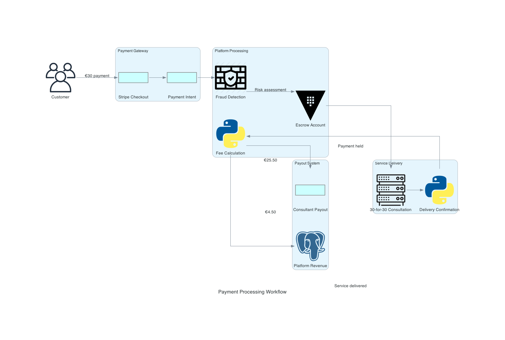
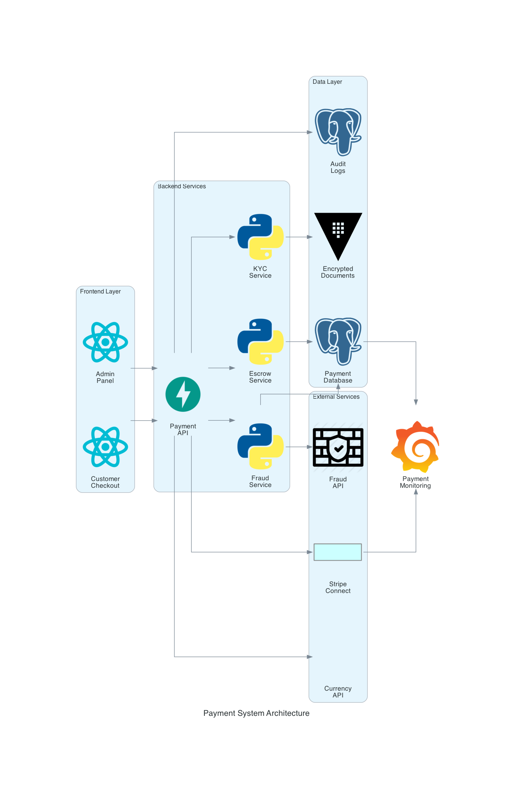
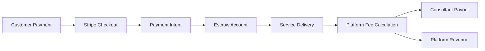
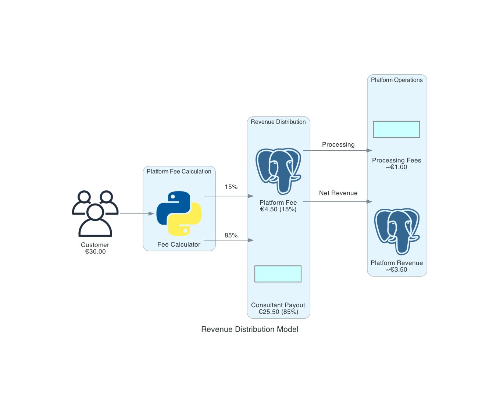

# Magnetiq v2 - Payment Processing Integration Specification

## Overview

The Magnetiq v2 payment processing integration provides comprehensive financial transaction management for the 30-for-30 consultation service, supporting customer payments, consultant payouts, and platform fee collection. This specification defines the implementation of Stripe Connect integration with automated payment escrow, KYC compliance, and multi-currency support.

→ **Business Model**: [30-for-30 Consultation Service](../frontend/public/features/book-a-meeting.md#pricing-model)  
← **Supports**: [Business Revenue Goals](../business/revenue-model.md), [Admin-Managed Consultant Setup](../users/knowhow-bearer.md#simplified-onboarding), [Admin Payment Configuration](../frontend/adminpanel/consultant-management.md#admin-managed-kyc-payments)  
⚡ **Core Dependencies**: [Security Framework](../security.md#payment-security), [Database Schema](../backend/database.md#payment-tables), [API Endpoints](../backend/api.md#payment-api)

## Visual Payment Flow Overview

*Complete payment workflow from customer payment to consultant payout including escrow and fee distribution*

🔗 **Cross-referenced in**: [Booking System](../frontend/public/features/book-a-meeting.md), [Admin Panel](../frontend/adminpanel/admin.md#payment-management), [Database Schema](../backend/database.md#payment-models)

## Payment Architecture




⚡ **System Integration**:
- **Payment Gateway**: [Stripe Connect](https://stripe.com/connect) with Express accounts
- **Escrow Management**: [Payment Holding Service](../backend/api.md#escrow-service)
- **KYC Integration**: [Identity Verification](../security.md#kyc-compliance)
- **Currency Support**: [Multi-Currency Handler](../backend/api.md#currency-service)
- **Payout System**: [Automated Disbursement](../backend/api.md#payout-service)

## Core Payment System

### Payment Flow Components
**Revenue Distribution Model:**
- **Customer Payment**: €30 per 30-for-30 consultation
- **Platform Fee**: €4.50 (15% of total payment)
- **Consultant Payment**: €25.50 (85% of total payment, after service delivery)
- **Processing Fees**: Covered by platform from platform fee portion



**Cross-Component Integration:**
- **Booking Creation**: [Book-a-Meeting Feature](../frontend/public/features/book-a-meeting.md#booking-flow) → Payment Intent
- **Service Delivery**: [Consultant Workflows](../users/knowhow-bearer.md#service-delivery) → Payout Trigger
- **Admin Oversight**: [Payment Management](../frontend/adminpanel/admin.md#payment-dashboard) → Manual Controls
- **Financial Records**: [Odoo Integration](./integrations.md#odoo-integration) → Accounting Sync

### Stripe Connect Implementation
```python
import stripe
from typing import Dict, Any, Optional
from datetime import datetime, timedelta
from app.core.security import require_permission, Permission

class StripeConnectService(BaseIntegrationService):
    """Stripe Connect service for platform marketplace payments."""
    
    def __init__(self, config: Dict[str, Any]):
        super().__init__(config)
        stripe.api_key = config['secret_key']
        self.platform_fee_percentage = 0.15  # 15% platform fee
        self.webhook_secret = config['webhook_secret']
        self.currency = 'eur'  # Primary currency
        
    async def create_payment_intent(
        self,
        booking_id: str,
        amount: int,  # Amount in cents
        consultant_stripe_account_id: str,
        customer_email: str,
        metadata: Optional[Dict[str, str]] = None
    ) -> Dict[str, Any]:
        """Create payment intent for consultation booking."""
        try:
            # Calculate platform fee
            platform_fee = int(amount * self.platform_fee_percentage)
            
            payment_intent = stripe.PaymentIntent.create(
                amount=amount,
                currency=self.currency,
                application_fee_amount=platform_fee,
                transfer_data={
                    'destination': consultant_stripe_account_id,
                },
                metadata={
                    'booking_id': booking_id,
                    'consultant_account': consultant_stripe_account_id,
                    'platform_fee': str(platform_fee),
                    'service_type': '30-for-30-consultation',
                    **(metadata or {})
                },
                receipt_email=customer_email,
                payment_method_types=['card', 'sepa_debit'],
                confirmation_method='automatic',
                confirm=False
            )
            
            # Store payment record in database
            await self._create_payment_record(
                booking_id=booking_id,
                stripe_payment_intent_id=payment_intent.id,
                amount=amount,
                platform_fee=platform_fee,
                consultant_amount=amount - platform_fee,
                consultant_stripe_account=consultant_stripe_account_id,
                status='pending'
            )
            
            await self.log_integration_activity(
                'create_payment_intent', 'success',
                booking_id=booking_id,
                payment_intent_id=payment_intent.id,
                amount=amount,
                platform_fee=platform_fee
            )
            
            return {
                'client_secret': payment_intent.client_secret,
                'payment_intent_id': payment_intent.id,
                'amount': amount,
                'platform_fee': platform_fee,
                'consultant_amount': amount - platform_fee,
                'status': payment_intent.status
            }
            
        except stripe.error.StripeError as e:
            await self.log_integration_activity(
                'create_payment_intent', 'error',
                error=str(e),
                booking_id=booking_id,
                amount=amount
            )
            raise IntegrationError(f"Payment intent creation failed: {e.user_message}")
    
    async def create_consultant_express_account(
        self,
        consultant_id: str,
        email: str,
        business_profile: Dict[str, Any]
    ) -> Dict[str, Any]:
        """Create Stripe Express account for consultant."""
        try:
            account = stripe.Account.create(
                type='express',
                country=business_profile.get('country', 'DE'),
                email=email,
                capabilities={
                    'card_payments': {'requested': True},
                    'transfers': {'requested': True},
                    'sepa_debit_payments': {'requested': True}
                },
                business_type='individual',
                business_profile={
                    'mcc': '8299',  # Educational services
                    'url': business_profile.get('website'),
                    'product_description': '30-minute business consultations'
                },
                tos_acceptance={
                    'service_agreement': 'recipient'
                }
            )
            
            # Store consultant account mapping
            await self._store_consultant_stripe_account(
                consultant_id=consultant_id,
                stripe_account_id=account.id,
                account_status='pending'
            )
            
            await self.log_integration_activity(
                'create_consultant_account', 'success',
                consultant_id=consultant_id,
                stripe_account_id=account.id
            )
            
            return {
                'stripe_account_id': account.id,
                'charges_enabled': account.charges_enabled,
                'payouts_enabled': account.payouts_enabled,
                'details_submitted': account.details_submitted
            }
            
        except stripe.error.StripeError as e:
            await self.log_integration_activity(
                'create_consultant_account', 'error',
                error=str(e),
                consultant_id=consultant_id
            )
            raise IntegrationError(f"Account creation failed: {e.user_message}")
    
    async def create_account_onboarding_link(
        self,
        stripe_account_id: str,
        return_url: str,
        refresh_url: str
    ) -> str:
        """Create account onboarding link for consultant setup."""
        try:
            account_link = stripe.AccountLink.create(
                account=stripe_account_id,
                return_url=return_url,
                refresh_url=refresh_url,
                type='account_onboarding'
            )
            
            await self.log_integration_activity(
                'create_onboarding_link', 'success',
                stripe_account_id=stripe_account_id
            )
            
            return account_link.url
            
        except stripe.error.StripeError as e:
            await self.log_integration_activity(
                'create_onboarding_link', 'error',
                error=str(e),
                stripe_account_id=stripe_account_id
            )
            raise IntegrationError(f"Onboarding link creation failed: {e.user_message}")
```

### Payment Escrow System
```python
from enum import Enum
from datetime import datetime, timedelta

class PaymentStatus(str, Enum):
    PENDING = 'pending'
    PAID = 'paid' 
    HELD_IN_ESCROW = 'held_in_escrow'
    SERVICE_DELIVERED = 'service_delivered'
    RELEASED_TO_CONSULTANT = 'released_to_consultant'
    DISPUTED = 'disputed'
    REFUNDED = 'refunded'
    FAILED = 'failed'

class EscrowService:
    """Manage payment escrow and release logic."""
    
    def __init__(self, db_session, stripe_service):
        self.db = db_session
        self.stripe_service = stripe_service
        self.escrow_hold_period = timedelta(days=1)  # 24-hour hold after service
        
    async def process_successful_payment(
        self,
        payment_intent_id: str,
        booking_id: str
    ) -> Dict[str, Any]:
        """Process successful payment and move to escrow."""
        try:
            # Update payment status
            await self._update_payment_status(
                payment_intent_id, 
                PaymentStatus.HELD_IN_ESCROW
            )
            
            # Update booking status
            await self._update_booking_payment_status(
                booking_id, 
                'paid'
            )
            
            # Send confirmation emails
            await self._send_payment_confirmation_emails(booking_id)
            
            # Log escrow event
            await self.log_integration_activity(
                'payment_escrowed', 'success',
                payment_intent_id=payment_intent_id,
                booking_id=booking_id
            )
            
            return {
                'status': 'success',
                'payment_status': PaymentStatus.HELD_IN_ESCROW,
                'escrow_release_date': (datetime.utcnow() + self.escrow_hold_period).isoformat()
            }
            
        except Exception as e:
            await self.log_integration_activity(
                'payment_escrow_failed', 'error',
                error=str(e),
                payment_intent_id=payment_intent_id,
                booking_id=booking_id
            )
            raise
    
    async def mark_service_delivered(
        self,
        booking_id: str,
        delivered_by: str,
        delivery_confirmation: Dict[str, Any]
    ) -> Dict[str, Any]:
        """Mark consultation service as delivered and trigger payout release."""
        try:
            # Update booking status
            await self._update_booking_status(
                booking_id,
                'completed',
                delivered_by,
                delivery_confirmation
            )
            
            # Get payment details
            payment = await self._get_payment_by_booking_id(booking_id)
            
            if payment.status != PaymentStatus.HELD_IN_ESCROW:
                raise ValueError(f"Payment not in escrow status: {payment.status}")
            
            # Update payment status
            await self._update_payment_status(
                payment.stripe_payment_intent_id,
                PaymentStatus.SERVICE_DELIVERED
            )
            
            # Schedule payout release (after hold period)
            release_date = datetime.utcnow() + self.escrow_hold_period
            await self._schedule_payout_release(
                payment_intent_id=payment.stripe_payment_intent_id,
                release_date=release_date
            )
            
            # Send service delivery confirmation
            await self._send_service_delivery_emails(booking_id, delivery_confirmation)
            
            await self.log_integration_activity(
                'service_delivered', 'success',
                booking_id=booking_id,
                payment_intent_id=payment.stripe_payment_intent_id,
                payout_release_date=release_date.isoformat()
            )
            
            return {
                'status': 'success',
                'service_status': 'delivered',
                'payout_release_date': release_date.isoformat()
            }
            
        except Exception as e:
            await self.log_integration_activity(
                'service_delivery_failed', 'error',
                error=str(e),
                booking_id=booking_id
            )
            raise
    
    async def release_consultant_payout(
        self,
        payment_intent_id: str
    ) -> Dict[str, Any]:
        """Release held funds to consultant after escrow period."""
        try:
            # Get payment details
            payment = await self._get_payment_by_intent_id(payment_intent_id)
            
            if payment.status != PaymentStatus.SERVICE_DELIVERED:
                raise ValueError(f"Payment not ready for release: {payment.status}")
            
            # Check if escrow period has passed
            if datetime.utcnow() < payment.service_delivered_at + self.escrow_hold_period:
                raise ValueError("Escrow hold period not yet expired")
            
            # Release transfer to consultant (funds already captured by Stripe)
            # With Stripe Connect, funds are automatically transferred after application fee
            
            # Update payment status
            await self._update_payment_status(
                payment_intent_id,
                PaymentStatus.RELEASED_TO_CONSULTANT
            )
            
            # Send payout notification
            await self._send_payout_notification(payment.booking_id, payment.consultant_amount)
            
            await self.log_integration_activity(
                'payout_released', 'success',
                payment_intent_id=payment_intent_id,
                consultant_amount=payment.consultant_amount,
                platform_fee=payment.platform_fee
            )
            
            return {
                'status': 'success',
                'payout_status': 'released',
                'consultant_amount': payment.consultant_amount,
                'platform_fee': payment.platform_fee
            }
            
        except Exception as e:
            await self.log_integration_activity(
                'payout_release_failed', 'error',
                error=str(e),
                payment_intent_id=payment_intent_id
            )
            raise
```

## Consultant Onboarding & KYC

### KYC/AML Compliance System
```python
from app.core.security import encrypt_sensitive_data, decrypt_sensitive_data

class KYCComplianceService:
    """Handle KYC/AML compliance for consultant onboarding."""
    
    def __init__(self, db_session, stripe_service):
        self.db = db_session
        self.stripe_service = stripe_service
        
        # KYC requirements by country
        self.kyc_requirements = {
            'DE': {
                'identity_document': ['passport', 'national_id', 'drivers_license'],
                'address_verification': ['bank_statement', 'utility_bill', 'tax_document'],
                'tax_information': ['tax_id', 'vat_number'],
                'bank_account': True
            },
            'US': {
                'identity_document': ['passport', 'drivers_license', 'state_id'],
                'address_verification': ['bank_statement', 'utility_bill'],
                'tax_information': ['ssn', 'ein'],
                'bank_account': True
            },
            # Add more countries as needed
            'default': {
                'identity_document': ['passport'],
                'address_verification': ['bank_statement'],
                'tax_information': ['tax_id'],
                'bank_account': True
            }
        }
    
    async def initiate_kyc_process(
        self,
        consultant_id: str,
        country_code: str,
        business_type: str = 'individual'
    ) -> Dict[str, Any]:
        """Initiate KYC process for consultant."""
        try:
            # Get KYC requirements for country
            requirements = self.kyc_requirements.get(
                country_code, 
                self.kyc_requirements['default']
            )
            
            # Create KYC record
            kyc_record = await self._create_kyc_record(
                consultant_id=consultant_id,
                country_code=country_code,
                business_type=business_type,
                requirements=requirements,
                status='pending'
            )
            
            # Generate secure document upload URLs
            document_upload_urls = await self._generate_document_upload_urls(
                kyc_record.id,
                requirements
            )
            
            await self.log_integration_activity(
                'kyc_initiated', 'success',
                consultant_id=consultant_id,
                kyc_record_id=kyc_record.id,
                country_code=country_code
            )
            
            return {
                'kyc_record_id': kyc_record.id,
                'requirements': requirements,
                'document_upload_urls': document_upload_urls,
                'status': 'pending'
            }
            
        except Exception as e:
            await self.log_integration_activity(
                'kyc_initiation_failed', 'error',
                error=str(e),
                consultant_id=consultant_id
            )
            raise
    
    async def verify_identity_document(
        self,
        kyc_record_id: str,
        document_type: str,
        document_data: bytes,
        document_metadata: Dict[str, Any]
    ) -> Dict[str, Any]:
        """Verify uploaded identity document."""
        try:
            # Encrypt and store document securely
            encrypted_document = encrypt_sensitive_data(document_data)
            
            # Store document record
            document_record = await self._store_kyc_document(
                kyc_record_id=kyc_record_id,
                document_type=document_type,
                encrypted_data=encrypted_document,
                metadata=document_metadata,
                verification_status='pending'
            )
            
            # Perform basic validation
            validation_result = await self._validate_document(
                document_data,
                document_type,
                document_metadata
            )
            
            if validation_result['valid']:
                # Update document status
                await self._update_document_status(
                    document_record.id,
                    'verified'
                )
                
                # Check if all requirements are met
                kyc_status = await self._check_kyc_completion(kyc_record_id)
                
                await self.log_integration_activity(
                    'document_verified', 'success',
                    kyc_record_id=kyc_record_id,
                    document_type=document_type,
                    document_id=document_record.id
                )
                
                return {
                    'status': 'verified',
                    'document_id': document_record.id,
                    'kyc_status': kyc_status,
                    'validation_details': validation_result
                }
            else:
                await self._update_document_status(
                    document_record.id,
                    'rejected',
                    validation_result['errors']
                )
                
                return {
                    'status': 'rejected',
                    'errors': validation_result['errors']
                }
                
        except Exception as e:
            await self.log_integration_activity(
                'document_verification_failed', 'error',
                error=str(e),
                kyc_record_id=kyc_record_id,
                document_type=document_type
            )
            raise
    
    async def complete_kyc_verification(
        self,
        kyc_record_id: str,
        reviewer_id: str,
        verification_notes: str = None
    ) -> Dict[str, Any]:
        """Complete KYC verification and enable consultant account."""
        try:
            # Get KYC record
            kyc_record = await self._get_kyc_record(kyc_record_id)
            
            # Verify all requirements are met
            completion_check = await self._verify_kyc_completeness(kyc_record)
            
            if not completion_check['complete']:
                raise ValueError(f"KYC incomplete: {completion_check['missing_requirements']}")
            
            # Update KYC status
            await self._update_kyc_status(
                kyc_record_id,
                'approved',
                reviewer_id,
                verification_notes
            )
            
            # Update consultant account status
            await self._update_consultant_account_status(
                kyc_record.consultant_id,
                'kyc_approved'
            )
            
            # Enable Stripe account
            await self.stripe_service.update_account_status(
                kyc_record.consultant_stripe_account_id,
                {'kyc_verified': True}
            )
            
            # Send approval notification
            await self._send_kyc_approval_notification(kyc_record.consultant_id)
            
            await self.log_integration_activity(
                'kyc_approved', 'success',
                kyc_record_id=kyc_record_id,
                consultant_id=kyc_record.consultant_id,
                reviewer_id=reviewer_id
            )
            
            return {
                'status': 'approved',
                'consultant_id': kyc_record.consultant_id,
                'verification_date': datetime.utcnow().isoformat(),
                'reviewer_id': reviewer_id
            }
            
        except Exception as e:
            await self.log_integration_activity(
                'kyc_approval_failed', 'error',
                error=str(e),
                kyc_record_id=kyc_record_id
            )
            raise
```

### Bank Account Setup
```python
class BankAccountService:
    """Manage consultant bank account setup for payouts."""
    
    def __init__(self, db_session, stripe_service):
        self.db = db_session
        self.stripe_service = stripe_service
    
    async def add_bank_account(
        self,
        consultant_id: str,
        stripe_account_id: str,
        bank_account_details: Dict[str, Any]
    ) -> Dict[str, Any]:
        """Add bank account for consultant payouts."""
        try:
            # Validate bank account details
            validation_result = await self._validate_bank_account(
                bank_account_details,
                consultant_id
            )
            
            if not validation_result['valid']:
                raise ValueError(f"Invalid bank account: {validation_result['errors']}")
            
            # Add external account to Stripe
            external_account = stripe.Account.create_external_account(
                stripe_account_id,
                external_account={
                    'object': 'bank_account',
                    'country': bank_account_details['country'],
                    'currency': bank_account_details.get('currency', 'eur'),
                    'account_holder_name': bank_account_details['account_holder_name'],
                    'account_holder_type': 'individual',
                    'routing_number': bank_account_details.get('routing_number'),
                    'account_number': bank_account_details['account_number']
                }
            )
            
            # Store encrypted bank account record
            await self._store_bank_account_record(
                consultant_id=consultant_id,
                stripe_account_id=stripe_account_id,
                stripe_external_account_id=external_account.id,
                account_details=encrypt_sensitive_data(bank_account_details),
                status='pending_verification'
            )
            
            await self.log_integration_activity(
                'bank_account_added', 'success',
                consultant_id=consultant_id,
                stripe_account_id=stripe_account_id,
                external_account_id=external_account.id
            )
            
            return {
                'status': 'success',
                'external_account_id': external_account.id,
                'verification_status': 'pending'
            }
            
        except stripe.error.StripeError as e:
            await self.log_integration_activity(
                'bank_account_addition_failed', 'error',
                error=str(e),
                consultant_id=consultant_id
            )
            raise IntegrationError(f"Bank account setup failed: {e.user_message}")
    
    async def verify_bank_account(
        self,
        consultant_id: str,
        external_account_id: str,
        verification_amounts: List[int]
    ) -> Dict[str, Any]:
        """Verify bank account with micro-deposits."""
        try:
            # Get consultant's Stripe account
            stripe_account_id = await self._get_consultant_stripe_account(consultant_id)
            
            # Verify with Stripe
            verification = stripe.Account.verify_external_account(
                stripe_account_id,
                external_account_id,
                amounts=verification_amounts
            )
            
            # Update bank account status
            await self._update_bank_account_status(
                consultant_id,
                external_account_id,
                'verified' if verification.status == 'verified' else 'failed'
            )
            
            if verification.status == 'verified':
                # Enable payouts for consultant
                await self._enable_consultant_payouts(consultant_id)
                
                await self.log_integration_activity(
                    'bank_account_verified', 'success',
                    consultant_id=consultant_id,
                    external_account_id=external_account_id
                )
                
                return {
                    'status': 'verified',
                    'payouts_enabled': True
                }
            else:
                return {
                    'status': 'verification_failed',
                    'error': 'Verification amounts do not match'
                }
                
        except stripe.error.StripeError as e:
            await self.log_integration_activity(
                'bank_account_verification_failed', 'error',
                error=str(e),
                consultant_id=consultant_id
            )
            raise IntegrationError(f"Bank account verification failed: {e.user_message}")
```

## Multi-Currency Support

### Currency Management System
```python
from decimal import Decimal, ROUND_HALF_UP
import aiohttp
from datetime import datetime, timedelta

class CurrencyService:
    """Handle multi-currency support and exchange rates."""
    
    def __init__(self, redis_client):
        self.redis = redis_client
        self.base_currency = 'EUR'
        self.supported_currencies = ['EUR', 'USD', 'GBP', 'CHF', 'SEK', 'NOK', 'DKK']
        self.exchange_rate_cache_ttl = 3600  # 1 hour
        
    async def get_exchange_rate(
        self,
        from_currency: str,
        to_currency: str
    ) -> Decimal:
        """Get current exchange rate between currencies."""
        if from_currency == to_currency:
            return Decimal('1.0')
        
        # Check cache first
        cache_key = f"exchange_rate:{from_currency}:{to_currency}"
        cached_rate = await self.redis.get(cache_key)
        
        if cached_rate:
            return Decimal(cached_rate)
        
        # Fetch from exchange rate API
        rate = await self._fetch_exchange_rate(from_currency, to_currency)
        
        # Cache for 1 hour
        await self.redis.setex(cache_key, self.exchange_rate_cache_ttl, str(rate))
        
        return rate
    
    async def convert_amount(
        self,
        amount: Decimal,
        from_currency: str,
        to_currency: str
    ) -> Decimal:
        """Convert amount between currencies."""
        if from_currency == to_currency:
            return amount
        
        exchange_rate = await self.get_exchange_rate(from_currency, to_currency)
        converted_amount = amount * exchange_rate
        
        # Round to 2 decimal places
        return converted_amount.quantize(Decimal('0.01'), rounding=ROUND_HALF_UP)
    
    async def get_localized_pricing(
        self,
        consultant_id: str,
        customer_country: str
    ) -> Dict[str, Any]:
        """Get localized pricing for consultation based on customer location."""
        try:
            # Get consultant's base currency and pricing
            consultant = await self._get_consultant_details(consultant_id)
            base_price = Decimal('30.00')  # €30 base price
            base_currency = consultant.get('currency', 'EUR')
            
            # Determine customer's preferred currency
            customer_currency = self._get_currency_by_country(customer_country)
            
            # Convert price if needed
            if base_currency != customer_currency:
                localized_price = await self.convert_amount(
                    base_price, base_currency, customer_currency
                )
            else:
                localized_price = base_price
            
            # Calculate platform fee and consultant amount
            platform_fee = localized_price * Decimal('0.15')
            consultant_amount = localized_price - platform_fee
            
            return {
                'base_price': float(localized_price),
                'platform_fee': float(platform_fee),
                'consultant_amount': float(consultant_amount),
                'currency': customer_currency,
                'exchange_rate': float(await self.get_exchange_rate(base_currency, customer_currency)) if base_currency != customer_currency else 1.0
            }
            
        except Exception as e:
            # Fallback to EUR pricing
            return {
                'base_price': 30.00,
                'platform_fee': 4.50,
                'consultant_amount': 25.50,
                'currency': 'EUR',
                'exchange_rate': 1.0,
                'error': f'Localization failed: {str(e)}'
            }
    
    def _get_currency_by_country(self, country_code: str) -> str:
        """Get currency code by country."""
        currency_map = {
            'DE': 'EUR', 'FR': 'EUR', 'IT': 'EUR', 'ES': 'EUR', 'NL': 'EUR',
            'AT': 'EUR', 'BE': 'EUR', 'PT': 'EUR', 'IE': 'EUR', 'FI': 'EUR',
            'US': 'USD', 'GB': 'GBP', 'CH': 'CHF', 'SE': 'SEK', 
            'NO': 'NOK', 'DK': 'DKK'
        }
        return currency_map.get(country_code, 'EUR')  # Default to EUR
    
    async def _fetch_exchange_rate(
        self,
        from_currency: str,
        to_currency: str
    ) -> Decimal:
        """Fetch exchange rate from external API."""
        try:
            # Using exchangerate-api.com (free tier)
            async with aiohttp.ClientSession() as session:
                url = f"https://api.exchangerate-api.com/v4/latest/{from_currency}"
                async with session.get(url) as response:
                    data = await response.json()
                    
                    if to_currency in data['rates']:
                        return Decimal(str(data['rates'][to_currency]))
                    else:
                        raise ValueError(f"Currency {to_currency} not supported")
                        
        except Exception as e:
            # Fallback to stored rates or default
            await self.log_integration_activity(
                'exchange_rate_fetch_failed', 'error',
                error=str(e),
                from_currency=from_currency,
                to_currency=to_currency
            )
            
            # Return default rate (1:1) as fallback
            return Decimal('1.0')
```

## Payment Security & Compliance

### PCI Compliance Implementation
```python
from app.core.security import SecurityMonitoringService, SecurityEventType

class PCIComplianceService:
    """Ensure PCI DSS compliance for payment processing."""
    
    def __init__(self, security_monitor: SecurityMonitoringService):
        self.security_monitor = security_monitor
        self.compliance_requirements = {
            'network_security': True,
            'data_protection': True,
            'access_control': True,
            'monitoring': True,
            'vulnerability_management': True,
            'security_policies': True
        }
    
    async def validate_payment_request(
        self,
        request_data: Dict[str, Any],
        user_id: str,
        ip_address: str
    ) -> Dict[str, Any]:
        """Validate payment request for PCI compliance."""
        try:
            validation_errors = []
            
            # Check for card data in request (should not be present)
            if self._contains_sensitive_card_data(request_data):
                await self.security_monitor.log_security_event(
                    SecurityEventType.SECURITY_VIOLATION,
                    user_id=user_id,
                    ip_address=ip_address,
                    details={'violation': 'card_data_in_request'}
                )
                validation_errors.append('Sensitive card data detected in request')
            
            # Validate request structure
            if not self._validate_request_structure(request_data):
                validation_errors.append('Invalid payment request structure')
            
            # Check rate limiting
            if not await self._check_payment_rate_limit(user_id, ip_address):
                validation_errors.append('Payment rate limit exceeded')
            
            # Validate amount ranges
            if not self._validate_amount_range(request_data.get('amount', 0)):
                validation_errors.append('Payment amount out of valid range')
            
            return {
                'valid': len(validation_errors) == 0,
                'errors': validation_errors
            }
            
        except Exception as e:
            await self.security_monitor.log_security_event(
                SecurityEventType.SECURITY_VIOLATION,
                user_id=user_id,
                ip_address=ip_address,
                details={'error': str(e), 'component': 'pci_validation'}
            )
            raise
    
    def _contains_sensitive_card_data(self, data: Dict[str, Any]) -> bool:
        """Check if request contains sensitive card data."""
        sensitive_fields = [
            'card_number', 'cardnumber', 'pan', 'ccv', 'cvv', 'cvc', 
            'expiry', 'exp_month', 'exp_year', 'security_code'
        ]
        
        def check_nested(obj):
            if isinstance(obj, dict):
                for key, value in obj.items():
                    if key.lower() in sensitive_fields:
                        return True
                    if isinstance(value, (dict, list)):
                        if check_nested(value):
                            return True
            elif isinstance(obj, list):
                for item in obj:
                    if check_nested(item):
                        return True
            return False
        
        return check_nested(data)
    
    async def audit_payment_security(
        self,
        payment_id: str,
        operation: str,
        user_id: str,
        details: Dict[str, Any]
    ) -> None:
        """Audit payment security events."""
        await self.security_monitor.log_security_event(
            SecurityEventType.DATA_ACCESS,
            user_id=user_id,
            details={
                'payment_id': payment_id,
                'operation': operation,
                'component': 'payment_processing',
                **details
            }
        )
```

### Fraud Detection System
```python
import asyncio
from typing import List
from datetime import datetime, timedelta

class FraudDetectionService:
    """Detect and prevent fraudulent payment activities."""
    
    def __init__(self, db_session, redis_client):
        self.db = db_session
        self.redis = redis_client
        self.fraud_thresholds = {
            'max_daily_amount': 1000.00,  # €1000 per day per user
            'max_attempts_per_hour': 3,
            'suspicious_countries': ['XX', 'YY'],  # Configure as needed
            'velocity_check_window': 300,  # 5 minutes
            'max_cards_per_user': 3
        }
    
    async def assess_payment_risk(
        self,
        customer_email: str,
        amount: float,
        currency: str,
        ip_address: str,
        user_agent: str,
        payment_method_details: Dict[str, Any]
    ) -> Dict[str, Any]:
        """Assess fraud risk for payment attempt."""
        risk_score = 0
        risk_factors = []
        
        try:
            # Check daily spending limit
            daily_spending = await self._get_daily_spending(customer_email)
            if daily_spending + amount > self.fraud_thresholds['max_daily_amount']:
                risk_score += 30
                risk_factors.append('daily_spending_limit_exceeded')
            
            # Check payment velocity
            recent_attempts = await self._get_recent_payment_attempts(
                customer_email, 
                self.fraud_thresholds['velocity_check_window']
            )
            if len(recent_attempts) > self.fraud_thresholds['max_attempts_per_hour']:
                risk_score += 40
                risk_factors.append('high_payment_velocity')
            
            # Check IP reputation
            ip_risk = await self._check_ip_reputation(ip_address)
            risk_score += ip_risk['score']
            if ip_risk['risky']:
                risk_factors.append('suspicious_ip')
            
            # Check for unusual amount patterns
            if await self._is_unusual_amount(customer_email, amount):
                risk_score += 20
                risk_factors.append('unusual_amount_pattern')
            
            # Check payment method consistency
            pm_risk = await self._check_payment_method_consistency(
                customer_email, 
                payment_method_details
            )
            risk_score += pm_risk['score']
            risk_factors.extend(pm_risk['factors'])
            
            # Determine risk level
            if risk_score >= 70:
                risk_level = 'high'
                action = 'block'
            elif risk_score >= 40:
                risk_level = 'medium'
                action = 'review'
            else:
                risk_level = 'low'
                action = 'approve'
            
            # Log fraud assessment
            await self._log_fraud_assessment(
                customer_email=customer_email,
                amount=amount,
                ip_address=ip_address,
                risk_score=risk_score,
                risk_level=risk_level,
                risk_factors=risk_factors,
                action=action
            )
            
            return {
                'risk_score': risk_score,
                'risk_level': risk_level,
                'risk_factors': risk_factors,
                'action': action,
                'assessment_id': f"fraud_{datetime.utcnow().timestamp()}"
            }
            
        except Exception as e:
            await self.log_integration_activity(
                'fraud_assessment_failed', 'error',
                error=str(e),
                customer_email=customer_email,
                amount=amount
            )
            
            # Default to medium risk if assessment fails
            return {
                'risk_score': 50,
                'risk_level': 'medium',
                'risk_factors': ['assessment_error'],
                'action': 'review',
                'error': str(e)
            }
    
    async def handle_suspicious_activity(
        self,
        assessment_id: str,
        customer_email: str,
        risk_factors: List[str],
        automatic_block: bool = False
    ) -> Dict[str, Any]:
        """Handle detected suspicious payment activity."""
        try:
            actions_taken = []
            
            if automatic_block or 'daily_spending_limit_exceeded' in risk_factors:
                # Temporarily block customer
                await self._temporarily_block_customer(
                    customer_email, 
                    duration=timedelta(hours=24)
                )
                actions_taken.append('customer_temporarily_blocked')
            
            if 'high_payment_velocity' in risk_factors:
                # Implement additional rate limiting
                await self._implement_strict_rate_limiting(customer_email)
                actions_taken.append('strict_rate_limiting_applied')
            
            if 'suspicious_ip' in risk_factors:
                # Flag IP for additional monitoring
                await self._flag_ip_for_monitoring(customer_email)
                actions_taken.append('ip_flagged_for_monitoring')
            
            # Send alert to fraud team
            await self._send_fraud_alert(
                assessment_id=assessment_id,
                customer_email=customer_email,
                risk_factors=risk_factors,
                actions_taken=actions_taken
            )
            actions_taken.append('fraud_team_alerted')
            
            await self.log_integration_activity(
                'suspicious_activity_handled', 'success',
                assessment_id=assessment_id,
                customer_email=customer_email,
                risk_factors=risk_factors,
                actions_taken=actions_taken
            )
            
            return {
                'status': 'handled',
                'actions_taken': actions_taken,
                'assessment_id': assessment_id
            }
            
        except Exception as e:
            await self.log_integration_activity(
                'suspicious_activity_handling_failed', 'error',
                error=str(e),
                assessment_id=assessment_id,
                customer_email=customer_email
            )
            raise
```

## API Endpoints Integration

### Payment Processing API
```python
from fastapi import APIRouter, Depends, HTTPException, Request
from app.core.security import get_current_admin_user, require_permission, Permission
from app.schemas.payment import PaymentIntentRequest, PaymentStatusResponse
from app.services.payment_service import PaymentService

payment_router = APIRouter(prefix="/api/v1/payments", tags=["payments"])

@payment_router.post("/create-intent")
@require_permission(Permission.BOOKINGS_WRITE)
async def create_payment_intent(
    request: PaymentIntentRequest,
    current_user = Depends(get_current_admin_user),
    payment_service: PaymentService = Depends()
):
    """Create payment intent for booking.
    
    Cross-references:
    - Booking System: frontend/public/features/book-a-meeting.md#payment-flow
    - Database: backend/database.md#payment_intents_table
    - Security: security.md#payment-security
    """
    try:
        # Fraud assessment
        fraud_assessment = await payment_service.assess_payment_risk(
            customer_email=request.customer_email,
            amount=request.amount,
            currency=request.currency,
            booking_id=request.booking_id
        )
        
        if fraud_assessment['action'] == 'block':
            raise HTTPException(
                status_code=403,
                detail={
                    "error": "Payment blocked due to fraud risk",
                    "risk_factors": fraud_assessment['risk_factors']
                }
            )
        
        # Create payment intent
        payment_intent = await payment_service.create_payment_intent(
            booking_id=request.booking_id,
            amount=request.amount,
            currency=request.currency,
            consultant_stripe_account_id=request.consultant_stripe_account_id,
            customer_email=request.customer_email,
            metadata=request.metadata
        )
        
        return {
            "success": True,
            "data": payment_intent,
            "fraud_assessment": {
                "risk_level": fraud_assessment['risk_level'],
                "requires_review": fraud_assessment['action'] == 'review'
            }
        }
        
    except IntegrationError as e:
        raise HTTPException(status_code=400, detail={"error": str(e)})
    except Exception as e:
        raise HTTPException(status_code=500, detail={"error": "Payment processing failed"})

@payment_router.post("/webhook")
async def handle_stripe_webhook(
    request: Request,
    payment_service: PaymentService = Depends()
):
    """Handle Stripe webhook events.
    
    Cross-references:
    - Webhook Security: security.md#webhook-verification
    - Event Processing: integrations/integrations.md#webhook-handling
    """
    try:
        payload = await request.body()
        signature = request.headers.get('stripe-signature')
        
        # Verify webhook signature
        event = await payment_service.verify_webhook_signature(payload, signature)
        
        # Process webhook event
        result = await payment_service.process_webhook_event(event)
        
        return {"success": True, "processed": result}
        
    except ValueError as e:
        raise HTTPException(status_code=400, detail={"error": f"Invalid webhook: {str(e)}"})
    except Exception as e:
        raise HTTPException(status_code=500, detail={"error": "Webhook processing failed"})

@payment_router.post("/consultants/{consultant_id}/onboard")
@require_permission(Permission.USERS_MANAGE)
async def onboard_consultant(
    consultant_id: str,
    onboarding_data: ConsultantOnboardingRequest,
    current_user = Depends(get_current_admin_user),
    payment_service: PaymentService = Depends()
):
    """Onboard consultant for payments.
    
    Cross-references:
    - Consultant Management: users/knowhow-bearer.md#payment-onboarding
    - KYC Process: security.md#kyc-compliance
    - Database: backend/database.md#consultant_payment_accounts
    """
    try:
        # Create Stripe Express account
        stripe_account = await payment_service.create_consultant_express_account(
            consultant_id=consultant_id,
            email=onboarding_data.email,
            business_profile=onboarding_data.business_profile
        )
        
        # Initiate KYC process
        kyc_process = await payment_service.initiate_kyc_process(
            consultant_id=consultant_id,
            country_code=onboarding_data.country,
            business_type=onboarding_data.business_type
        )
        
        # Create onboarding link
        onboarding_link = await payment_service.create_account_onboarding_link(
            stripe_account_id=stripe_account['stripe_account_id'],
            return_url=f"{request.base_url}consultant/onboarding/success",
            refresh_url=f"{request.base_url}consultant/onboarding/refresh"
        )
        
        return {
            "success": True,
            "data": {
                "stripe_account_id": stripe_account['stripe_account_id'],
                "kyc_record_id": kyc_process['kyc_record_id'],
                "onboarding_link": onboarding_link,
                "requirements": kyc_process['requirements']
            }
        }
        
    except IntegrationError as e:
        raise HTTPException(status_code=400, detail={"error": str(e)})
    except Exception as e:
        raise HTTPException(status_code=500, detail={"error": "Consultant onboarding failed"})

@payment_router.get("/consultants/{consultant_id}/earnings")
@require_permission(Permission.USERS_READ)
async def get_consultant_earnings(
    consultant_id: str,
    start_date: Optional[datetime] = None,
    end_date: Optional[datetime] = None,
    current_user = Depends(get_current_admin_user),
    payment_service: PaymentService = Depends()
):
    """Get consultant earnings summary.
    
    Cross-references:
    - Analytics: frontend/adminpanel/admin.md#earnings-dashboard
    - Database: backend/database.md#payment_records
    - Reporting: features/reporting.md#consultant-earnings
    """
    try:
        earnings = await payment_service.get_consultant_earnings(
            consultant_id=consultant_id,
            start_date=start_date,
            end_date=end_date
        )
        
        return {
            "success": True,
            "data": earnings
        }
        
    except Exception as e:
        raise HTTPException(status_code=500, detail={"error": "Failed to fetch earnings"})

@payment_router.post("/refunds")
@require_permission(Permission.BOOKINGS_MANAGE)
async def process_refund(
    refund_request: RefundRequest,
    current_user = Depends(get_current_admin_user),
    payment_service: PaymentService = Depends()
):
    """Process payment refund.
    
    Cross-references:
    - Refund Policy: business/refund-policy.md
    - Audit Trail: security.md#audit-logging
    - Customer Communication: integrations/smtp-brevo.md#refund-notifications
    """
    try:
        # Validate refund eligibility
        eligibility = await payment_service.check_refund_eligibility(
            payment_id=refund_request.payment_id,
            reason=refund_request.reason
        )
        
        if not eligibility['eligible']:
            raise HTTPException(
                status_code=400,
                detail={
                    "error": "Refund not eligible",
                    "reason": eligibility['reason']
                }
            )
        
        # Process refund
        refund_result = await payment_service.process_refund(
            payment_id=refund_request.payment_id,
            amount=refund_request.amount,
            reason=refund_request.reason,
            processed_by=current_user.id
        )
        
        return {
            "success": True,
            "data": refund_result
        }
        
    except IntegrationError as e:
        raise HTTPException(status_code=400, detail={"error": str(e)})
    except Exception as e:
        raise HTTPException(status_code=500, detail={"error": "Refund processing failed"})
```

## Database Schema Integration

### Payment Tables Schema
**Cross-References:**
- **Database Specification**: [Complete Schema](../backend/database.md#payment-system-tables)
- **User Models**: [Consultant Accounts](../backend/database.md#consultant-payment-accounts)
- **Audit Tables**: [Financial Audit Trail](../backend/database.md#audit-logs)

```sql
-- Payment Intent Records
CREATE TABLE payment_intents (
    id INTEGER PRIMARY KEY AUTOINCREMENT,
    stripe_payment_intent_id TEXT NOT NULL UNIQUE,
    booking_id INTEGER NOT NULL,
    consultant_id INTEGER NOT NULL,
    consultant_stripe_account_id TEXT NOT NULL,
    
    -- Amount details (in cents)
    amount INTEGER NOT NULL,
    currency TEXT NOT NULL DEFAULT 'eur',
    platform_fee INTEGER NOT NULL,
    consultant_amount INTEGER NOT NULL,
    
    -- Status tracking
    status TEXT NOT NULL DEFAULT 'pending',
    payment_method TEXT,
    
    -- Timestamps
    created_at DATETIME NOT NULL DEFAULT CURRENT_TIMESTAMP,
    paid_at DATETIME,
    service_delivered_at DATETIME,
    payout_released_at DATETIME,
    updated_at DATETIME NOT NULL DEFAULT CURRENT_TIMESTAMP,
    
    -- Foreign keys
    FOREIGN KEY (booking_id) REFERENCES bookings(id),
    FOREIGN KEY (consultant_id) REFERENCES admin_users(id),
    
    -- Constraints
    CONSTRAINT ck_payment_status CHECK (
        status IN ('pending', 'paid', 'held_in_escrow', 'service_delivered', 
                  'released_to_consultant', 'disputed', 'refunded', 'failed')
    ),
    CONSTRAINT ck_currency CHECK (
        currency IN ('eur', 'usd', 'gbp', 'chf', 'sek', 'nok', 'dkk')
    ),
    CONSTRAINT ck_amounts CHECK (
        amount > 0 AND platform_fee >= 0 AND consultant_amount >= 0 AND 
        amount = platform_fee + consultant_amount
    )
);

-- Consultant Payment Accounts
CREATE TABLE consultant_payment_accounts (
    id INTEGER PRIMARY KEY AUTOINCREMENT,
    consultant_id INTEGER NOT NULL UNIQUE,
    stripe_account_id TEXT NOT NULL UNIQUE,
    
    -- Account status
    account_status TEXT NOT NULL DEFAULT 'pending',
    charges_enabled BOOLEAN NOT NULL DEFAULT FALSE,
    payouts_enabled BOOLEAN NOT NULL DEFAULT FALSE,
    details_submitted BOOLEAN NOT NULL DEFAULT FALSE,
    
    -- KYC information
    kyc_status TEXT NOT NULL DEFAULT 'pending',
    kyc_verified_at DATETIME,
    kyc_reviewer_id INTEGER,
    
    -- Bank account information (encrypted)
    has_bank_account BOOLEAN NOT NULL DEFAULT FALSE,
    bank_account_verified BOOLEAN NOT NULL DEFAULT FALSE,
    default_currency TEXT NOT NULL DEFAULT 'eur',
    
    -- Preferences
    payout_schedule TEXT NOT NULL DEFAULT 'weekly',
    minimum_payout_amount INTEGER NOT NULL DEFAULT 1000, -- €10 minimum
    
    -- Timestamps
    created_at DATETIME NOT NULL DEFAULT CURRENT_TIMESTAMP,
    updated_at DATETIME NOT NULL DEFAULT CURRENT_TIMESTAMP,
    
    -- Foreign keys
    FOREIGN KEY (consultant_id) REFERENCES admin_users(id),
    FOREIGN KEY (kyc_reviewer_id) REFERENCES admin_users(id),
    
    -- Constraints
    CONSTRAINT ck_account_status CHECK (
        account_status IN ('pending', 'active', 'restricted', 'suspended')
    ),
    CONSTRAINT ck_kyc_status CHECK (
        kyc_status IN ('pending', 'in_review', 'approved', 'rejected', 'expired')
    ),
    CONSTRAINT ck_payout_schedule CHECK (
        payout_schedule IN ('daily', 'weekly', 'monthly')
    )
);

-- KYC Records
CREATE TABLE kyc_records (
    id INTEGER PRIMARY KEY AUTOINCREMENT,
    consultant_id INTEGER NOT NULL,
    country_code TEXT NOT NULL,
    business_type TEXT NOT NULL DEFAULT 'individual',
    
    -- Status tracking
    status TEXT NOT NULL DEFAULT 'pending',
    submitted_at DATETIME,
    reviewed_at DATETIME,
    reviewer_id INTEGER,
    review_notes TEXT,
    
    -- Requirements tracking (JSON)
    requirements TEXT NOT NULL, -- JSON object
    completed_requirements TEXT, -- JSON array of completed items
    
    -- Document references
    identity_document_id INTEGER,
    address_document_id INTEGER,
    tax_document_id INTEGER,
    
    -- Timestamps
    created_at DATETIME NOT NULL DEFAULT CURRENT_TIMESTAMP,
    updated_at DATETIME NOT NULL DEFAULT CURRENT_TIMESTAMP,
    expires_at DATETIME, -- KYC expiration date
    
    -- Foreign keys
    FOREIGN KEY (consultant_id) REFERENCES admin_users(id),
    FOREIGN KEY (reviewer_id) REFERENCES admin_users(id),
    
    -- Constraints
    CONSTRAINT ck_kyc_status CHECK (
        status IN ('pending', 'in_review', 'approved', 'rejected', 'expired')
    ),
    CONSTRAINT ck_business_type CHECK (
        business_type IN ('individual', 'company', 'non_profit')
    )
);

-- Encrypted KYC Documents
CREATE TABLE kyc_documents (
    id INTEGER PRIMARY KEY AUTOINCREMENT,
    kyc_record_id INTEGER NOT NULL,
    document_type TEXT NOT NULL,
    
    -- Encrypted document storage
    encrypted_data BLOB, -- Encrypted document content
    encryption_key_ref TEXT NOT NULL, -- Reference to encryption key
    file_name TEXT NOT NULL,
    file_size INTEGER NOT NULL,
    mime_type TEXT NOT NULL,
    
    -- Verification status
    verification_status TEXT NOT NULL DEFAULT 'pending',
    verified_at DATETIME,
    verified_by INTEGER,
    verification_notes TEXT,
    rejection_reason TEXT,
    
    -- Timestamps
    uploaded_at DATETIME NOT NULL DEFAULT CURRENT_TIMESTAMP,
    updated_at DATETIME NOT NULL DEFAULT CURRENT_TIMESTAMP,
    
    -- Foreign keys
    FOREIGN KEY (kyc_record_id) REFERENCES kyc_records(id),
    FOREIGN KEY (verified_by) REFERENCES admin_users(id),
    
    -- Constraints
    CONSTRAINT ck_document_type CHECK (
        document_type IN ('passport', 'national_id', 'drivers_license',
                         'bank_statement', 'utility_bill', 'tax_document',
                         'business_registration', 'proof_of_address')
    ),
    CONSTRAINT ck_verification_status CHECK (
        verification_status IN ('pending', 'verified', 'rejected', 'expired')
    )
);

-- Payment Disputes
CREATE TABLE payment_disputes (
    id INTEGER PRIMARY KEY AUTOINCREMENT,
    payment_intent_id INTEGER NOT NULL,
    stripe_dispute_id TEXT UNIQUE,
    
    -- Dispute details
    dispute_reason TEXT NOT NULL,
    dispute_status TEXT NOT NULL DEFAULT 'open',
    disputed_amount INTEGER NOT NULL,
    currency TEXT NOT NULL,
    
    -- Evidence and responses
    evidence_details TEXT, -- JSON object
    evidence_due_by DATETIME,
    response_submitted_at DATETIME,
    responded_by INTEGER,
    
    -- Resolution
    resolved_at DATETIME,
    resolution_outcome TEXT,
    final_amount INTEGER, -- Final amount after resolution
    
    -- Timestamps
    created_at DATETIME NOT NULL DEFAULT CURRENT_TIMESTAMP,
    updated_at DATETIME NOT NULL DEFAULT CURRENT_TIMESTAMP,
    
    -- Foreign keys
    FOREIGN KEY (payment_intent_id) REFERENCES payment_intents(id),
    FOREIGN KEY (responded_by) REFERENCES admin_users(id),
    
    -- Constraints
    CONSTRAINT ck_dispute_status CHECK (
        dispute_status IN ('open', 'under_review', 'won', 'lost', 'accepted')
    ),
    CONSTRAINT ck_resolution_outcome CHECK (
        resolution_outcome IN ('won', 'lost', 'accepted', 'partially_won') OR 
        resolution_outcome IS NULL
    )
);

-- Payment Refunds
CREATE TABLE payment_refunds (
    id INTEGER PRIMARY KEY AUTOINCREMENT,
    payment_intent_id INTEGER NOT NULL,
    stripe_refund_id TEXT UNIQUE,
    
    -- Refund details
    refund_amount INTEGER NOT NULL,
    refund_reason TEXT NOT NULL,
    refund_status TEXT NOT NULL DEFAULT 'pending',
    
    -- Processing details
    requested_by INTEGER NOT NULL,
    approved_by INTEGER,
    processed_at DATETIME,
    
    -- Platform fee adjustment
    platform_fee_refunded INTEGER NOT NULL DEFAULT 0,
    consultant_amount_refunded INTEGER NOT NULL DEFAULT 0,
    
    -- Timestamps
    created_at DATETIME NOT NULL DEFAULT CURRENT_TIMESTAMP,
    updated_at DATETIME NOT NULL DEFAULT CURRENT_TIMESTAMP,
    
    -- Foreign keys
    FOREIGN KEY (payment_intent_id) REFERENCES payment_intents(id),
    FOREIGN KEY (requested_by) REFERENCES admin_users(id),
    FOREIGN KEY (approved_by) REFERENCES admin_users(id),
    
    -- Constraints
    CONSTRAINT ck_refund_status CHECK (
        refund_status IN ('pending', 'approved', 'processed', 'failed', 'cancelled')
    ),
    CONSTRAINT ck_refund_amounts CHECK (
        refund_amount > 0 AND
        refund_amount = platform_fee_refunded + consultant_amount_refunded
    )
);

-- Fraud Assessment Records
CREATE TABLE fraud_assessments (
    id INTEGER PRIMARY KEY AUTOINCREMENT,
    payment_intent_id INTEGER,
    customer_email TEXT NOT NULL,
    
    -- Risk assessment
    risk_score INTEGER NOT NULL,
    risk_level TEXT NOT NULL,
    risk_factors TEXT NOT NULL, -- JSON array
    assessment_action TEXT NOT NULL,
    
    -- Request details
    ip_address TEXT,
    user_agent TEXT,
    country_code TEXT,
    
    -- Assessment metadata
    assessed_at DATETIME NOT NULL DEFAULT CURRENT_TIMESTAMP,
    assessment_version TEXT NOT NULL DEFAULT 'v1.0',
    
    -- Follow-up actions
    actions_taken TEXT, -- JSON array
    blocked_until DATETIME,
    requires_manual_review BOOLEAN NOT NULL DEFAULT FALSE,
    reviewed_by INTEGER,
    reviewed_at DATETIME,
    
    -- Foreign keys
    FOREIGN KEY (payment_intent_id) REFERENCES payment_intents(id),
    FOREIGN KEY (reviewed_by) REFERENCES admin_users(id),
    
    -- Constraints
    CONSTRAINT ck_risk_level CHECK (
        risk_level IN ('low', 'medium', 'high', 'critical')
    ),
    CONSTRAINT ck_assessment_action CHECK (
        assessment_action IN ('approve', 'review', 'block', 'flag')
    )
);

-- Indexes for performance
CREATE INDEX idx_payment_intents_booking_id ON payment_intents(booking_id);
CREATE INDEX idx_payment_intents_consultant_id ON payment_intents(consultant_id);
CREATE INDEX idx_payment_intents_status ON payment_intents(status);
CREATE INDEX idx_payment_intents_created_at ON payment_intents(created_at);
CREATE INDEX idx_consultant_payment_accounts_stripe_id ON consultant_payment_accounts(stripe_account_id);
CREATE INDEX idx_kyc_records_consultant_id ON kyc_records(consultant_id);
CREATE INDEX idx_kyc_records_status ON kyc_records(status);
CREATE INDEX idx_fraud_assessments_customer_email ON fraud_assessments(customer_email);
CREATE INDEX idx_fraud_assessments_risk_level ON fraud_assessments(risk_level);
```

## Integration with Admin Panel

### Payment Management Dashboard
**Cross-References:**
- **Admin Interface**: [Admin Panel Specification](../frontend/adminpanel/admin.md#payment-management-section)
- **User Permissions**: [RBAC Implementation](../security.md#role-based-access-control)
- **Analytics**: [Financial Reporting](../features/reporting.md#payment-analytics)

```typescript
// Frontend Admin Panel Components
interface PaymentDashboardProps {
  currentUser: AdminUser;
  permissions: Permission[];
}

export const PaymentDashboard: React.FC<PaymentDashboardProps> = ({ 
  currentUser, 
  permissions 
}) => {
  const [paymentMetrics, setPaymentMetrics] = useState<PaymentMetrics | null>(null);
  const [consultantEarnings, setConsultantEarnings] = useState<ConsultantEarning[]>([]);
  const [pendingPayouts, setPendingPayouts] = useState<PendingPayout[]>([]);
  const [disputedPayments, setDisputedPayments] = useState<DisputedPayment[]>([]);

  // Cross-reference: API endpoints defined in backend/api.md#payment-api
  useEffect(() => {
    const loadDashboardData = async () => {
      try {
        const [metrics, earnings, payouts, disputes] = await Promise.all([
          paymentApi.getMetrics(),
          paymentApi.getConsultantEarnings(),
          paymentApi.getPendingPayouts(),
          paymentApi.getDisputedPayments()
        ]);

        setPaymentMetrics(metrics.data);
        setConsultantEarnings(earnings.data);
        setPendingPayouts(payouts.data);
        setDisputedPayments(disputes.data);
      } catch (error) {
        console.error('Failed to load payment dashboard:', error);
      }
    };

    loadDashboardData();
  }, []);

  return (
    <div className="payment-dashboard">
      <div className="dashboard-header">
        <h1>Payment Management</h1>
        <div className="quick-actions">
          {permissions.includes(Permission.SYSTEM_ADMIN) && (
            <button 
              onClick={() => window.open('/admin/payments/fraud-monitor')}
              className="btn btn-secondary"
            >
              Fraud Monitor
            </button>
          )}
        </div>
      </div>

      <div className="metrics-grid">
        {paymentMetrics && (
          <>
            <MetricCard
              title="Total Revenue"
              value={`€${paymentMetrics.totalRevenue.toLocaleString()}`}
              change={paymentMetrics.revenueChange}
              trend="up"
            />
            <MetricCard
              title="Platform Fees"
              value={`€${paymentMetrics.platformFees.toLocaleString()}`}
              change={paymentMetrics.feeChange}
              trend="up"
            />
            <MetricCard
              title="Consultant Payouts"
              value={`€${paymentMetrics.consultantPayouts.toLocaleString()}`}
              change={paymentMetrics.payoutChange}
              trend="up"
            />
            <MetricCard
              title="Pending Disputes"
              value={paymentMetrics.pendingDisputes}
              change={paymentMetrics.disputeChange}
              trend={paymentMetrics.disputeChange > 0 ? "down" : "up"}
              alert={paymentMetrics.pendingDisputes > 5}
            />
          </>
        )}
      </div>

      <div className="dashboard-sections">
        <section className="consultant-earnings">
          <h2>Consultant Earnings</h2>
          <ConsultantEarningsTable 
            earnings={consultantEarnings}
            onViewDetails={(consultantId) => 
              window.open(`/admin/consultants/${consultantId}/earnings`)
            }
          />
        </section>

        <section className="pending-payouts">
          <h2>Pending Payouts</h2>
          <PendingPayoutsTable
            payouts={pendingPayouts}
            onProcessPayout={handleProcessPayout}
            permissions={permissions}
          />
        </section>

        <section className="disputed-payments">
          <h2>Payment Disputes</h2>
          <DisputedPaymentsTable
            disputes={disputedPayments}
            onResolveDispute={handleResolveDispute}
            permissions={permissions}
          />
        </section>
      </div>
    </div>
  );
};

// Cross-reference: State management via Redux (frontend/public.md#state-management)
const paymentApi = {
  getMetrics: () => api.get('/api/v1/payments/metrics'),
  getConsultantEarnings: () => api.get('/api/v1/payments/consultant-earnings'),
  getPendingPayouts: () => api.get('/api/v1/payments/pending-payouts'),
  getDisputedPayments: () => api.get('/api/v1/payments/disputes'),
  processRefund: (paymentId: string, refundData: RefundRequest) =>
    api.post(`/api/v1/payments/${paymentId}/refund`, refundData),
  resolveDispute: (disputeId: string, resolution: DisputeResolution) =>
    api.post(`/api/v1/payments/disputes/${disputeId}/resolve`, resolution)
};
```

## Monitoring & Analytics

### Financial Analytics Integration
**Cross-References:**
- **Analytics System**: [System Monitoring](../monitoring.md#payment-monitoring)
- **Business Intelligence**: [Revenue Analytics](../features/analytics.md#financial-metrics)
- **Compliance Reporting**: [Financial Audit Trail](../security.md#audit-logging)

```python
class PaymentAnalyticsService:
    """Generate payment and financial analytics."""
    
    def __init__(self, db_session):
        self.db = db_session
    
    async def generate_revenue_report(
        self,
        start_date: datetime,
        end_date: datetime,
        granularity: str = 'daily'
    ) -> Dict[str, Any]:
        """Generate comprehensive revenue report."""
        try:
            # Base revenue query
            base_query = """
                SELECT 
                    DATE(created_at) as date,
                    COUNT(*) as total_payments,
                    SUM(amount) as gross_revenue,
                    SUM(platform_fee) as platform_revenue,
                    SUM(consultant_amount) as consultant_payouts,
                    COUNT(CASE WHEN status = 'completed' THEN 1 END) as completed_payments,
                    COUNT(CASE WHEN status = 'disputed' THEN 1 END) as disputed_payments,
                    COUNT(CASE WHEN status = 'refunded' THEN 1 END) as refunded_payments
                FROM payment_intents
                WHERE created_at BETWEEN :start_date AND :end_date
                GROUP BY DATE(created_at)
                ORDER BY date
            """
            
            # Execute query
            result = await self.db.execute(
                text(base_query),
                {"start_date": start_date, "end_date": end_date}
            )
            
            daily_data = [dict(row) for row in result.fetchall()]
            
            # Calculate aggregates
            totals = {
                'total_payments': sum(row['total_payments'] for row in daily_data),
                'gross_revenue': sum(row['gross_revenue'] for row in daily_data),
                'platform_revenue': sum(row['platform_revenue'] for row in daily_data),
                'consultant_payouts': sum(row['consultant_payouts'] for row in daily_data),
                'completed_payments': sum(row['completed_payments'] for row in daily_data),
                'disputed_payments': sum(row['disputed_payments'] for row in daily_data),
                'refunded_payments': sum(row['refunded_payments'] for row in daily_data)
            }
            
            # Calculate key metrics
            metrics = {
                'average_transaction_value': totals['gross_revenue'] / totals['total_payments'] if totals['total_payments'] > 0 else 0,
                'completion_rate': totals['completed_payments'] / totals['total_payments'] if totals['total_payments'] > 0 else 0,
                'dispute_rate': totals['disputed_payments'] / totals['total_payments'] if totals['total_payments'] > 0 else 0,
                'refund_rate': totals['refunded_payments'] / totals['total_payments'] if totals['total_payments'] > 0 else 0,
                'platform_fee_percentage': totals['platform_revenue'] / totals['gross_revenue'] if totals['gross_revenue'] > 0 else 0
            }
            
            return {
                'period': {
                    'start_date': start_date.isoformat(),
                    'end_date': end_date.isoformat(),
                    'granularity': granularity
                },
                'daily_data': daily_data,
                'totals': totals,
                'metrics': metrics,
                'generated_at': datetime.utcnow().isoformat()
            }
            
        except Exception as e:
            await self.log_integration_activity(
                'revenue_report_generation_failed', 'error',
                error=str(e),
                start_date=start_date.isoformat(),
                end_date=end_date.isoformat()
            )
            raise
    
    async def get_consultant_performance_analytics(
        self,
        consultant_id: Optional[str] = None,
        start_date: datetime = None,
        end_date: datetime = None
    ) -> Dict[str, Any]:
        """Get consultant payment performance analytics."""
        try:
            # Build query conditions
            conditions = ["1=1"]
            params = {}
            
            if consultant_id:
                conditions.append("pi.consultant_id = :consultant_id")
                params['consultant_id'] = consultant_id
            
            if start_date:
                conditions.append("pi.created_at >= :start_date")
                params['start_date'] = start_date
            
            if end_date:
                conditions.append("pi.created_at <= :end_date")
                params['end_date'] = end_date
            
            where_clause = " AND ".join(conditions)
            
            query = f"""
                SELECT 
                    u.id as consultant_id,
                    u.first_name || ' ' || u.last_name as consultant_name,
                    COUNT(pi.id) as total_bookings,
                    SUM(pi.consultant_amount) as total_earnings,
                    AVG(pi.consultant_amount) as average_earning_per_booking,
                    COUNT(CASE WHEN pi.status = 'completed' THEN 1 END) as completed_bookings,
                    COUNT(CASE WHEN pi.status = 'disputed' THEN 1 END) as disputed_bookings,
                    COUNT(CASE WHEN fr.assessment_action = 'block' THEN 1 END) as fraud_blocked_attempts,
                    MIN(pi.created_at) as first_booking_date,
                    MAX(pi.created_at) as latest_booking_date
                FROM payment_intents pi
                JOIN admin_users u ON pi.consultant_id = u.id
                LEFT JOIN fraud_assessments fr ON pi.id = fr.payment_intent_id
                WHERE {where_clause}
                GROUP BY u.id, u.first_name, u.last_name
                ORDER BY total_earnings DESC
            """
            
            result = await self.db.execute(text(query), params)
            consultant_data = [dict(row) for row in result.fetchall()]
            
            # Calculate additional metrics for each consultant
            for consultant in consultant_data:
                consultant['completion_rate'] = (
                    consultant['completed_bookings'] / consultant['total_bookings']
                    if consultant['total_bookings'] > 0 else 0
                )
                consultant['dispute_rate'] = (
                    consultant['disputed_bookings'] / consultant['total_bookings']
                    if consultant['total_bookings'] > 0 else 0
                )
                consultant['fraud_attempt_rate'] = (
                    consultant['fraud_blocked_attempts'] / consultant['total_bookings']
                    if consultant['total_bookings'] > 0 else 0
                )
            
            return {
                'consultant_performance': consultant_data,
                'summary': {
                    'total_consultants': len(consultant_data),
                    'total_earnings': sum(c['total_earnings'] for c in consultant_data),
                    'average_earnings_per_consultant': (
                        sum(c['total_earnings'] for c in consultant_data) / len(consultant_data)
                        if len(consultant_data) > 0 else 0
                    )
                },
                'generated_at': datetime.utcnow().isoformat()
            }
            
        except Exception as e:
            await self.log_integration_activity(
                'consultant_analytics_failed', 'error',
                error=str(e),
                consultant_id=consultant_id
            )
            raise
```

## Cross-References Summary

← **Referenced by**: 
- [Booking System](../frontend/public/features/book-a-meeting.md#payment-integration)
- [Consultant Management](../users/knowhow-bearer.md#payment-setup)
- [Admin Panel](../frontend/adminpanel/admin.md#payment-dashboard)
- [Business Analytics](../features/analytics.md#financial-metrics)

→ **Depends on**: 
- [Core Security Framework](../security.md#payment-security)
- [Database Schema](../backend/database.md#payment-tables)
- [API Infrastructure](../backend/api.md#payment-endpoints)
- [Email Communications](../integrations/smtp-brevo.md#payment-notifications)

↔️ **Integrates with**: 
- [Odoo ERP](./integrations.md#odoo-integration) for financial records
- [Fraud Detection](../security.md#fraud-prevention) for risk management
- [Compliance Systems](../security.md#kyc-compliance) for regulatory requirements
- [Monitoring Services](../monitoring.md#payment-monitoring) for system health

## Related Diagrams

- [Payment Processing Flow](../../diagrams/spec_v2/integrations/payment_processing_workflow.png)
- [Revenue Distribution Model](../../diagrams/spec_v2/integrations/revenue_distribution.png)
- [KYC Verification Process](../../diagrams/spec_v2/integrations/kyc_verification_flow.png)
- [Fraud Detection Pipeline](../../diagrams/spec_v2/integrations/fraud_detection_pipeline.png)
- [Multi-Currency Architecture](../../diagrams/spec_v2/integrations/multi_currency_flow.png)
- [Consultant Onboarding Journey](../../diagrams/spec_v2/integrations/consultant_onboarding_flow.png)
- [Payment Security Framework](../../diagrams/spec_v2/security/payment_security_architecture.png)

🔗 **Complete Integration Index**: [All Payment Diagrams](../../diagrams/spec_v2/integrations/payment/)

This comprehensive payment processing integration specification provides a complete foundation for implementing secure, compliant, and scalable payment operations within the Magnetiq v2 platform, with extensive cross-linking to all related system components and comprehensive dependency management.